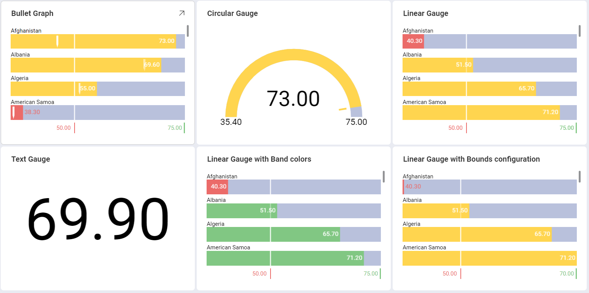
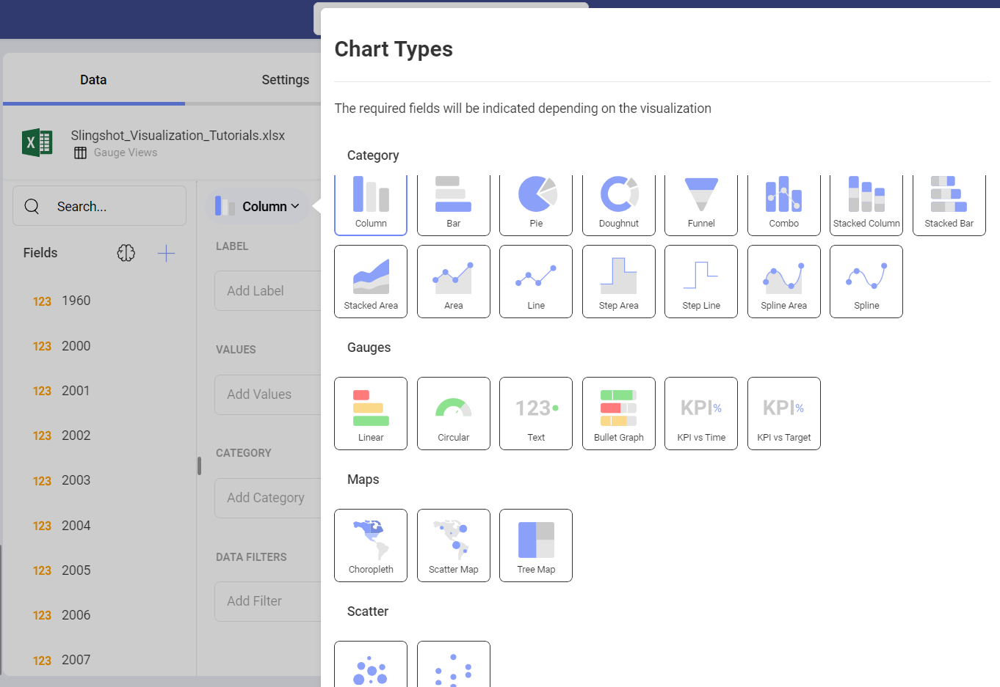
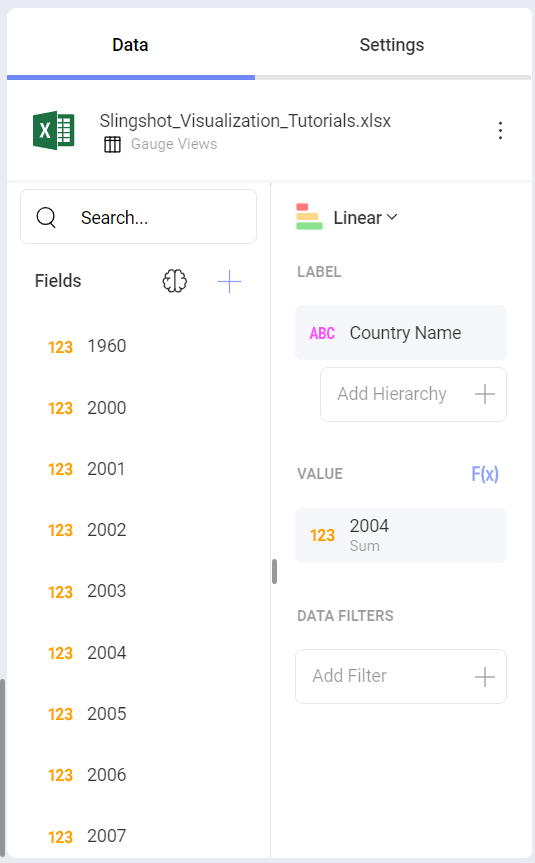
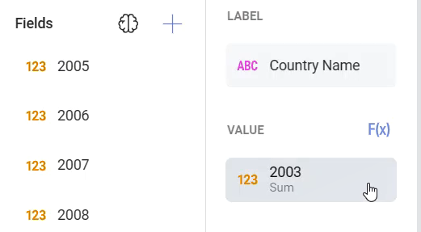
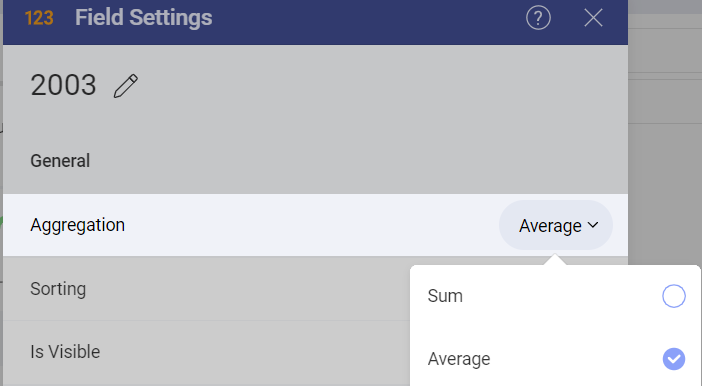
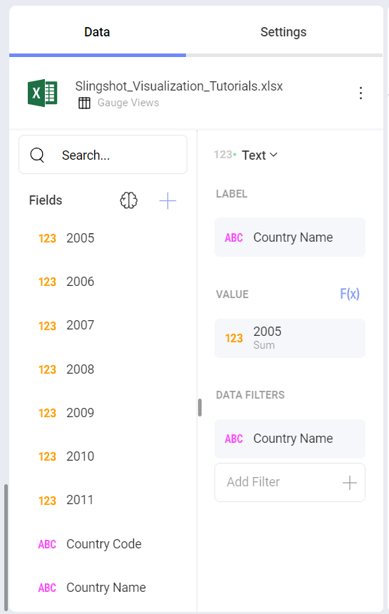
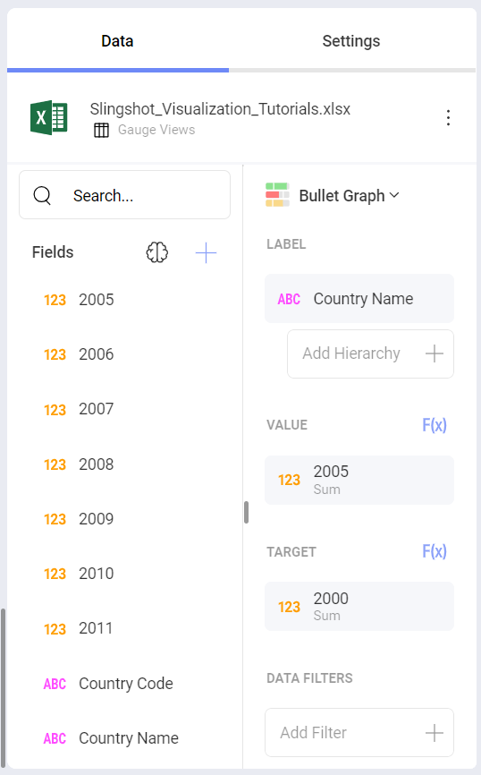
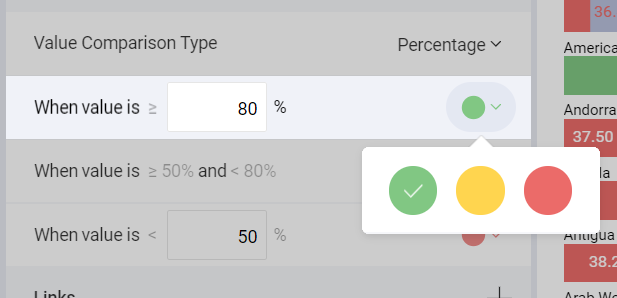

# ゲージで表示形式を作成する方法

このチュートリアルは、サンプル スプレッドシートを使用してゲージの表示形式を作成する方法を説明します。

ゲージ チャートのためのガイドは、以下のリンクから参照してください。

  - [リニア ゲージの作成方法](https://www.slingshotapp.io/en/help/docs/analytics/visualization-tutorials/gauge-charts#creating-a-linear-gauge)

  - [ラジアル ゲージの作成方法](https://www.slingshotapp.io/en/help/docs/analytics/visualization-tutorials/gauge-charts#creating-a-circular-gauge)

  - [ラベル ゲージの作成方法](https://www.slingshotapp.io/en/help/docs/analytics/visualization-tutorials/gauge-charts#creating-a-text-gauge)

  - [ブレット グラフ の作成方法](https://www.slingshotapp.io/en/help/docs/analytics/visualization-tutorials/gauge-charts#creating-a-bullet-graph)

  - [ゲージ表示形式に範囲を追加する方法](https://www.slingshotapp.io/en/help/docs/analytics/visualization-tutorials/gauge-charts#adding-bounds-to-your-gauge)

  - [バンドの色を変更する方法](https://www.slingshotapp.io/en/help/docs/analytics/visualization-tutorials/gauge-charts#changing-band-colors)

## 重要なコンセプト

ゲージ チャートは、2 つのレイアウトから選択できます:

  - **しきい値の構成**。ゲージのしきい値の構成ではゲージの最大値と最小値を設定できます。デフォルトで最小値に設定されますが、特定のデータを除外するために変更できます。

  - **バンド構成**。バンドの構成は 3 つの範囲を設定できます (より大きい、中間、より小さい) です。データ ソースに基づく範囲でデフォルトの値を上書きします。

## サンプル データ ソース

このチュートリアルでは、[Reveal チュートリアル スプレッドシート](https://download.infragistics.com/reportplus/help/samples/Reveal_Visualization_Tutorials.xlsx).

>[!NOTE]
>このリリースでは、ローカル ファイルとしての Excel ファイルはサポートされていません。チュートリアルを実行するには、サポートされているクラウド サービスのいずれかにファイルをアップロードするか、[ウェブ リソース](~/jp/datasources/supported-data-sources/web-resource.html)として追加してください。

## リニア ゲージを作成する方法

1. Select the **+ Dashboard** button in the top right-hand corner in the **My Analytics** section.

                                         

2. Select your data source(**Reveal Tutorials Spreadsheet**) from the list of data sources. If the data source is new, you will need to first add it from the **+ Data Source** button in the top-right corner.

                                             

3. Choose the **Gauge Views** sheet.
  
   
         
4. Open the *Visualization Picker* and select any of the **Gauges** visualizations. By default, the visualization type will be set to *Column*. 

   

5. This linear gauge, for example, will display life expectancy per Country. Drag and drop the **Country Name** field to **Label** and one of the year fields into **Values**.
  
                            

## 円型ゲージを作成する方法

1. Select the **+ Dashboard** button in the top right-hand corner of **My Analytics**.

                                         

2. Select your data source(**Reveal Tutorials Spreadsheet**) from the list of data sources. If the data source is new, you will need to first add it from the **+ Data Source** button in the top-right corner.

                                             

3. Choose the **Gauge Views** sheet.
  
   
         
4. Open the *Visualization Picker* and select any of the **Gauges** visualizations. By default, the visualization type will be set to *Column*. 

   

5. This linear gauge, for example, will display life expectancy per Country. Drag and drop the **Country Name** field to **Label** and one of the year fields into **Values**.
  
    

Circular Gauges are particularly useful to show average values as well
as sum of values. In order to change the aggregation for the field
displayed in Values:

|                                              |                                                                            |                                                                                           |
| -------------------------------------------- | -------------------------------------------------------------------------- | ----------------------------------------------------------------------------------------- |
| 1\. **[値] のフィールド設定にアクセスする** |  | **[値]** のフィールドを選択してアクセスします                                                  |
| 2\. **別の集計を選択する**       |          | **[集計]** のドロップダウンを展開し、別のオプションを選択します (平均値など)。|

## テキスト ゲージを作成する方法

1. Select the **+ Dashboard** button in the top right-hand corner of **My Analytics**.

                                         

2. Select your data source(**Reveal Tutorials Spreadsheet**) from the list of data sources. If the data source is new, you will need to first add it from the **+ Data Source** button in the top-right corner.

                                             

3. Choose the **Gauge Views** sheet.
  
   
         
4. Open the *Visualization Picker* and select the *Text Gauge*. By default, the visualization type will be set to *Column*. 

   

5. This text gauge, for example, will display life expectancy per Country. Drag and drop one of the year fields into "Values", and then the "Country Name" field into "Data Filters". Then, select the specific country you want by selecting the field. 

   

上記の [テキスト ゲージのサンプル] は平均値の集計を使用します。フィールドの集計を変更するために、[この手順](#aggregation-instructions)をご参照ください。

## ブレット グラフを作成する方法

1. Select the **+ Dashboard** button in the top right-hand corner of **My Analytics**.

                                         

2. Select your data source(**Reveal Tutorials Spreadsheet**) from the list of data sources. If the data source is new, you will need to first add it from the **+ Data Source** button in the top-right corner.

                                             

3. Choose the **Gauge Views** sheet.
  
   
         
4. Open the *Visualization Picker* and select any of the *Bullet Graph* visualizations. By default, the visualization type will be set to *Column*. 

   

5. This bullet graph, for example, will display life expectancy per Country. Drag and drop the *Country Name* field to **Label**, one of the years into **Values**, and another year into **Target**.

   

## ゲージの化でしきい値を追加する方法

しきい値を使用すると、ゲージの最小値と最大値を設定できます。[重要なコンセプト](#key-concepts)で述べたように、特定のデータを除外するように変更できます。以下は作業手順です。

|                                                |                                                                        |                                                                                                                                       |
| ---------------------------------------------- | ---------------------------------------------------------------------- | ------------------------------------------------------------------------------------------------------------------------------------- |
| 1\. **設定を変更する**                        |  | 表示形式エディターの **[設定]** セクションに移動します。                                                                           |
| 2\. **制限のデフォルトの選択を変更する** |          | 最大値または最小値 (または両方) 値を設定するかどうかに基づいて、チャートの開始値または終了値を入力します。|

## バンドの色の変更

以下は、バンド (より大きい、中間 および より小さい) の色を変更するための手順です。以下は変更手順です。

|                                    |                                                                        |                                                                          |
| ---------------------------------- | ---------------------------------------------------------------------- | ------------------------------------------------------------------------ |
| 1\. **設定を変更する**            |  | 表示形式エディターの **[設定]** セクションに移動します。              |
| 2\. **色のドロップダウンを表示する** |      | Expand the dropdown of the range for which you want to change the color. Select one of Reveal's three predefined colors for your band color.|
