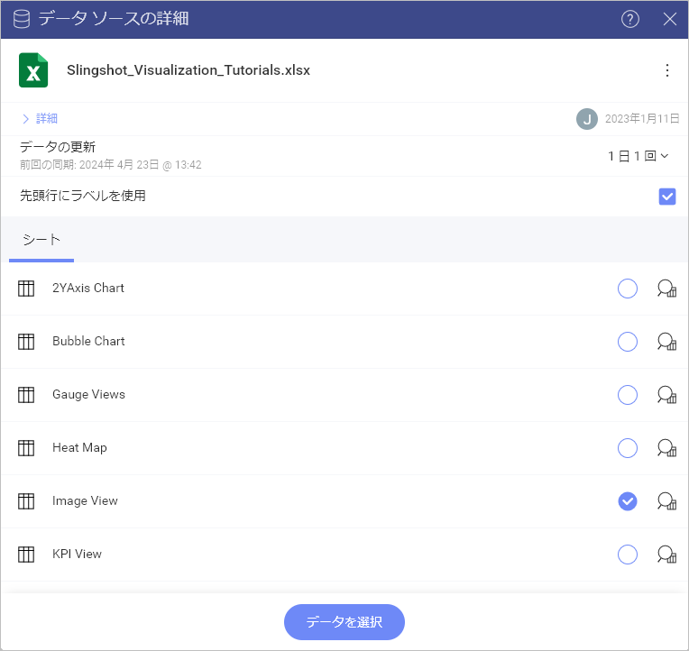
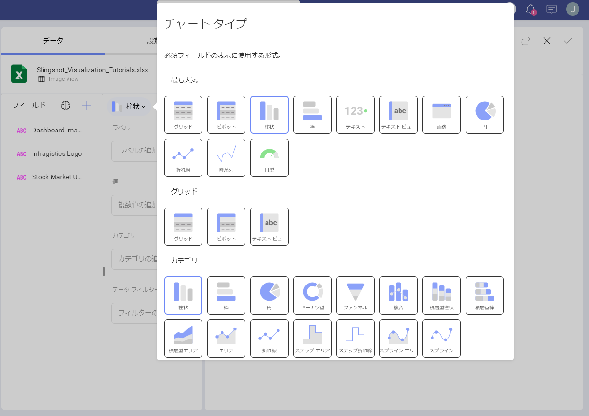
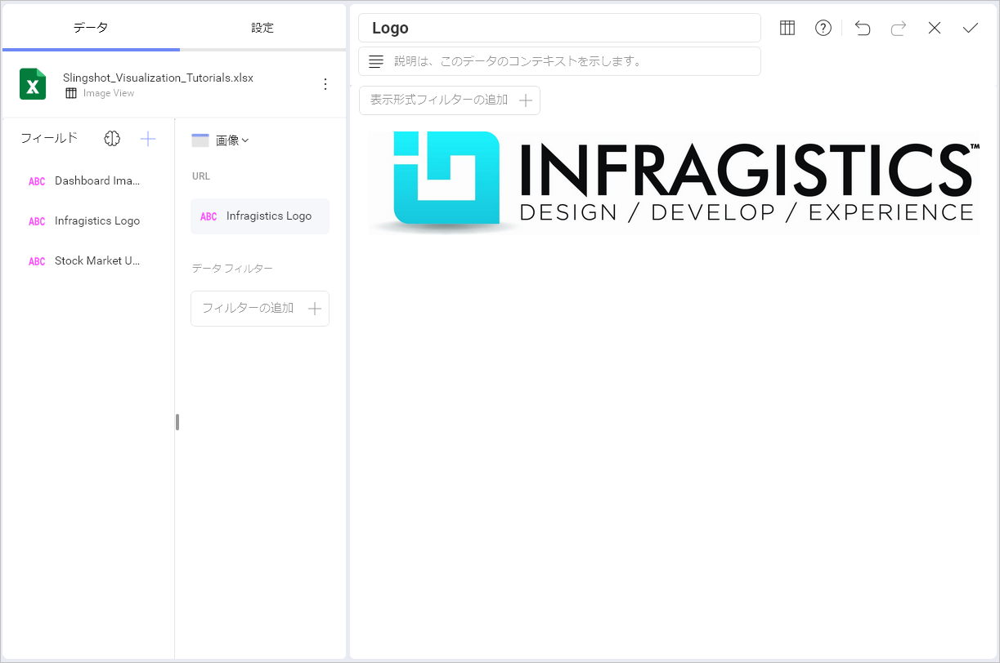

# 画像チャートを作成する方法

このチュートリアルでは、サンプル スプレッドシートを使用して**画像**の表示形式を作成する方法を説明します。

## 重要なコンセプト

[データ表示] セクションに述べたように、画像チャートは URL へ要求を送信して、埋め込みのブラウザーで結果を表示します。したがって、データ ソースに以下の項目が必要です:

  - ウィジェットに表示されるウェブ リソースへのリンク。

  - リンクを**データセットの最初の行**に含みます。

## サンプル データ ソース

このチュートリアルでは、[Slingshot Visualization Tutorials](https://download.infragistics.com/slingshot/samples/Slingshot_Visualization_Tutorials.xlsx) の *Image Chart* シートを使用します。

 1. ダッシュボードを保存する場所に応じて、**分析**、ワークスペース、またはプロジェクトでダッシュボード リストを開くことができます。ダッシュボードは後からいつでも別の場所に移動できます。

 2. **[+ ダッシュボード]** ボタンをクリックまたはタップします。

 

 3. ダイアログが開き、すでに追加されているデータ ソースのリストが表示されます。Visualization Tutorial (表示形式チュートリアル) ファイルは、すでに使用している場合はデータ ソースとしてそこにあります。ファイルを追加していない場合は、**[+ データ ソース]** ⇒ **[データ ファイル]** ⇒ **[+ 新規]** ⇒ **[アップロード]** をクリックまたはタップして ⇒ ファイルを選択し、**[選択して続行]** ををクリックまたはタップしてリストに含めます。

 

 4. データ ソースを設定したら、*Image View* シートを選択します。

   

 5. デフォルトで、表示形式のタイプは**柱状**に設定されています。**画像**オプションを選択します。

  

6. 使用可能なフィールドのいずれかを **[URL]** にドラッグします。

