# KPI ゲージを作成する方法

このチュートリアルでは、サンプル スプレッドシートを使用して KPI ゲージの表示形式を作成する方法を説明します。

<table>
<colgroup>
<col style="width: 50%" />
<col style="width: 50%" />
</colgroup>
<tbody>
<tr class="odd">
<td>
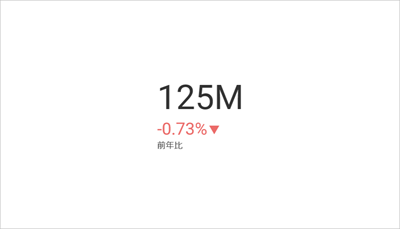 

<a href="#kpi-ゲージの作成">KPI ゲージ</a> 

</td>
<td>
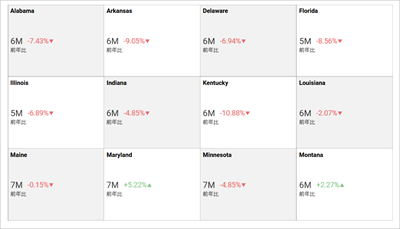 

<a href="#1-つの表示形式で複数の-kpi-ゲージを作成する方法">複数の KPI ゲージ</a> 

</td>
</tr>
<tr class="even">
<td>
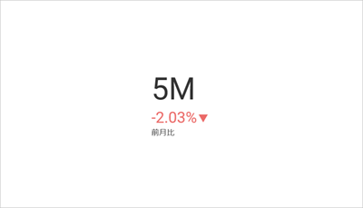 

<a href="#日付比較タイプの変更">月ごとの KPI ゲージ</a> 

</td>
<td>
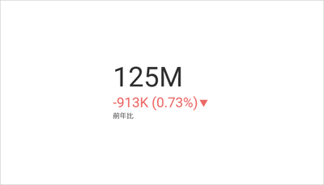 

<a href="#kpi-ゲージの差分ラベルの変更">値とパーセンテージの違いがある KPI ゲージ</a> 

</td>
</tr>
<tr class="odd">
<td>
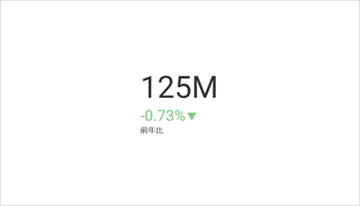 

<a href="#差分マーカーの色の変更">値が減少したときに緑色のマーカーが付いた KPI ゲージ</a> 

</td>
<td></td>
</tr>
</tbody>
</table>

KPI ゲージ ビューのためのガイドは、以下のリンクから参照してください:

  - [KPI ゲージの作成方法](#kpi-ゲージの作成)

  - [1 つの表示形式で複数の KPI ゲージを作成する方法](#1-つの表示形式で複数の-kpi-ゲージを作成する方法)

  - [KPI の日付タイプを変更する方法](#日付比較タイプの変更)

  - [KPI の差分ラベルを変更する方法](#kpi-ゲージの差分ラベルの変更)

  - [KPI の差分マーカーの色を変更する方法](#差分マーカーの色の変更)

## 重要なコンセプト

KPI ゲージは、特定の期間内のパフォーマンスとその変動を表示するためのものです。作成するには、次のものが必要です:

  - データエディターの **[日付]** プレースホルダーにドロップする **1 つのフィールド**。

  - **[値]** にドロップする **1 つのフィールド**。

## サンプル データ ソース

このチュートリアルでは、[Analytics チュートリアル スプレッドシート](https://download.infragistics.com/slingshot/samples/Slingshot_Visualization_Tutorials.xlsx)の [KPI ビュー] シートを使用します。

>[!NOTE]
>このリリースでは、ローカル ファイルとしての Excel ファイルはサポートされていません。チュートリアルを実行するには、サポートされているクラウド サービスのいずれかにファイルをアップロードするか、[ウェブ リソース](../datasources/supported-data-sources/web-resource.md)として追加してください。

## KPI ゲージの作成

|                                          |                                                                                              |                                                                                                                                                      |
| ---------------------------------------- | -------------------------------------------------------------------------------------------- | ---------------------------------------------------------------------------------------------------------------------------------------------------- |
| 1\. **ダッシュボードを作成する**               | 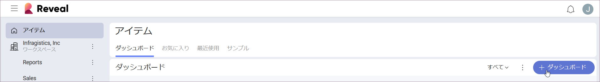                 | ダッシュボード ビューアーで、[ダッシュボード] 画面の右上隅にある [+ ダッシュボード] ボタンを選択します。|
| 2\. **データ ソースを構成する**       | 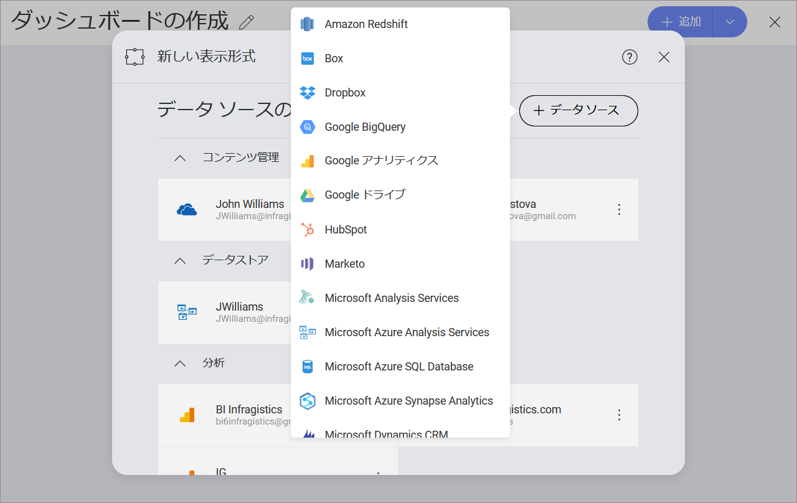                     | [新しい表示形式] ウィンドウで、右下隅の [+ データ ソース] ボタンを選択し、データ ソースを選択します。                                       |
| 3\. **チュートリアル スプレッドシートを選択する** | 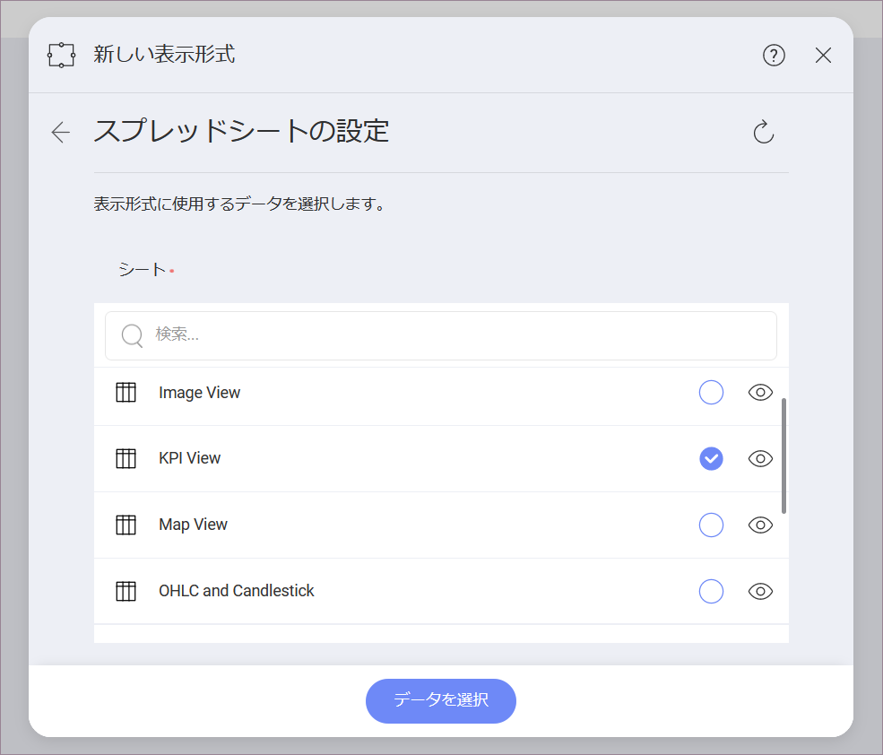 | データ ソースを設定したら、**Analytics チュートリアル スプレッドシート**を選択します。に、*KPI Gauge* シートを選択します。                                 |
| 4\. **表示形式メニューを開く**     | 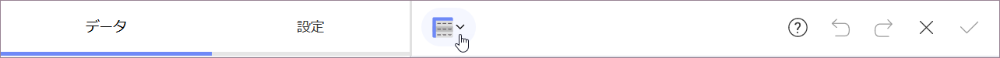   | 表示形式エディターのトップ バーで**グリッド アイコン**を選択します。                                                                                |
| 5\. **表示形式を選択する**        | 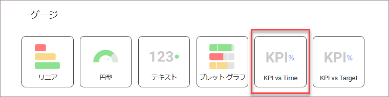                         | デフォルトで、表示形式のタイプは**グリッド**に設定されています。**[KPI vs Time]** ゲージを選択します。                                                            |
| 6\. **データを体系化する**               | 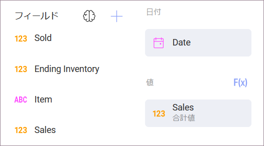         | [ラベル] に Date フィールド、[値] に Sales フィールドをドラッグアンドドロップします。                                                                       |

## 1 つの表示形式で複数の KPI ゲージを作成する方法

1 つの表示形式で複数の KPI を作成するには、データ エディターの**カテゴリ** プレースホルダーにフィールドを追加する必要があります。

|                                          |                                                                                                      |                                                                                                                                                      |
| ---------------------------------------- | ---------------------------------------------------------------------------------------------------- | ---------------------------------------------------------------------------------------------------------------------------------------------------- |
| 1\. **ダッシュボードを作成する**               |                          | ダッシュボード ビューアーで、[ダッシュボード] 画面の右上隅にある [+ ダッシュボード] ボタンを選択します。|
| 2\. **データ ソースを構成する**       |                              | [新しい表示形式] ウィンドウで、右下隅の [+ データ ソース] ボタンを選択し、データ ソースを選択します。                                       |
| 3\. **チュートリアル スプレッドシートを選択する** |          | データ ソースを設定したら、**Analytics チュートリアル スプレッドシート**を選択します。に、*KPI Gauge* シートを選択します。                                 |
| 4\. **表示形式メニューを開く**     |            | 表示形式エディターのトップ バーで**グリッド アイコン**を選択します。                                                                                |
| 5\. **表示形式を選択する**        | 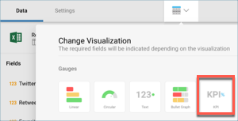                                 | デフォルトで、表示形式のタイプは**グリッド**に設定されています。 **[KPI vs Time]** ゲージを選択します。                                                            |
| 6\. **データを体系化する**               | 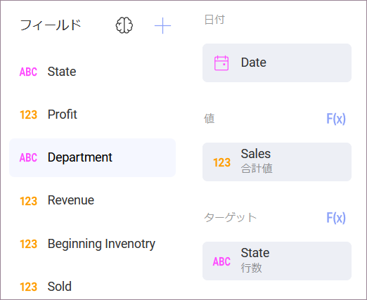 | Date フィールドを [日付] に、Sales フィールドを [値] に、State フィールドを [カテゴリ] にドラッグアンドドロップします。                                    |

## 日付比較タイプの変更

デフォルトでは、KPI ゲージの日付タイプは前年比になります。[タイプ] フィールドを変更することでこれを変更できます。以下は変更手順です。

|                                  |                                                                        |                                                                                                                                                |
| -------------------------------- | ---------------------------------------------------------------------- | ---------------------------------------------------------------------------------------------------------------------------------------------- |
| 1\. **設定メニューへアクセスする** | 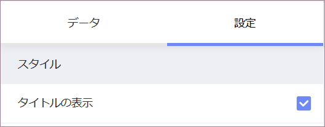 | 表示形式エディターの **[設定]** セクションに移動します。                                                                                    |
| 2\. **タイプを変更する**          | 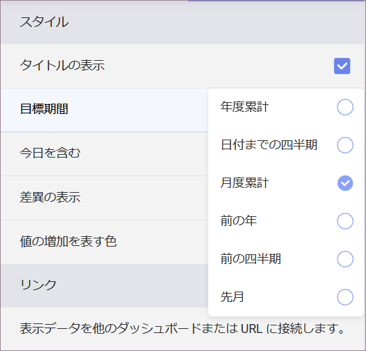     | デフォルトでは、日付タイプは前年比になります。 **[目票期間]** の横のドロップダウンを選択し、選択を **[月度累計]** に変更します。|

## KPI ゲージの差分ラベルの変更

|                                  |                                                                                            |                                                                                                                                                                         |
| -------------------------------- | ------------------------------------------------------------------------------------------ | ----------------------------------------------------------------------------------------------------------------------------------------------------------------------- |
| 1\. **設定メニューへアクセスする** |                      | 表示形式エディターの **[設定]** セクションに移動します。                                                                                                             |
| 2\. **タイプを変更する**          |  | デフォルトで、差分ラベルは**パーセンテージ**に設定されています。 **[差異の表示]** の横のドロップダウンを選択し、選択を **[値とパーセンテージ]** に変更します。|

## 差分マーカーの色の変更

デフォルトでは、KPI ゲージのマーカーの色は、正の値の場合は緑、負の値の場合は赤に設定されます。ただし、減少をプラスとして表現したい場合もあります。以下は設定方法です。

|                                  |                                                                                                          |                                                                                                                                                             |
| -------------------------------- | -------------------------------------------------------------------------------------------------------- | ----------------------------------------------------------------------------------------------------------------------------------------------------------- |
| 1\. **設定メニューへアクセスする** |                                    | 表示形式エディターの **[設定]** セクションに移動します。                                                                                                 |
| 2\. **タイプを変更する**          | 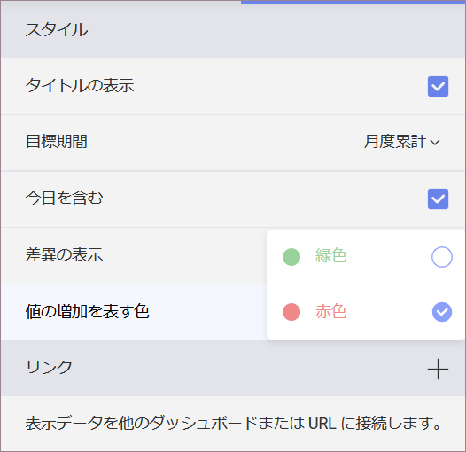 | デフォルトでは、マーカーの色は緑に設定されます。**[値の増加を表す色]** の横のドロップダウンを選択し、選択を **[赤色]** に変更します。|
