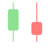

# 表示形式のチュートリアル

このセクションでは、Analytics の表示形式の作成手順を説明します。すべてのセクションのデータ表示形式に使用しているデータ ソースは、[こちら](https://download.infragistics.com/slingshot/samples/Slingshot_Visualization_Tutorials.xlsx)からダウンロードしてください。表示形式がサポートされる各ウィジェットの情報については、ヘルプの[データ表示](~/docs/analytics/data-visualizations/overview.md)セクションを参照してください。

<table>
<colgroup>
<col style="width: 20%" />
<col style="width: 20%" />
<col style="width: 20%" />
<col style="width: 20%" />
<col style="width: 20%" />
</colgroup>
<tbody>
<tr class="odd">
<td>
 

<a href="simple-charts.md">エリア</a> 

</td>
<td>
 

<a href="simple-charts.md">棒</a> 

</td>
<td>
 

<a href="gauge-charts.md">ブレット グラフ</a> 

</td>
<td>
 

<a href="candlestick-chart.md">ロウソク足</a> 

</td>
<td>
 

<a href="gauge-charts.md#円型ゲージを作成する方法">円型</a> 

</td>
</tr>
<tr class="even">
<td>
 

<a href="simple-charts.md">柱状</a> 

</td>
<td>
 

<a href="simple-charts.md">ドーナツ型</a> 

</td>
<td>
 

<a href="simple-charts.md">ファンネル</a> 

</td>
<td>
 

<a href="image-chart.md">画像</a> 

</td>
<td>
 

<a href="kpi-gauge.md">KPI</a> 

</td>
</tr>
<tr class="odd">
<td>
 

<a href="simple-charts.md">折れ線</a> 

</td>
<td>
 

<a href="gauge-charts.md#リニア-ゲージを作成する方法">リニア</a> 

</td>
<td>
 

<a href="ohlc-chart.md">OHLC チャート</a> 

</td>
<td>
 

<a href="simple-charts.md">円</a> 

</td>
<td>
 

<a href="simple-charts.md">ラジアル</a> 

</td>
</tr>
<tr class="even">
<td>
 

<a href="sparkline-charts.md">スパークライン</a> 

</td>
<td>
 

<a href="simple-charts.md">スプライン</a> 

</td>
<td>
 

<a href="simple-charts.md">スプライン エリア</a> 

</td>
<td>
 

<a href="stacked-charts.md">積層型エリア</a> 

</td>
<td>
 

<a href="stacked-charts.md">積層型棒</a> 

</td>
</tr>
<tr class="odd">
<td>
 

<a href="stacked-charts.md">積層型柱状</a> 

</td>
<td>
 

<a href="simple-charts.md">ステップ エリア</a> 

</td>
<td>
 

<a href="simple-charts.md">ステップ折れ線</a> 

</td>
<td>
 

<a href="gauge-charts.md#テキスト-ゲージを作成する方法">テキスト</a> 

</td>
<td>
 

<a href="text-view.md">テキスト ビュー</a> 

</td>
</tr>
</tbody>
</table>
