# シンプル シリーズのチャートを作成する方法

このチュートリアルは、サンプル スプレッドシートを使用してシンプル シリーズのチャートを作成する方法を説明します。

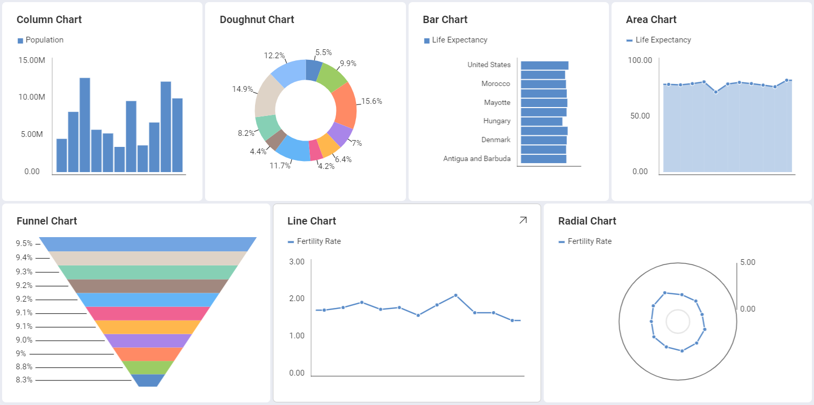

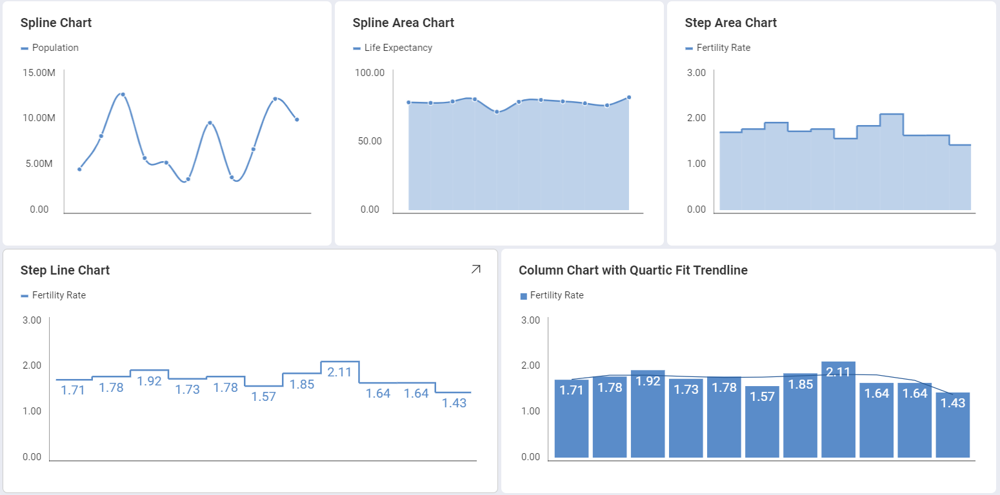

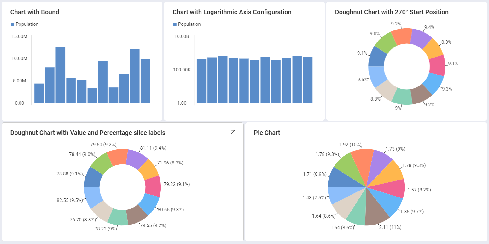

シンプル チャート ビューのガイドは、以下のリンクから参照してください。

  - [エリア チャートを作成する方法](https://www.slingshotapp.io/en/help/docs/analytics/visualization-tutorials/simple-charts#creating-your-chart)

  - [チャートにトレンドラインを追加する方法](https://www.slingshotapp.io/en/help/docs/analytics/visualization-tutorials/simple-charts#adding-a-trendline-to-your-chart)

  - [軸の構成を変更する方法](https://www.slingshotapp.io/en/help/docs/analytics/visualization-tutorials/simple-charts#changing-your-axis-configuration)

  - [軸の構成を対数に変更する方法](https://www.slingshotapp.io/en/help/docs/analytics/visualization-tutorials/simple-charts#setting-your-axis-configuration-as-logarithmic)

  - [ドーナツ型と円チャートの開始位置の変更方法](https://www.slingshotapp.io/en/help/docs/analytics/visualization-tutorials/simple-charts#changing-the-start-position-for-doughnut-and-pie-charts)

  - [ファンネル、円とドーナツ型 チャートのスライスのラベルを変更する方法](https://www.slingshotapp.io/en/help/docs/analytics/visualization-tutorials/simple-charts#changing-the-slice-labels-for-doughnut-funnel-and-pie-charts)

## 重要なコンセプト

チャートを使用する時、表示される情報とともに追加の情報も追加できます。これは以下の機能で追加できます。

  - チャートに折れ線で表示する**チャート トレンドライン**。変数間の関係や情報全体の方向性を表す場合に役立ちます。チャートに回帰と呼ばれるいくつかのアルゴリズムを適用できます。回帰は **[チャート トレンドライン]** から選択できます。

  - **軸の構成**: 軸の構成でチャートの最大値と最小値を構成できます。デフォルトで最小値は 0 に設定され、最大値は使用されるデータによって設定されます。

      - **対数軸構成**: [対数] ボックスをチェックする場合、値のスケールは通常のリニア スケールを使用する代わりに大きさを使用するリニア スケール以外で計算されます。

  - **開始位置**: 円チャートおよびドーナツ型チャートでチャートのスライスを回転する開始位置を構成し、データの表示順序を変更できます。

  - **スライス ラベル**: ドーナツ型、ファンネル、および円チャートでは、値やパーセンテージ、またはその両方を同時に表示するスライス ラベルを構成できます。

## サンプル データ ソース

このチュートリアルでは [Reveal チュートリアル スプレッドシート](https://download.infragistics.com/reportplus/help/samples/Reveal_Visualization_Tutorials.xlsx) の Simple Series Charts シートを使用します。

>[!NOTE]
>このリリースでは、ローカル ファイルとしての Excel ファイルはサポートされていません。チュートリアルを実行するには、サポートされているクラウド サービスのいずれかにファイルをアップロードするか、[ウェブ リソース](~/jp/datasources/supported-datasources/web-resource.md)として追加してください。

## チャートの作成

1. Select the **+ Dashboard** button in the top right-hand corner of **My Analytics**.

                                         

2. Select your data source(**Reveal Tutorials Spreadsheet**) from the list of data sources. If the data source is new, you will need to first add it from the **+ Data Source** button in the top-right corner.

                                             

3. Choose the **Simple Series Charts** sheet.     

   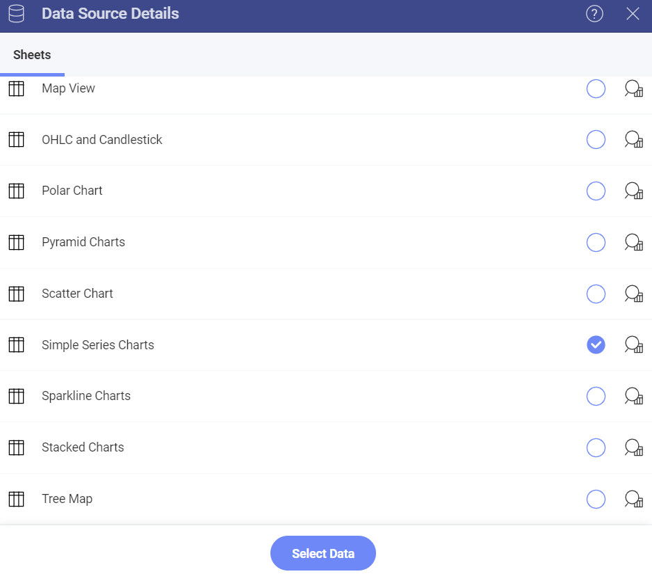

4. Open the *Visualization Picker* and select any of the **chart** visualizations. By default, the visualization type will be set to *Column*. 

   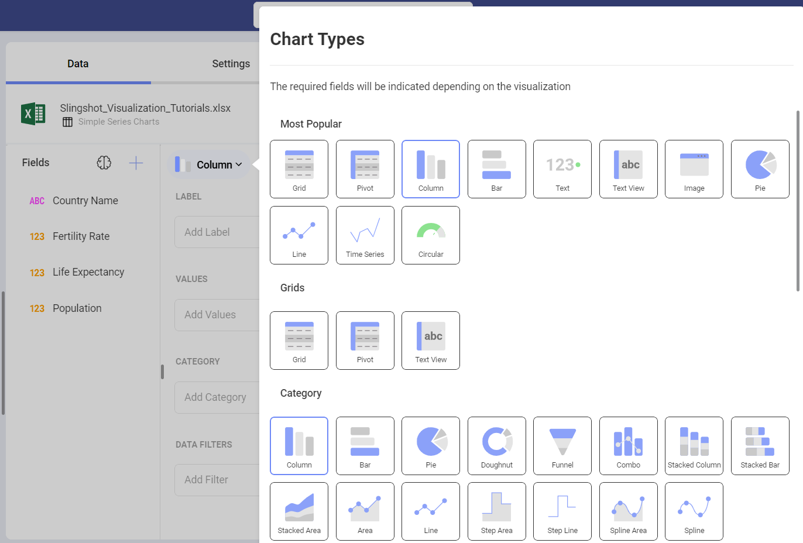 
 
 5. The charts in the table above, for example, display the population for a select list of countries. Drag and drop the "Country Name" field to "Label" and the "Population" field into "Values".                                                        
   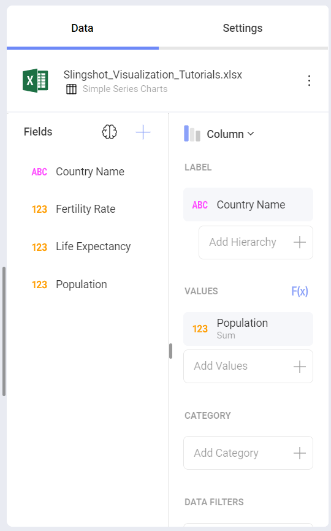                                   

## チャートに近似曲線を追加する

情報全体の方向性またチャートの変数の関係を表すためにチャートの近似曲線を追加できます。以下は作業手順です。

|                                     |                                                                        |                                                                  |
| ----------------------------------- | ---------------------------------------------------------------------- | ---------------------------------------------------------------- |
| 1\. **設定を変更する**             | 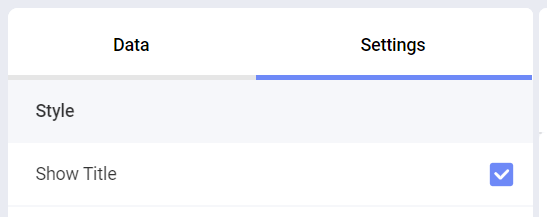  | 表示形式エディターの **[設定]** セクションに移動します。      |
| 2\. **チャートの近似曲線へアクセスする** | 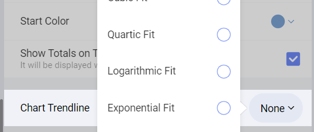 | Expand the Chart Trendline dropdown by selecting the down arrow to select one of Reveal's predefined trendlines. |

## 軸の構成の変更

[ゲージのバンド](~/jp/data-visualizations/visualization-types/gauge-charts.html#bands-configuration)と同様に、チャート軸構成でチャートの最小と最大値を設定できます。この機能を使用して、特定のデータ含有や除外ができます。

|                                        |                                                                                      |                                                                                                                                       |
| -------------------------------------- | ------------------------------------------------------------------------------------ | ------------------------------------------------------------------------------------------------------------------------------------- |
| 1\. **設定を変更する**                |                  | 表示形式エディターの **[設定]** セクションに移動します。                                                                           |
| 2\. **範囲の設定にアクセスする** | 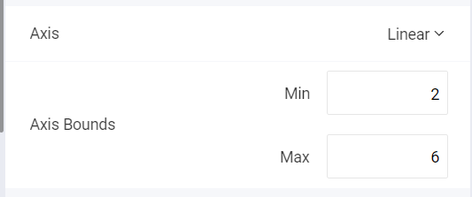                           | Navigate to *Axis Bounds*. Depending on whether you want to set the minimum or maximum value (or both), enter the value you want the chart to start or end with. |

## 軸を対数軸として設定

|                                           |                                                                          |                                                             |
| ----------------------------------------- | ------------------------------------------------------------------------ | ----------------------------------------------------------- |
| 1\. **設定を変更する**                   |      | 表示形式エディターの **[設定]** セクションに移動します。|
| 2\. **軸オプションにアクセスする**            | img src="images/axis-logarithmic.png" alt="Tutorials-Axis-Bounds" class="responsive-img"/>               | Expand the Axis dropdown by selecting the down arrow and select *Logarithmic*.      |   

## ドーナツ型と円チャートの開始位置の変更

|                                                   |                                                                                |                                                                                           |
| ------------------------------------------------- | ------------------------------------------------------------------------------ | ----------------------------------------------------------------------------------------- |
| 1\. **設定を変更する**                           |            | 表示形式エディターの **[設定]** セクションに移動します。                               |
| 2\. **開始位置セクションにアクセスする**         | 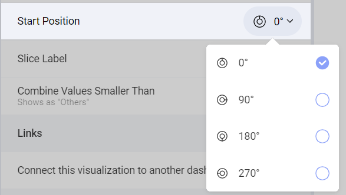               | Expand the *Start Position* dropdown by selecting the down arrow. Select one of Reveal's predefined start positions for your chart (0°, 90°, 180° or 270°).                          |

## ドーナツ型、ファンネルと円チャートのスライスのラベルの変更

|                                                |                                                                          |                                                                                                        |
| ---------------------------------------------- | ------------------------------------------------------------------------ | ------------------------------------------------------------------------------------------------------ |
| 1\. **設定を変更する**                        |      | 表示形式エディターの **[設定]** セクションに移動します。                                            |
| 2\. **スライス ラベルのセクションにアクセスする**         | 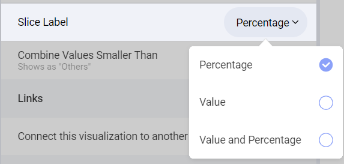               | Expand the Slice Labels dropdown by selecting the down arrow. Select one of Reveal's predefined labeling options ("Percentage", "Value", or "Value and Percentage").                                       |
