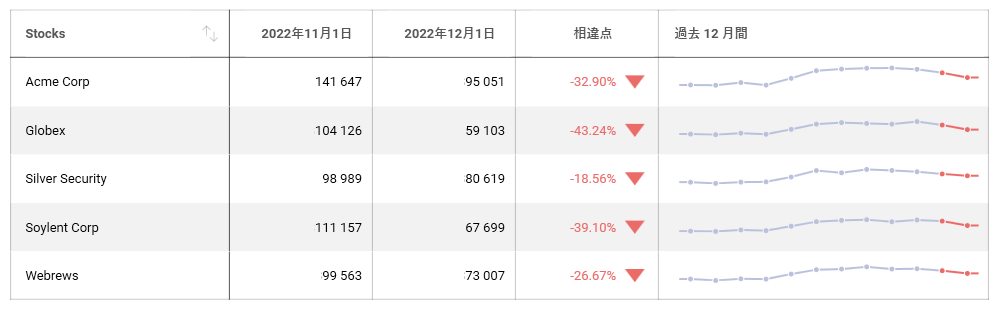
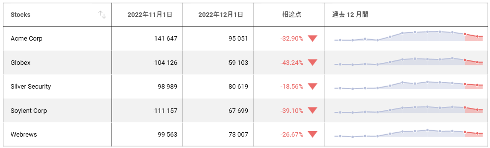
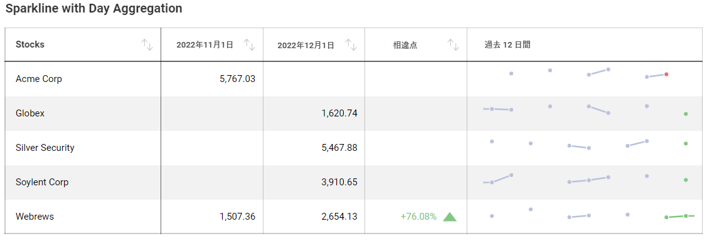
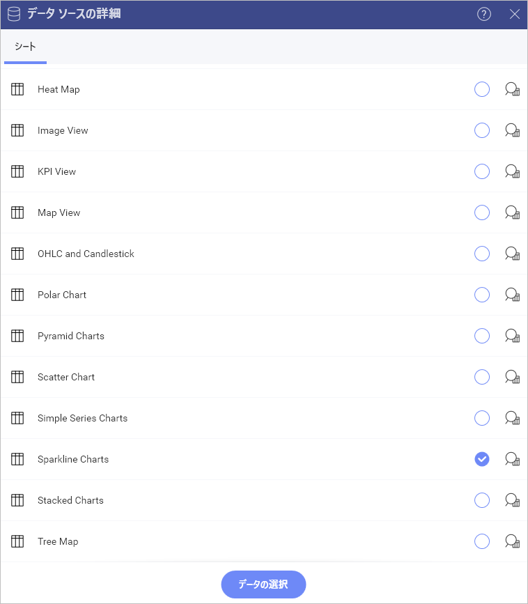
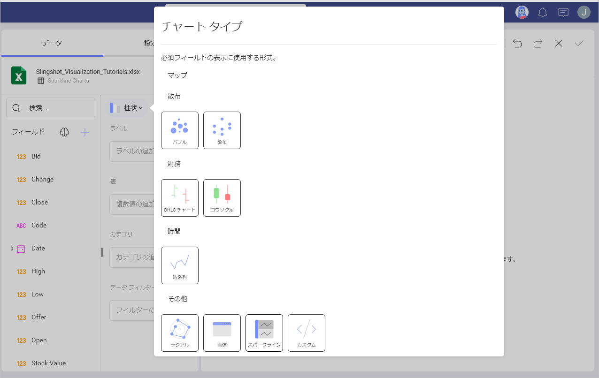
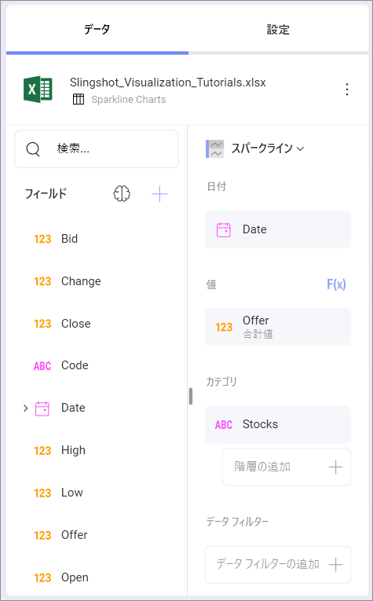
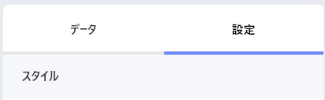
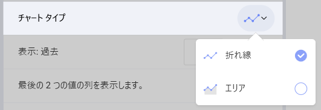
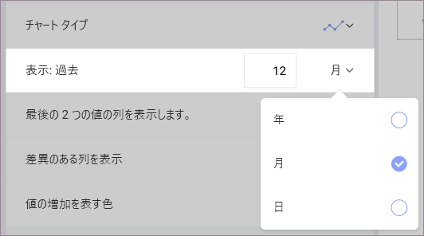
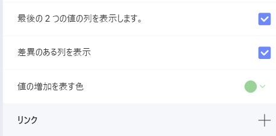

# スパークライン チャートを作成する方法

このチュートリアルは、サンプル スプレッドシートを使用してスパークライン チャートの表示形式を作成する方法を説明します。

スパークライン チャート ビューのガイドは、以下のリンクから参照してください。

  - [スパークライン チャートの作成](https://www.slingshotapp.io/en/help/docs/analytics/visualization-tutorials/sparkline-charts#creating-a-sparkline-chart)

  - [スパークラインのチャート タイプを変更する方法](https://www.slingshotapp.io/en/help/docs/analytics/visualization-tutorials/sparkline-charts#changing-the-chart-type-for-the-sparkline)

  - [日付集計を変更する方法](https://www.slingshotapp.io/en/help/docs/analytics/visualization-tutorials/sparkline-charts#changing-the-date-aggregation)

  - [スパークラインの列数を変更する方法](https://www.slingshotapp.io/en/help/docs/analytics/visualization-tutorials/sparkline-charts#modifying-the-amount-of-columns-in-the-sparkline)

## 重要なコンセプト

スパークライン チャートは、指定した日付範囲のトレンドとその進行を表示します。OHLC チャートやローソク足チャートなど、ファイナンシャル シナリオと株の変動の分析のために役立ちます。
スパークラインは、グリッドセル内に折れ線チャートを表示します。

  - データ エディターの **[日付]** プレースホルダーにドロップする**フィールド**。

  - **[値]** にドロップする**フィールド**。

  - **[カテゴリ]** にドロップする**フィールド**。

スパークライン チャートを使用する時、表示するデータに対して情報を追加、変更または削除できます。これは以下の機能で追加できます。

  - スパークラインの**チャート タイプ**は、**折れ線**または**エリア** チャートのいずれかを選択できます。

  - チャートの日付**集計**。

  - 同じチャート内に表示される**値の数**。

  - データに**過去 2 か月を含めるかどうか、またそれらの差異など**、スパークラインのグリッドに含める明示的な情報。

## サンプル データ ソース

このチュートリアルでは [Slingshot Visualization Tutorials](https://download.infragistics.com/slingshot/samples/Slingshot_Visualization_Tutorials.xlsx) の *Sparkline Charts* シートを使用します。

>[!NOTE]
>このリリースでは、ローカル ファイルとしての Excel ファイルはサポートされていません。チュートリアルを実行するには、サポートされている**クラウド サービス**のいずれかにファイルをアップロードするか、[ウェブ リソースとして](../datasources/supported-data-sources/web-resource.md)追加してください。

## スパークライン チャートの作成

1. **[分析]** セクションの右上隅にある **[+ ダッシュボード]** ボタンを選択します。

     

2. データ ソースのリストからデータ ソース (**Slingshot Tutorials Spreadsheet**) を選択します。データ ソースが新しい場合は、最初に右上隅の **[+ データ ソース]** ボタンから追加する必要があります。

                                            

3. *Sparkline Charts* シートを選択します。

                            

4. **表示形式ピッカー**を開き、**スパークライン チャート**を選択します。デフォルトで、表示形式のタイプは**柱状**に設定されています。                                                                             
                                                                                
5. *Date* フィールドを **[日付]** に、*Offer* を **[値]** に、*Stocks* を **[カテゴリ]** にドラッグ アンド ドロップします。

    

## スパークラインのチャート タイプを変更する方法

スパークライン チャートに使用するチャートのタイプを変更できます。以下は作業手順です。

|                                  |                                                                                        |                                                                     |
| -------------------------------- | -------------------------------------------------------------------------------------- | ------------------------------------------------------------------- |
| 1\. **設定メニューへアクセスする** |                  | 表示形式エディターの **[設定]** セクションに移動します。         |
| 2\. **チャート タイプを変更する**    |  | デフォルトで、チャート タイプは [折れ線] に設定されています。[エリア] に設定します。 |

## 日付集計の変更

デフォルトでは、情報の集計は **12 ヶ月**です。[表示: 過去] 設定で変更できます。以下は変更手順です。

|                                  |                                                                                                      |                                                                                                                                                      |
| -------------------------------- | ---------------------------------------------------------------------------------------------------- | ---------------------------------------------------------------------------------------------------------------------------------------------------- |
| 1\. **設定メニューへアクセスする** |                               | 表示形式エディターの **[設定]** セクションに移動します。                                                                                          |
| 2\. **集計を変更する**   |   | デフォルトで、[表示: 過去] 設定は **[月]** に設定されます。[月] の横のドロップダウンを選択し、[年] または [日] に変更します。|

日付の集計の隣にある数値を変更して、表示するデータを増減できます。

## スパークラインの列数を変更する方法

分析で、表示形式の列数は、過去 2 か月とそれらの差を表示するかどうかによって定義されます。デフォルトで有効になります。以下は削除方法です。

|                                      |                                                                                    |                                                                                                                                                          |
| ------------------------------------ | ---------------------------------------------------------------------------------- | -------------------------------------------------------------------------------------------------------------------------------------------------------- |
| 1\. **設定メニューへアクセスする**     |              | 表示形式エディターの **[設定]** セクションに移動します。                                                                                              |
| 2\. **表示列を変更する** |  | どちらもスパークラインに表示しない場合は、**[最後の 2 つの値の列を表示] または [差異のある列を表示] ボックスをオフにします**。|
