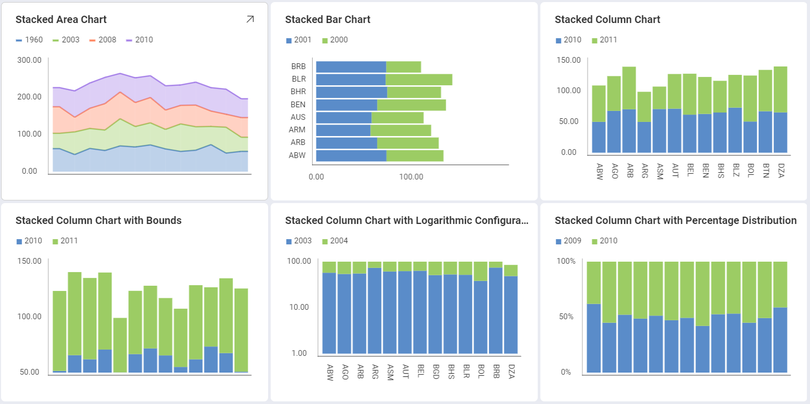
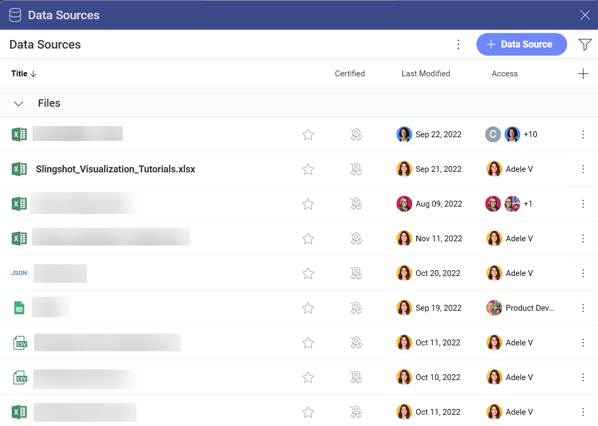
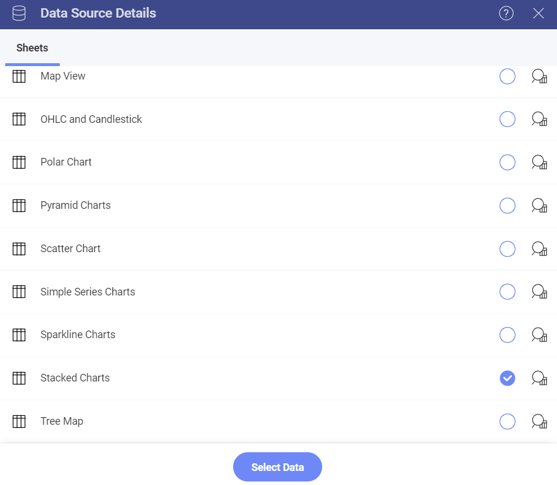
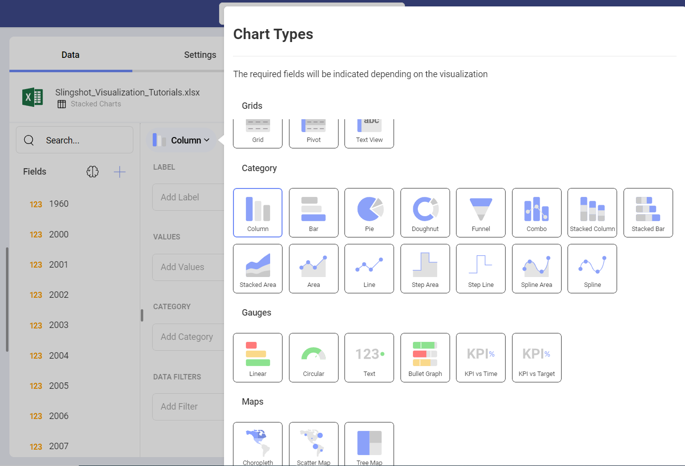
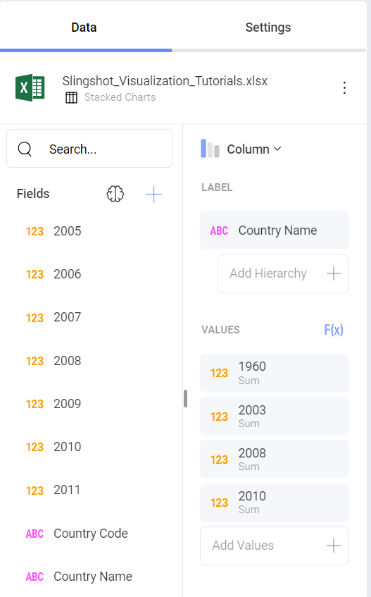
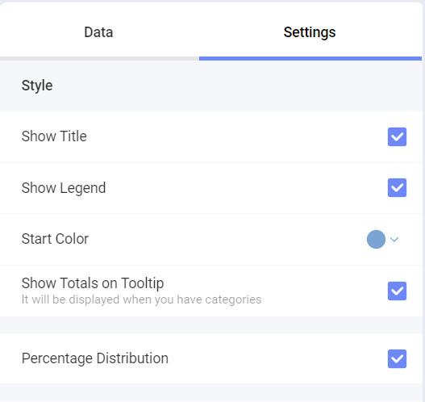

# 積層型チャートを作成する方法

このチュートリアルはサンプル スプレッドシートを使用し積層型チャートを作成する方法を説明します。

  

積層型チャート ビューのガイドは、以下のリンクから参照してください。

  - [積層型柱状チャートを作成する方法](https://www.slingshotapp.io/en/help/docs/analytics/visualization-tutorials/stacked-charts#creating-a-stacked-chart)

  - [積層型チャートのタイプを変更する方法](#change-chart-type)

  - [軸の構成を変更する方法](https://www.slingshotapp.io/en/help/docs/analytics/visualization-tutorials/stacked-charts#changing-your-axis-configuration)

  - [軸の構成を対数に変更する方法](https://www.slingshotapp.io/en/help/docs/analytics/visualization-tutorials/stacked-charts#setting-your-axis-configuration-as-logarithmic)

  - [百分率分布を有効にする方法](https://www.slingshotapp.io/en/help/docs/analytics/visualization-tutorials/stacked-charts#enabling-percentage-distribution)

## 重要なコンセプト

積層型チャートは、3 つのレイアウトから選択できます - [エリア](#積層型チャートの作成)、[柱状](#積層型チャートの作成)および[棒](#積層型チャートの作成)。

以下の項目も設定できます。

  - **軸の構成**: 軸の構成でチャートの最大値と最小値を構成できます。デフォルトで最小値は 0 に設定され、最大値は使用されるデータによって設定されます。

      - **対数軸構成**: [対数] ボックスをチェックする場合、値のスケールは通常のリニア スケールを使用する代わりに大きさを使用するリニア スケール以外で計算されます。

## サンプル データ ソース

このチュートリアルでは [Reveal チュートリアル スプレッドシート](https://download.infragistics.com/reportplus/help/samples/Reveal_Visualization_Tutorials.xlsx) の Stacked Charts シートを使用します。

>[!NOTE]
>このリリースでは、ローカル ファイルとしての Excel ファイルはサポートされていません。チュートリアルを実行するには、サポートされているクラウド サービスのいずれかにファイルをアップロードするか、[ウェブ リソース](datasources/supported-data-sources/web-resource.html)として追加してください。

## 積層型チャートの作成

 1. Select the **+ Dashboard** button in *My Analytics*.  

   
                                                      
 2. Select your data source(**Reveal Tutorials Spreadsheet**) from the list of data sources. If the data source is new, you will need to first add it from the **+ Data Source** button in the top-right corner.     

  

 3. Choose the "Stacked Charts" sheet.               

  
  
 4. Select the **grid icon** in the top bar of the Visualizations Editor. By default, the visualization type will be set to *Column*. You can always change it by selecting any of the **stack** visualizations.     
 
                                                                                                        
 5. Stacked charts require two or more fields to be dragged and dropped into the "Values" placeholder of the data editor. In this case, the "1960", "2003", "2008" and "2010" fields have been dropped into "Values" and "Country Name" in "Label". 

   

## 軸の構成を変更する方法

[ゲージのバンド](~/jp/data-visualizations/gauge-charts#bands-configuration)と同様に、チャート軸構成でチャートの最小と最大値を設定できます。
この機能を使用して、特定のデータ含有や除外ができます。

|                                        |                                                                                      |                                                                                                                                       |
| -------------------------------------- | ------------------------------------------------------------------------------------ | ------------------------------------------------------------------------------------------------------------------------------------- |
| 1\. **設定を変更する**                |                | 表示形式エディターの **[設定]** セクションに移動します。                                                                           |
| 2\. **範囲の設定へアクセスする** |                            | Navigate to Axis Bounds. Depending on whether you want to set the minimum or maximum value (or both), enter the value you want the chart to start or end with.  |                                                                               

## 軸構成を対数的としての設定

|                                           |                                                                          |                                                             |
| ----------------------------------------- | ------------------------------------------------------------------------ | ----------------------------------------------------------- |
| 1\. **設定を変更する**                   |     | 表示形式エディターの **[設定]** セクションに移動します。 |
| 2\. **軸のオプションへアクセスする**            |                | Expand the Axis dropdown by selecting the down arrow. Then select *Logarithmic*.|      

## 百分率分布を有効する方法

積層型チャートに百分率分布も構成できます。このタイプのチャートに値と百分率分布スケールを切り替えます。以下は作業手順です。

|                                        |                                                                                    |                                                                                           |
| -------------------------------------- | ---------------------------------------------------------------------------------- | ----------------------------------------------------------------------------------------- |
| 1\. **設定を変更する**                |               | 表示形式エディターの **[設定]** セクションに移動します。                               |
| 2\. **百分率分布を有効にする** |  | [パーセンテージの配分] ボックスをチェックして、パーセンテージの配分設定を有効にします。|
