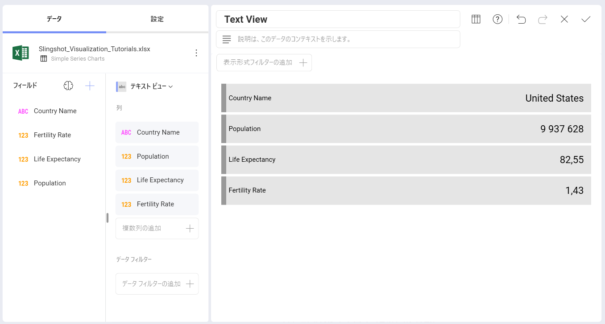
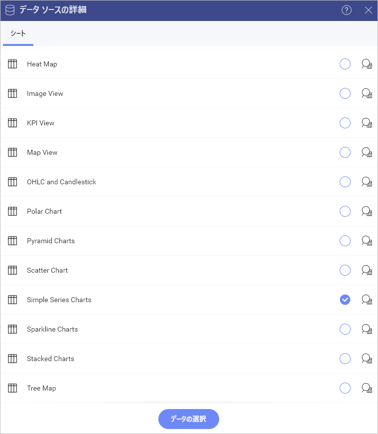
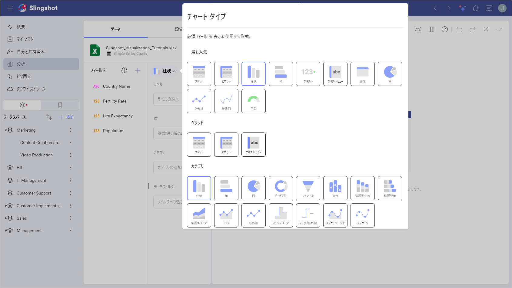
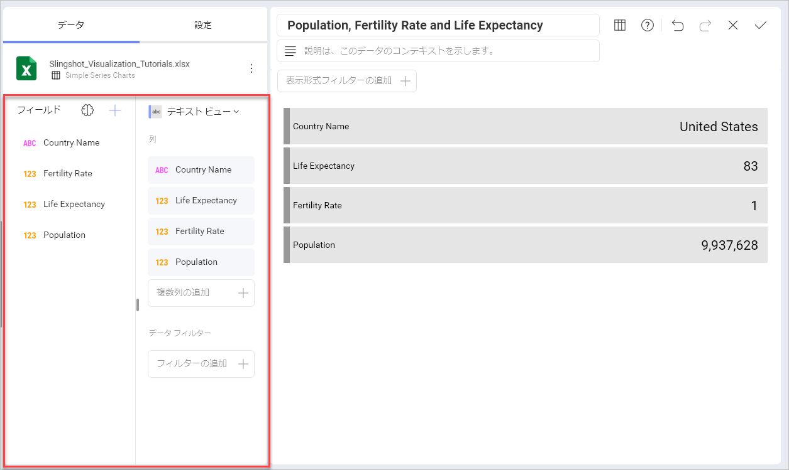
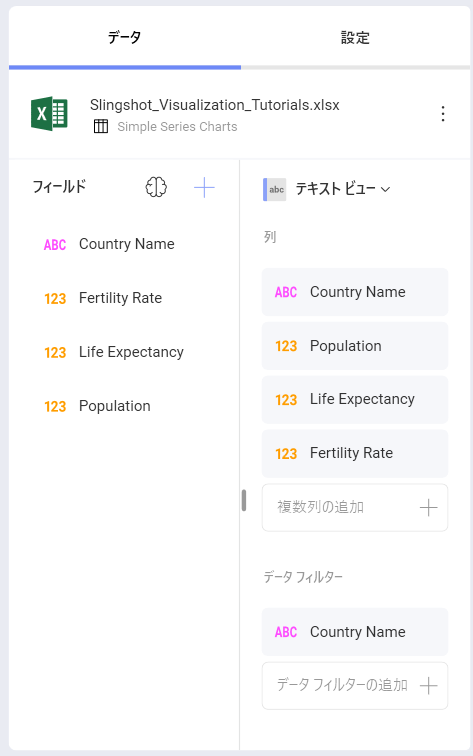
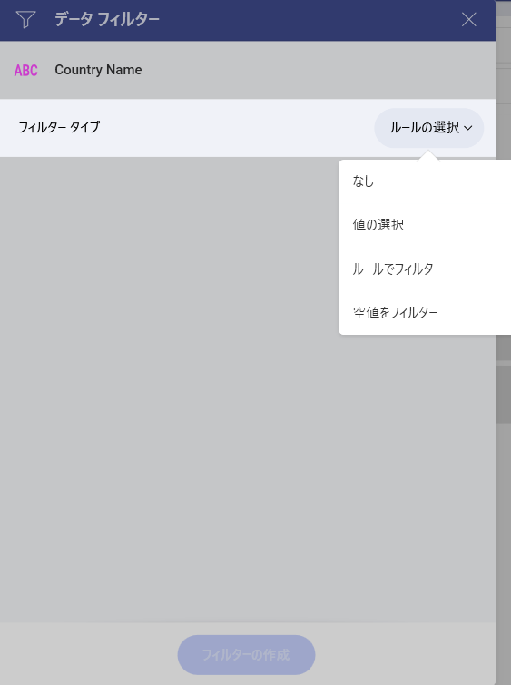
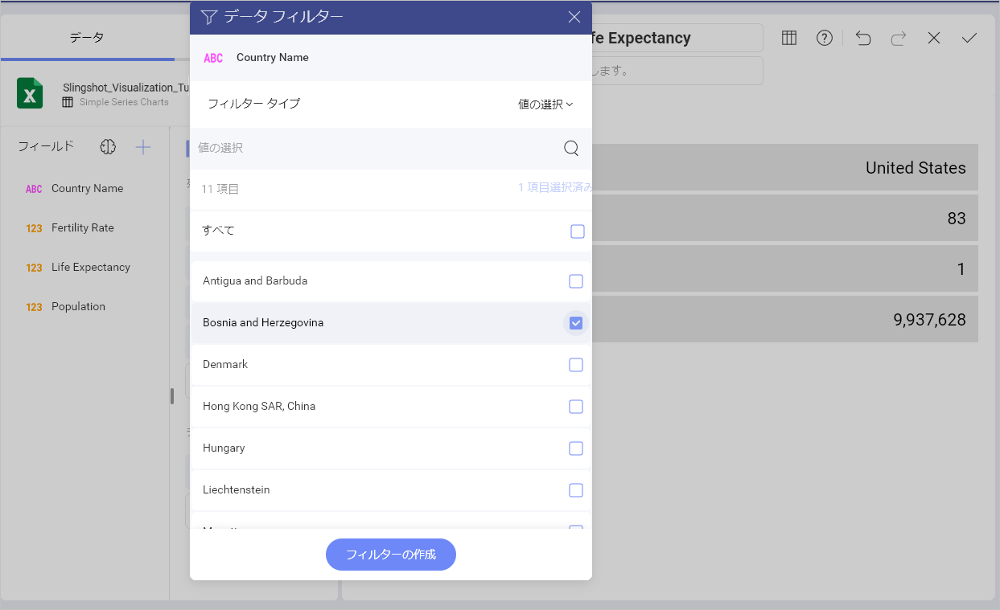

# テキスト ビューを作成する方法

このチュートリアルはサンプル スプレッドシートを使用しテキスト ビューを作成する方法を説明します。

テキスト ビューのガイドは、以下のリンクから参照してください。

  - [基本的なテキスト ビューを作成する方法](#creating-text-view)

  - [選択された行を変更する方法](#changing-selected-row)

## 重要なコンセプト

テキストビューではキーと値のパターンで情報が表示されますが、**列のラベルとペアになっているデータの最初の行のみが表示されます**。ただし、フィルターを追加して、必要な行が Reveal 表示されるようにすることができます。

## サンプル データ ソース

このチュートリアルでは [Slingshot Visualization Tutorials](https://download.infragistics.com/slingshot/samples/Slingshot_Visualization_Tutorials.xlsx) の *Simple Series Charts* シートを使用します。

>[!NOTE]
>このリリースでは、ローカル ファイルとしての Excel ファイルはサポートされていません。チュートリアルを実行するには、サポートされているクラウド サービスのいずれかにファイルをアップロードするか、[ウェブ リソース](datasources/supported-data-sources/web-resource.md)として追加してください。

## テキスト ビューを作成する方法

 1. **[分析]** の右上隅にある **[+ ダッシュボード]** ボタンをクリックまたはタップします。

                                                             
 2. データ ソースのリストから、操作するデータ ソースを選択できます。データ ソースが新しい場合は、**[+ データ ソース]** ボタンから追加する必要があります。

                                                              
 3. データ ソースを構成したら、**Slingshot tutorials Spreadsheet** を選択します。次に、*Simple Series Charts* シートを選択します。 

                                                                                           
 4.  **表示形式ピッカー**を開き、**テキスト ビュー**を選択します。デフォルトで、表示形式のタイプは**柱状**に設定されています。  
 
                                                                                                      
5. たとえば、上記のテキスト ビューには、特定の国の人口、平均余命および出生率が表示されます。「Country Name」、「Population」、「Life Expectancy」、「Fertility Rate」を [列] にドラッグアンドドロップします。

        

## 選択された行を変更する方法

デフォルトで、テキスト ビューはシートの最初の行を表示されます。これを変更するためにフィルターを適用できます。たとえば、テキスト ビューに行 9 (ボスニア・ヘルツェゴビナ) を表示させます。

1.「Country Name」フィールドを **[データ フィルター]** にドラッグ アンド ドロップします。   
 

2. [フィルター タイプ] を選択してドロップダウン メニューを有効にし、**[値の選択]** を選択します。
 
  

3. デフォルトでは、すべての値が選択済です。**[すべて]** ボックスのチェックを外し、**Bosnia and Herzegovina** のみを選択します。次に、**[フィルターの作成]** を選択します。 

 
