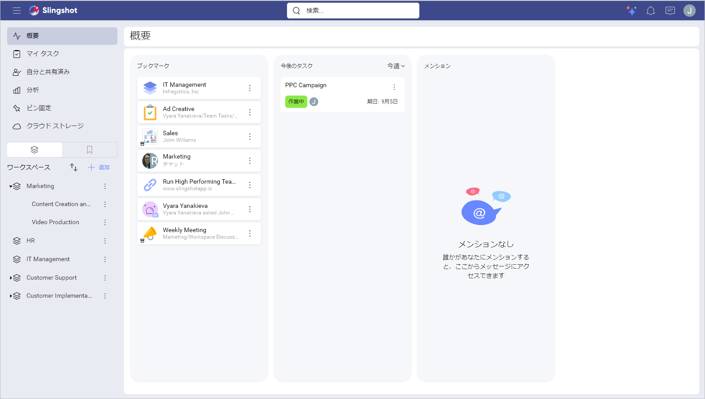
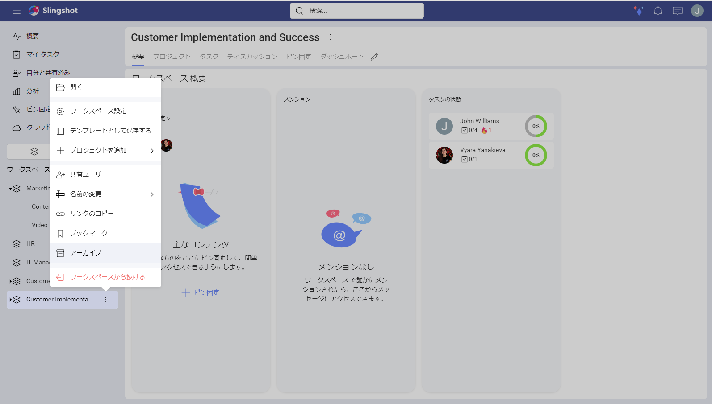
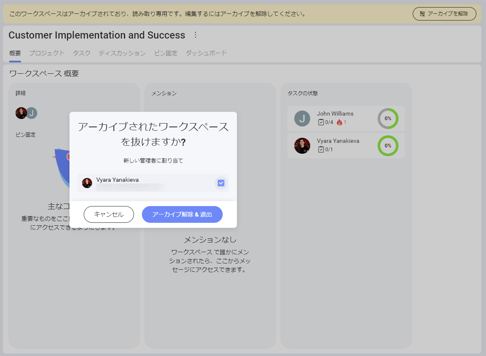
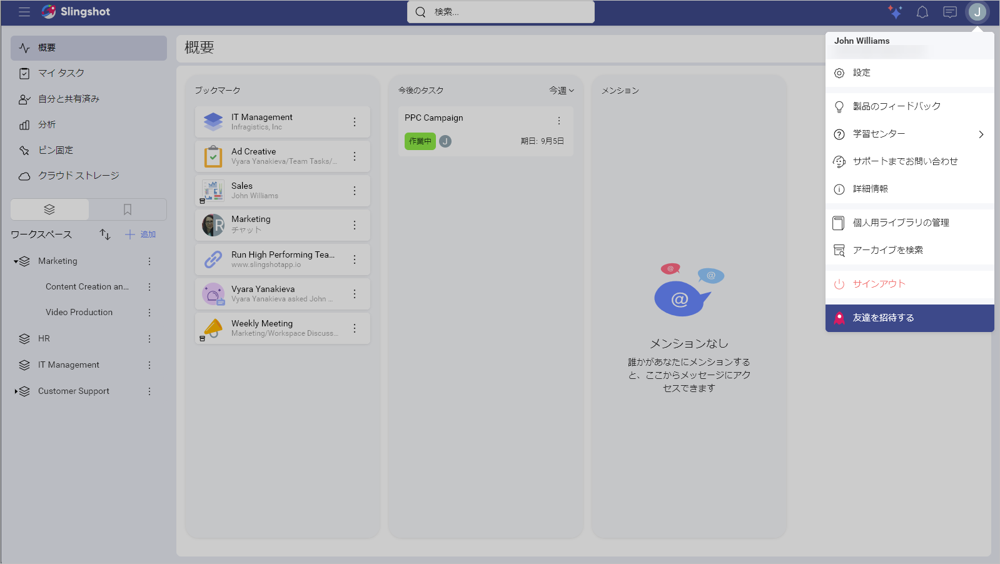
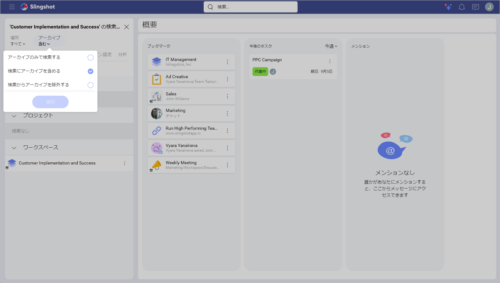
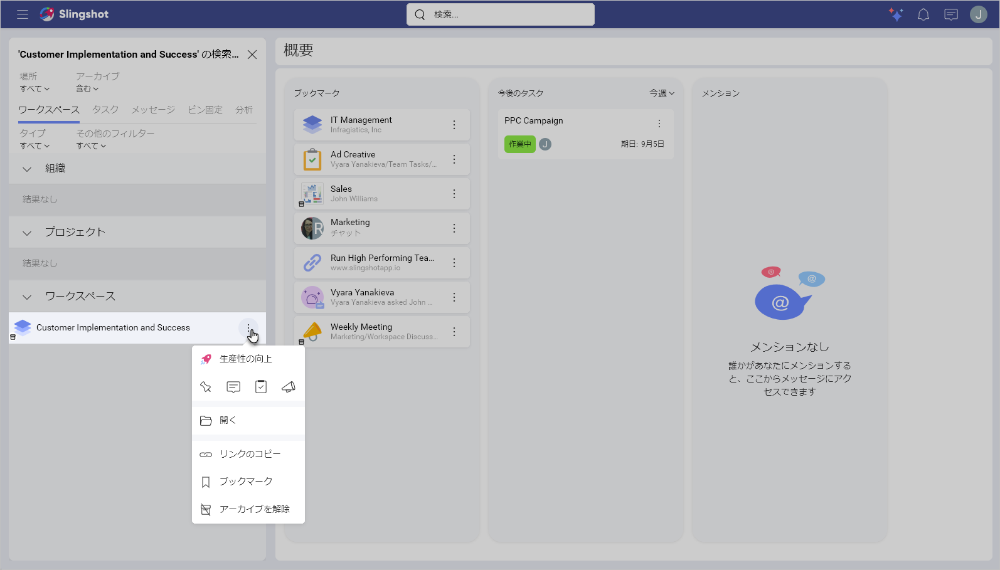
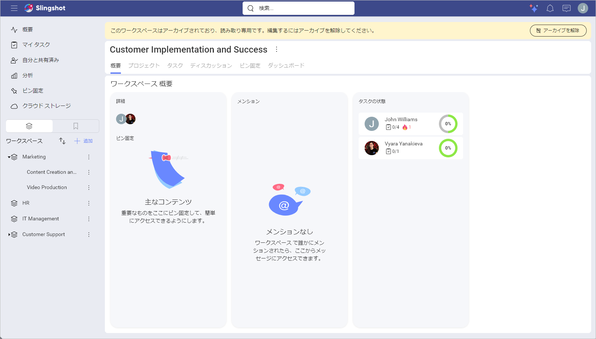
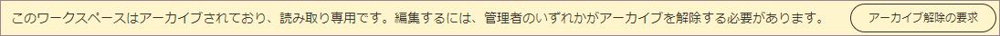
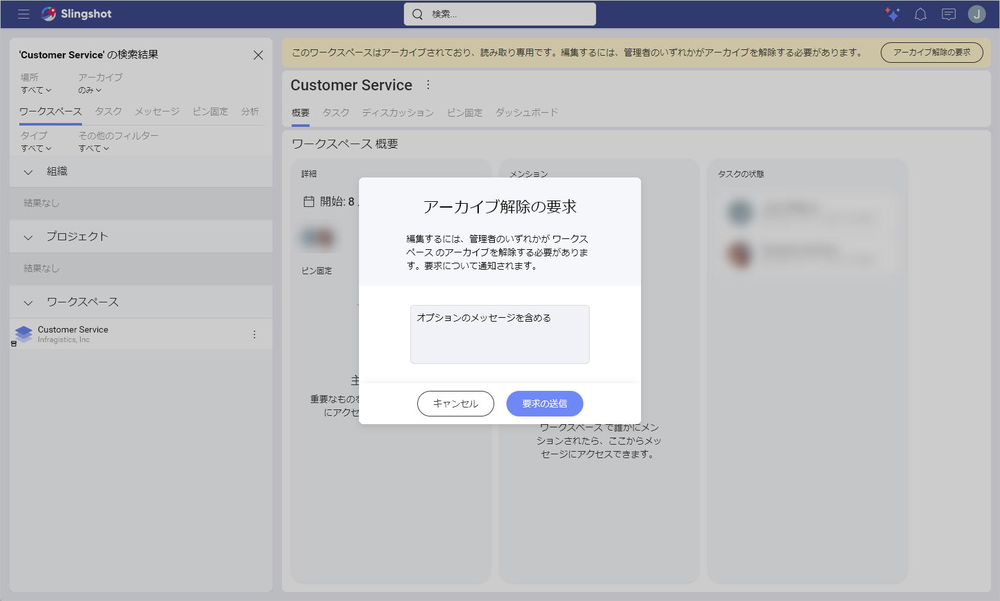
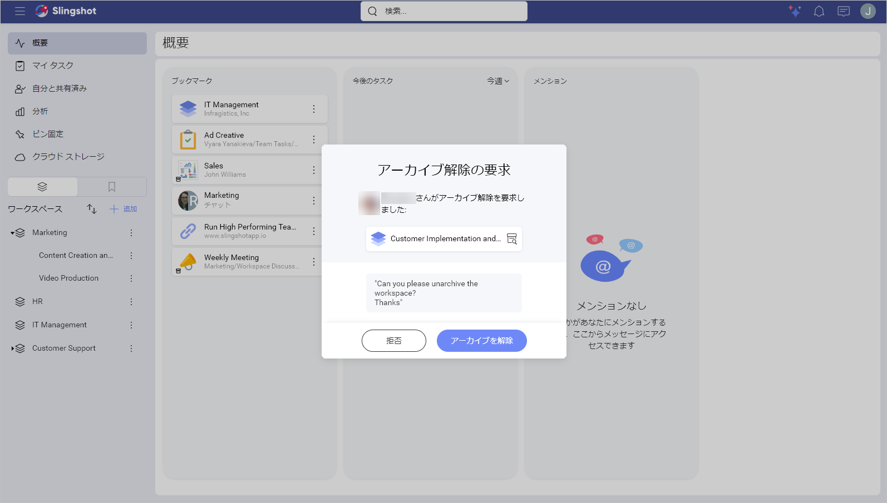

# アーカイブ

Slingshot の有料サブスクリプションを持つユーザーは、Slingshot を整理してクリーンな状態に保つために、アーカイブを使用して、さまざまな項目をビューから非表示にすることができます。アーカイブされた項目は、いつでもアーカイブ解除して再度使用することができます。

## アーカイブ可能な項目

ワークスペース、プロジェクト、リスト、ディスカッション、データ ソース、ダッシュボードをアーカイブできます。

>[!Note] 組織のデータ カタログ リストはアーカイブできません。

## 項目をアーカイブする方法

1.	アーカイブしたい項目の横にあるオーバーフロー メニューを開きます。この場合、*Customer Implementation and Success* ワークスペースをアーカイブしました。

2.	**[アーカイブ]** をクリックまたはタップします。 

>[!Note] アーカイブされたワークスペースは編集できません。ワークスペースの管理者から抜けるなどの変更を行う場合は、まずアーカイブを解除し、新しい管理者を割り当ててから抜ける必要があります。

## アーカイブされた項目を見つける方法

アーカイブされた項目を見つけるには、次の操作を行います。

1.	プロフィール設定の **[アーカイブを検索]** をクリックまたはタップして検索バーを開きます。あるいは、検索バーに項目の名前を直接入力することもできます。

2.	検索結果に**アーカイブ**を含めるか、アーカイブされた項目のみを検索するかを選択します。

## 項目のアーカイブを解除する方法 

項目のアーカイブを解除する手順は、上記と同様です。

項目のアーカイブを解除するには、次の操作を行います。

1.	検索バーにアーカイブされた項目の名前を入力します。

2.	検索結果に**アーカイブ**を含めるか、アーカイブされた項目のみを検索するかを選択します。

3.	アーカイブ解除したい項目の横にあるオーバーフロー メニューから **[アーカイブを解除]** をクリックまたはタップします。 

または、バナーの **[アーカイブを解除]** をクリックまたはタップすることもできます。

## アーカイブできるユーザー 

|項目| ワークスペース管理者| 編集者| 閲覧者|
-----|---|----|----|
|ワークスペース| :white_check_mark: | :x: | :x:|
|プロジェクト| :white_check_mark: | :x: | :x:|
|ワークスペース ディスカッション| :white_check_mark:| :x: | :x:  |
|ワークスペース データ ソース| :white_check_mark:| :x: | :x: |
|ワークスペース リスト| :white_check_mark: | :x: | :x: |
|ワークスペース ダッシュボード| :white_check_mark: | :x: | :x: |

|項目|プロジェクト管理者|編集者|閲覧者|
-----|---|----|----|
|ワークスペース| :x: | :x: | :x: |
|プロジェクト| :white_check_mark: | :x: | :x: |
|プロジェクト ディスカッション| :white_check_mark:| :x:| :x: |
|プロジェクト データ ソース| :white_check_mark:| :x: | :x: |
|プロジェクト リスト| :white_check_mark: | :x: | :x: |
|プロジェクト ダッシュボード| :white_check_mark: | :x: | :x: |

**編集者**と**閲覧者**は、次の手順で項目の管理者にアクセスを要求できます。

1.	アーカイブされた項目を開きます。

2.	バナーの **[アーカイブ解除の要求]** をクリックまたはタップします。 

3. 管理者にメッセージを残すことができるダイアログが表示されます。準備ができたら、**[要求の再送信]** をクリックまたはタップします。

4. 管理者に通知が届きます。それを開くと、新しいダイアログが表示され、要求を拒否するか、項目をアーカイブ解除することができます。

<!--  -->
