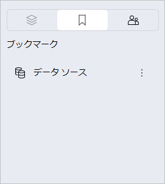
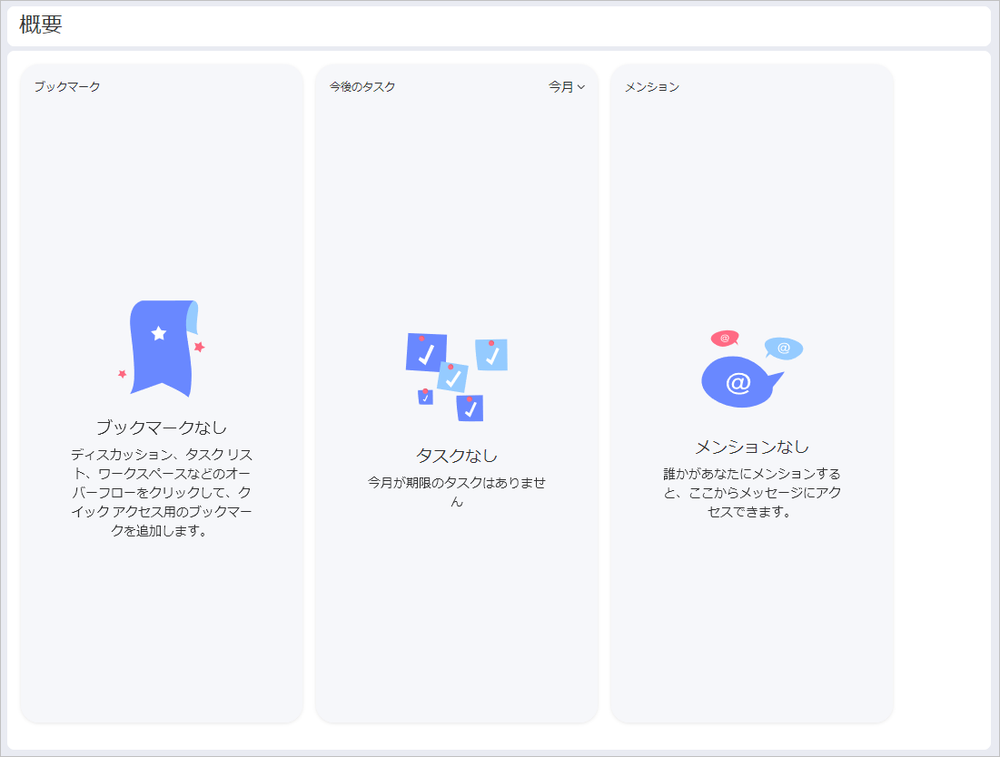
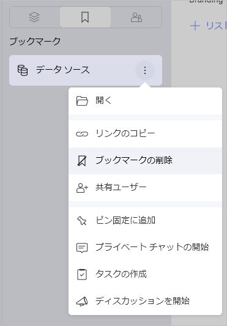

# ブックマーク

データ駆動型の世界では、常に情報を処理しています。チーム メンバーや友達は、URL や画像からダッシュボードやデータ ソースまで、さまざまなタイプのコンテンツを共有します。すべての情報を追跡するのは困難な場合があります。

時間を節約し、重要なコンテンツを整理するために、わずかな手順ですばやくブックマークを作ることができます。

## ブックマークを使用する方法

1.	ブックマークしたいコンテンツの横にあるオーバーフロー メニューを開きます。
2.	提供されたオプションから **[ブックマーク]** を選択します。 
3.	タスクやダッシュボードをブックマークに追加すると、左側のパネルの [ワークスペース] および [グループ] の隣にある **[ブックマーク]** セクションに追加されたブックマークが表示されます。

または、**[概要]** をクリックしても、ブックマークにアクセスできます。

多くの項目をブックマークしている場合は、手動でドラッグアンドドロップしてリストを整理できます。

## ブックマークできる項目

タスク、リンク、チャット メッセージ、ディスカッションからワークスペース、プロジェクト、データソース、ダッシュボードまで、すばやくアクセスしたいもの全てをブックマークすることができます。保存した項目が **[ブックマーク]** にある場合、保存された項目に基づいてオーバーフロー メニューから直接さまざまな操作を実行できます。

## ブックマーク リストから項目を削除する方法

以下の手順でブックマーク項目を削除できます:

1.	**[ブックマーク]** セクションを開きます。
2.	オーバーフロー メニューを開きます。
3.	**[ブックマークの削除]** を選択します。

または、項目を開いてオーバーフロー メニューをクリックし、**[ブックマークの削除]** を選択します。 