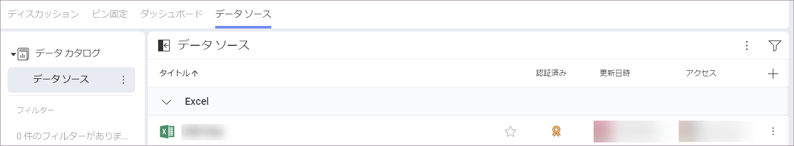
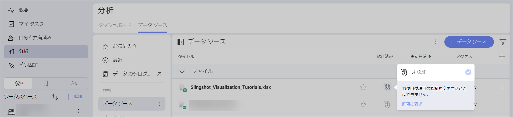

# 認証の使用

Slingshot の組織に所属している場合、リストのデータ ソースおよびダッシュボードの一部が認証されていることがあります。認証は、どのデータ ソースおよびダッシュボードが信頼でき、検証済みの情報のみを含んでいるかを、組織の管理者がユーザーをガイドするのに役立ちます。 

以下は、認証されたデータ ソースとダッシュボードの認識方法、検索できる認証レベル、認証できるユーザーおよび認証方法です。 

## このトピックの対象ユーザー 

**分析**の認証は、Slingshot に組織アカウントがあるユーザーのみが利用できます。 

個人アカウントのユーザーは、データ ソースおよびダッシュボードに認証を使用できません。ただし、組織の一部であるワークスペースに招待された場合、これらのワークスペースの**分析**で、認証済みのデータ ソースとダッシュボードを表示できます。 

## 認証済みのデータ ソースまたはダッシュボードの検索

ワークスペースのデータ ソースまたはダッシュボードには、認証済みのものと未認証のものがあります。データ ソースまたはダッシュボードが認証されると、隣に金色、銀色、または銅色のバッジが表示されます (以下のスクリーンショットを参照)。 

データ ソースまたはダッシュボードが認証されているかどうかがわからない場合は、リストの右上にあるプラス アイコン  を選択します。**[認証済み]** 列のボックスがチェックされていることを確認してください。  

## 認証できるユーザーは?

認証を使用すると、ユーザーが組織で推奨および検証されたデータを検索するのに役立ちます。**認証者**の要件は次のとおりです。 

* 組織の管理者。 
* 組織の管理者によって承認されたユーザー。 

データ ソースを認証できるユーザーを確認するには以下の手順を実行します: 

1. 3 つの点  を選択して、組織ワークスペースの設定を開きます。 
2.  **[組織の設定]** を選択します。 
3. **[データ カタログ]** に移動します。 

ここには、3 つの認証レベル、名前、および認証できるユーザーが表示されます。

組織の**管理者**の場合: 

* 任意の認証レベルの認証者として自分自身を割り当てることができます。
* 他のユーザーを認証者として追加 - 管理者、メンバー、閲覧者、さらに組織外のユーザーを割り当てることができます。
* 認証の名前を変更できます。デフォルトでは、認証レベルは **「金」**、**「銀」** および **「銅」** です。「Sales」、「Marketing」、「RND」など、わかりやすい名前を付けることができます。  

管理者以外のユーザーは、認証になるためのアクセス許可を要求できます。そのためには次の手順を実行します。 

1. 任意のワークスペースまたは **[分析]** の [データ ソース] リストに移動します。
2. 任意のデータ ソースの **[認証済み]** 列でバッジを選択します。 
3. **[許可の要求]** をクリック / タップします (以下のスクリーンショットを参照)。

    

4. すべての組織の管理者にメールが送信され、ユーザーがデータ ソースまたはダッシュボードを認証するための承認を求めることを通知します。 

## 認証プロセス

各データ ソースまたはダッシュボードは、それが存在するワークスペースで個別に認証できます。認証するには、以下の手順を実行します。

1. データ ソースまたはダッシュボードがあるワークスペースに移動します。 
2. **[データ ソース]** または **[ダッシュボード]** タブを選択します。 
3. 認定するデータ ソースまたはダッシュボードの  バッジ アイコンをクリック/タップして、ドロップダウン メニューからバッジを選択します。 

認証は階層的です。つまり、**金**の認証者には、*銀*と**銅**のバッジもドロップダウン メニューに表示されます。また、**銅**認証者には銅バッジのみが表示されます。 

>[!NOTE] 2 つのワークスペースの 2 つのデータ ソースに同じ名前が付けられている場合、認証者は各ワークスペースで個別にデータ ソースを認証する必要があることに注意してください。認証者が同じ情報を含むことを最初に確認する必要があるため、認証は自動的に転送されません。

## 認証済みの項目の移動とコピー

認証済みのデータ ソースまたはダッシュボードを、あるワークスペースから別のワークスペースに移動すると、認証は移行先のワークスペースに保持されます。 

認証済みのデータ ソースまたはダッシュボードを、あるワークスペースから別のワークスペースにコピーすると、認証は失われます。これにより、移動先のワークスペースでデータ ソースまたはダッシュボードを変更できます。組織の認証基準を満たしている場合は、後で認証することができます。

## 認証基準の定義

**分析**の認証は柔軟であるため、独自の認証基準を定義できます。組織で、金、銀、銅バッジの意味を決定し、新しい名前を設定することもできます。 

バッジは名前が示すように階層構造であり、その階層は次のようになります。**金** > **銀** > **銅**

>[!Tip] **プロのヒント** ガイドラインを書き留め、組織のユーザーに配布することを忘れないでください。ガイドライン ドキュメントを組織の **[ピン固定]** セクションにピン固定することで、見つけやすくすることができます。 

