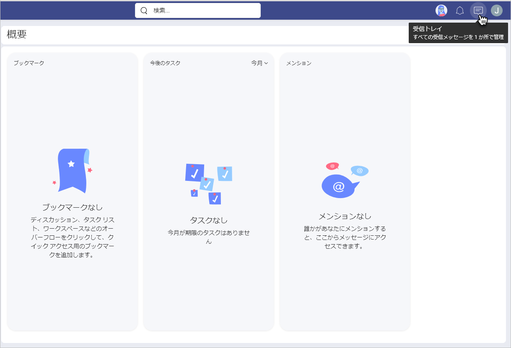
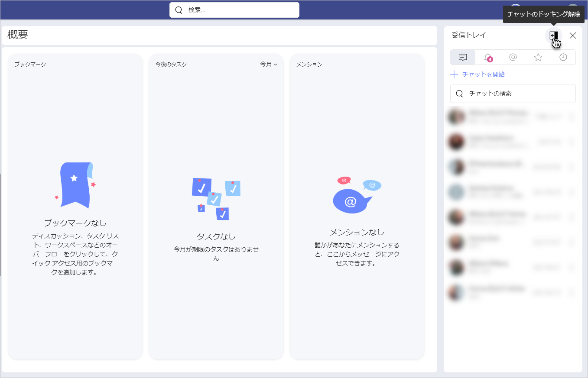
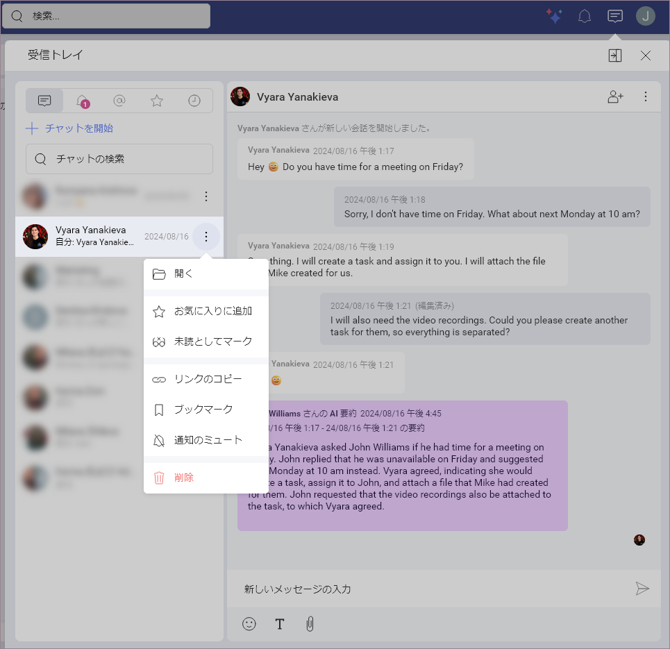
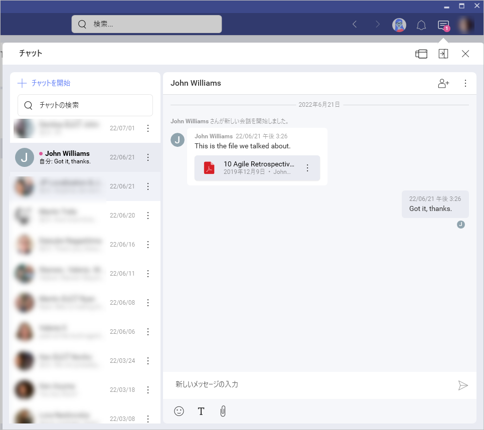
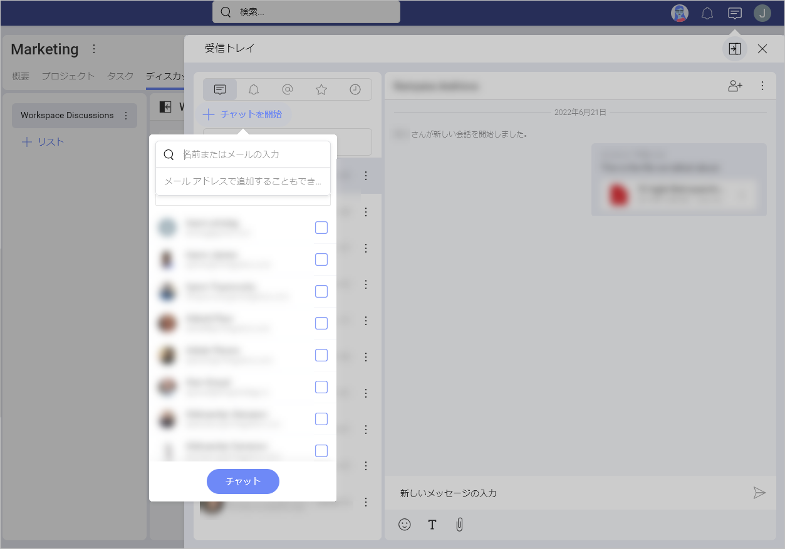
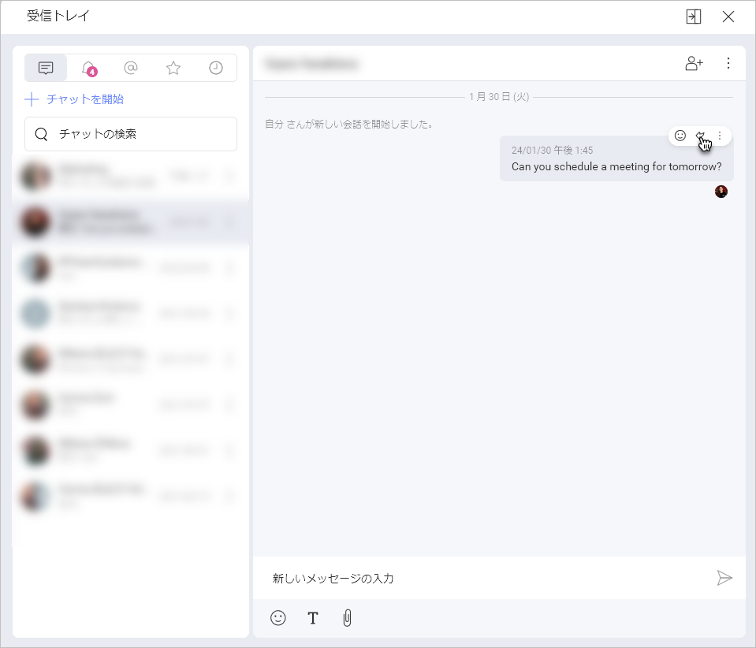
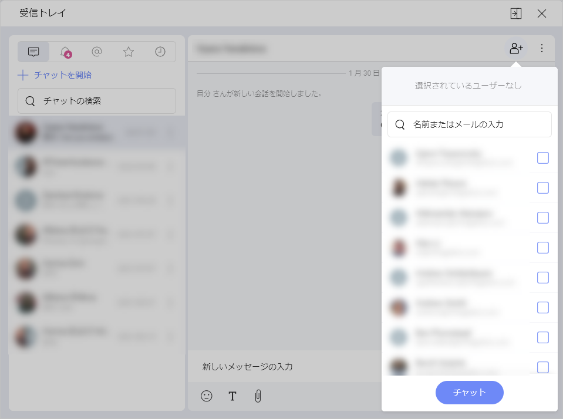
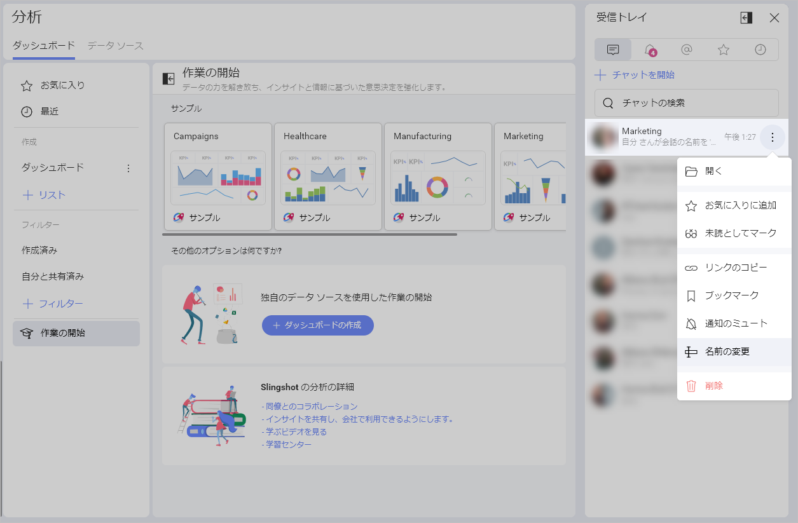
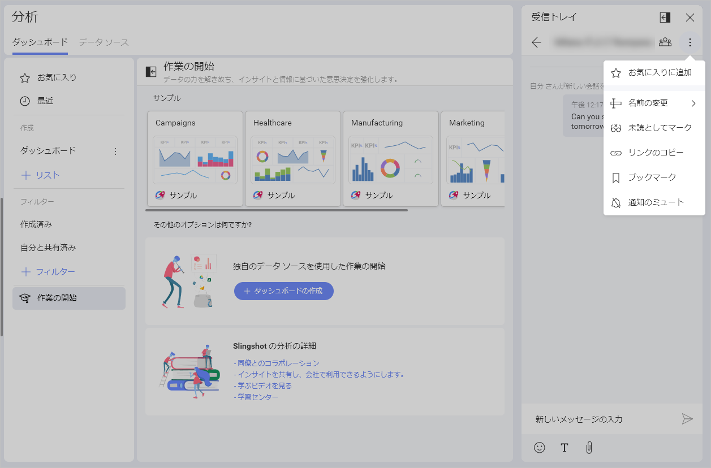
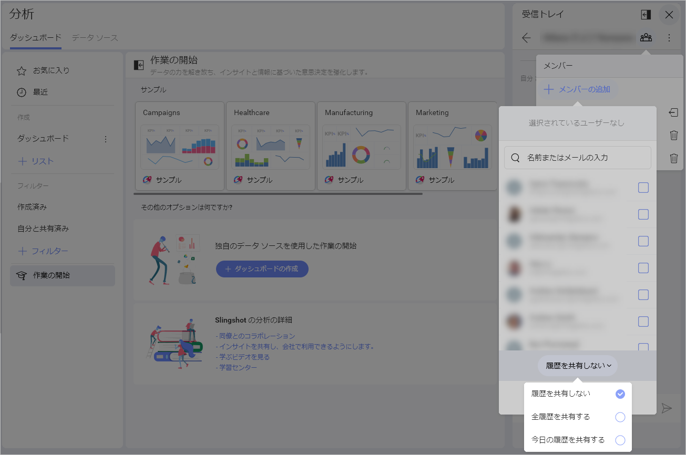

# プライベート チャットの詳細

ようこそ! このトピックは、プライベート チャットの機能を紹介します。

## ディスカッションおよびチャット

Slingshot では、コミュニケーションはディスカッションやプライベート チャットで行われます。

各ワークスペースとプロジェクトに **[ディスカッション]** タブがあります。詳細については、[ディスカッション](discussions-faq.md) トピックを参照してください。 

ディスカッションとは異なり、プライベート チャットはワークスペースとプロジェクトに依存しません。つまり、Slingshot ユーザーまたはユーザー グループとチャットできます。組織に参加しているユーザーと参加していないユーザーとチャットできます。以下は、[個人アカウントのユーザーとチャットする方法](#個人アカウントを持つユーザーとチャットを開始する方法)です。ディスカッションとは異なり、チャットは**プライベート**であり、自分とチャットしているユーザーのみがアクセスできます。 

## チャットにアクセスする方法

上部バーのプロフィール画像の隣に**チャット メッセージ アイコン**があります。アイコンをクリック/タップしてチャット画面を開きます。 

## チャットを常に表示する方法

Slingshot では、タスクの実行中にチャットを非表示または表示できます。 
非表示から表示状態 (または表示から非表示状態) に切り替えるは、**[閉じる]** の隣の**ドッキング / ドッキング解除**アイコンを選択します (以下のスクリーンショットを参照)。

チャットが*ドッキングされる*と、常に右側に表示されます。このモードでは、最後に開いたチャット ルームまたは進行中のチャットのリストを表示できます。 

## チャットを**未読**としてマークする方法

チャットで返信する必要があることを確認するには、チャットを**未読**として設定します。オーバーフロー メニューを開き、**[未読としてマーク]** を選択します。

チャットを**未読**としてマークすると、通知に表示されます。チャットの隣に赤い点が表示され、未読であることを示します。

チャットの横にあるオーバーフロー メニューを開いて **[既読としてマーク]** を選択すると、チャットを既読としてマークすることができます。チャットを開くと**既読**になります。

## プライベート チャットを開始する方法

チャットを開始するには、チャット画面を開きます。以下の手順を実行します。

1. **[+ チャットを開始]** 青いボタンをクリック/タップします。 

2. リストからユーザーを選択するか、上部の**検索**ボックスに名前またはメールを入力します。

3. **[チャット]** をクリック / タップします。 

>[!NOTE] **[+ チャットを開始]** ボタンが表示されない場合は、チャットが[ドッキングされている](#チャットを常に表示する方法)かどうかを確認してください。この場合、**[閉じる]** の横にある **[ドッキング解除]** アイコンを選択します。

返信矢印をクリックまたはタップして、自分のメッセージや他の人からのメッセージに返信することもできます。メッセージにカーソルを合わせると表示されます。

>[!NOTE] 返信スレッドはサポートされていません。

## グループ チャットを開始する方法

グループ チャットの開始は、[プライベート チャットの開始](#プライベート-チャットを開始する方法)に似ています。唯一の違いは、グループ チャットを作成するために複数のユーザーを選択することです。または、既存の Slingshot グループを使用して名前で検索することもできます。

進行中のチャット (プライベートまたはグループ) にユーザーを追加するには、チャットを開いて右上の **[+ メンバー]** アイコンを選択します (以下を参照)。 

>[!NOTE] プライベート チャットにユーザーを追加して新しいグループ チャットを作成することもできます。グループ チャットは別のチャット ルームで開きます。プライベート チャットも個別に保持されます。

## チャット名を変更する方法

同じユーザーとのグループ チャットを区別するには、グループ チャットの名前を変更できます。グループ チャットの**オーバーフロー** メニューに **[名前の変更]** オプションがあります (以下を参照)。

## グループ チャットのメンバーを管理する方法 

グループ チャットのメンバーを管理するには、チャット ルームの上部にある**グループ** アイコンを選択します。 

チャット メンバーがドロップダウンに表示されます。ユーザーを削除したい場合は、名前の横にある**ゴミ箱**アイコンを使用します。グループ チャットの参加者は全員、チャットから他のメンバーを削除できます。削除されたメンバーは引き続きチャットの履歴を表示しますが、新しいメッセージにアクセスすることはできません。 

名前の隣に**退出**アイコンがあります。チャットはいつでも終了できます。 

## グループ チャットの履歴を新しいメンバーが利用できるようにしますか？

進行中のグループ チャットにメンバーを追加する場合、チャットの一部またはすべての履歴にアクセスできるようにすることができます。 

メンバーを追加すると、ユーザーリストの下部に**履歴**設定が表示されます (以下のスクリーンショットを参照)。 

以下の 3 つのオプションが縮小時にドロップダウンに表示されます。 

- **履歴を共有しない**
- **全履歴を共有する**
- **今日の履歴を共有する**

新しいチャット参加者のデフォルトの履歴設定は **[以前の履歴なしで招待]** です。他の 2 つの履歴オプションを使用して、新しいチャット メンバーを歓迎し、すぐにトピックを紹介できます。

完了したら、**[チャットに追加]** 青いボタンを選択します。 

## 個人アカウントを持つユーザーとチャットを開始する方法

個人アカウントのユーザーを含むすべての Slingshot ユーザーはプライベートおよびグループ チャットに参加できます。 
ただし、[個人アカウントのユーザー](roles-permissions-faq.html#組織に属さないユーザー)は組織の一部ではありません。**[+ チャットを開始...]** を選択した後、組織がある場合、ユーザーのリストに名前が表示されません。リストには組織メンバーのみが含まれます。検索ボックスにメールを手動で追加した場合のみ、個人アカウントのユーザーとチャットできます。

もちろん、組織がない場合は、このようにチャットするすべてのユーザーを追加する必要があります。

## チャットの終了と通知のミュート

興味を失ったら、Slingshot でチャットを終了またはミュートできます。  

**終了**はグループ チャットのみのオプションです。各メンバーは、会話に参加する必要がなくなったと判断した場合にグループ チャットから退出できます。退出したメンバーは新しいメッセージを受信できなくなりますが、チャット履歴にはアクセスできます。グループ チャットを終了するには、チャットをクリックまたはタップして**開きます** ⇒ **上部のメンバーアイコン** ⇒ 名前の隣の**退出アイコン**をクリックします。

通常、上部のチャット アイコンは未読のチャット メッセージの総数を示します。プライベートまたはグループ チャットを**ミュートする**と、新しいメッセージはカウントに追加されなくなります。これは、会話をフォローしたくないが、引き続きアクセスしたい場合のオプションです。 
チャットをミュートするには、**オーバーフロー メニュー** ⇒ **[通知のミュート]** をクリックします。 

## チャットでファイルを共有する方法

Slingshot チャットでは、デバイス、クラウド ストレージ、またはこれらのファイルがピン固定されているワークスペースからファイルを共有できます。  

クリップ アイコンを選択してファイルをメッセージに添付します。 
  
Slingshot はファイルを保存しません。デバイスからファイルを共有すると、最初に Slingshot にではなく、パーソナル クラウド ストレージ (**OneDrive** など) にアップロードされます。他の人と共有するために、Slingshot はクラウド ストレージの場所にリンクします。

## ワークスペースまたはプロジェクトにピン固定されたファイルを共有する方法

ワークスペースまたはプロジェクトにピン固定されているファイルについてはどうですか? ワークスペースまたはプロジェクトに参加していない人とこれらのファイルを共有する必要がある場合があります。Slingshot では、チャットでリンクを送信するか、ピン固定ファイルから直接チャットを開始できます。これを行うには、ファイルに移動してオーバーフロー メニューを開き、チャットを開始します。

ただし、ワークスペースまたはプロジェクトに機密情報を含むファイルが含まれる場合があることに注意してください。そのため、ファイルをワークスペース/プロジェクトにピン固定する場合、その管理者が別のファイル許可を選択してアクセスを制限できます。

ファイルのアクセス許可に応じて、チャットでファイルを共有する際に 2 つのシナリオがあります。 

1. ファイルの管理者が **[アクセスの要求]** のアクセス許可を設定した場合、ファイルへのアクセスを完全に制御することになります。チャットで他のユーザーと共有できますが、最初に開いたときにファイルの管理者に許可を求める必要があります。

2. 管理者が **[自動アクセス]** または **[すべてのユーザーがアクセス可能]** を設定した場合、チャットでファイルを共有し、他のユーザーが自由に開くことができます。