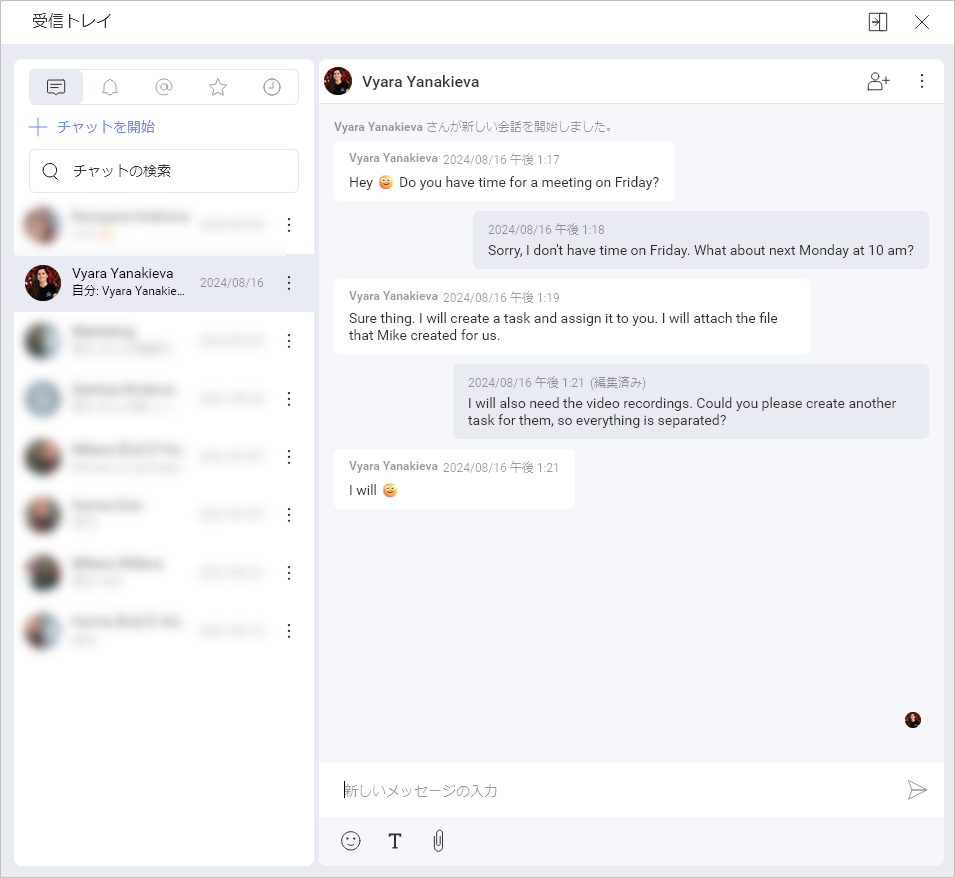

# コミュニケーション

チームやプロジェクトでコラボレーションしている間、さまざまなワークスペースや組織外の人も一緒に作業できます。こちらでのコミュニケーションは生産性を高めるために不可欠です。ディスカッションとプライベート チャットを使用する Slingshot のアプローチは、この点を考慮して設計されています。

## Slingshot ディスカッションとは?

組織、ワークスペース、またはプロジェクトのメンバーが使用するコミュニケーション方法です。ディスカッションはさまざまなスレッドで構成されているため、すべてのコミュニケーションやコラボレーション ツールを 1 か所にまとめることができるため、離れた場所にいても生産性を維持できます。

テキストの書式設定、添付ファイル、絵文字、リンクを組み合わせて複数のディスカッションを同時に行うことができます。さらに、会話に反応し、メッセージからタスクを作成することもできます。

## ディスカッションのリスト

ディスカッションはさまざまなリストに整理され、サイドの会話が制御されます。メイン ディスカッションはすべての会話の場所があるため、フォーカスを失うことはありません。

長いメール チェーンとは異なり、メンバーはディスカッションをフォローまたはフォロー解除できます。フォローしているディスカッションにメッセージが送信されたときに通知されるため、通知に関連付けられます。

## Slingshot のチャットとは? 

[**チャット**](https://www.slingshotapp.io/ja/help/docs/chat-faq)もコミュニケーションのツールですが、[**ディスカッション**](https://www.slingshotapp.io/ja/help/docs/discussions-faq)とは異なり、ワークスペースやプロジェクトとは関係ありません。つまり、Slingshot を使用して任意の Slingshot ユーザーとチャットできます。また、組織のメンバーではない個人アカウントを持つユーザーとチャットすることもできます。

## 複数のデバイスからのチャット

Slingshot は使用しているデバイスに関係なく、シームレスでほぼ同一のエクスペリエンスを提供します。iOS、Android、およびデスクトップで Web ブラウザーを使用するか、ネイティブ アプリケーションを取得できます。

1 人または複数のメンバーとチャットし、オンデマンドでメンバーを削除または追加します。メッセージの作成時に、メッセージをコピー、編集、または削除できます。また、絵文字や反応を使用して自分自身を表現することもできます。最後に、チャットは基本的なテキストの書式設定 (太字、斜体、下線、取り消し線) に加えて、クラウド ストレージ プロバイダーからの添付ファイルもサポートします。

## 通知の受け取り

Slingshot の通知機能を使用すると、ユーザーがメッセージを送信したときや、フォローしているディスカッション スレッドで @ とメンションされたときに通知を受け取ることができます。メッセージングの現在の通知設定を確認し、必要に応じて調整できます。  
[**通知**](https://www.slingshotapp.io/ja/help/docs/notifications)の詳細については、リンクを参照してください。
