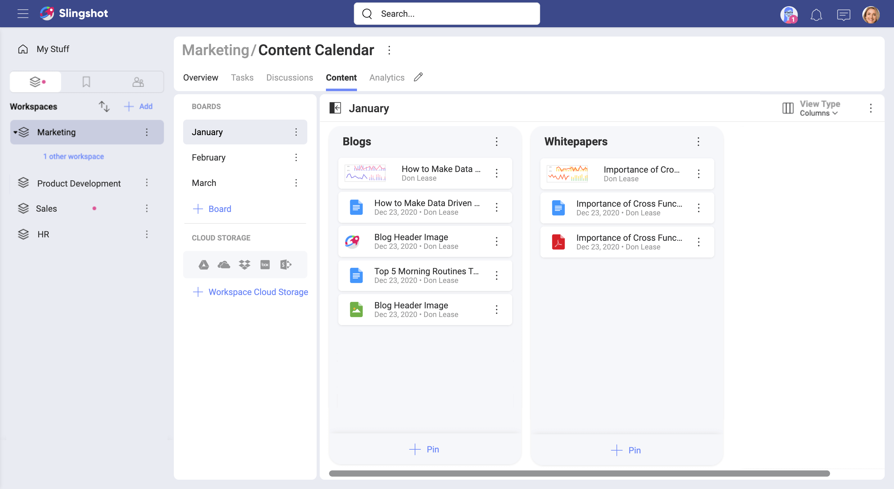
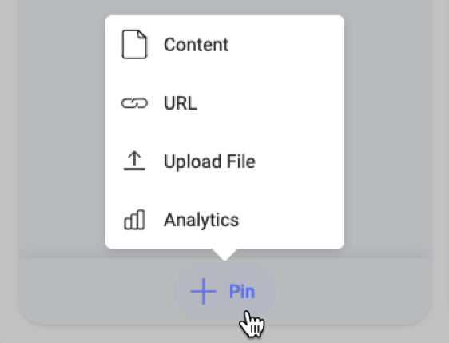
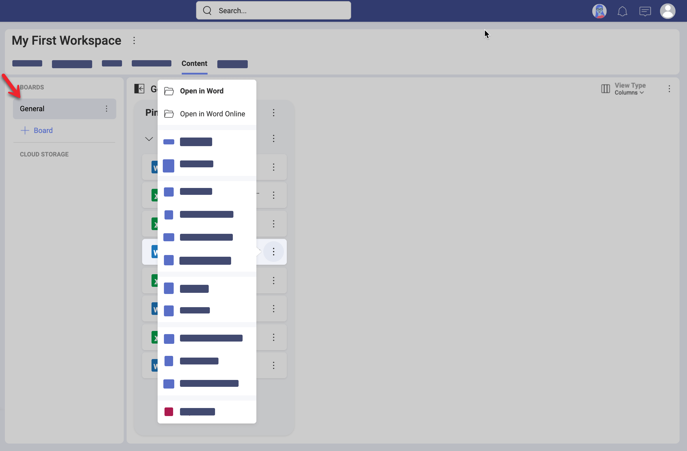
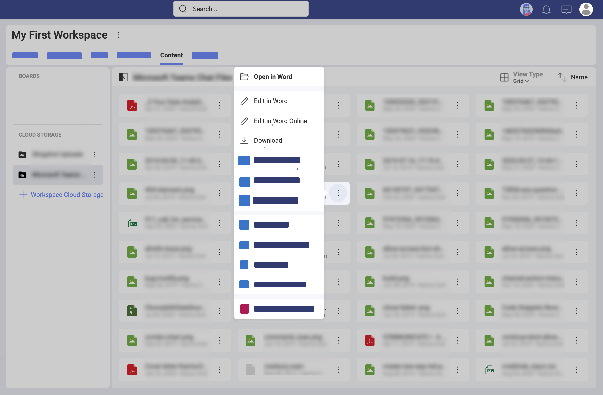
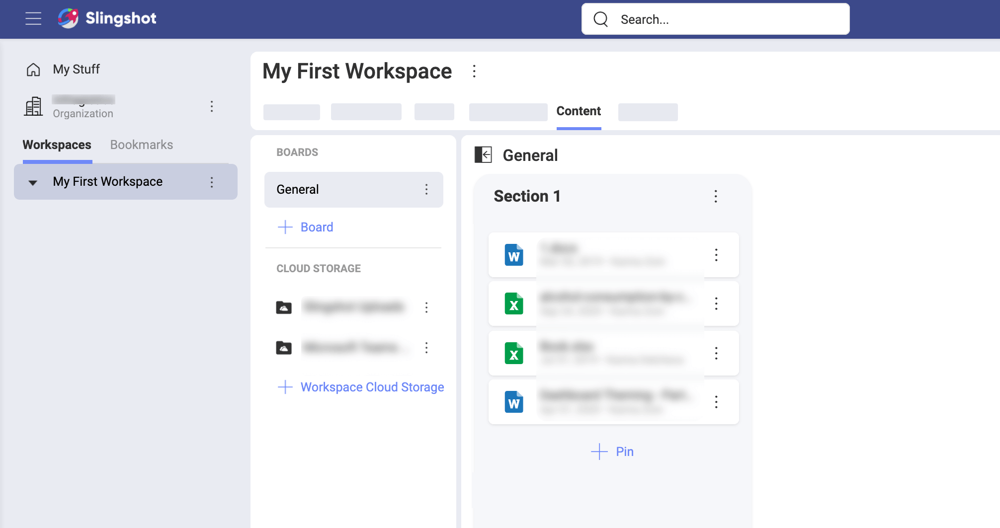
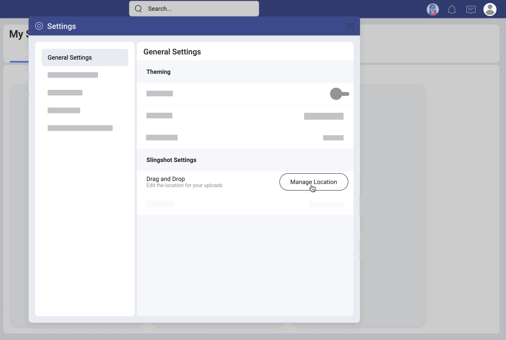

# コンテンツとボードの詳細

ようこそ！このトピックは、コンテンツおよびボードに関する詳細な操作方法を紹介します。

## パーソナルと共有のボード/クラウド ストレージ

クラウド ストレージに接続すると、Slingshot 内でコンテンツにアクセスできるようになり、ボードでコンテンツを整理して他のユーザーと共有できます。
パーソナルとワークスペースの両方のボードおよびクラウド ストレージを構成できますが、異なるシナリオで使用するためのものです。

パーソナルのクラウド ストレージとボードは自分だけがアクセスでき、いつでも作成および削除できます。パーソナル のクラウド ストレージとボードは両方とも [コンテンツ] タブのパーソナル スペース (**アイテム**) にあります。  
パーソナルコンテンツを他のユーザーと共有できます。パーソナル クラウド ストレージのコンテンツをワークスペースの共有ボードにピン固定すると、そのコンテンツはワークスペースのすべてのユーザーが利用できるようになります。

ワークスペースのすべてのメンバーはワークスペースのクラウド ストレージとボードにアクセスできます。これらの共有接続およびボードは、そのワークスペースの [コンテンツ] タブにあります。  また、ワークスペース内のすべてのユーザーは、いつでも接続を管理したりコンテンツをピン固定したりできます。

### ボードとセクション

ボードが単なるコンテナーである場合、セクションとは何でしょうか？以下は、セクションを持つボードの例です。

上記のように、**セクション**はボードの構成に役立ちます。セクションはボードを分割したものです。コンテンツをセクションにピン固定もできます。ボードには 1 つ以上のセクションを持つことができ、クリックしてドラッグ (ラップトップまたは PC) またはスワイプ ジェスチャ (モバイル デバイス) を使用してスクロールできます。

ボードおよびセクションは再編成でき、必要に応じて移動できます。作成したコンテンツ ボードやセクションの一部が他のコンテンツ ボードやセクションよりも重要な場合、ドラッグアンドドロップで優先順位を付けてリストの一番上または上に移動できます。

### 自分のボード/クラウド ストレージにアクセスする方法

自分のボードとクラウド ストレージにアクセスするには、ワークスペースに移動して、一番上の **[コンテンツ]** タブを探します。[コンテンツ] タブでボードとクラウド ストレージの両方を確認できます (以下のスクリーンショットを参照)。 

ボードをブックマークしておくと、個人の概要に表示されます。  
[概要](overviews.md)の詳細については、リンクを参照してください。

## 接続可能なクラウド ストレージ

Slingshot では、以下のクラウド ストレージ プロバイダーへの新しい接続を追加できます。
- Google Drive
- OneDrive
- Dropbox
- Box
- SharePoint

> [!NOTE]
> **SharePoint** への新しい接続を追加する場合、ルート サイトまたは特定のサブ サイトを追加できます。サブ サイトを後で追加することもできます - このオプションは SharePoint 接続のオーバーフロー メニューにあります。

## サポートされているファイル タイプ

Slingshot では、ファイル タイプは異なるアイコンを使用して表示されます。最も一般的なものは以下のとおりです。

|**アイコン**|**ファイル タイプ**|**アイコン**|**ファイル タイプ**|
|---|---|---|---|
|| Microsoft Word ファイル|| Google Doc ファイル|
|| Microsoft Excel ファイル|| Google Sheet ファイル|
|| Microsoft PowerPoint ファイル||画像ファイル|
||Adobe PDF ファイル|| ビデオ ファイル|
|| Web リンク|| ZIP ファイル|

## ファイルを共有する方法

Slingshot を使用すると、さまざまなクラウド ストレージからファイルにアクセスし、ボードでファイルを整理し、それらのファイルを他のユーザーと共有できます。

ファイルを共有するには、共有するコンテンツを、ボード、ディスカッション、または概要にピン固定します。これにより、コンテンツを他のユーザーが使用できるようになります。  

通常、ボードを使用してファイルを共有しますが、ワークスペースで作業している場合は、関連コンテンツを概要にピン固定できます。これにより、その特定のファイルの可視性が向上します。また、ファイルをディスカッションにピン固定して一時的にコラボレーションすることもできます。

## ファイルのアクセス許可を設定する方法

ワークスペース内のファイルを共有すると、ワークスペース内のユーザーがこれらのファイルを使用できるようになります。 
ファイルのアクセス許可は、ファイルの管理者がファイルにアクセスできるユーザーを制御します。ファイルを固定するたびに、Slingshot は設定する許可のタイプを要求します。以下のようなダイアログが表示されます: 

こちらでは、以下の 3 つの許可タイプから選択できます。

 - **すべてのユーザーがアクセス可能** - すべての Slingshot ユーザーがファイルにアクセスできます。
 - **自動アクセス** - ワークスペースのすべてのユーザーがファイルにアクセスできます。
 - **アクセスの要求** - ワークスペースのユーザーを含むすべてのユーザーは、管理者にアクセスを要求する必要があります。

> [!NOTE] Slingshot でファイルへのアクセスを許可すると、ファイルの表示および編集のアクセス許可が与えられます。 

[このトピック](file-permissions-faq.md)では、各ファイルのアクセス許可のタイプとメンバーのアクセスを管理する方法について説明します。 

## ファイルを開く方法

Slingshot でファイルを開くには、クリック/タップします。 

MS Office ファイルの場合、開く場所を選択できます。オンラインで開くか、またはデバイスに関連付けられた MS Office アプリケーションで開くことができます。ファイルを開くデフォルトのアプリケーションを設定するには、以下に移動します。

プロファイル > [設定] > [一般設定] > [ファイルを開く]

ドロップダウンで以下のいずれかを選択できます: 
* **ネイティブ アプリ** - デバイス上のアプリケーション (MS Word など) でファイルを開きます。
*  **オンライン** - ファイルが Web アプリケーション (MS Word、Excel、および PowerPoint Online) で開きます。 

パーソナルおよびワークスペースのクラウド ストレージのファイルはデフォルトのアプリケーションで開かれます。ただし、**[ピン固定]** でボードにピン固定されたファイルの場合、開くために使用するアプリケーションをメニューから選択できます (以下のスクリーンショットを参照)。 

## ファイルを編集する方法

プラットフォームに応じて、異なるアプリケーションを使用してファイルを編集できます。Slingshot はサードパーティのアプリケーションを起動して編集を行うため、完全にユーザー次第です。

いずれの場合も、ファイルをコンピューターまたはデバイスにいつでもダウンロードできます。

### コンテンツにすばやくアクセスする方法

手元に置いておきたい関連コンテンツが発生する場合があります。この場合、ファイルをパーソナル スペースのプライベート ボード (アイテム) にピン固定できます。

### ドラッグアンドドロップを使用してファイルをすばやく固定する方法
ドラッグアンドドロップ ジェスチャを使用すると、外部ソースから Slingshot のボードに、ファイルまたはリンクをすばやく追加できます。  
コンテンツをセクションにピン固定もできます。ボードは、コンテンツを整理および分割するためのセクションの、単なるコンテナーです。

ボードのセクションにファイルを追加した後、Slingshot はファイルをアップロードするクラウド ストレージを選択するようプロンプトを表示します。これは一度のみ行う必要があります。Slingshot は、選択したクラウド ストレージに「Slingshot のアップロード」フォルダーを作成します。以後のドラッグアンドドロップのアップロードはすべてそこに追加されます。

ドラッグアンドドロップ ファイルをアップロードする場所は、[一般設定] > [場所の管理] で変更できます。

### ボードおよびセクションを再配置する方法

必要に応じて、ボード、セクション、およびピン固定を再配置および移動できます。これは、必要なセクションやボードを事前に計画することなく作業に集中できるため、非常に重要です。ボード、セクション、またはピン固定の **[移動]** オプションの隣にある 3 つの点メニュー  を選択します。 

同じ親ワークスペースのサブワークスペース間で、ボード、セクション、ピン固定を移動できます。ボードを[親ワークスペース](workspaces.html#using-workspaces-within-the-workspace)からサブワークスペースへ、またはその逆に移動することもできます。 

#### セクションの並べ替え

ボードの要素を作成した後、セクションを移動してコンテンツの配置を改善できます。[移動] オプションを使用すると、選択した要素を別のボードに再配置できます。ピン固定とセクションは、接続されたワークスペース (メイン ワークスペースとそのサブワークスペース) のボード間でのみ移動できます。

### ボードの表示方法の変更 

ボードはデフォルトで列として表示されます。この表示は、ピン固定の詳細を一目で確認できます。その他の利用可能な表示タイプは**リスト**です。**[リスト]** 表示はセクションを強調表示し、多くのセクションのあるボードを管理する必要がある場合に最適です。 

**列**表示から**リスト**表示に切り替えるには、ボードに移動し、列の右上にある   [表示タイプ] ボタンをクリック/タップします。**[リスト]**を選択します。表示がすぐに変更されます。 