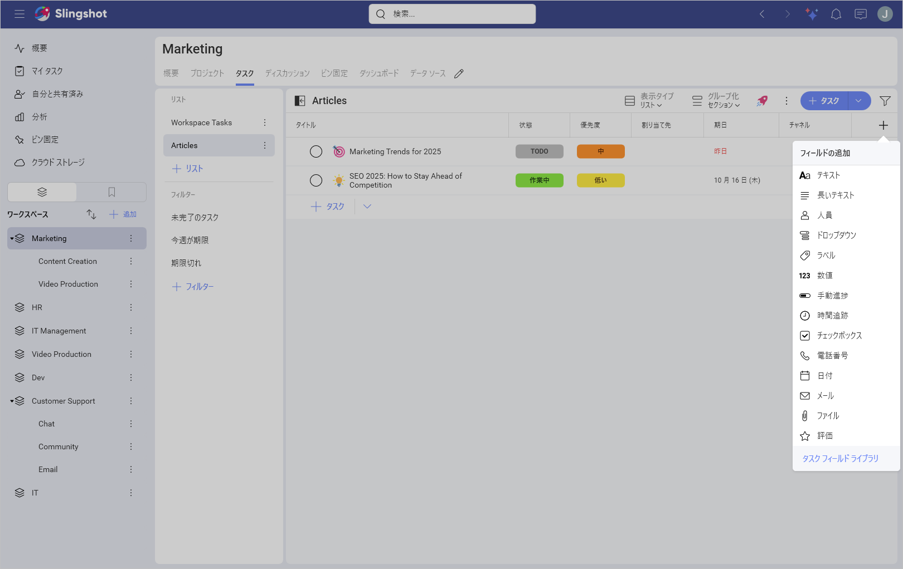
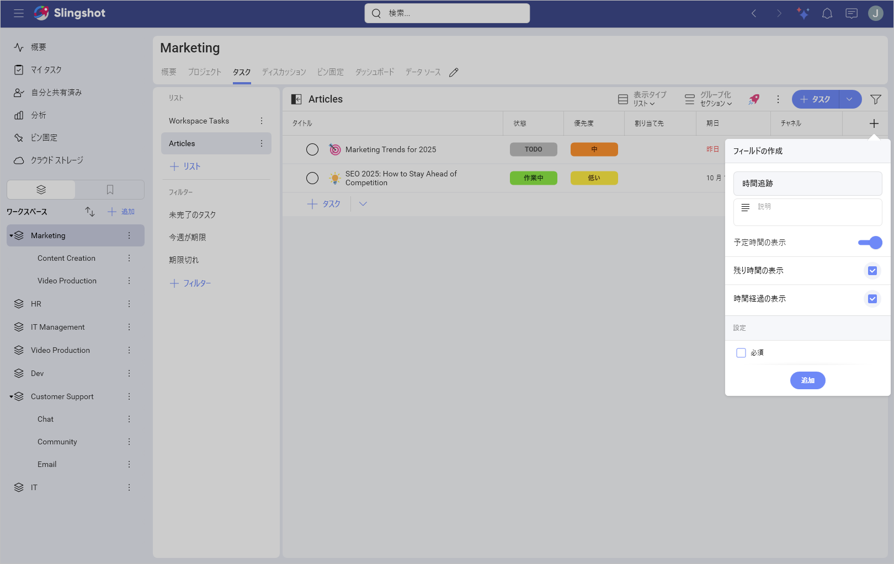
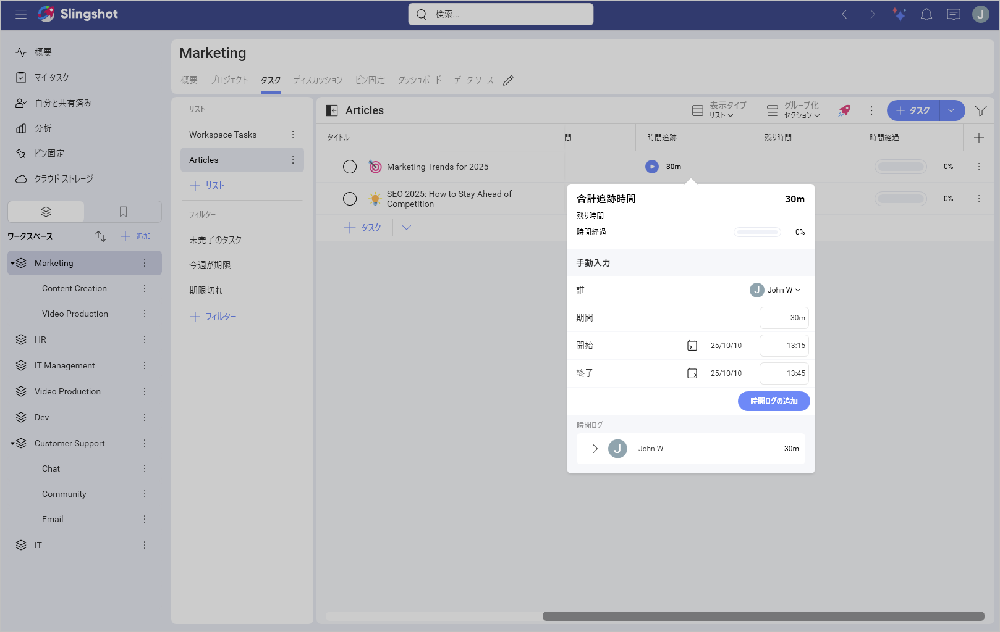
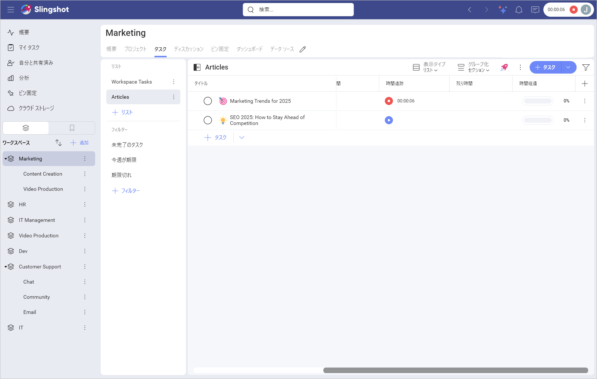
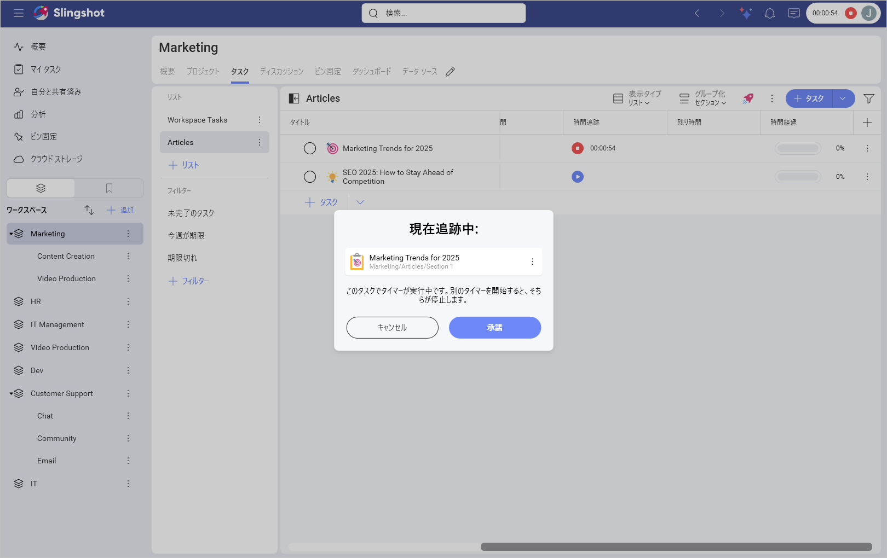
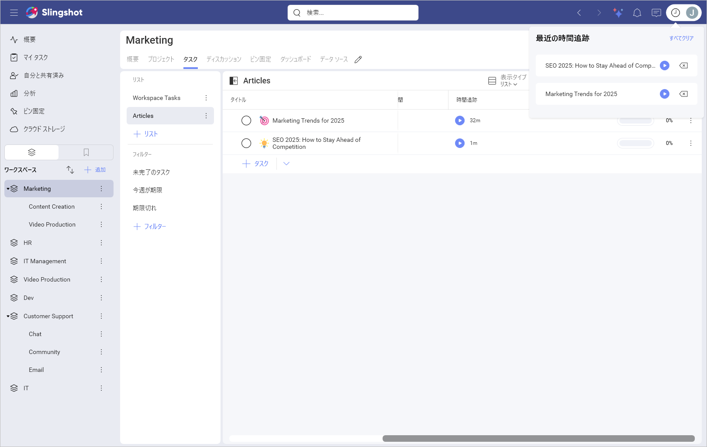
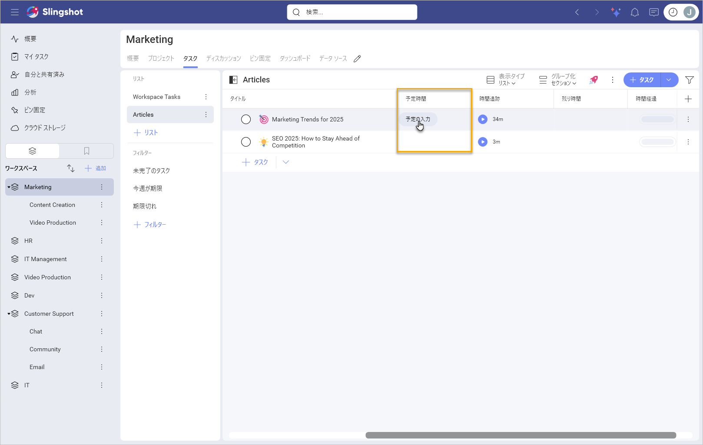
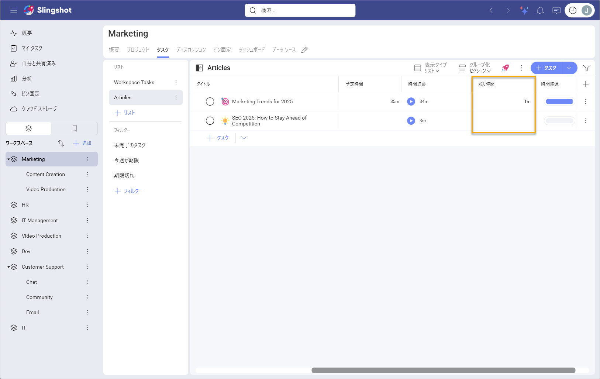
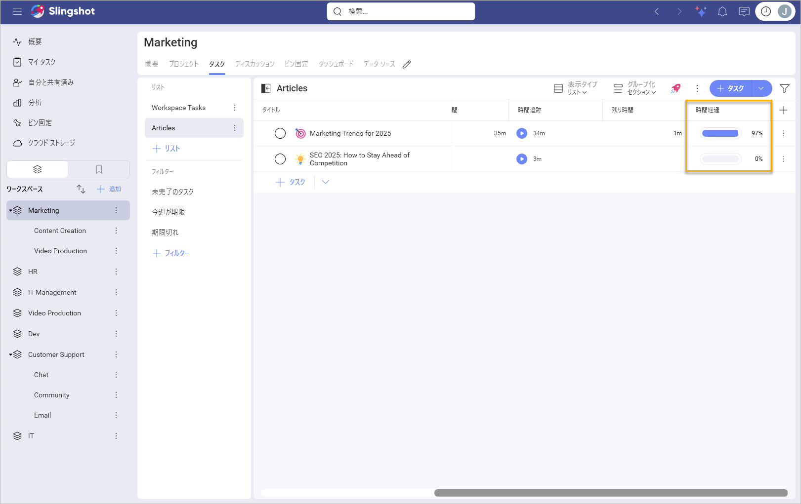

# カスタム フィールド タイプ

カスタム フィールドのリストは継続的に拡張されています。以下に、Slingshot で現在利用可能なすべてのカスタム フィールドを示します。 

## カスタム フィールド タイプのリスト

| **タイプ** | **説明** | **ユース ケース** |
| ---- | ----------- | -------- |
| **テキスト** | 簡単な補足情報を追加したいタスクで使用できます。文字数は 255 文字までです。 | 例えばカスタマー サポート チームにおいて、エスカレーション用のフィールドが必要であるとします。この場合、**「エスカレーション」** というテキスト フィールドを作成すると、ケースがすでにエスカレーションされているのか、あるいは別のチームにエスカレーションする必要があるか、などの情報をチーム メンバーが提供できるようになります。 |
| **長いテキスト** | より多くの情報を提供する必要のあるタスクで使用できます。 | より多くの情報を提供する必要のあるタスクで使用できます。あなたはカスタマー サポート チームのチーム マネージャーで、ユーザーからの電子メールによる問い合わせの処理を担当しているとします。その場合、チームのタスクに **「概要」** フィールドを追加したいと考えるかもしれません。そうすれば、チーム メンバーは各サポート ケースに関する詳細な情報を含めることができます。 |
| **人員** |  ユーザーが、そのタスクには割り当てられないが、タスクの進捗状況は監視したいシナリオで使用できます。 | あなたは、製品の Web デザインに関するタスクを監視したいチーム リーダーであるとします。また、QA チームも参加させて、新しいデザインがいつ実装され、テストの準備ができたかを QA チームが確認できるようにする必要があります。この場合、タスクをデザイナーのチームに割り当て、QA チームと自分自身を人員フィールドに含めることができます。 |
| **ドロップダウン** | さまざまなオプションのリストから 1 つのオプションを選択する必要があるタスクで使用できます。 | あなたはトレーニング資料の作成を担当しており、その資料が初級レベル、中級レベル、上級レベルのどの職務レベル向けであるかを指定する必要があるとします。この場合、**「職務レベル」** というドロップダウン フィールドを作成し、オプションを追加できます。 |
| **ラベル** | 特定の基準に基づいて分類したいタスクで使用できます。 | さまざまなマーケティング チャネル向けのタスクがあるとします。この場合、**メール**や**ソーシャル メディア**などの値を使用して、**「チャネル」** フィールドを設定できます。こうすることで、チーム メンバーはタスクを分類できます。 |
| **数値** | 数値データを含めたいタスクで使用できます。 | あなたは、キャンペーンの支出を監視したいキャンペーン マネージャーであるとします。この場合、特定の通貨値を持つ **「経費」** フィールドを追加できます。 |
|**手動進捗**|ユーザーはタスクの進捗状況を追跡するために使用できます。**「手動進捗」** フィールドには、0 ～ 100 のパーセンテージ値が設定されます。数値を入力するか、フィールド スライダーを使用して調整できます。| あなたは、社内の複数のプロジェクトを担当するチーム マネージャーであるとします。チームのタスクの進捗状況を簡単に把握するには、さまざまなタスク リストに **「手動進捗」** カスタム フィールドを追加できます。|
|**チェックボックス**| 選択/選択解除可能なオプションを追加したいタスクで使用できます。| あなたは、さまざまな段階を通じてキャンペーンの進捗状況を追跡する必要があるキャンペーン マネージャーであるとします。これを行うには、タスクに **「承認済み」** カスタム フィールドを追加できます。そうすれば、チームは情報に基づいた意思決定を行うことができます。|
|**電話番号**|ユーザーがタスクに電話番号を含めたい場合に使用できます。| あなたは人事チームの一員であり、空いている職種に関して面接を行う必要があるとします。後で候補者に連絡するために、電話番号を保存できます。|
| **日付** | 進捗状況に重要な日付を追加したいタスクで使用できます。**開始日**と**期限**とは異なる日付を設定できます。 | あなたは、製品のリリース日を常に監視したいテクニカル ライターであるとします。この場合、日付フィールドを使用するとリリース日がいつであるかを確認できるため、ドキュメントを素早く整理できます。 |
|**メール**|ユーザーがタスクにメール アドレスを保存する必要がある場合に使用できます。| あなたは、機能リクエストに関して顧客に連絡を取る必要があるカスタマー サポート担当者であるとします。タスクにメール アドレスを追加することで、進捗状況を顧客に更新できます。|
|**ファイル**|ユーザーがファイルやドキュメントを添付することで情報を追加したい場合に使用できます。タスクの **「添付ファイル」** フィールドと同様に、ユーザーはタスク、ディスカッション、ドキュメント、ダッシュボード、データ ソース、URL を追加したり、デバイスからファイルをアップロードしたりできます。違いは、**「ファイル」** フィールドに名前と説明を付けてカスタマイズできることです。| あなたは顧客の請求書を整理したい会計士であるとします。これを行うには、タスクに **「請求書」** ファイル フィールドを作成できます。|
| **評価**| ユーザーが星の数でタスクを評価したいタスクで使用できます。デフォルトの評価は 1 から 5 の範囲です。ユーザーは星の数を編集して、3 つ星、4 つ星、または 5 つ星のスケールを設定できます。| あなたは、チームが取り組んでいるそれぞれの新機能の影響を視覚化する方法を必要としているチーム リーダーであるとします。そのためには、**「Impact」** というフィールドを作成し、会社の内部プロセスに従って各タスクを評価します。| 
| **時間追跡**| タスクの完了に費やされた時間を追跡するためにこれを使用できます。ユーザーは時間ログを保存し、それを使用してプロジェクトやチーム全体の時間データを分析できます。時間追跡カスタム フィールドの詳細については、[以下](#時間追跡カスタム-フィールド)をお読みください。| あなたは、さまざまなクライアントのプロジェクトに取り組んでいるフリーランスのデザイナーであるとします。タスクに時間追跡フィールドを追加し、そのデータを使用してクライアント向けの正確な請求書を生成できます。|

## 時間追跡カスタム フィールド

>[!NOTE] 時間追跡カスタム フィールドは、Slingshot および Slingshot Enterprise ユーザーが利用できます。

時間追跡カスタム フィールドを使用すると、期限に間に合わせるために追加のリソースが必要となる可能性のあるタスクを特定することで、チーム メンバーの作業負荷を管理し、生産性を向上させることができます。

時間追跡カスタム フィールドを見つける方法は以下のとおりです:

1. 右上隅のタスク リストで [+] フィールド ボタンをクリックまたはタップします。

2. 表示されるドロップダウンから、**[+ フィールドの追加]** をクリックまたはタップします。異なるタスク タイプがある場合は、カスタム フィールドを追加したいものを選択します。

3. **[時間追跡]** を選択します。

 

4. 次のダイアログが表示され、次の操作を実行できます。

- 説明を追加します。

- タスクを完了するために必要な**予定時間**を表示します。

- タスクを完了するまでの**残り時間**を表示します。

- タスクの**時間経過**を表示します。

- 必須としてフィールドをマークします。

 

時間追跡フィールドのみを使用する場合は、**[予定時間の表示]** サブフィールドをオフに切り替えることができます。デフォルトではこのオプションがオンに設定されています。

これにより、残り時間と時間経過のサブフィールドも非表示になります。

時間追跡フィールドは、次の 3 つのサブフィールドで構成されます: **[予定時間](#予定時間)**、**[残り時間](#残り時間)**、**[時間経過](#時間経過)**。

タスク リストまたは[タスク タイプ](task-types.md)に時間追跡フィールドを追加したら、手動で次の操作を実行できます。

- タスクに取り組んだ担当者を追加します。 

- タスクに費やした時間の長さを入力します。時間と分を使用して時間を入力できます。 

- 特定の開始日と終了日を設定します。

- 時間ログを追加します。

- 時間ログのリストを開きます。編集または削除できます。異なる人が同じタスクに取り組む場合は、個別に追加する必要があります。追加すると、タスクに費やされた合計時間が自動的に計算されます。

 

時間追跡フィールドに情報を手動で追加したくない場合は、タスクの横にある開始ボタンをクリックまたはタップします。これにより、右上隅のアバターの横に表示されるタイマーが開始されます。モバイル デバイスで Slingshot を使用している場合は、アバターを直接クリックまたはタップしてタイマーを開始または一時停止できます。

 

>[!NOTE] 1 分未満でタイマーを停止する場合は、時間入力ログを保存するか、閉じるかを選択できます。保存することを選択した場合、時間は 1 分に切り上げられます。

同時に追跡できるタスクは 1 つだけです。別のタスクの追跡を開始しようとすると、次の警告が表示され、別のタスクの追跡を受け入れるか、現在のタスクの追跡を継続するかを選択できます。

 

タイマーの実行中は、異なる人が同時に同じタスクに取り組むことができます。各タイマーを停止したら、タスクに費やした時間をタスク ログに追加できます。

アバターの横にある時間追跡アイコンをクリックまたはタップすると、次のダイアログが表示され、次の操作を実行できます。

- 現在追跡中のタスクを開きます。

- すでに追跡されているタスクのリストから特定のタスクの追跡を続行します。

- 追跡されたタスクのリストから特定のタスクを削除します。

- 追跡中のすべてのタスクをクリアします。これにより、時間追跡ボタンも削除されます。 

 

>[!NOTE] タスクが完了としてマークされている場合でも、タイマーはタスクに費やされた時間をマークし続けます。

### 予定時間

「予定時間」 サブフィールドを使用すると、タスクに費やされた実際の時間を測定するための基準を作成できます。タスクの完了に必要と思われる時間を手動で追加できます。 

 

### 残り時間

「残り時間」 サブフィールドを使用すると、タスクが完了するまでに残っている時間を確認できます。Slingshot は、予定時間と時間追跡データの差を自動的に計算します。「時間追跡」 フィールドの時間が予定時間を超えると、「残り時間」 フィールドに負の赤色の値が表示されます。いつでも予定時間を変更して残り時間を再計算することができます。

 

### 時間経過

「時間経過」 サブフィールドを使用すると、タスクの完了率を確認できます。パーセンテージは **「予定時間」** フィールドと **「時間追跡」** フィールドのデータに基づいて自動的に更新されます。

 