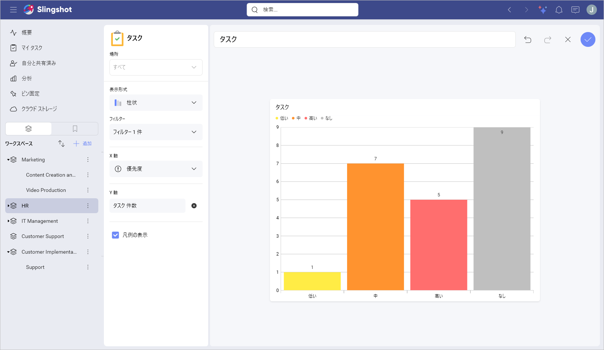
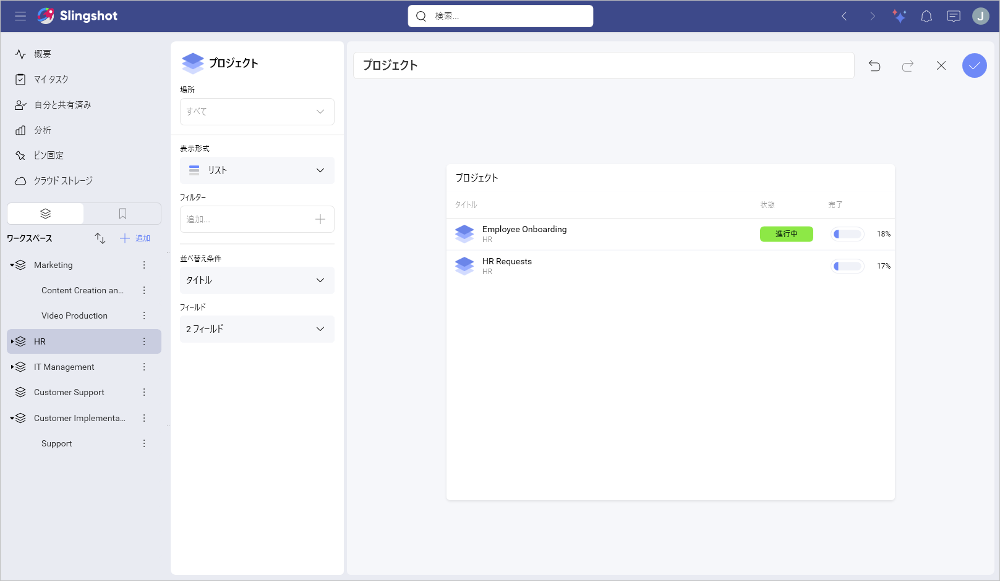
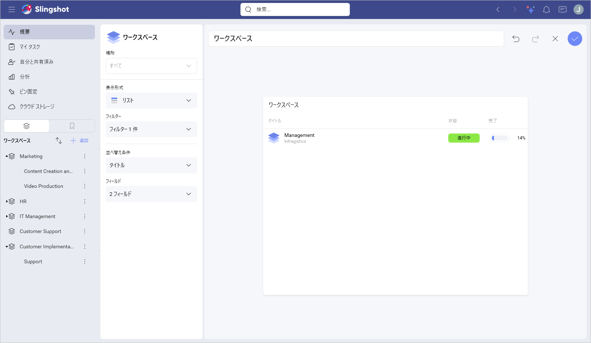
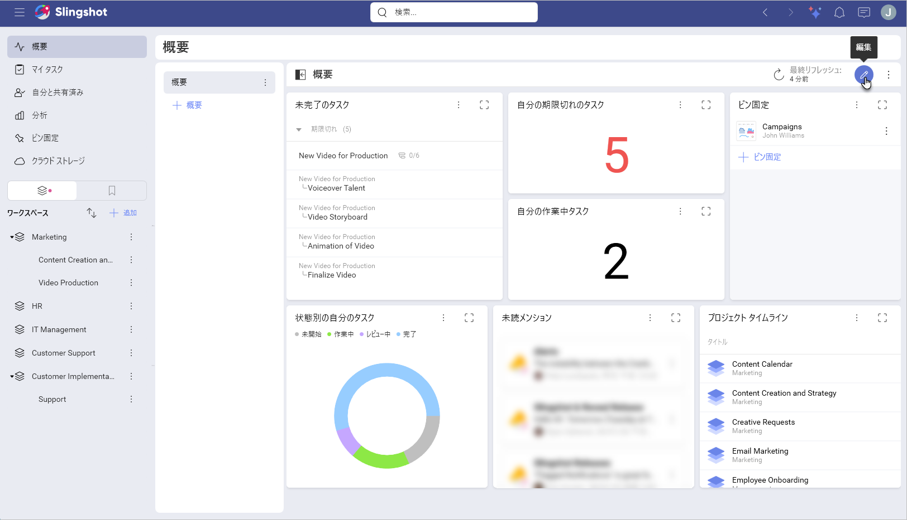
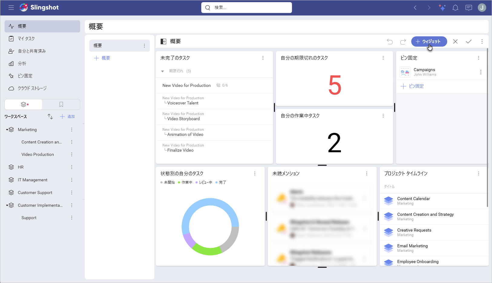
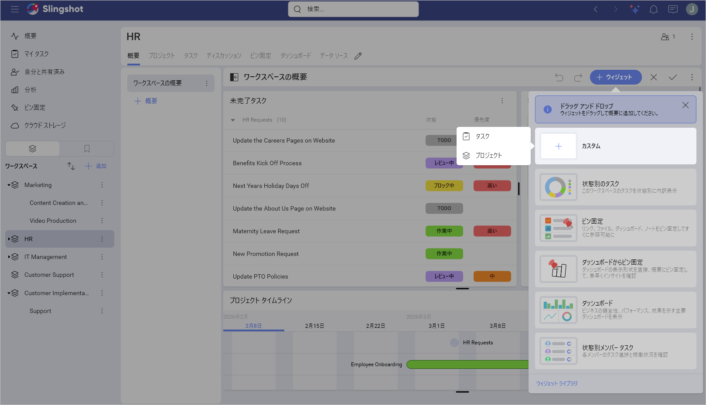
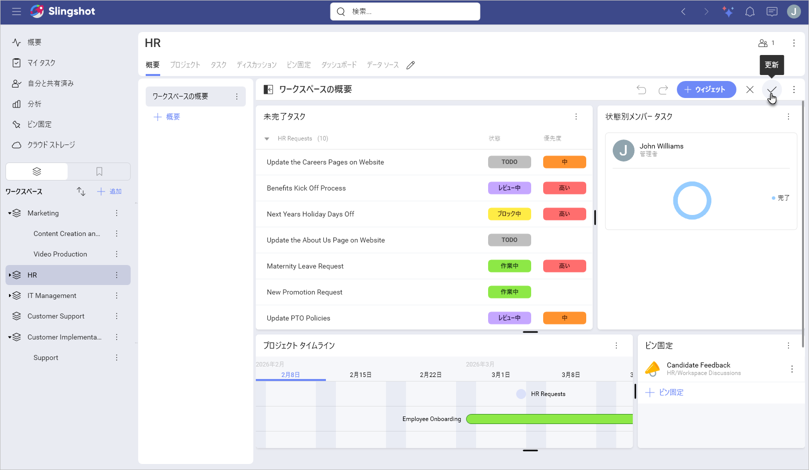
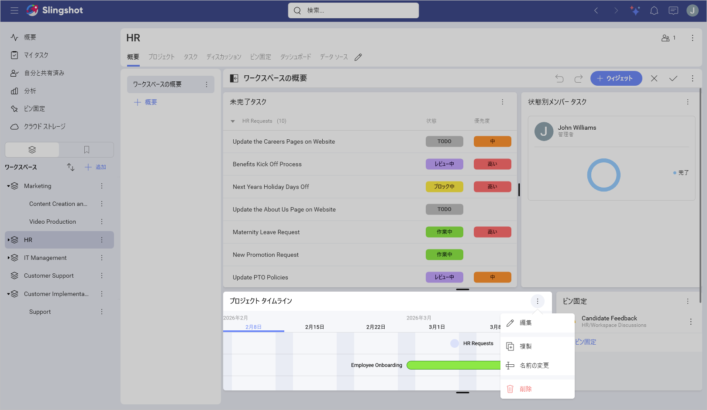

# カスタム ウィジェット

カスタム ウィジェットを使用すると、フィルターを適用せずに、ゼロからウィジェットを作成できます。これにより、自分とチームが効率的に作業し、十分な情報を得られる方法で作業を整理できます。

## カスタム ウィジェットのタイプ

カスタム ウィジェットには 3 つのタイプがあります:

- **タスク**: ワークスペース、プロジェクト、および **[概要]** の概要にタスク ウィジェットを作成できます。

- **プロジェクト**: ワークスペースおよび **[概要]** の概要にのみプロジェクト ウィジェットを作成できます。

- **ワークスペース**: **[概要]** の概要にのみワークスペース ウィジェットを作成できます。

## タスク ウィジェット

カスタム タスク ウィジェットを作成する場合、次のことができます:

- タスク ウィジェットに名前を付けます。

- 行った変更を元に戻す/やり直します。

- 概要にウィジェットを保存します。

- [表示形式タイプ](visualization-types.md)を選択します: 選択した表示形式タイプに応じて、ウィジェットを構成するためのさまざまなオプションが表示されます。デフォルトで、表示形式のタイプは**柱状**に設定されています。

- フィルターを追加します。

- 凡例を表示または非表示にします: このオプションは、**[数値]** と **[リスト]** を除くすべての表示形式で使用できます。

> [!Note]
> **[概要]** またはワークスペースでタスク ウィジェットを作成する場合、**[場所]** でフィルター処理することもできます。

## プロジェクト ウィジェット

プロジェクト ウィジェットを作成する場合、次のことができます:

- タスク ウィジェットに名前を付けます。

- 行った変更を元に戻す/やり直します。

- 概要にウィジェットを保存します。

- 場所でフィルター処理します。

- [表示形式タイプ](visualization-types.md)を選択します: 選択した表示形式タイプに応じて、ウィジェットを構成するためのさまざまなオプションが表示されます。

- フィルターを追加します。

- **[タイトル]**、**[状態]**、**[開始日]**、**[終了日]**、または **[なし]** でタスクを並べ替えます。

- ウィジェットが概要に追加された後に表示するフィールドの数を選択します。

> [!Note]
> デフォルトで、表示形式のタイプは**リスト**に設定されています。表示形式のタイプはいつでも別のタイプに切り替えることができます。

## ワークスペース ウィジェット

カスタム ワークスペース ウィジェットを作成する場合、プロジェクト ウィジェットで使用できるものと同じ要素を構成できます。

> [!Note]
> デフォルトで、表示形式のタイプは**リスト**に設定されています。表示形式のタイプはいつでも別のタイプに切り替えることができます。

## カスタム ウィジェットの管理

プロジェクトまたはワークスペースに対する管理者の権限がある場合、ウィジェットを作成、編集、複製、または削除できます。

**[概要]** セクションは自分だけがアクセスできるため、いつでもウィジェットに変更を加えることができます。

カスタム ウィジェットを作成するには、次の手順を実行します:

1. **[概要]** セクション、ワークスペース、またはプロジェクトの概要を開きます。

2. 右上隅にある鉛筆ボタンをクリックまたはタップして、概要を編集します。

3. **[+ウィジェット]** をクリックまたはタップします。

4. **[カスタム]** を選択します。

5. ウィジェットを選択します。

6. 目標に最適なウィジェットをカスタマイズできます。

7. 右上隅にあるチェックマークをクリックまたはタップして、変更を保存します。

8. 右上隅にあるチェックマークをもう一度クリックまたはタップして、概要を更新します。

ウィジェットの設定を表示するには、次の手順を実行します:

1. **[概要]** セクション、ワークスペース、またはプロジェクトの概要を開きます。

2. 右上隅にある鉛筆ボタンをクリックまたはタップします。

3. 設定を表示するカスタム ウィジェットのオーバーフロー メニューを開きます。

