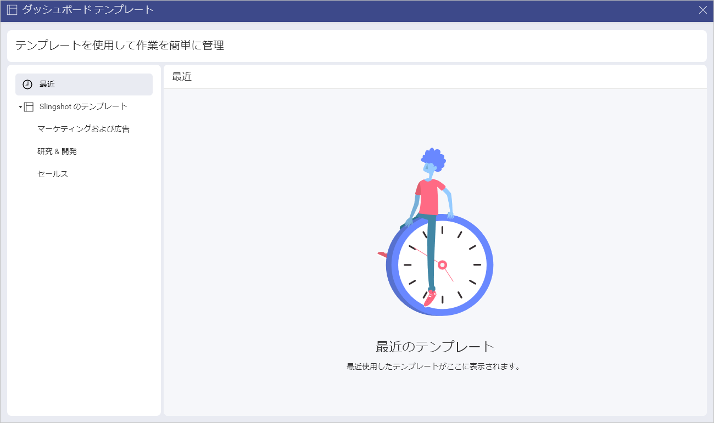
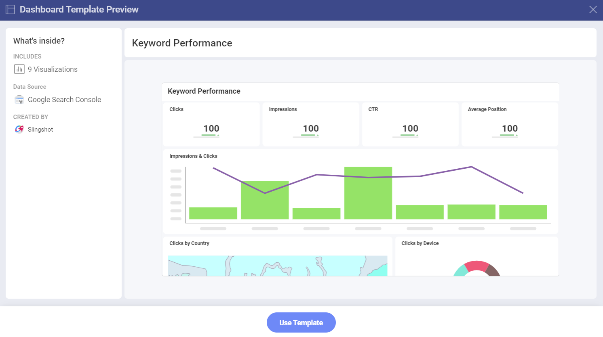
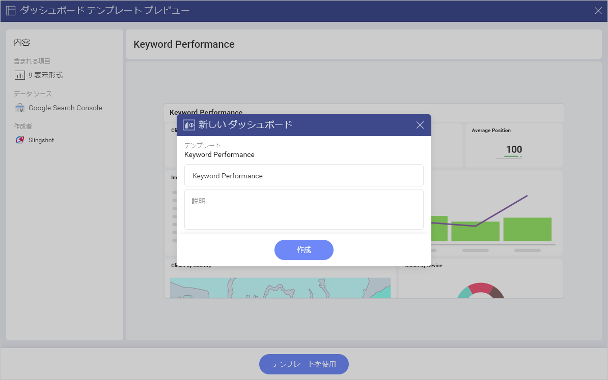
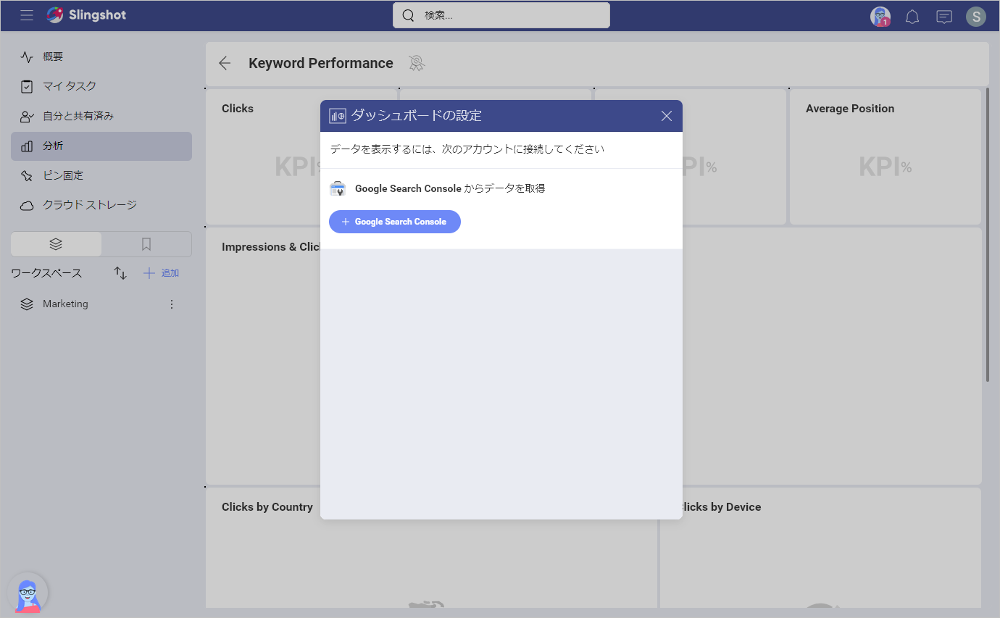
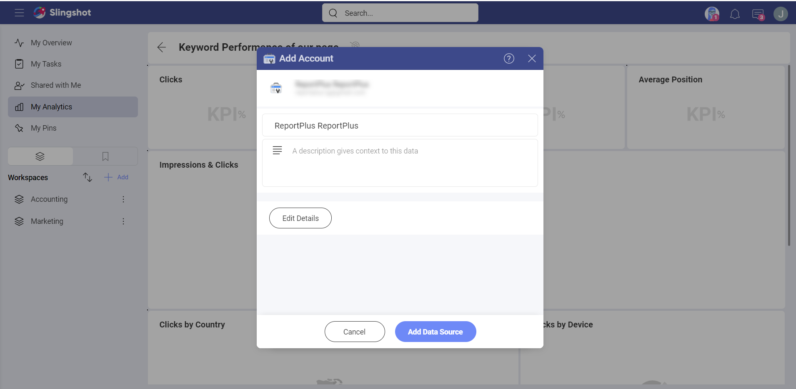
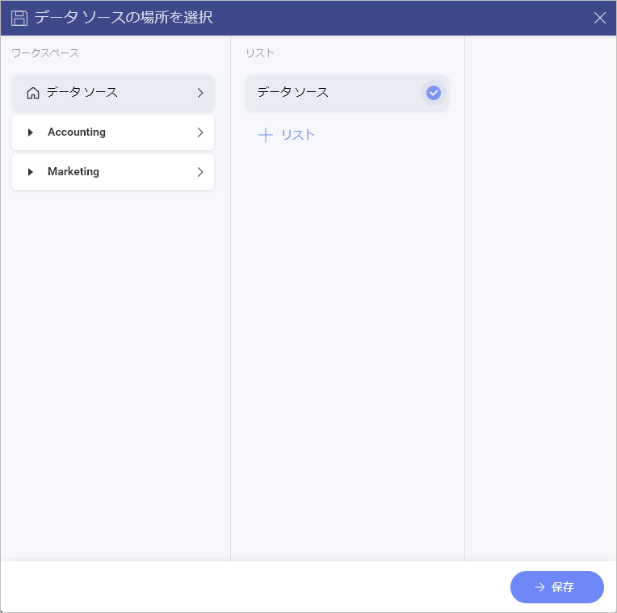

# ダッシュボード テンプレート

ダッシュボード テンプレートを使用すると、チーム メンバーは、数回クリックするだけでダッシュボードをより迅速かつ簡単に作成できます。 

## さまざまなダッシュボード テンプレート リストにアクセスする方法

ダッシュボード テンプレート リストにアクセスする方法:

1. ダッシュボード リストの **[+ ダッシュボード]** ボタンをクリックまたはタップするか、**[はじめに]** セクションの **[ダッシュボードの作成]** 青いボタンをクリックまたはタップします。

2. **[すべてのテンプレートを見る]** をクリックまたはタップします。

3. 使用可能なすべてのダッシュボード テンプレートを確認できるダイアログがポップアップ表示されます。

左パネルでは、次のことができます:

- 最近使用したテンプレートを確認/使用します。

- Slingshot テンプレートからテンプレートを確認/使用します。

## ダッシュボード テンプレートを使用する方法

Slingshot のテンプレートは、さまざまな業界/部署に基づいて編成されています。テンプレートを使用するには: 

1. **[Slingshot のテンプレート]** の下にあるテンプレートのリストの 1 つを選択します。

2. 要件に最適なテンプレートをクリックまたはタップします。 

3. ダッシュボードの外観のプレビューが表示されます。この場合、データ ソースとして *Google Search Console* を使用する **Keyword Performance** テンプレートを選択しました。

4. こちらでは、ダッシュボードに含まれる表示形式の数、使用されるデータ ソースのタイプ、作成者を確認できます。 

5. 準備ができたら、**[テンプレートを使用]** をクリックまたはタップします。

6. ダイアログが表示され、各テキスト ボックスをクリックまたはタップしてダッシュボードのタイトルを変更したり、説明を追加したりできます。

7. ダッシュボードを設定する前に、テンプレートをデータ ソースに接続する必要があります。 

## データ ソースの設定 

データ ソースを設定するには (この場合は Google Search Console)、次のことを行う必要があります。

1. **[+ Google Search Console]** をクリックまたはタップします。

2. データ ソース アカウントの資格情報を入力します。

3. **[データ ソースの追加]** をクリックまたはタップします。

4. データ ソースの場所を選択し、**[保存]** をクリックまたはタップします。この場合、場所として **[データ ソース]** を選択しました。

5. ダッシュボードを作成する前に、使用するサイトを選択できます。準備ができたら、**[データの選択]** をクリックまたはタップして、表示形式にデータを入力できるようにします。

>[!NOTE] すぐにデータ ソースに接続しなくても、テンプレートを使用してダッシュボードを作成できます。後でダッシュボードを開くと、情報を追加して表示形式を作成するためにデータ ソースを選択するよう求められます。

ダッシュボードの作成方法と使用方法の詳細については、[こちら](./analytics/dashboards/overview.md)をご覧ください。

