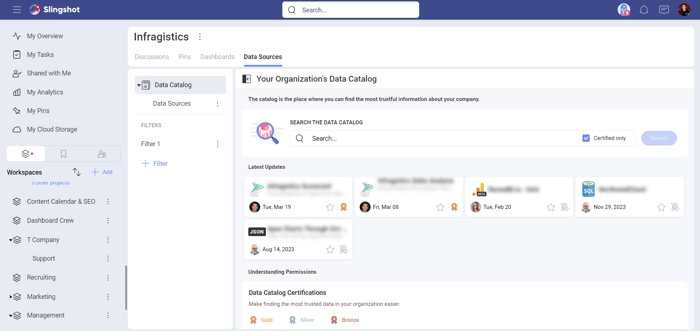
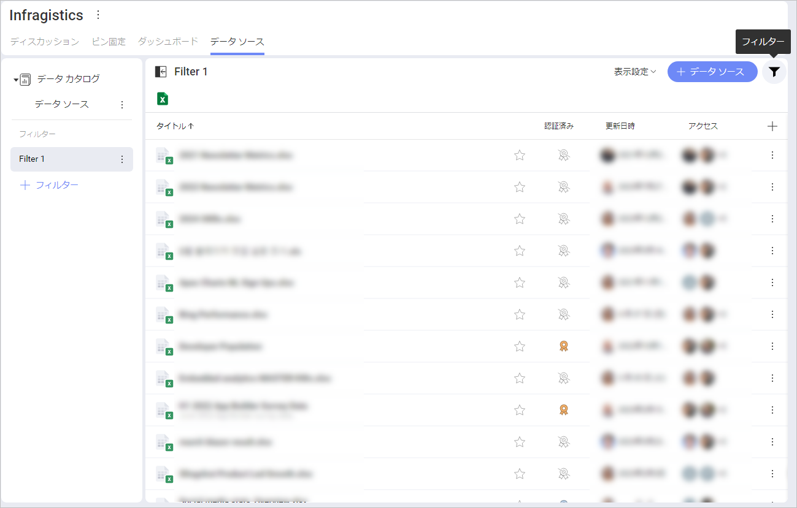
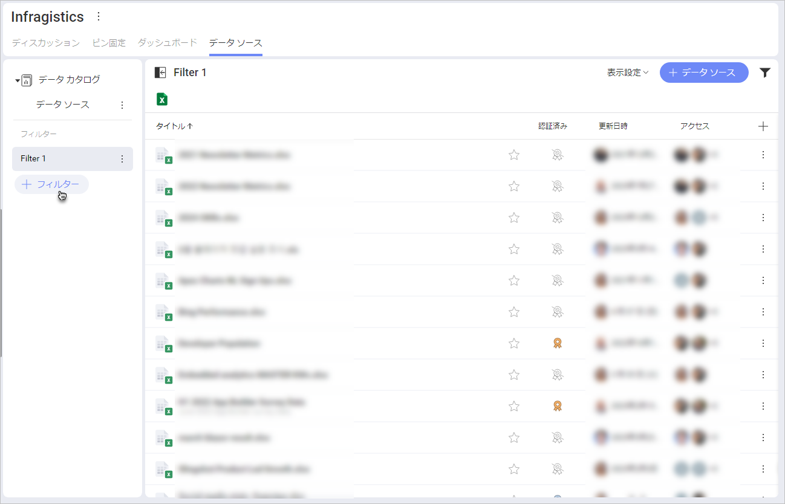
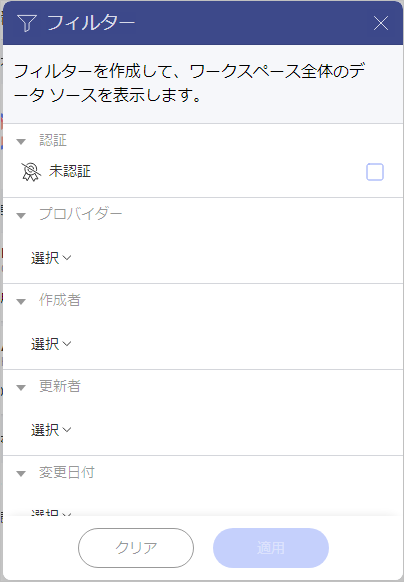
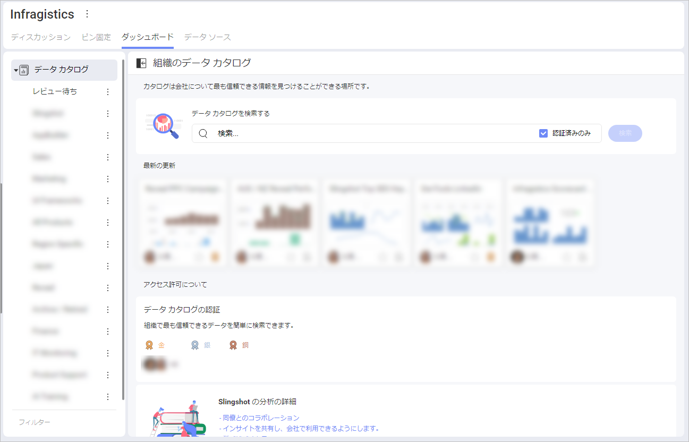
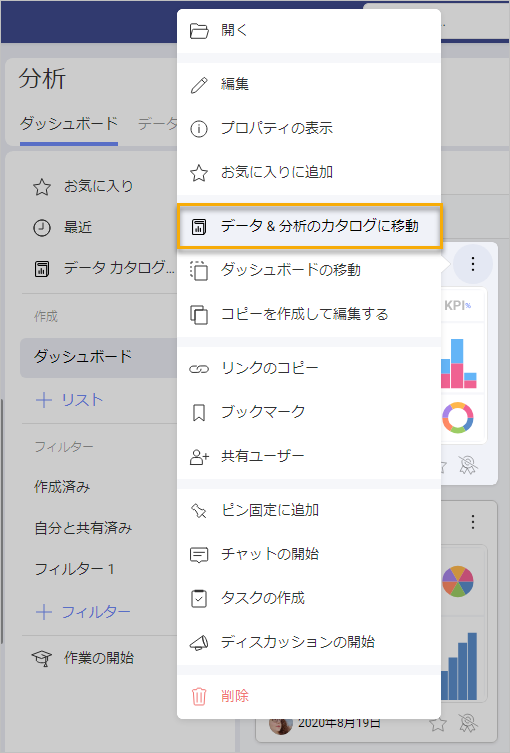

# データ カタログ

データ駆動型企業とは、常に意思決定の中心にデータを置き、収集したデータを活用して実用的な洞察を引き出す会社です。当然のことながら、すべての人がデータにアクセスできる必要があり、データを処理するためのツールも必要です。
Slingshot は、分析、データ ソースとセット、表示形式、ダッシュボードの広範なカタログを提供することにより、[Enterprise](slingshot-enterprise-subscription.md) ユーザーにこれを可能にします。

## Slingshot のデータ カタログの内容

分類され、適切に文書化され、認証されたデータにアクセスして、自社について最も信頼できる情報を検索します。

以下は、データ カタログが提供する高度な機能です。

- **認証**: 組織内の信頼できるデータ、信頼性が高く検証済みの情報を含むデータ ソースおよびダッシュボードを検索できます。 

- **データ ソースの詳細情報 (メタデータ)**: データ ソースに含まれるデータセット、データ フィールドのタイプ、説明、最終変更日などの高度な情報を追加して後で活用できます。

- **ダッシュボードとデータ ソース**: データ カタログは、ユーザーにダッシュボードおよびデータ ソースの広範なカタログへのアクセスを提供することを目的としています。

<!------>

### 認証

組織の管理者は、どのダッシュボードまたはデータ ソースが検証済みの情報を含み信頼性が高いと考えられるかを、ユーザーに示すことができます。

ユーザーは認証されたダッシュボードやデータ ソースをその隣の金、銀、銅のバッジで簡単に識別できます。
[認証の詳細については、こちらをご覧ください。](certifications.md)

### データ ソースの詳細情報 (メタデータ)

組織の認証者は高度なエディターを使用して、認証済みデータ ソースにメタデータを追加または変更できます。この情報を追加することにより、認証者はデータに関する適切なドキュメントを提供できます。
認証者はデータを非表示にしてチームの生産性を高めることもできます。非表示機能は大量のデータの処理に役立ちます。

組織ユーザーは、データ フィールドに説明を追加することでデータをわかりやすくすることができます。
[データ ソースの高度な編集の詳細については、こちらをご覧ください。](metadata-advanced-editing.md)

### 定義済みのリスト

デフォルトでは、[レビュー待ち] と、多くの場合「ダッシュボード」または「データ ソース」と呼ばれる別のリストがありますが、組織の管理者はリスト、セクション、ダッシュボード、またはデータ ソースをドラッグして簡単に再編成および移動できます。

## データ カタログのフィルタリング

フィルターを使用すると、特定の条件を満たすダッシュボードまたはデータ ソースのセットを表示できます。

[フィルター] エディターにアクセスするには、オーバーフローの隣にあるフィルター アイコン (画面右上) をクリックまたはタップします。

または、[+フィルター] ボタンをクリックまたはタップします。

ダッシュボードまたはデータ ソースのフィルタリングを停止するには、次の方法があります。

1. フィルター アイコンをクリックまたはタップして、フィルター ダイアログを開きます。

2. 下部にある **[クリア]** ボタンを選択して、現在のフィルターを削除します。

3. **[適用]** をクリックまたはタップして変更を保存します。

## データ カタログの構成

組織の管理者は、データ カタログを管理し、新しいコンテンツを追加または承認し、組織の他のメンバーと共有するコンテンツを整理できます。

これらのリソースを整理、管理、共有するためのダッシュボードとデータ ソースのリストが複数あります。
[ダッシュボード] タブと [データ ソース] タブには、セクションごとに整理できるリストがあります。管理者でない組織ユーザーは、セクションは、コンテンツを分割してより良くレイアウトする場合に便利です。

管理者でない組織ユーザーは、データ カタログのコンテンツを削除または追加できません。管理者でない組織ユーザーは、リストやセクションを参照できますが、それらの作成や編集はできません。 

## データ カタログの展開 

データ カタログには自社に関する最も信頼できる情報が含まれており、すべてのデータは分類され、適切に文書化され、認証されています。当然のことながら、新しいダッシュボードまたはデータ ソースをデータ カタログに追加するプロセスには、品質と信頼できるプロセスを確保するための複数の手順があります。 

**プロセスの概要:**

1. ユーザーが、データ ソースまたはダッシュボードをデータ カタログに追加するよう要求します。

2. ダッシュボードまたはデータ ソースが [レビュー待ち] に移動します。

3. 組織の管理者が要求をレビューします。

4. 承認されると、組織の管理者はダッシュボードまたはデータ ソースをデータ カタログ内の場所に移動します。

5. ダッシュボードまたはデータ ソースは、組織内のすべてのユーザーが使用できるようになります。

### 新しいコンテンツをデータ カタログに追加するプロセス

以下は、プロセスの各手順の詳細な説明です。

1. **ユーザーが、組織のデータ カタログにコンテンツを追加するよう要求します。**  
   Slingshot ユーザーが、分析、ワークスペース、プロジェクトにある、ダッシュボードまたはデータ ソースを持っているとします。そのコンテンツを組織全体で利用できるようにするには、そのためのプロセスを開始します。
   
   A. ダッシュボードのオーバーフロー (右上) をクリックまたはタップし、**[データ & 分析のカタログに移動]** を選択します。  
    
   B. 組織管理者に要求を説明するメッセージを書き込みます。ダッシュボードまたはデータ ソースのコピーを元の場所に保存するかどうかも選択できます。  
     

2. **データ ソースまたはダッシュボードが [レビュー待ち] に移動します。**  
   **レビュー待ち**のリストには、組織の管理者によるレビュー待ちのすべてのデータ ソースまたはダッシュボードが含まれます。
   
3. **組織の管理者が要求をレビューします。**  
   組織の管理者はレビュー待ちのダッシュボードまたはデータ ソースを開いて確認できます。バナーが表示されるので (画面の上部)、レビューアーは要求を拒否するか、または要求を承諾してコンテンツをデータ カタログ内に移動できます。  
     
4. **承認されると、組織の管理者はダッシュボードまたはデータ ソースをデータ カタログ内の場所に移動します。**

5. **ダッシュボードまたはデータ ソースは、組織内のすべてのユーザーが使用できるようになります。**
