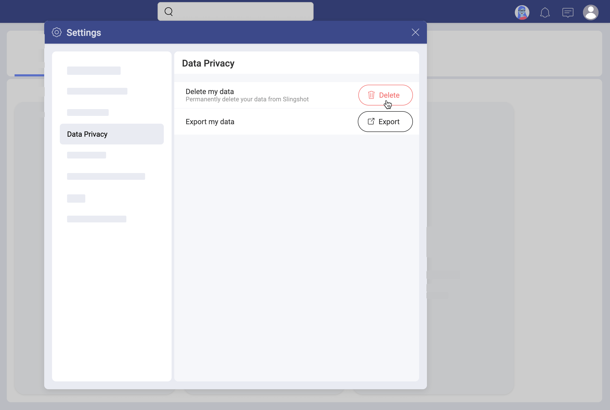
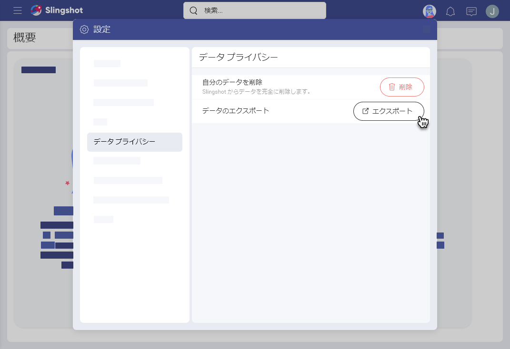

# データ プライバシーの詳細 

ようこそ！このトピックは、データ プライバシーに関する有益な情報を提供します。

## Slingshot の EU一般データ保護規則 (GDPR) への準拠

Slingshot は EU一般データ保護規則 (GDPR) に準拠しています。Slingshot は、そのデータ プライバシー慣行を、EU 一般データ保護規則 (GDPR) などのグローバル データ プライバシー法と整合させています。データの権利を保護するために、Slingshot はユーザーのデータを削除およびエクスポートするための制御された手順を提供します。 

ユーザーのデータを削除/エクスポートできるユーザー、および削除/エクスポートできる情報の種類について説明します。  

## プロファイル情報を削除できるユーザー

厳密に言えば、Slingshot サポートチームは Slingshot からプロファイル データを削除する権限を持ちます。しかし当然のことながら、ユーザーの要求に基づいてこれを行います。 

Slingshot のサポート チームにプロファイル データの削除を直接要求できるユーザーは次のとおりです。プロファイルデータの削除を要求できるユーザー:

- Slingshot で[個人アカウント](roles-permissions-faq.html#組織に属さないユーザー)を持つユーザー、または 
- 組織の管理者。 

Slingshot の組織のメンバーの場合、プロフィールの情報は組織の管理とみなされます。データを削除する場合は、組織の個人データの管理者に連絡して削除を要求する必要があります。

## プロファイル情報を削除する方法

以下に 2 つのシナリオを示します。削除手順の手順は、Slingshot の組織との関係によって異なります。

### 組織の管理者向け 

組織チームに[管理者](roles-permissions-faq.html#ワークスペースでさまざまなロールができること)のロールがあり、1 人以上のユーザーのプロフィール情報を削除する必要がある場合は、以下をお読みください。 

1. **support@slingshot.io** までお問い合わせください。
2. 組織メンバーのプロファイル情報を削除したい場合
3. 詳細情報の入力を求められる場合があります。 
4. はじめに、Slingshot のサポート チームが、削除を要求する権利が問い合わせ元にあることを確認します。その後削除が開始されます。プロフィール情報が最終的に削除されると、コンテンツが消えない限りユーザー名は *@deactivateduser* として表示されます。  

### 個人アカウントを持つユーザーの場合

Slingshot に[個人アカウント](roles-permissions-faq.html#組織に属さないユーザー)がある場合、Slingshot の組織に属していません。ただし、招待された場合、組織に属するワークスペースのメンバーとして参加できます。そういった意味では、自身のプロファイル情報はどの組織にも属していません。Slingshot のサポート チームにデータ削除を直接要求できます。そのためには次の手順を実行します。  

プロフィール画像を選択 > [設定] > [データ プライバシー] > [自分のデータを削除] (以下のスクリーンショットを参照)。

Slingshot でワークスペースの唯一の管理者の場合、プロファイルを削除する前に新しい管理者を割り当てる必要があります。 

削除処理には最大 24 時間かかる場合があります。削除が完了するまで、Slingshot プロファイルに再度サインインすることはできません。

>[!NOTE] Slingshot の組織関連ワークスペースのメンバーに招待された場合、プロファイル情報を削除する権利は失われません。ただし、組織が所有する組織関連データは、プロファイル情報とともに削除されません。

## プロファイル情報の削除が機能する方法

Slingshot のようなコラボレーション ソフトウェアでは、作業内容が作業する人に影響します。たとえば、ワークスペースでディスカッションを開始した場合、この情報は Slingshot に保存されます。ワークスペースのすべてのユーザーがディスカッションの情報から利益を得ることができ、および、あなたがそのワークスペースの開始者であることを確認できます。 

以下は Slingshot によってプロファイル情報とみなされ、プロファイル情報の削除の結果、アプリから消えます。 

- 名前とメール アドレス
- 役職、業種、および部署 (提供されている場合)。([設定] > [プロファイル情報] を参照)
- **アイテム**にある作成または共有したすべてのコンテンツ
- すべてのタスクの割り当て - チームまたはプロジェクトで割り当てられたタスクは割り当て解除されますが、消えることはありません。 
- ピン固定したファイルおよびダッシュボードへのアクセスが拒否されます。Slingshot のユーザーは、削除したユーザーが共有しているファイルおよびダッシュボードを開くことができません。

削除は永続的です。一度削除すると、情報は Slingshot で復元できません。 

## 削除したプロファイルを再度アクティブにする方法

Slingshot に[個人アカウント](roles-permissions-faq.html#組織に属さないユーザー)をお持ちの場合は、削除プロセスの完了後に再度ログインするだけで、プロファイルを再アクティブ化できます。ただし、プロファイルから削除された情報は復元できません。履歴も使用できません。 

組織メンバーの場合、Slingshot プロファイルを自身で再アクティブ化することはできません。Slingshot の組織の管理責任者に連絡する必要があります。Slingshot に復帰した際、履歴はクリアされた状態から開始されます。 

## Slingshot のデータをエクスポートできるユーザー 

以下の条件に該当する場合、Slingshot のサポート チームにエクスポートを要求できます。 

- Slingshot で個人アカウントを持つユーザー、または 
- 組織の管理者。 

Slingshot の組織のメンバーである場合、プロファイルの情報はその組織の管理とみなされます。自身のプロファイルデータをエクスポートして入手したい場合は、組織の個人データの管理者に連絡してエクスポートを要求する必要があります。

## エクスポート形式

プロファイル情報は JSON 形式でエクスポートされます。 

要求に応じて、Slingshot からメールが送信されます。このメールには、プロファイル データを含む 1 つ以上の JSON ファイルを含む zip ファイルをダウンロードするためのリンクが含まれています。 

## プロファイル情報をエクスポートする方法 

以下に 2 つのシナリオを示します。エクスポート手順は組織のメンバーかどうかによって異なり、最大 24 時間かかる場合があります。

### 組織の管理者向け

組織ワークスペースで[管理者](roles-permissions-faq.md)権限を持つユーザーが、ユーザーのプロファイル データをエクスポートする必要がある場合、以下をお読みください。 

1. **support@slingshot.io** までお問い合わせください。
2. 組織メンバーのプロファイル情報をエクスポートしたい場合
3. 詳細情報の入力を求められる場合があります。 
4. はじめに、Slingshot のサポート チームが、エクスポートを要求する権利が問い合わせ元にあることを確認します。その後に、エクスポートされたデータがメールで送信されます。 

### 個人アカウントを持つユーザーの場合

Slingshot に[個人アカウント](roles-permissions-faq.md#組織に属さないユーザー)がある場合、Slingshot の組織に属していません。もし招待されていた場合は、組織のチームおよびプロジェクトのメンバーになることができます。そういった意味では、自身のプロファイル情報はどの組織にも属していません。Slingshot のサポート チームにデータのエクスポートを直接要求できます。そのためには次の手順を実行します。  

プロフィール画像を選択 > [設定] > [データ プライバシー] > [データのエクスポート] (以下のスクリーンショットを参照)。

>[!NOTE] 組織メンバーの場合、[設定] メニューの [データ プライバシー] は無効です。  

## エクスポートに含まれるデータ 

エクスポートには以下が含まれます。

- ユーザー プロファイルに関連付けられたメール、名前、ID、およびロケール。 
- 業種、部署、役職 (ユーザーが提供した場合)。
- タスクに関する情報 (タスク グループ、タスク フィルターなど)。
- コンテンツ ボードに関する情報。
- ピン固定または共有ファイルに関する情報。ファイル自体は含みません。
- ユーザーのメッセージのディスカッション、トピック、およびテキスト。ただし、他のユーザーのメッセージのテキストは含みません。
- プライベート チャットに関する情報、およびユーザー メッセージの実際のテキスト。チャットの他の参加者のメッセージは含みません。
- 分析 - パーソナル ダッシュボードに関する情報。実際のダッシュボードは含まれません。他のユーザーが共有しているダッシュボードに関する情報はエクスポートされません。