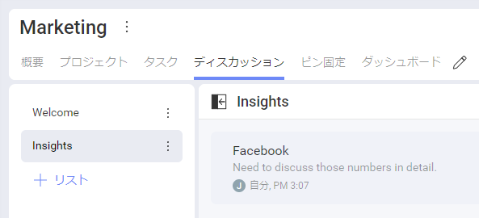
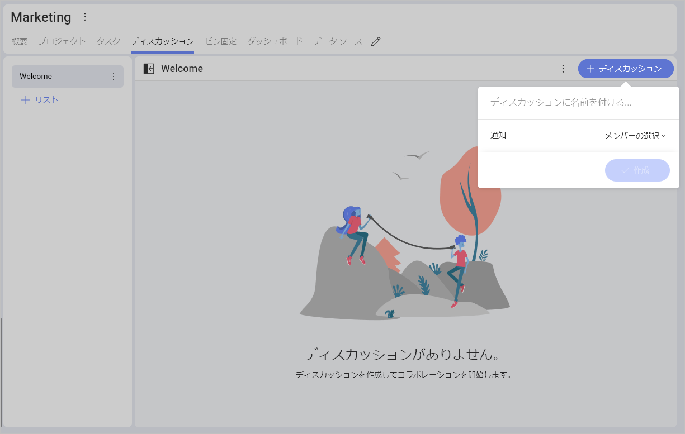
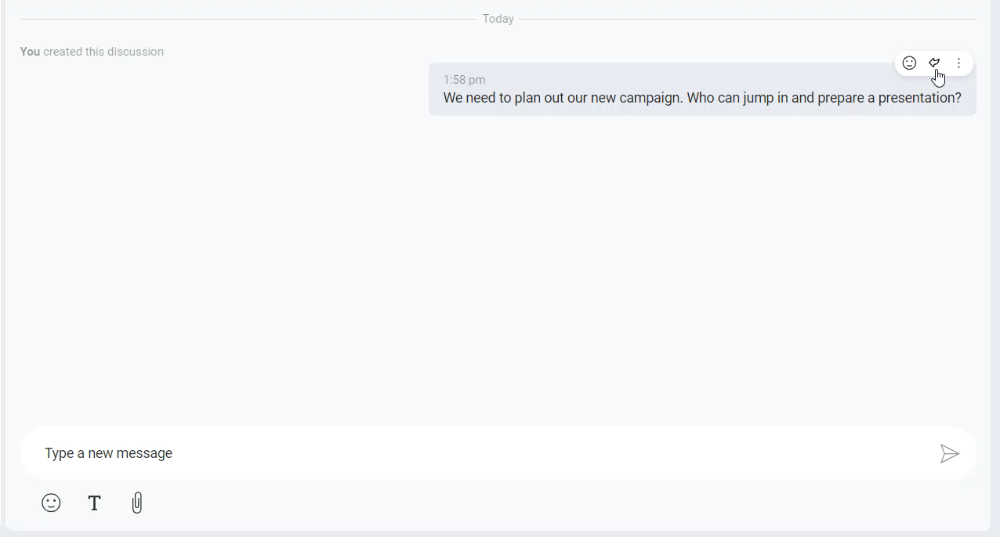
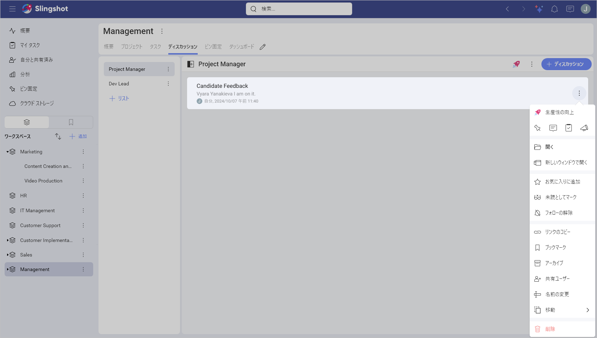
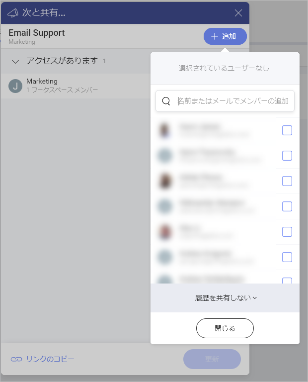
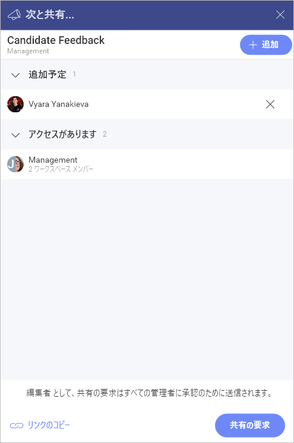
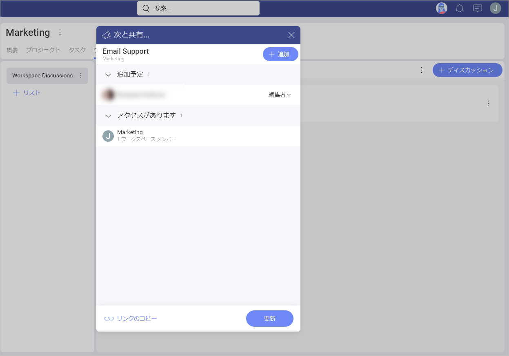
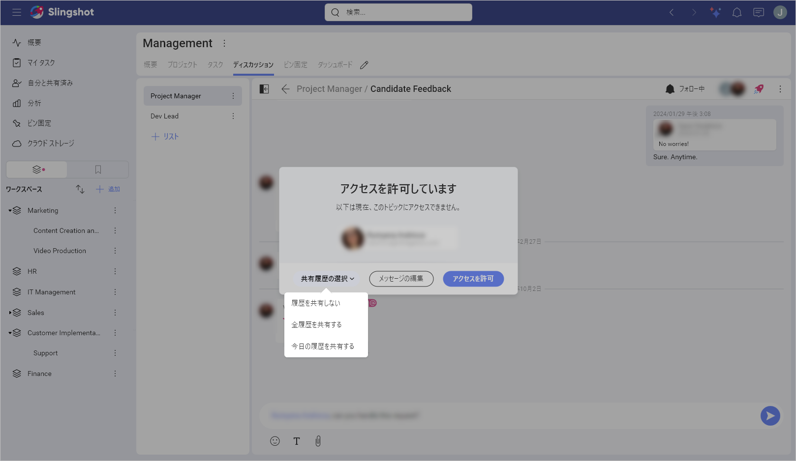
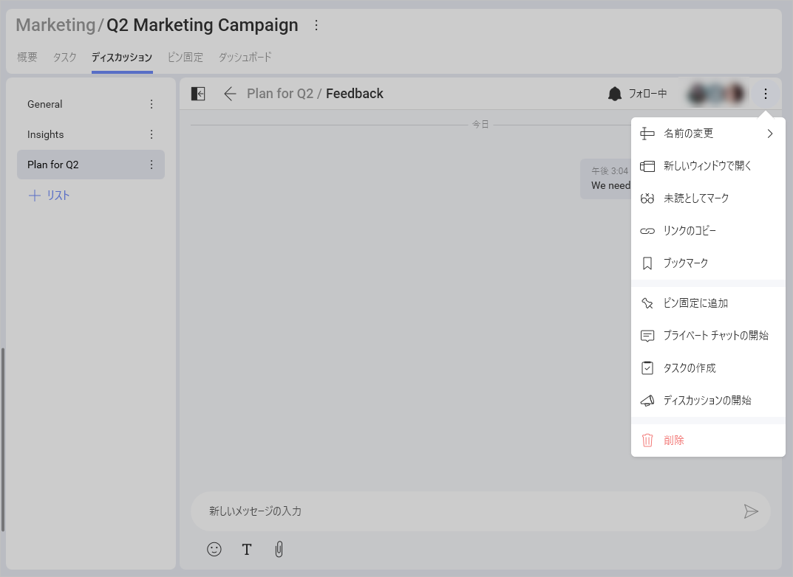
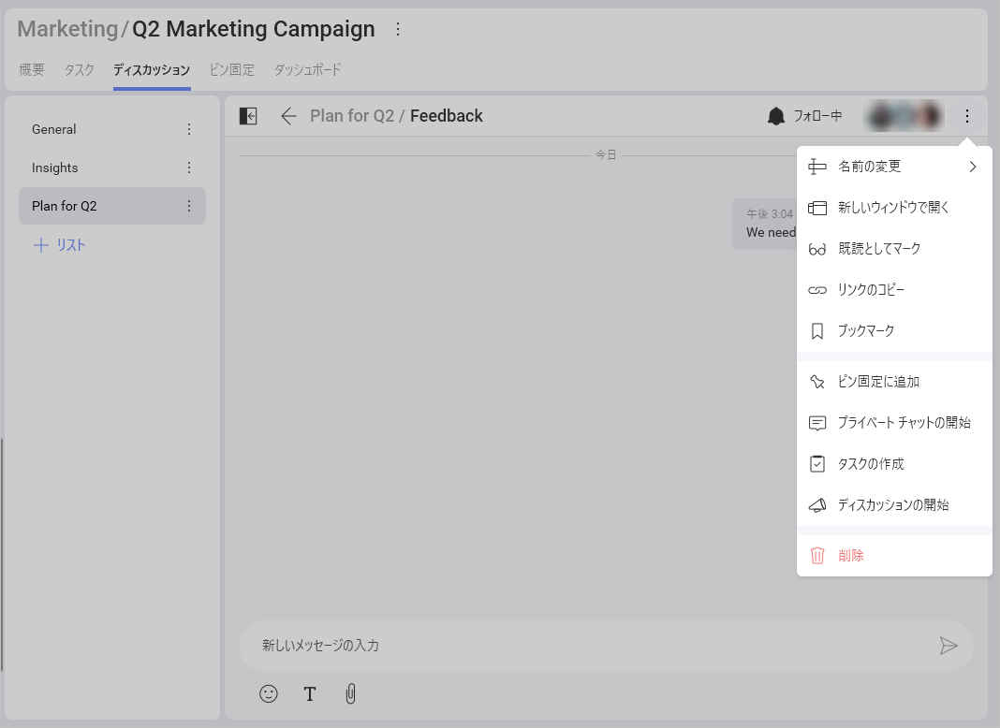

# ディスカッション

ようこそ! このトピックは、Slingshot ディスカッションに関する詳細を紹介します。

## ディスカッションおよびチャット

Slingshot では、コミュニケーションはディスカッションやプライベート チャットで行われます。

各ワークスペースには、ディスカッションのリストを含む **[ディスカッション]** タブがあります。ディスカッションはワークスペースおよびプロジェクトに固有のものです。そのため、Slingshot のすべてのディスカッションを表示して参加することはできません。ディスカッションにアクセスできるユーザーについては、[このリンク](discussions-faq.md#ディスカッションにアクセスできるユーザー)を参照してください。

ディスカッションとは異なり、プライベート チャットはワークスペースとプロジェクトに依存しません。詳細については、[チャット](chat-faq.md) トピックを参照してください。

## ディスカッションにアクセスする方法

ディスカッションにアクセスするには、ワークスペースまたはプロジェクトに移動し、上部にある **[ディスカッション]** ナビゲーション タブを選択します (以下のスクリーンショットを参照)。

ディスカッション、リスト、または特定のメッセージをブックマークしておくことができます。それらのブックマークは、ブックマーク リストおよび [概要] に表示されます。
[概要] の詳細については、[このリンク](overviews.md)を参照してください。

## ディスカッションにアクセスできるユーザー

立場に応じて、さまざまなディスカッションがあります。ワークスペースおよびプロジェクトのプライバシーを確保するため、Slingshot ではすべてのディスカッションへのアクセスを許可していません。誰が何にアクセスできるかはこの説明を参照下さい。 

ワークスペースまたはプロジェクト内で、メンバーのみがアクセスできるディスカッションを作成できます。

プロジェクト内で、このプロジェクトに固有のディスカッションを行うことができます。プロジェクトのすべてのコラボレーター (個人アカウントのユーザーを含む) は、これらのディスカッションに参加できます。[ワークスペース](workspaces.md)のメンバーは、プロジェクトのディスカッションにもアクセスできます。 

**組織内**にも**ディスカッション**があります。個人用アカウントを持つユーザーは組織ディスカッションにアクセスできません。こちらは、発表やその他の重要な組織関連のディスカッションに最適な場所です。 

## ディスカッションを見つけて参加する方法

ワークスペースまたはプロジェクトの [ディスカッション] タブを使用して、興味深いディスカッションを見つけることができます。

ディスカッションのリストは、特定のテーマに特化したセクションで、ディスカッションのリストで構成されます。ディスカッションは会話の場です。

>[!NOTE] ワークスペースまたはプロジェクトの管理者と編集者のみが、ディスカッションへの返信や、新しいディスカッションの作成ができます。閲覧者はディスカッションの閲覧だけができます。

## 新しいディスカッションを作成する方法

ワークスペースまたはプロジェクトのすべての管理者または編集者が新しいディスカッションを作成できます。**組織内**のディスカッションについても同様です。 

通常、ディスカッションはワークスペースの閲覧者にとって**読み取り専用**です。

>[!NOTE] ディスカッションを作成または回答するワークスペースまたはプロジェクトでのロールを常に考慮してください。 

**ディスカッションを作成する**には: 

1. **[ディスカッション]** タブに移動します。

2. リストを選択または作成します。

3. **[+ ディスカッション] を選択します。**

4. ディスカッションに名前を付けます。**[通知]** でメールを追加して、作成の通知を受け取るメンバーを選択できます。

5. **[作成]** をクリックまたはタップします。

これでディスカッションが作成されます。最初のメッセージを入力して、話題の詳細を入力できます。そうすることで会話のきっかけにもなります。

自分のメッセージや他の人からのメッセージに返信したい場合は、返信矢印をクリックまたはタップして行うこともできます。メッセージにカーソルを合わせると表示されます。

>[!NOTE] 返信スレッドはサポートされていません。

## 他のユーザーとディスカッションを共有する方法

ディスカッションを他のユーザーと共有するには、以下の手順に従ってください。

1. ディスカッションのオーバーフロー メニューを開き、**[共有ユーザー]** をクリックまたはタップします。

2. ユーザーを追加するためのダイアログが表示されます。

3. ディスカッションの管理者の場合は、ロールの権限を選択しながら他のユーザーを追加し、**[更新]** をクリックまたはタップできます。ディスカッションの管理者でない場合は、ユーザーを追加して **[共有の要求]** をクリックできます。ディスカッションの管理者は通知を受け取り、要求を承認または拒否できます。 

<!--  -->

ディスカッションをユーザーまたはグループと共有するもう 1 つの方法は、メンションすることです。**@ 記号**を使用して、ユーザー名 / ユーザーのメール アドレス、またはグループの名前を入力することでこれを行うことができます。 

メンション先がワークスペースまたはプロジェクトのメンバーではない場合、(ワークスペースまたはプロジェクトの) 管理者がアクセスを許可するまで、ディスカッションを見ることはできません。 

ワークスペース (またはプロジェクト) の管理者がディスカッションを開いてグループにメンションすると、ディスカッション履歴に関する次のオプションが提示されます: 

- 履歴を共有しない

- 全履歴を共有する

- 今日の履歴を共有する

ユーザーまたはグループに提供する履歴の範囲を選択した後、**[アクセスを許可]** をクリックまたはタップできます。

グループのメンバー (ワークスペースまたはプロジェクトの管理者ではない) がグループにメンションしたい場合は、最初に管理者にアクセス権を要求する必要があります。管理者がグループに許可を与えると、メンバーはディスカッションとその完全な履歴を表示できるようになります。 

## ユーザーに新しい回答が通知されるようにする方法

特定の人の注意を引く必要があるテーマがあります。ディスカッションの新しいメッセージごとに通知を受け取るようにするには、新しいディスカッションの作成時に **[通知]** オプションを使用します。 

>[!NOTE] 
>**通知の制限**。ワークスペースまたはプロジェクトに参加しているユーザーにのみ通知できます。 

ディスカッションの作成時に [通知] 機能を使用しなかった場合は、後で @メンション を使用できます。メンションされたユーザーにはメッセージが通知されますが、ディスカッションを**フォローする**ことを選択しない限り、新しいメッセージの通知は送信されません。

## 新しい回答の通知を確実に受け取る方法 

新しいメッセージの通知を受け取るには、ディスカッションに移動し、ディスカッションを開いて上のボタンを **[フォロー中]** に変更します。**通知センター**で通知を受信するようになります。

>[!NOTE]
>**自動フォロー。**ディスカッションに回答するたびに、自動的にフォローします。これは、明示的にトピックのフォローを解除するまで、すべての新しい回答の通知を受信することを意味します。 

## ディスカッションを**未読**としてマークする方法

ディスカッションで返信する必要があることを確認するには、ディスカッションを**未読**として設定します。オーバーフロー メニューを開き、**[未読としてマーク]** を選択します。

または、ディスカッションを開いて **[未読]** のマークを付けることもできます。

 ディスカッションを既読としてマークしたい場合は、そのディスカッションの横にあるオーバーフロー メニューを開き、**[既読としてマーク]** を選択します。ディスカッションを開くと、**既読**としてマークされます。

## ディスカッションの削除とフォロー解除

すべてのディスカッションが興味を引くものであったり、参加が必要であったりするとは限りません。Slingshot ディスカッションが膨大になるのを防ぐには、ディスカッションのフォローを解除または削除できます。 

ディスカッションが不要になった場合は、**フォローを解除できます**。**通知センター**での新しい回答の通知の受信が停止します。これにより、より重要なタスクに集中できます。**[フォローしていません]** に切り替えるには、上のベルを選択します。 

ディスカッションが誰とも関連性がなくなった場合は、ディスカッションを**削除できます**。ディスカッションを削除するとすべてのユーザーに表示されなくなるため注意してください。貴重な情報がまだ含まれている場合は、削除する前によく考えてください。

ディスカッションを削除するには、ディスカッションに移動し、オーバーフローメニューの **[削除]** を選択します。

## ディスカッション リストの並べ替え

新しいリストを作成すると、ディスカッション リストの最後に追加されます。いくつかリストが溜ってくると、追加した順の並び順では満足できないかもしれません。そのような場合は、ディスカッションを上下にドラッグするだけで、簡単にすばやく並べ替えることができます。

