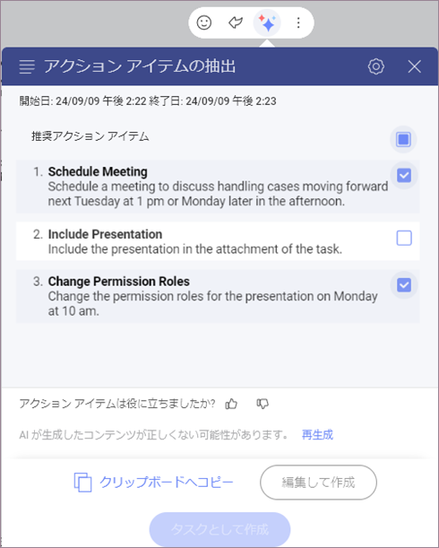
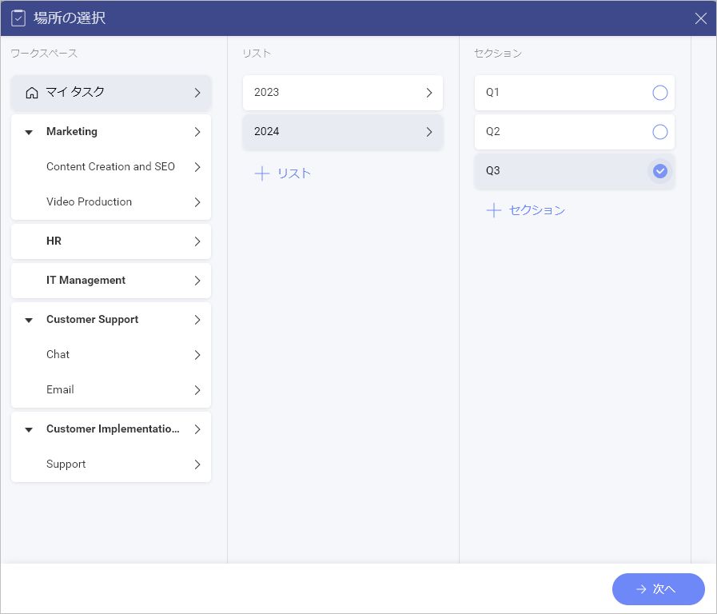
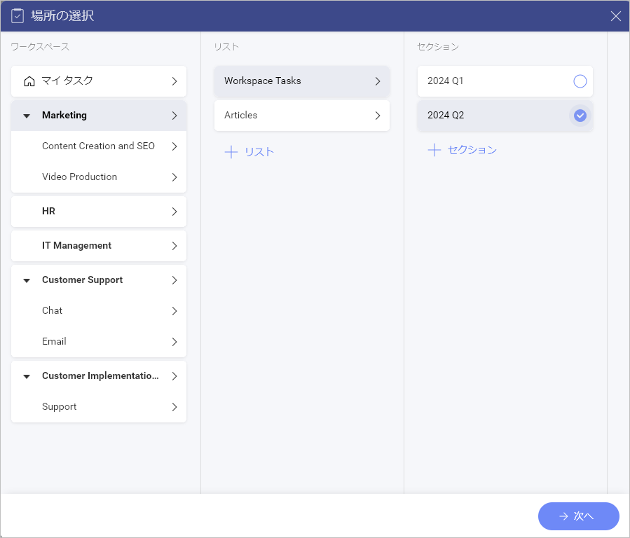
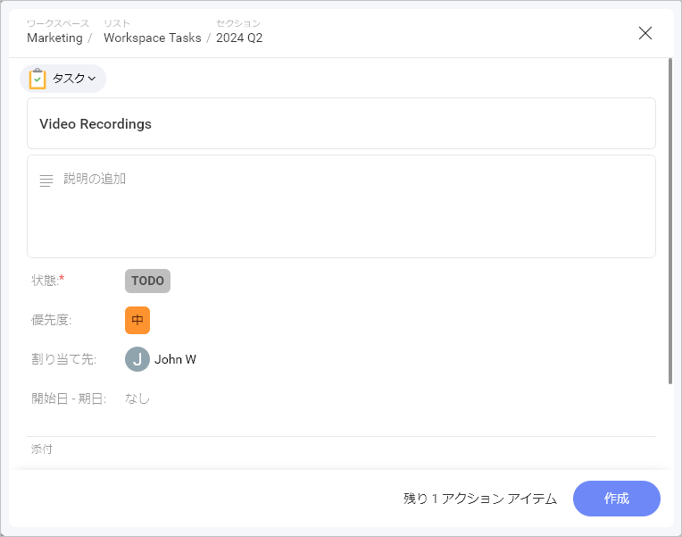
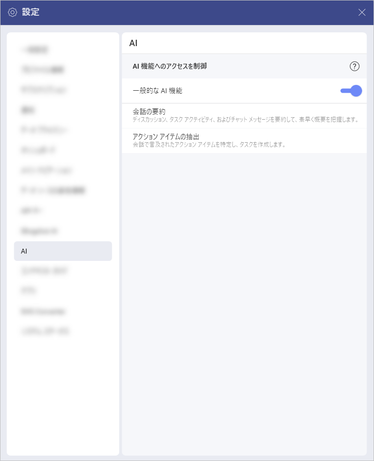

# アクション アイテムの抽出

「アクション アイテムの抽出」は、チャット、ディスカッション、その他のタスク内のメッセージから直接タスクを生成できる Slingshot AI 搭載の機能です。AI によって生成されたタイトルと説明により、この機能はタスク作成プロセスを効率化し、時間を節約し、チーム全体での責任分担を効率的に行うことができます。 

すべての Slingshot AI 機能と同様に、これは有料機能であり、*Slingshot* および *Slingshot Enterprise* サブスクリプションで利用できます。ライセンスのアップグレードに関する詳細については、[こちら](https://www.slingshotapp.io/ja/pricing)をご覧ください。  

## Slingshot AI の「アクション アイテムの抽出」機能を使用する方法 

Slingshot AI の「アクション アイテムの抽出」機能は簡単に使用でき、チャットやディスカッションからタスクを手間なく作成できます。この機能は、ディスカッションやチャットからテキストを抽出し、タスクを生成することで、通常の手順を省略してタスク作成を簡素化します。  

タスクを作成したいディスカッションやチャットメッセージに移動します。 

1. チャットやディスカッション内のメッセージにカーソルを合わせるか、モバイル デバイスの場合は長押しします。 

2. メッセージに絵文字で反応したり、直接返信したりするなど、さまざまなオプションが表示されます。メッセージで利用できる Slingshot AI 機能のリストを表示するには、3 つ星の AI ボタンをクリックまたはタップします。  

3. Slingshot AI 機能のリストが表示されます。このウォークスルーでは、**[アクション アイテムの抽出]** を選択します。 

4. ここからダイアログボックスが表示されます。ここには、推奨アクション アイテムのリストが表示されます。 

ここから、さらに多くのオプションを実行できます: 

- タスクの作成に使用するアイテムを選択します。各アイテムにはタイトルと説明があります。新しいタスクを作成するときにそれらを使用することと決定した場合、それらは自動的に追加されます。この方法により、時間を節約し、タスクの分配をより効率的に行うことができます。  必要に応じて、アイテムをいつでも編集できます。  

- **[生成]** ボタンから抽出されたアクション アイテムの新しいバージョンを再生成します。  これにより、タイトルと説明のさまざまなオプションが得られます。  目標に最も適したものを選択できます。 

- **クリップボードへコピーして**、アイテムのタイトルと説明をメモやメッセージの作成に再利用することもできます。   

- フィードバックをお寄せください。ユーザーからのフィードバックは、Slingshot とその体験を改善するのに役立ちます。 

- **[編集して作成]** ボタンを使用すると、タスクのデフォルト値とフィールドを編集できます。例えば、状態を **「To Do」** ではなく **「進行中」** に設定することができます。また、AI が生成したタイトルや説明を変更することもできます。次にタスクを作成します。 

- **[作成]** ボタンをクリックすると、編集オプションなしですぐにタスクが作成されます。これにより、抽出されたアクション アイテムから使用されるタイトルと説明を編集することはできません。デフォルト値やフィールドを編集するオプションもありません。タスクを作成したら、変更を加えることができます。 

## タスクを作成する方法 

1. **[タスクとして作成]** をクリックまたはタップします。  

2. タスクを保存したい場所を選択し、**[次へ]** をクリックまたはタップします。  タスクのデフォルトの場所はメッセージの場所です。たとえば、プライベート チャット メッセージからアクション アイテムを抽出する場合、デフォルトの場所は [マイ タスク] になります。ただし、必要に応じてデフォルトの場所を変更することができます。タスクを作成するプロセスでは、下のスクリーンショットのように、新しいタスク リストとタスク セクションを場所に追加することもできます。 

 

>[!Note] Slingshot AI の「アクション アイテムの抽出」機能は、生成されていないメッセージに対してのみ使用できます。そのため、Slingshot AI [要約機能](summarization.md)を使用してすでに要約されているメッセージを要約することはできません。   

## タスクを作成する前に編集するにはどうすればよいですか？ 

タスクや一連のタスクの**優先度**を設定するなど、最初にいくつか変更を加えたい場合は、次の手順を実行できます: 

1. **[編集して作成]** をクリックまたはタップします。  

2. タスクを保存したい場所を選択し、**[次へ]** をクリックまたはタップします。タスクのデフォルトの場所はメッセージの場所です。たとえば、プライベート チャット メッセージからアクション アイテムを抽出する場合、デフォルトの場所は [マイ タスク] になります。ただし、必要に応じてデフォルトの場所を変更することができます。タスクを作成するプロセスでは、下のスクリーンショットのように、新しいタスク リストとタスク セクションを場所に追加することもできます。 

3. 各タスクの変更が完了したら、それぞれの **[作成]** をクリックまたはタップします。複数のアクション アイテムがある場合は、**[作成]** ボタンの横にタスクとして作成される残りのアクション アイテムの数が表示されます。 

 

## Slingshot AI の「アクション アイテムの抽出」機能を無効にする方法  

Slingshot AI はデフォルトでオンになっていますが、組織に所属している場合は、組織の管理者が全体のために無効にしていることがあります。   

Slingshot AI をオフにするには:  

1. 2 つのシナリオで設定パネルにアクセスできます:  

    a. 右上のアバターに移動します。   

    b. 要約テキスト ウィンドウから直接、右上隅にある設定アイコンに移動します。 

2. 設定パネルから **[AI]** を選択します。  

3. **[一般的な AI 機能]** をオフに切り替えます。 

 
