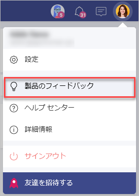
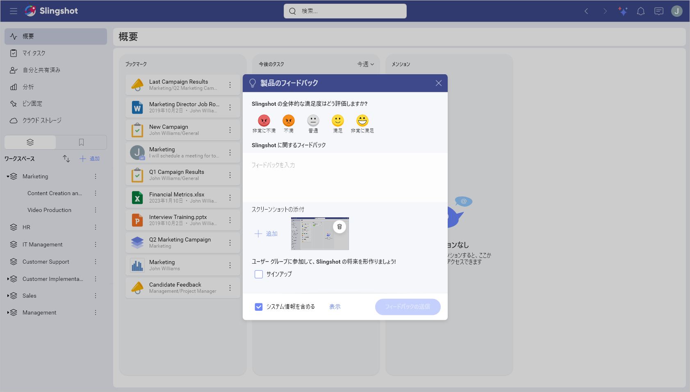

# フィードバック

リモートワークを簡単かつ迅速にしながら、データ駆動型の世界でシンプルさを実現することが Slingshot の目標です。デジタル ワークプレースに対するユーザーの想いを共有したく、ご感想、ご要望等お気づきの点がありましたら、フィードバックフォームからお知らせ下さい。

## フィードバックを報告する方法

フィードバックを送信する手順は、以下のとおりです:

1. 右上隅のプロフィール画像をタップ/クリックします。

2. **[製品のフィードバック]** をタップ/クリックします。

 

3. ウィンドウがポップアップし、以下の操作を実行できます:

- Slingshot を使用した感想、追加または改善して欲しい機能やオプションについてお聞かせください。
- アプリのスクリーンショットを添付することができます。テキストの追加や特定の領域を指す矢印の使用など、さまざまなツールを使用して編集することもできます。 
- ニュースレターにサインアップできます。
- システム情報を含めることができます。常にこの情報をフィードバックに含めることをお勧めします。これにより、問題の概要をより適切に把握することができます。

 

ユーザー アカウントおよび設定にあるその他のオプションの詳細については、[こちら](https://www.slingshotapp.io/jp/help/docs/user-account)をクリックしてください。