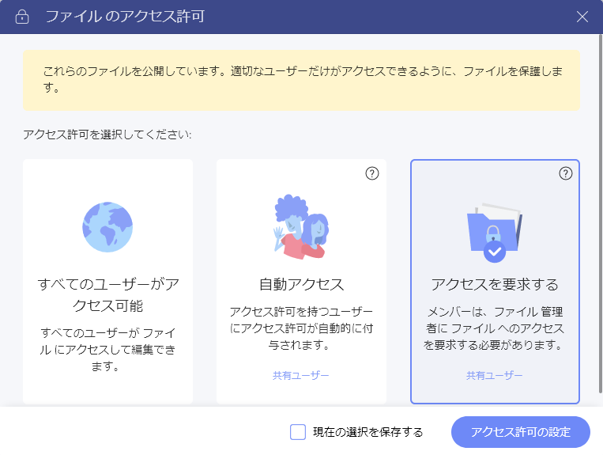
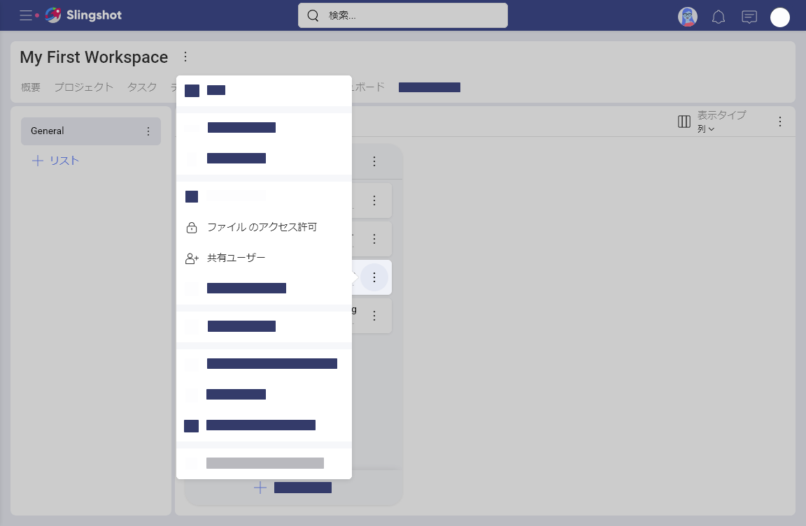
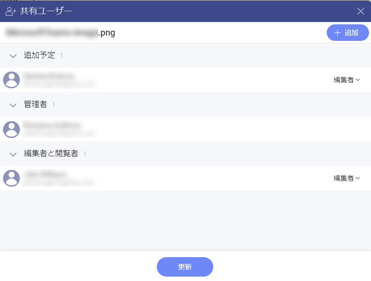
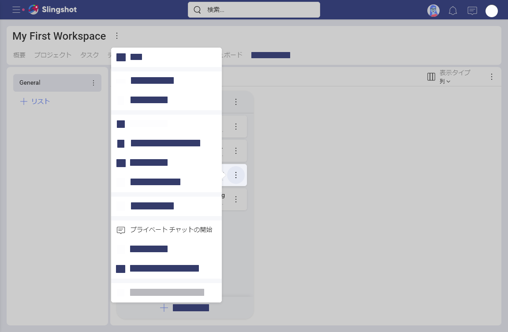

# ファイル アクセス許可の詳細

ようこそ！このトピックは、ファイルのアクセス許可に関する詳細を紹介します。

## Slingshot でファイル セキュリティはどのように許可されますか？

[ファイルをコンテンツ ボードにピン固定して](content-boards.md#working-with-your-content-in-slingshot)他のユーザーと共有する場合、セキュリティのさまざまな側面に注意する必要があります。機密情報は外部の人に見られていませんか？他のユーザーがあなたのファイルを削除できますか？ファイルを編集できるユーザーは?

Slingshot では、**ファイルにアクセスできるユーザーを選択できる**ため、ファイルのセキュリティが確保されます。  
 また、Slingshot はファイルを保存しませんが、好みのクラウド ストレージに接続してファイルにアクセスできます。これは、あなたとあなたの信頼できる人だけがアクセスできることを意味します。また、Slingshot はクラウド ストレージのセキュリティに基づいてファイルの安全性を確保します。詳細については、ファイルのアクセス許可に関する [FAQ](file-permissions-faq.md) を参照してください。

>[!NOTE] あなたがボードにピン固定したファイルは他のユーザーは**削除できません**。ボードは、ファイルがあるクラウド プロバイダーへの接続を保持するコンテナーです。ただし、ワークスペースの管理者およびメンバーは、ファイルの*ピン固定を解除して*接続を削除できます。

## ファイルのアクセス許可を設定する方法

ワークスペース内のファイルを共有すると、ワークスペース内のユーザーがこれらのファイルを使用できるようになります。 

ファイルのアクセス許可は、ファイルの管理者がファイルにアクセスできるユーザーを制御します。Slingshot を介してアクセスを許可すると、他のユーザーは以下を実行できます: 

- ファイルを開く 
- そして編集することです。

ファイルをピン固定するたびに、Slingshot は **[ファイルのアクセス許可]** ダイアログを開き、アクセス許可のタイプを確認します (以下を参照)。

こちらでは、以下の 3 つの許可タイプから選択できます。

 - **すべてのユーザーがアクセス可能** 
 - **自動アクセス** 
 - **アクセスの要求** 

## それぞれのファイル アクセス許可の意味 

**[アクセスのを要求]** はデフォルトで最も制限が多いものです。つまり、初めてファイルを開こうとする場合、ファイルの管理者へのアクセスの要求必要があります。ファイルの管理者は、アクセスの**許可**または**拒否**をするよう促すメールを受信します。アクセスを許可することにより、ファイルの管理者はユーザーにファイルを開いて編集する許可を与えます。 

ファイルの管理者は、**[ファイルのアクセス許可]** ダイアログの **[アクセスの管理]** オプションを使用して、選択したワークスペースのメンバーにアクセスを事前に許可することもできます。 

**[自動アクセス]** は、すべてのワークスペース共同編集者がファイルにすばやくアクセスできるようにする場合に便利です。**自動アクセス**を選択した場合、ワークスペースのすべてのメンバーは、管理者にアクセスを明示的に要求せずにファイルを開いて編集します。  

> [!NOTE] デフォルトのファイル許可タイプを変更するには、**[現在の選択を保存する]** チェックボックスを選択します。 

**[すべてのユーザーがアクセス可能]** は最も制限の少ないオプションです。すべてのユーザーがファイルを開いて編集できます。ワークスペースのメンバーではないユーザーでも、ワークスペースの場所へのリンクがある場合はアクセスできます。ただし、より制限の多いタイプのアクセス許可にいつでも切り替えることができます。この場合、ワークスペース以外のユーザーはファイルへのリンクが無効になります。

> [!NOTE]
> クラウド ファイル プロバイダーにアップロードされたファイルにアクセスするユーザーは、Slingshot の許可だけでなく、そのクラウド プロバイダーの有効なアカウントも必要です。たとえば、他のユーザーが共有している *OneDrive* からファイルを開こうとすると、*OneDrive* アカウントにログインするよう求められます。*OneDrive* のアカウントがない場合、Slingshot はアクセスを拒否します。これは、ファイルにパブリック アクセス許可があり、ブラウザーで開いた場合は**適用されません**。 

チャットでファイルを共有するときにファイル許可が適用される方法については、[「チャットでファイルを共有する方法」](chat-faq.md#how-can-i-share-a-file-in-the-chat) を参照してください。 

## ファイルを編集する許可を持つユーザーを制御できますか？

Slingshot でアクセスを許可した各ユーザーは、ファイルを開いて編集できます。ただし、編集許可はいつでも取り消すことができます。2 つの方法があります。 

1. クラウド ストレージ プロバイダー (<a href="https://support.microsoft.com/en-us/office/share-files-and-folders-in-onedrive-personal-3fcefa26-1371-401e-8c04-589de81ed5eb" target="_blank">OneDrive</a>、<a href="https://support.google.com/docs/answer/2494893#zippy=%2Cstop-sharing-a-file-or-folder" target="_blank">Google Drive</a>、<a href="https://help.dropbox.com/files-folders/share/set-folder-permissions" target="_blank">Dropbox</a>、<a href="https://support.box.com/hc/en-us/articles/360044196413-Understanding-Collaborator-Permission-Levels" target="_blank">Box</a>、および <a href="https://support.microsoft.com/en-us/office/customize-permissions-for-a-sharepoint-list-or-library-02d770f3-59eb-4910-a608-5f84cc297782" target="_blank">SharePoint</a>) からファイルの編集許可を取り消すことができます。
2. Slingshot の設定を使用して、選択したユーザーへのファイル アクセスの許可を停止できます。以下の Slingshot でファイルのアクセス許可を管理する方法を参照してください。  

## Slingshot でファイルのアクセス許可を管理する方法

Slingshot でファイルのアクセス許可をいつでも表示および編集できます。すでにアクセスできるメンバーを管理することもできます。  

ファイルのアクセス許可を表示/編集するには、オーバーフロー メニューから **[ファイルのアクセス許可]** を選択します (以下を参照)。 

ファイルにアクセスできるユーザーを表示/編集するには、**[メンバー アクセス]** をクリック/タップします。表示されるダイアログ (以下を参照) には、ファイルを表示および編集できるすべてのメンバー、および保留中のアクセス要求が表示されます。

**[+ 追加]** 青いボタンを使用すると、明示的に確認せずにファイルを表示および編集できる選択したユーザーにアクセスを事前に許可します。

>[!NOTE]
> ワークスペースに含まれていないユーザーのファイルへのアクセスを事前に許可することはできません。 

各メンバーの名前の右側で、**[編集者/閲覧者]** > **[削除]** をクリック/タップしてアクセスを取り消すことができます。 

>[!NOTE] **アクセスを自動的に取り消すことはできません。**  一度ファイルを開いたことがあるユーザーは<*編集者*として追加され、ファイルのアクセス許可をより制限されたタイプに変更してもアクセスは自動的に取り消されません。ファイルのアクセス許可を *[自動アクセス]* から [アクセスの要求] に変更する場合、**[メンバー アクセス]** で **[編集者]** を確認し、必要に応じてアクセス許可を取り消します。

## ディスカッションおよびチャットでファイルのアクセス許可はどのように機能しますか？ 

ボードにピン固定したファイルをワークスペースに参加していない人と共有する必要がある場合があります。Slingshot では、次の方法でこれを実行できます。 

1. ディスカッションまたはチャットでファイルへのリンクを送信するか、あるいは 
2. ピン固定ファイルからチャットやディスカッションを直接開始できます。ファイルのオーバーフロー メニューに *[ディスカッションを開始]* または *[チャットを開始]* オプションがあります。

    

ファイルの管理者は、設定したファイルのアクセス許可でワークスペース以外のユーザーがファイルにアクセスできるかどうかを決定することに注意してください。 
ファイルのアクセス許可に応じて、チャットまたはディスカッションでファイルを共有する際に 2 つのシナリオがあります。

- **[アクセスの要求]** - ディスカッションまたはチャットで他のユーザーとファイルを共有できますが、最初にファイルを開こうとしたときにファイルの管理者に許可を求める必要があります。
- **[自動アクセス]** または **[すべてがアクセス可能]** - ディスカッションまたはチャットでファイルを共有し、他のユーザーが自由に開くことができます。ファイルの管理者はいつでもアクセスを取り消すことができます。