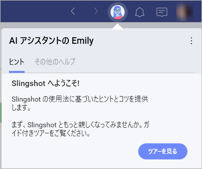

# Slingshot をはじめよう

Slingshot は、プロジェクト管理、データ分析、コンテンツ管理、チーム コラボレーションなど、高パフォーマンスのチームを運営するために必要なすべてのツールを統合した唯一のデジタル ワークプレースです。

シームレスなオンボーディングには、基本的な構造と機能を理解しておく必要があります。メイン ナビゲーション パネルの左上には以下の項目があります。  

- **概要**: ブックマーク、優先されるタスクやメッセージに素早くアクセスできるハイレベルなエリアとして機能します。
- **マイ タスク**: Slingshot で割り当てられたすべてのタスクを任意のワークスペースまたはプロジェクトからまとめます。他のチーム、部署、プロジェクトにまたがる仕事の優先順位を付けて管理するカスタム フィルターを作成できます。
- **自分と共有済み**: Slingshot で共有した項目にすばやくアクセスできます。共有、ダッシュボード、リスト、ディスカッションなどが可能です。
- **分析**: セルフサービスのビジネス インテリジェンスにより、これまで以上に深い洞察を得ることができます。毎日使用するデータ ソースからダッシュボードを作成し、組織のデータ カタログなどにアクセスできます。 
    - **データ カタログ**: 分類、認証されたデータにアクセスして、自社について最も信頼できる情報を検索します。
- **ピン固定**: クラウド ストレージからのファイル、URL、分析ダッシュボードなど、リソースへのすべてのリンクが含まれます。

>[!NOTE] データ カタログは Enterprise レベルの機能です。

クイック アクセス機能の実行後、Slingshot に はワークスペース、ブックマーク、グループの 3 つのタブがあります。  

- **[ワークスペース](https://www.slingshotapp.io/jp/help/docs/workspaces)**: チームやグループでプロジェクトやイニシアチブに取り組む場所です。ワークスペースには以下が含まれます。  

    - **[プロジェクト](https://www.slingshotapp.io/jp/help/docs/overviews)**: ワークスペースの下に配置し、タスク、コンテンツ、ダッシュボード、会話をさらに整理します。プロジェクトにもそれぞれの概要があります。  
    - **[タスク](https://www.slingshotapp.io/jp/help/docs/tasks)**: チームやプロジェクトのタスクを作成して整理します。  
    - **[ディスカッション](https://www.slingshotapp.io/jp/help/docs/discussions-faq)**: メンバーまたはワークスペースや組織が参加できるコンバージョンを用意し、情報を把握できるようにします。 
    - **[ピン固定](https://www.slingshotapp.io/jp/help/docs/pins)**: あらゆるクラウド プロバイダー (Google Drive、OneDrive、SharePoint、Box、DropBox) からワークスペースまたは組織のコンテキストで URL、ファイル、ドキュメントをまとめます。
    - **[ダッシュボード](https://www.slingshotapp.io/jp/help/docs/analytics/dashboards/overview)**: ダッシュボードをワークスペースおよびプロジェクトに追加して、データに基づいた意思決定を行います。  
    - **[データ ソース](https://www.slingshotapp.io/jp/help/docs/analytics/datasources/overview)**: ワークスペースまたはプロジェクトのメンバーがアクセスする必要があるデータ ソースを追加します。

- **ブックマーク**: Slingshot でブックマークを作成すると、重要なドキュメント、ダッシュボード、会話などをワンクリックで保存できます。  

- **[グループ](https://www.slingshotapp.io/jp/help/docs/groups)**: グループを作成して、情報にすばやくメンション、招待、情報を共有できます。  

>[!NOTE] グループは Enterprise だけの機能です。

組織に属している場合、[ワークスペース] の最初の項目として表示されます。組織とは、企業のデータ カタログを通じて、透明性のあるディスカッション、コンテンツおよびデータへのアクセスを企業全体に提供する方法です。また、マネージャーやリーダーが組織全体で重要な目標、指標、戦略、重要な発表やリソースを伝えるのにも役立ちます。組織ワークスペースは、組織 (会社名) に基づいて名前が付けられます。

>組織は Enterprise だけの機能です。

Slingshot の右上には以下の機能があります。  

- **Emily**: Slingshot のパーソナル AI アシスタントには、オンボードのヒントやコツ、ガイドやツアーがあり、Slingshot の旅をサポートします。When you open the personal AI assistant, you will see two sections: **Tips for you** and **More Help**:
   - *Tips for you*: When you click/tap on **See Tour** you will be pointed to different features with a short summary of what they do in order to get a better overview on Slingshot.

   - *More Help*: Here you can find more information about the features with the help of visuals. If you want to find additional information about the app, you can go through the different sections of the **Learning Center Docs**. 
   
     

- **[通知](https://www.slingshotapp.io/jp/help/docs/notifications)**: リアルタイムの通知で見逃すことはありません。  

- **[チャット](https://www.slingshotapp.io/jp/help/docs/chat-faq)**: 1 対 1、または組織内外の Slingshot の他のユーザーグループとプライベート チャットが可能です。   

- **[アバター*](https://www.slingshotapp.io/jp/help/docs/user-account)*: アバター アイコンからプロフィールやアクセス設定などを更新できます。  

Slingshot の概要を説明し、Slingshot 製品ツアー ビデオでさまざまな機能を紹介します。  

> [!Video https://www.youtube.com/embed/s5HRJE_iFPI]

## Slingshot へのログイン
Slingshot アプリケーションを初めて起動すると、以下のサインイン オプションが表示されます。
 - Apple
 - Google
 - Microsoft
 - Infragistics

Google または Microsoft のログインを使用すると、連絡先の同期などの利点があります。

ログインする前に、さまざまなログインの利点を見てみましょう。  
Slingshot は Microsoft と Google の上に構築されているため、技術スタックに直接統合するのに最適なツールです。これらのプロバイダーのいずれかでビジネス用メールを使用することには、3 つの主な利点があります。  

1.	すべての連絡先が同期されて Slingshot に追加されるため、ワークスペースへのユーザーの招待、チャット、タスクの割り当てが簡単になります。  
2.	各クラウド ストレージ プロバイダーが自動的に追加されるため、ファイルのピン固定や添付を開始したり、Excel ファイルからダッシュボードを作成したりできます。  
3.	関連付けられた組織に自動的に追加されます。  

