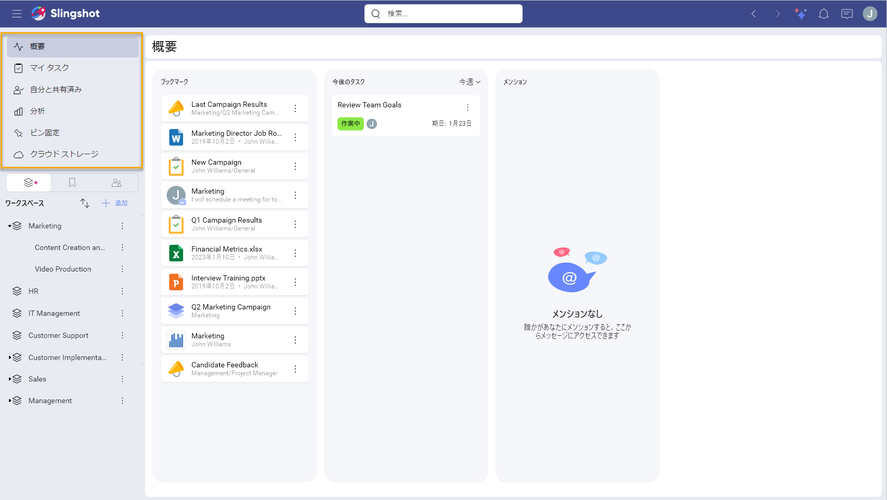
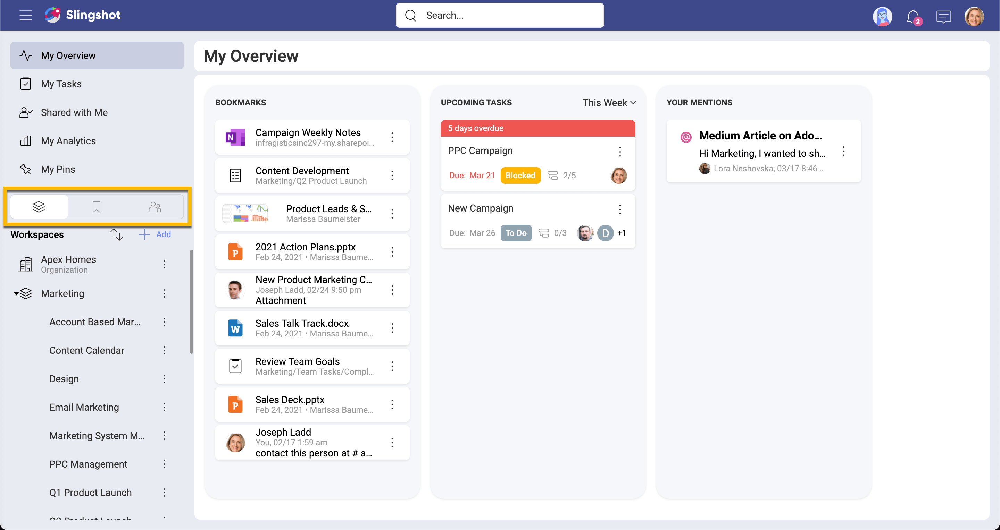
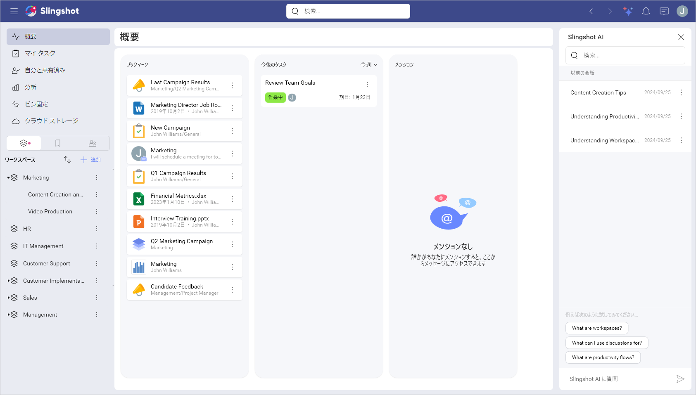
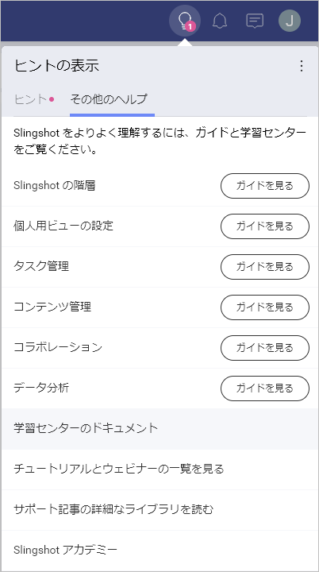
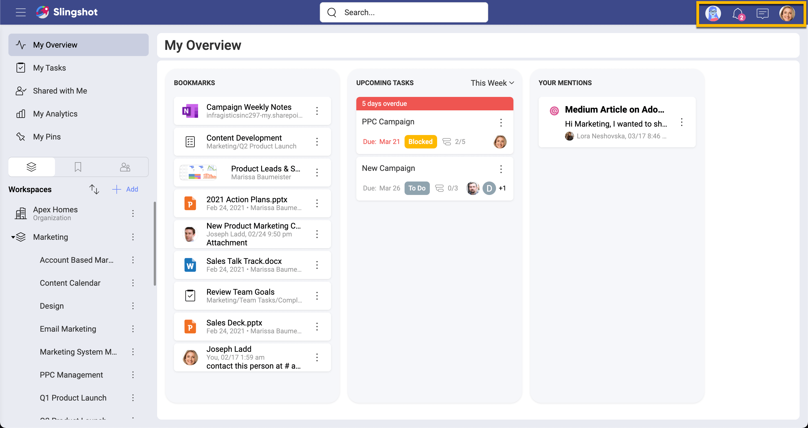
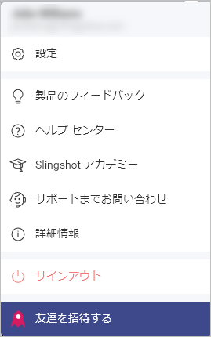

# Slingshot をはじめよう

Slingshot は、プロジェクト管理、データ分析、コンテンツ管理、チーム コラボレーションなど、高パフォーマンスのチームを運営するために必要なすべてのツールを統合した唯一のデジタル ワークプレースです。

シームレスなオンボーディングには、基本的な構造と機能を理解しておく必要があります。メイン ナビゲーション パネルの左上には以下の項目があります。  

- **概要**: ブックマーク、優先されるタスクやメッセージに素早くアクセスできるハイレベルなエリアとして機能します。

- **マイ タスク**: Slingshot で割り当てられたすべてのタスクを任意のワークスペースまたはプロジェクトからまとめます。他のチーム、部署、プロジェクトにまたがる仕事の優先順位を付けて管理するカスタム フィルターを作成できます。

- **自分と共有済み**: Slingshot で共有した項目にすばやくアクセスできます。共有、ダッシュボード、リスト、ディスカッションなどが可能です。

- **分析**: セルフサービスのビジネス インテリジェンスにより、これまで以上に深い洞察を得ることができます。毎日使用するデータ ソースからダッシュボードを作成し、組織のデータ カタログなどにアクセスできます。 

    - **データ カタログ**: 分類、認証されたデータにアクセスして、自社について最も信頼できる情報を検索します。

- **ピン固定**: クラウド ストレージからのファイル、URL、分析ダッシュボードなど、リソースへのすべてのリンクが含まれます。

- **クラウド ストレージ**: Google ドライブ、OneDrive、Dropbox、Box、または SharePoint に保存されているファイルを使用します。

>[!NOTE] データ カタログは Enterprise レベルの機能です。

クイック アクセス機能の実行後、Slingshot に はワークスペース、ブックマーク、グループの 3 つのタブがあります。  

- **[ワークスペース](https://www.slingshotapp.io/ja/help/docs/workspaces)**: チームやグループでプロジェクトやイニシアチブに取り組む場所です。ワークスペースには以下が含まれます。

    - **[プロジェクト](https://www.slingshotapp.io/ja/help/docs/overviews)**: ワークスペースの下に配置し、タスク、コンテンツ、ダッシュボード、会話をさらに整理します。プロジェクトにもそれぞれの概要があります。

    - **[タスク](https://www.slingshotapp.io/ja/help/docs/tasks)**: チームやプロジェクトのタスクを作成して整理します。

    - **[ディスカッション](https://www.slingshotapp.io/ja/help/docs/discussions-faq)**: メンバーまたはワークスペースや組織が参加できるコンバージョンを用意し、情報を把握できるようにします。

    - **[ピン固定](https://www.slingshotapp.io/ja/help/docs/pins)**: あらゆるクラウド プロバイダー (Google Drive、OneDrive、SharePoint、Box、DropBox) からワークスペースまたは組織のコンテキストで URL、ファイル、ドキュメントをまとめます。

    - **[ダッシュボード](https://www.slingshotapp.io/ja/help/docs/analytics/dashboards/overview)**: ダッシュボードをワークスペースおよびプロジェクトに追加して、データに基づいた意思決定を行います。

    - **[データ ソース](https://www.slingshotapp.io/ja/help/docs/analytics/datasources/overview)**: ワークスペースまたはプロジェクトのメンバーがアクセスする必要があるデータ ソースを追加します。

- **[ブックマーク](https://www.slingshotapp.io/ja/help/docs/bookmarks)**: Slingshot でブックマークを作成すると、重要なドキュメント、ダッシュボード、会話などをワンクリックで保存できます。  

- **[グループ](https://www.slingshotapp.io/ja/help/docs/groups)**: グループを作成して、情報にすばやくメンション、招待、情報を共有できます。  

>[!NOTE] グループは Enterprise だけの機能です。

組織に属している場合、[ワークスペース] の最初の項目として表示されます。組織とは、企業のデータ カタログを通じて、透明性のあるディスカッション、コンテンツおよびデータへのアクセスを企業全体に提供する方法です。また、マネージャーやリーダーが組織全体で重要な目標、指標、戦略、重要な発表やリソースを伝えるのにも役立ちます。組織ワークスペースは、組織 (会社名) に基づいて名前が付けられます。

>組織は Enterprise だけの機能です。

Slingshot の右上には以下の機能があります。  

- **[Slingshot AI](slingshot-ai-overview.md)** ([Slingshot](slingshot-subscription.md) および [Slingshot Enterprise の機能](slingshot-enterprise-subscription.md)): オンボーディングのヒントやコツ、ガイド、ツアー。Slingshot の機能に関する詳しい情報が必要な場合は、質問を入力してすぐに回答を得ることができます。 

- **学習のヒント** (Slingshot の無料版): 

   - **ヒント**: ここでオンボーディングを完了できます (プロフィールを完成させる、チュートリアルを実行する、またはさまざまなデバイスにアプリをダウンロードする)。

   - **その他のヘルプ**: こちらでは、ビジュアルにより、機能の詳細をご紹介しています。アプリの詳細については、**[学習センターのドキュメント]** の各セクションを参照してください。
   
   

- **[通知](https://www.slingshotapp.io/ja/help/docs/notifications)**: リアルタイムの通知で見逃すことはありません。  

- **[チャット](https://www.slingshotapp.io/ja/help/docs/chat-faq)**: 1 対 1、または組織内外の Slingshot の他のユーザーグループとプライベート チャットが可能です。   

- **[アバター](https://www.slingshotapp.io/ja/help/docs/user-account)**: アバター アイコンからプロフィールやアクセス設定などを更新できます。  

Slingshot の概要を説明し、Slingshot 製品ツアー ビデオでさまざまな機能を紹介します。  

> [!Video https://www.youtube.com/embed/ZEnf25u3g3E]

## Slingshot へのログイン
Slingshot アプリケーションを初めて起動すると、以下のサインイン オプションが表示されます。
 - Apple

 - Google

 - Microsoft

 - Infragistics

Google または Microsoft のログインを使用すると、連絡先の同期などの利点があります。

ログインする前に、さまざまなログインの利点を見てみましょう。  
Slingshot は Microsoft と Google の上に構築されているため、技術スタックに直接統合するのに最適なツールです。これらのプロバイダーのいずれかでビジネス用メールを使用することには、3 つの主な利点があります。  

1.	すべての連絡先が同期されて Slingshot に追加されるため、ワークスペースへのユーザーの招待、チャット、タスクの割り当てが簡単になります。

2.	各クラウド ストレージ プロバイダーが自動的に追加されるため、ファイルのピン固定や添付を開始したり、Excel ファイルからダッシュボードを作成したりできます。

3.	関連付けられた組織に自動的に追加されます。

## お問い合わせ

Slingshot アカウントについて質問がある場合やサポートが必要な場合は、当社のチームにお問い合わせください。そのためには:

1. <a href="https://account.slingshotapp.io" target="_blank">こちら</a>からアカウントにログインします。

2. **[Support] (サポート)** を選択してから **[New Support Request] (新しいサポートケースの作成)** を選択します。

すでに *Slingshot* アカウントにログインしている場合は、次のことができます:

1. アカウント設定を開き、**[サポートまでお問い合わせ]** をクリックまたはタップします。

2. **[New Support Case]** (新しいサポート リクエスト) をクリックまたはタップして、リクエストに関する詳細を入力します。

私たちのチームが、お問い合わせに関するさらなる指示や詳細情報をメールでお送りします。

または、ページの右下隅にあるチャット アイコンをクリックまたはタップして、チャットを開始することもできます。

