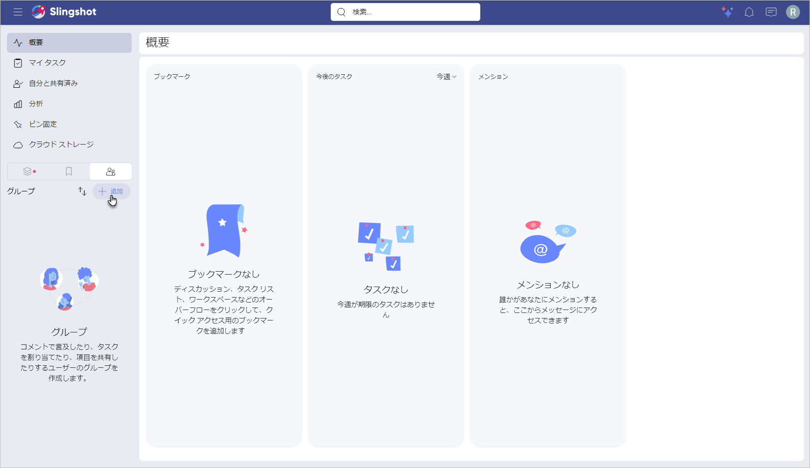
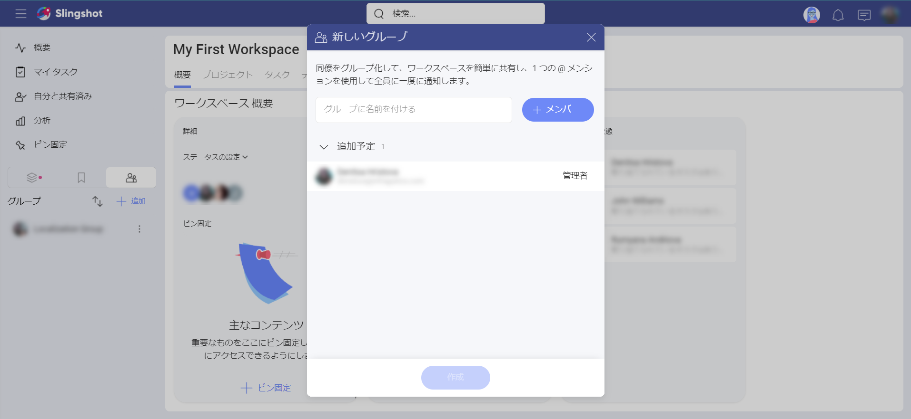

# グループ

Slingshot のグループを使用することで、共通の目的を持つユーザーのグループとの作業が高速化されます。一般的な例としては、製品リード、マーケティング チームのデザイナー、エグゼクティブ チームなどがあります。グループでディスカッションに参加したり、ワークスペースに招待したり、タスクを割り当てたり、ダッシュボードをすばやく共有したりできます。

## グループを使用してできること

グループを使用して、次のことができます:

- 個人だけではなく、グループをワークスペースまたはプロジェクトに招待します。

- グループをタスクに割り当てます。

- グループでチャットまたはディスカッションを開始します。

- ファイル、ピン固定、またはその他のリソースをグループと共有します。

## グループを作成する方法

グループを作成するには、次のことを行う必要があります:

1. 左側のナビゲーションに移動し、トグルを [ワークスペース] から [グループ] に移動します。

2. **[+ 追加]** ボタンを選択します。

3. グループの名前を入力し、メンバーを追加します。

4. 準備ができたら、**[作成]** を選択します。

>[!Note]
> **グループ**機能は [Slingshot Enterprise](slingshot-enterprise-subscription.md) ユーザーのみが利用できることに注意してください。

## グループ メンバーとアクセス許可

グループ内には、次の 2 種類のアクセス許可があります。

- **管理者** - デフォルトでは、グループを作成した人が管理者として設定されます。管理者のみがメンバーのアクセス許可を変更および削除できます。

- **メンバー** - グループに関連するすべてにアクセスできますが、新しいメンバーの追加やグループの削除はできません。

