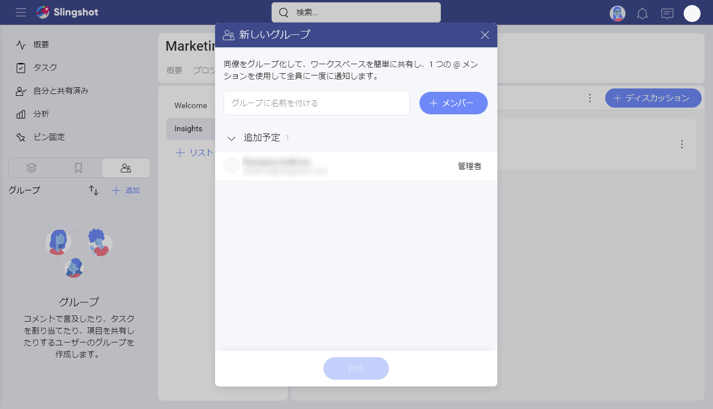
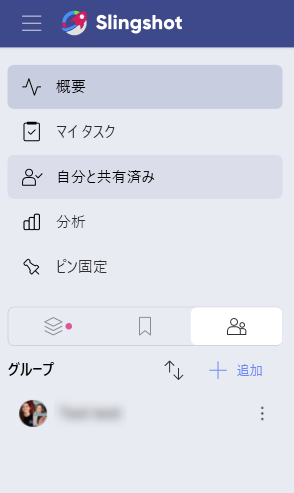

# グループ

Slingshot のグループを使用することで、共通の目的を持つユーザーのグループとの作業が高速化されます。一般的な例としては、製品リード、マーケティング チームのデザイナー、エグゼクティブ チームなどがあります。グループでディスカッションに参加したり、ワークスペースに招待したり、タスクを割り当てたり、ダッシュボードをすばやく共有したりできます。

## グループを使用してできること
グループを使用すると、次のようなさまざまな方法で作業を簡単にすることができます。
- 個人だけではなく、グループをワークスペースまたはプロジェクトに招待します。
- グループをタスクに割り当てます。
- グループでチャットまたはディスカッションを開始します。
- ファイル、ピン固定、またはその他のリソースをグループと共有します。

## グループを作成する方法
Slingshot での新しいグループの作成は、ほんの数手順で実行できます。

1. 左側のナビゲーションに移動し、トグルを [ワークスペース] から [グループ] に移動します。
2. [+追加] ボタンを選択します。
3. グループの名前を入力し、メンバーを追加します。
4. [作成] を選択します。

## グループ メンバーとアクセス許可
グループ内には、次の 2 種類のアクセス許可があります。
- **管理者** - デフォルトでは、グループを作成した人が管理者として設定されます。管理者のみがメンバーのアクセス許可を変更および削除できます。
- **メンバー** - グループに関連するすべてにアクセスできますが、新しいメンバーの追加やグループの削除はできません。

