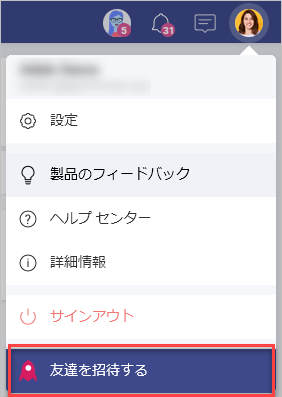
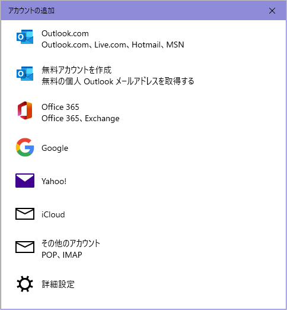

# 友達を招待する

Slingshot は、共に作業するすべてのユーザーをデータに接続し、プロジェクトやコンテンツを整理して、チームの結果を向上させるために他の人とコミュニケーションをとる手段を提供します。

アプリを使用してチーム メンバーに連絡するだけでなく、特定の組織に所属していない友人にメッセージを送信することもできます。

「友達を招待する」機能を使用すると、友達に Slingshot を紹介して、すぐにコラボレーションを開始できます。

 

## 友達を招待する方法

モバイル

1.	右上隅のプロフィール画像をクリックまたはタップします。

2.	**[友達を招待する]** をクリックします。

3.	共有ダイアログが開き、リンクの送信方法 (テキスト メーセージ、メール、アプリなど) を選択できます。

Web / デスクトップ アプリ

1.	右上隅のプロフィール画像をクリックまたはタップします。

2.	**[友達を招待する]** をクリックします。

3.	さまざまなメール クライアントのリストを含むダイアログが開きます。クライアントを選択してアカウントにログインするか、新しいアカウントを追加できます。 

 

4.	ログインすると、Slingshot へのリンクを友達に送信できるようになります。その後、友達はアカウントにログインしてページを確認できます。

5.	ページの右上隅にある **[今すぐ試す]** または **[サインイン]** ボタンをクリックし、手順に従って新しいアカウントを作成することもできます。

プライベート チャットを開始する方法の詳細については、[こちら](https://www.slingshotapp.io/ja/help/docs/chat-faq)をクリックしてください。