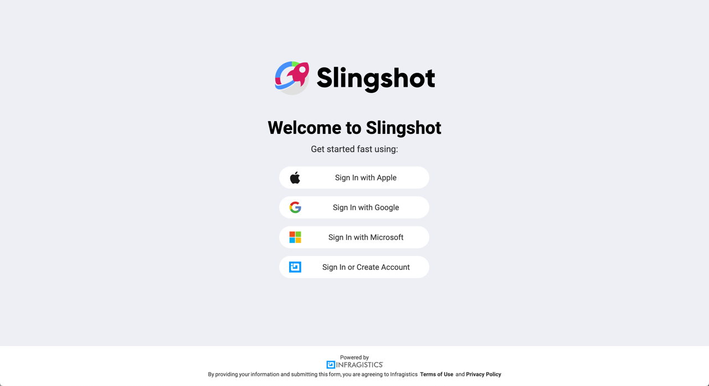
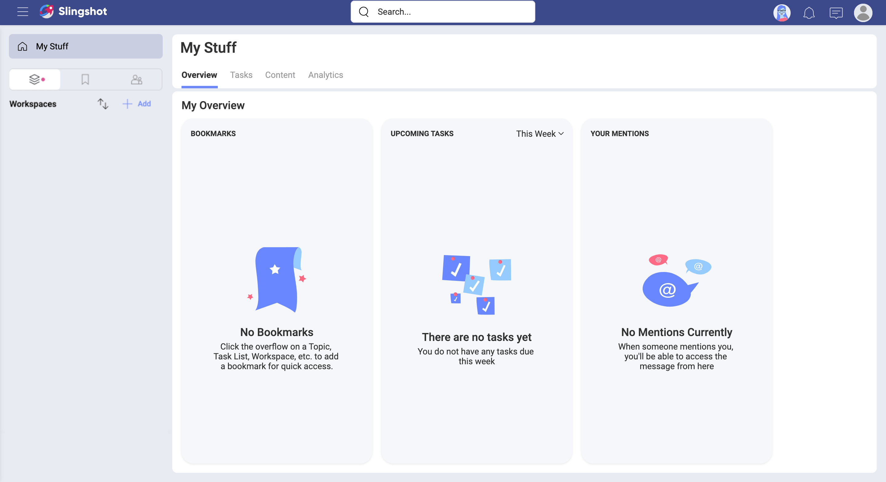
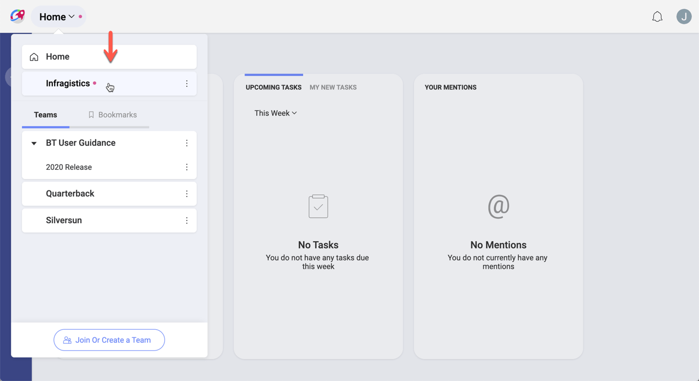
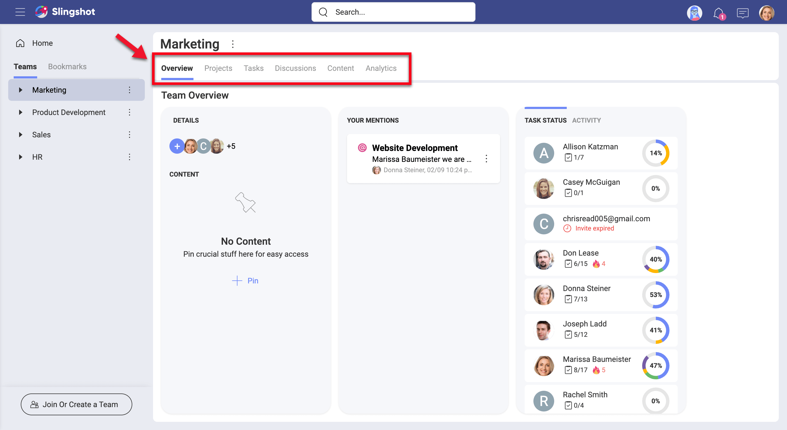

# Logging In for the First Time

Welcome to Slingshot!  
When opening the app you'll be met with different login options:

Before jumping in, take into account that in Slingshot you can join an **Organization**. If you are a member of an organization, you have to log in with your organization’s email. Choose Google (G Suite) or Microsoft (O365) as needed and you'll be associated with the organization team.

> [!NOTE]
> The organization team is useful for managers and leaders to communicate key goals, metrics, strategies, and important announcements throughout their organization. The organization team is named after your organization (e.g. your company's name).  

When you log in with Google and Microsoft, you get a cloud storage automatically configured based on your credentials, Google Drive or OneDrive respectively. This means you get access to your files on the cloud storage and can share them with other users to collaborate over them.

## Your First Screen

Once you get in, you are greeted with your first screen:

You always start in your personal space, your **Home**. Specifically, in **My Overview**, that one place where you can get a quick glance to your most important information, organize yourself, and visualize your work.

As you can see above, **My Overview** can get very busy. Let's focus on getting you familiar with Slingshot first...

## Home, Organization, Teams, and Projects

Your personal space, **Home**, is great and useful, but Slingshot is about effective collaboration while running teams and projects. So, you're probably wondering how to switch between your personal space, teams, and projects? Check out the image below:

By scrolling down you are able to navigate your teams and their projects. If you bookmarked a team or project to keep it at hand, you can select bookmarks here to find it faster. Your organization (if you have one) is also displayed here.

To **navigate to any team or project**, just click/tap over it.

Keep in mind that in Slingshot, people can be part of an organization, plus one or more teams, and also one or more projects. Projects live within teams, and you have overviews, tasks, discussions, content, and dashboards at both levels. E.g: There are team tasks and project tasks as well.  
Follow the links for further details about [teams](teams.md) or [projects](projects.md).

## Overviews, Projects, Tasks, Discussions, Content, and Dashboards

On the very left of the screen, you can find the **main navigation items**, Overviews, Projects, Tasks, Discussions, Content, Dashboards.

You probably noticed that Projects and Discussions are both missing in the image above.
It's true, not all navigation items are present in your Home, Organization, or Projects.  
So, why is that? Let's answer that question quickly...

As your Teams have Projects, only Teams have all the main navigation items. Discussions are used to chat among members of an Organization, Team or Project, so you'll find Discussions there. And finally, Overviews give you a quick status of projects, teams, or your personal work, so you'll find them there.

The image above shows a Slingshot team, so all the main navigation items are present.  
Tasks represent work to be done and Discussions are used to chat with members of your team or project. Content is about cloud storages and boards, basically you connect to cloud storages and then use boards to organize and share that content with others.
Finally, Dashboards allow you to quickly create and share data visualizations so you can turn your data into insights.  
Follow the links for further details about [overviews](overviews.md), [projects](projects.md), or [tasks](tasks.md).

## Notifications and User Settings

**Notifications** are designed to keep you updated of any changes to teams, tasks, projects, messages, and dashboards. You can learn, among others, that a task was assigned to you, that you are removed from a team, or that someone sent a message in a discussion thread you're following.

There are three different types of notifications, in-app, push, and email. This means that you can get a message that pops up while using Slingshot (in-app notification), a message that pops up on a mobile device (push notification), or even an email notification.  
Follow the link for further details about [notifications](notifications.md).

In **User Settings** you can find the General Settings, Feedback, and you can also _Sign Out_ of the application.

Then, in _Settings_ you can find General and Notifications settings. _General Settings_ include changing your name, photo, the application theme, dashboards-specific settings, and the drag and drop location.

After scrolling down to the bottom you'll see **Drag and Drop**. This setting allows you to manage the location of your uploads. But what does this mean?

Every time you reference or share a file within Slingshot, it is located in a cloud storage. When you drag and drop a file it comes outside Slingshot, so it's uploaded to the cloud storage configured here.

Use the in-app _Feedback_ screen to send us suggestions, comments, or requests about Slingshot. Here you can rate the app, add screenshots to the feedback you send, and also annotate the screenshots to provide even more detailed information.

## What about Roles & Permissions?

In Slingshot, people can join an organization, one or more teams, and also one or more projects. Roles and permissions apply only to organizations and teams.  
Roles represent a set of permissions assigned to a Slingshot user in relation to a team or an organization. This means every user is assigned a role when joining organizations or teams. There are three different roles (owner, member, viewer) with a clear set of permissions each.  
Follow the link for further details about [roles and permissions](roles-permissions.md).
