# 概要の管理

チームごとに目標や責任が異なるため、重要な情報をすばやく効率的に参照する方法が必要です。そこで概要が役立ちます。

各ワークスペースとプロジェクトには、変更可能なデフォルトの Slingshot 概要が付属しています。

**[概要]** の個人的な概要も、目標に最適に合わせてカスタマイズできます。

> [!Note]
> 概要はリンクで共有できません。

概要を整理するために使用できるウィジェットには 2 つのタイプがあります:

- [カスタム ウィジェット](custom-widgets.md): タスク、ワークスペース、またはプロジェクト ウィジェットをゼロから作成できます。

- [定義済みのウィジェット](out-of-the-box-widgets.md): 簡単にアクセスできるように 6 つのカテゴリに分類された Slingshot の事前定義済みウィジェットを使用できます。

## 概要の管理

> [!Note]
> **管理者**の権限を持つユーザーのみが、ワークスペースおよびプロジェクトの概要を変更できます。

チームがすばやくアクセスする必要があるものに応じて、概要にウィジェットを追加、編集、複製、または削除できます。

> [!Note]
> 概要は 30 分ごとに自動的に更新されます。**[更新]** ボタンをクリックまたはタップして手動で更新できます。

## ウィジェットの追加

概要にウィジェットを追加するには、次の手順を実行します:

1. **[概要]**、ワークスペース、またはプロジェクトの**概要**リストから概要を選択します。

2. 右上隅にある鉛筆アイコンをクリックまたはタップします。

3. **[+ウィジェット]** をクリックまたはタップします。

4. カスタム ウィジェットを作成するか、最も人気のある 5 つのウィジェットのいずれかを使用するか、**[ウィジェット ライブラリ]** を開くオプションが表示されます。カテゴリ別に整理されたすべてのウィジェットを表示する場合は、**[ウィジェット ライブラリ]** をクリックまたはタップできます。

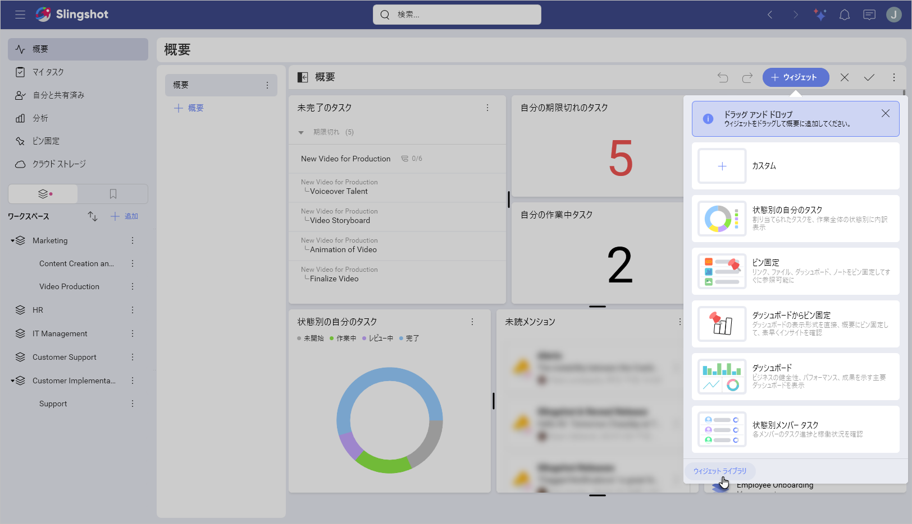

5. 概要に追加するウィジェットを選択するか、カスタム ウィジェットを作成します。

6. チェックマークをクリックまたはタップして、新しいウィジェットを含むように概要を更新します。

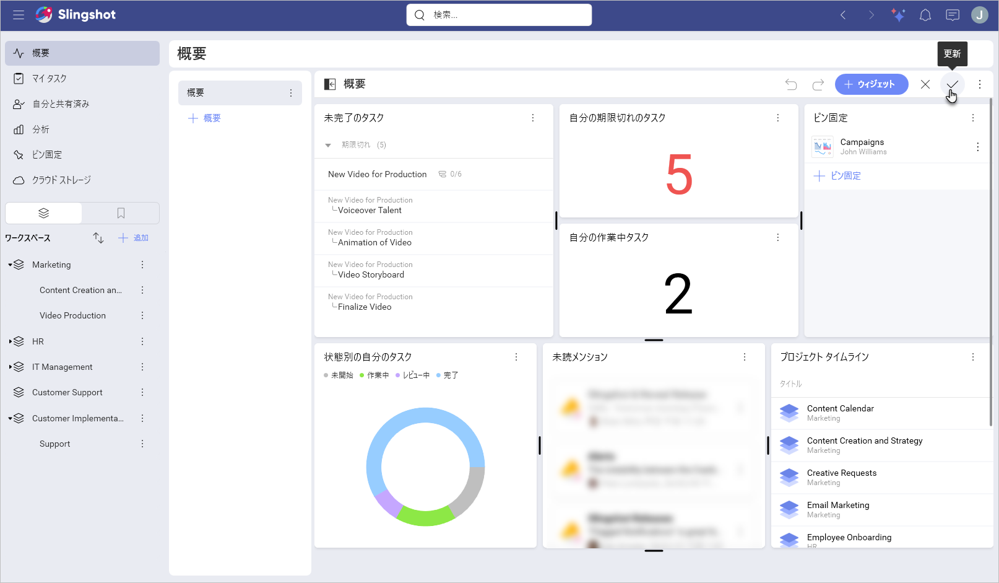

> [!Note]
> ウィジェットをドラッグまたはサイズ変更して、概要のレイアウトを整理できます。

## ウィジェットの編集

> [!Note]
> 編集するウィジェットのタイプに応じて、さまざまな設定が表示されます。

ウィジェットを編集するには、次の手順を実行します:

1. **[概要]**、ワークスペース、またはプロジェクトの**概要**リストから概要を開きます。

2. 右上隅の鉛筆アイコンをクリックまたはタップして概要を編集します。

3. ウィジェットのオーバーフロー メニューから **[編集]** を選択します。

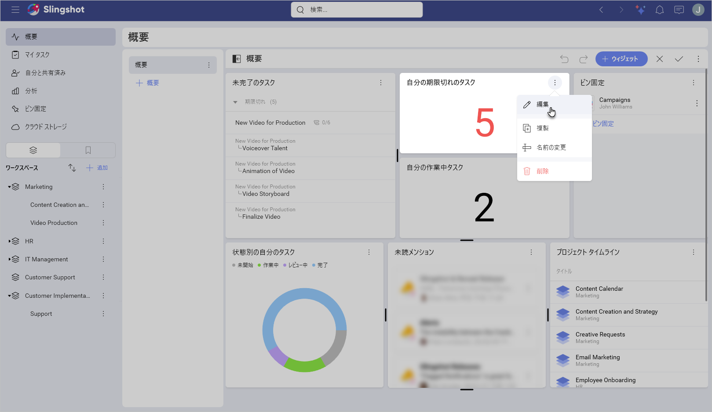

4. ウィジェットの左側に構成可能な要素が表示されます。

5. 必要な変更を行ったら、チェックマークをクリックまたはタップして変更を保存します。

6. 右上隅にあるチェックマークをクリックまたはタップして、概要を更新します。

別の方法としては以下の手順も利用できます:

1. **[概要]**、ワークスペース、またはプロジェクトの**概要**リストから概要を開きます。

2. ウィジェットのオーバーフローメニューをクリックまたはタップします。

3. **[編集]** を選択します。

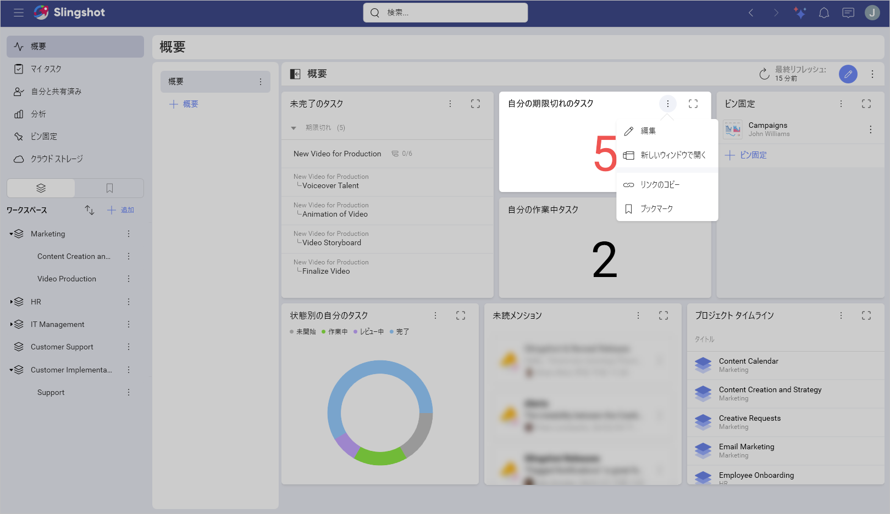

4. 必要な変更を行います。

5. チェックマーク アイコンをクリックまたはタップして変更を保存します。

> [!Note]
> **ピン固定**、**ダッシュボードからのピン固定**、**ブックマーク**、および**未読メンション**は編集できません。

## ウィジェットの複製

ウィジェットを複製するには、上記の手順に従い、**[編集]** の代わりに **[複製]** を選択します:

1. **[概要]**、ワークスペース、またはプロジェクトの**概要**リストから概要を開きます。

2. ウィジェットのオーバーフローメニューをクリックまたはタップします。

3. **[複製]** を選択します。

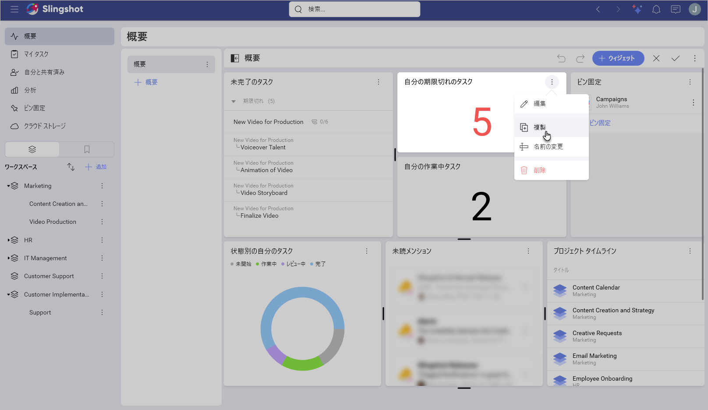

4. ウィジェットを複製したら、編集できます。

5. 右上隅にあるチェックマークをクリックまたはタップして、概要を更新します。

> [!Note]
> **ピン固定**、**ダッシュボードからのピン固定**、**ブックマーク**、**未読メンション**および**お気に入りのダッシュボード**は複製できません。

## ウィジェットの削除

ウィジェットを削除する手順は、上記の手順と同じです。ここでは、**[複製]** を選択する代わりに、**[削除]** を選択する必要があります。

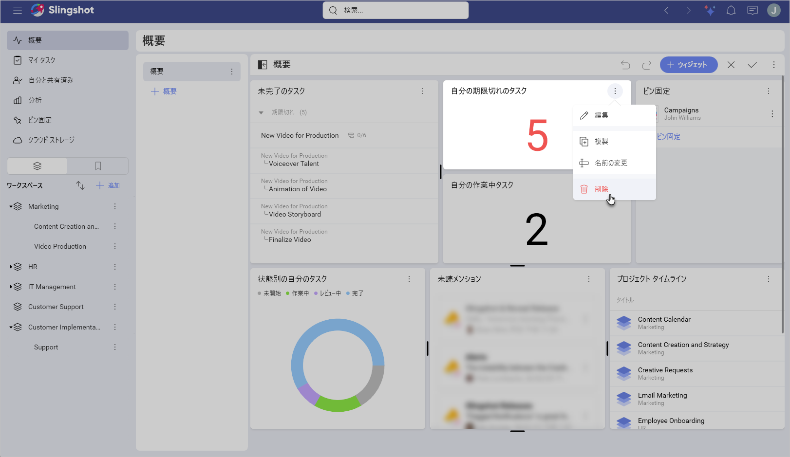

## タスクのフィルタリング

タスク ウィジェットのデータをフィルタリングするには、次の手順を実行します:

1. タスク ウィジェットの拡大ボタンをクリックまたはタップして、最大化モードで表示します。

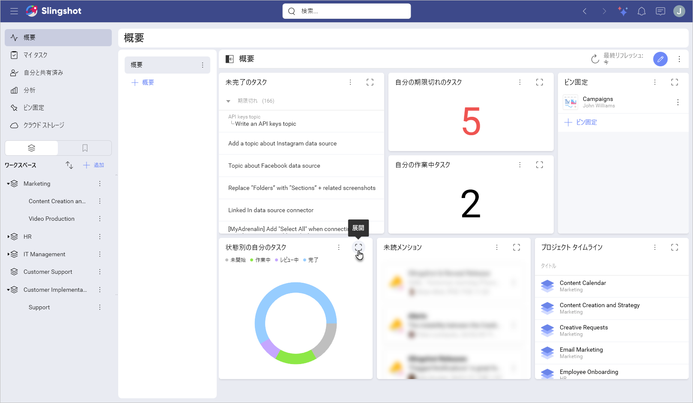

2. **[表示]** の横にあるフィルター ボタンをクリックまたはタップします。

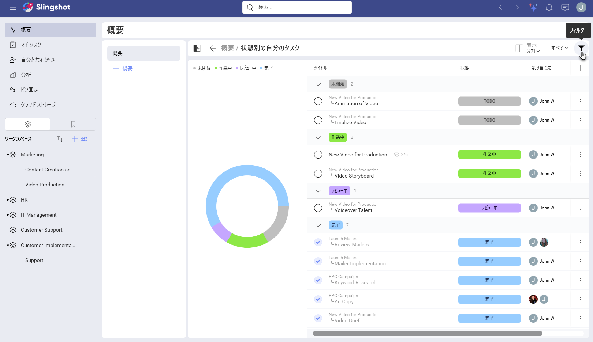

3. フィルター値を選択します。

4. **[適用]** を選択して変更を保存します。

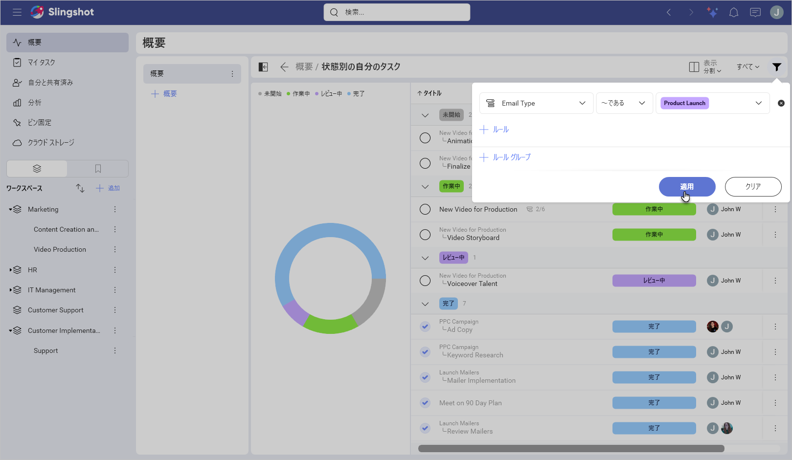

> [!Note]
> **タイムライン**または**カレンダー**表示形式を使用するタスクをフィルタリングするオプションはありません。

## タスク ウィジェットの表示

概要内のタスクをより適切に整理するために、**[チャート]**、**[分割]**、**[テーブル]** の 3 つのタスク表示から選択できます。

次の手順を実行すると、いつでもタスク表示を変更できます:

1. タスク ウィジェットの拡大ボタンをクリックまたはタップして、最大化モードで表示します。

2. **[表示]** のドロップダウン メニューを開きます。

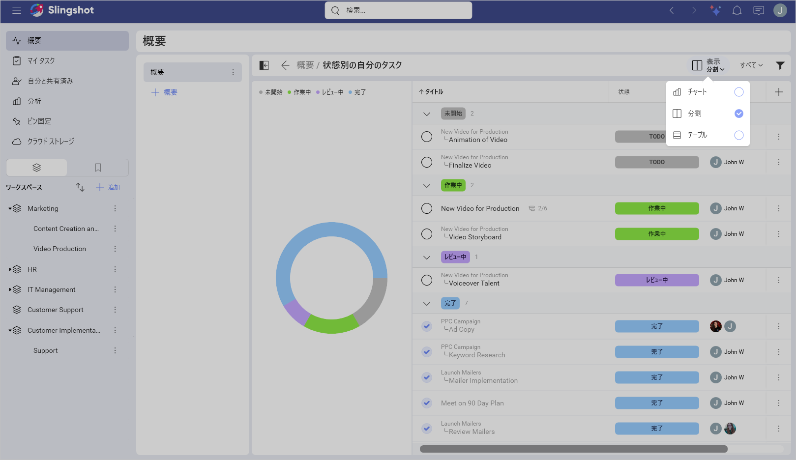

3. 別の表示を選択します。

4. 新しいタスク表示は自動的に保存されます。最大化モードでウィジェットを再度開くと、新しいタスク表示が表示されます。

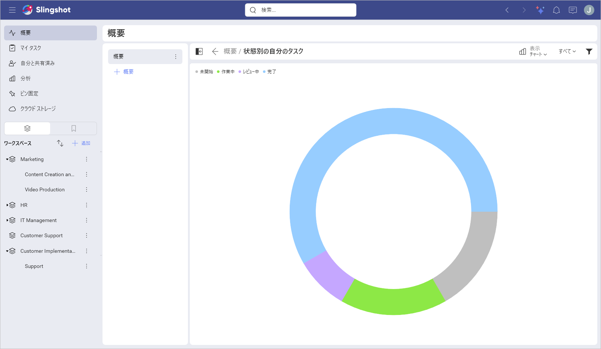

> [!Note]
> **リスト**、**タイムライン**、および **カレンダー**表示形式タイプには、タスク表示を変更するオプションはありません。
