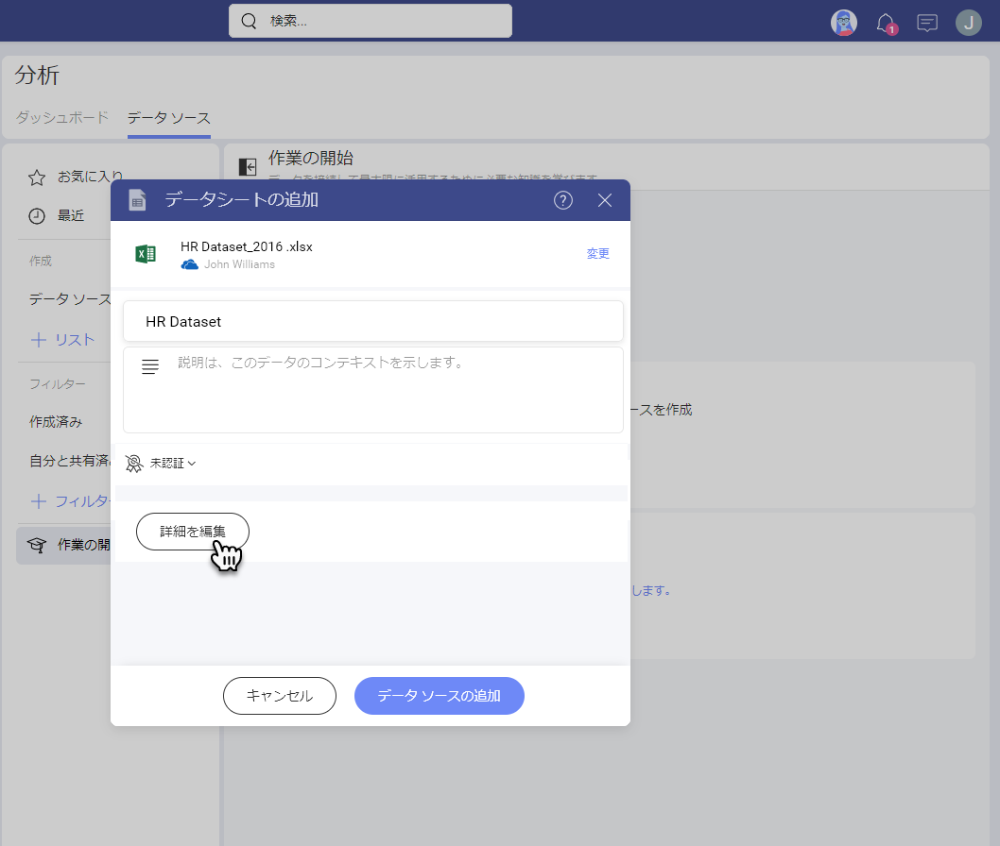
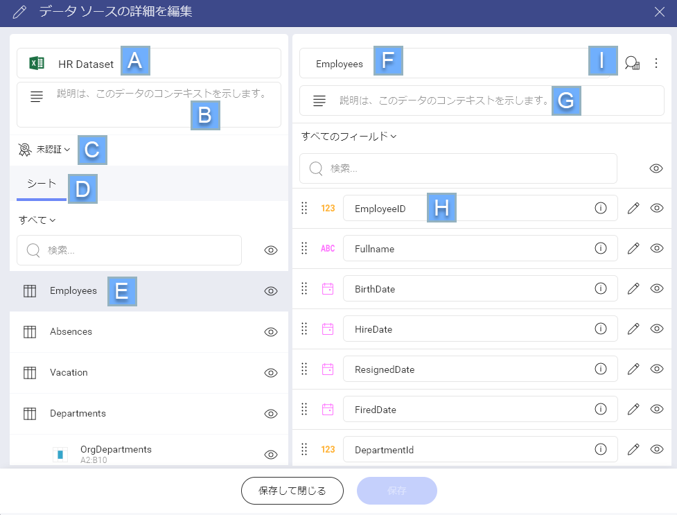
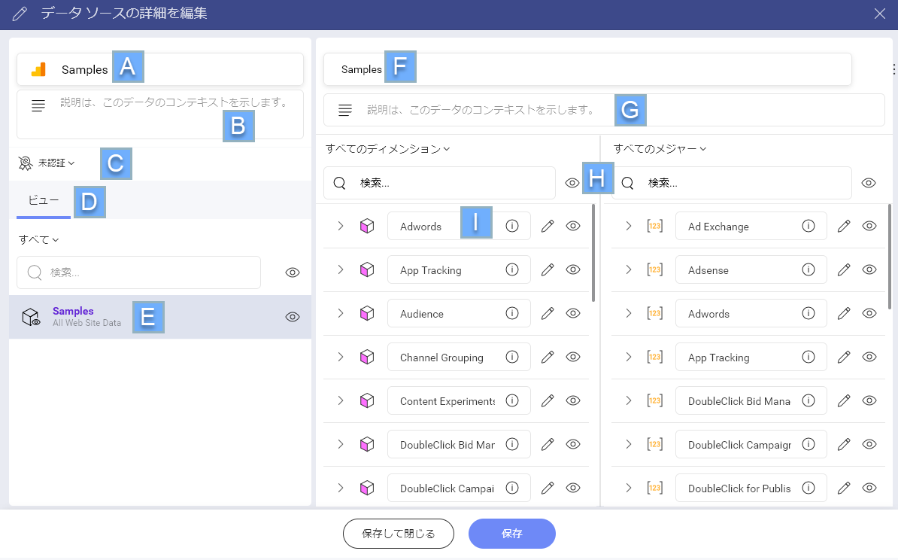
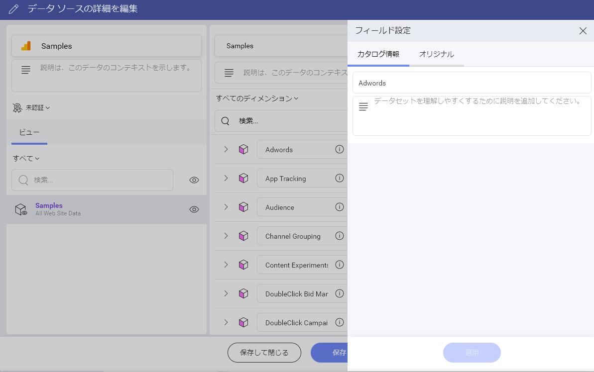
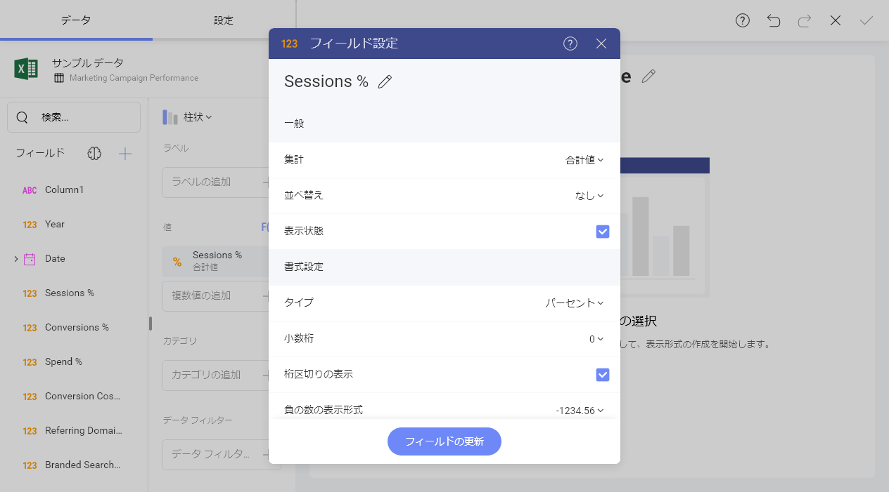

# データ ソースの詳細情報

Slingshot の詳細データ ソース エディター は、大規模なデータセットを使用した作業を改善します。**メタデータ**は、含まれるデータセット、データ フィールドのタイプと説明、最終更新日などのデータ ソースに関する情報です。

詳細エディターを使用すると、データ ソースを整理して、次のことができるようになります。

- 関連のないデータセットを非表示にすることで、表示形式に必要なデータをすばやく見つけることができます。

- データ フィールドの説明を編集または追加して、データを判別しやすくします。

- データ フィールドのデフォルト タイプを変更することにより、繰り返し操作を自動化したり、混乱を避けることができます。

以下は、データ ソースのメタデータを編集できるユーザーとその方法です。

>[!NOTE] データ ソースのタイプまたは[認証](certifications.md)に関連する[制限](#advanced-editing-limitations)のため、編集できないデータ ソースがあります。

## 詳細エディターにアクセスする方法

データ ソースの詳細エディターにアクセスするには、 データ ソース リストにある既存のデータ ソースを編集するか、新しいデータ ソースを追加します。

新しいデータ ソースを追加完了する直前に、[詳細を編集] ボタンを選択して詳細エディターにアクセスできます (以下を参照)。

 [データ ソース] リストにすでに追加されているデータ ソースの詳細エディターを開くには、以下の手順に従います。

1. データ ソースの隣の  オーバーフロー メニューを選択します。
2. ドロップダウンから  [詳細を編集] を選択します。

詳細エディターに進む前に、選択したデータセットのユーザー名とパスワードの入力が必要になる場合があります。

## 詳細エディターを使用できるユーザー

ワークスペースおよび組織でデータ ソースの詳細エディターを使用できるユーザーについては、以下の表を参照してください。 

|            |  組織内 |  ワークスペース内 |
| :----------: | :----------------------------------------------------------------------------------------------------------------------: | :----------------------------------------------------------------------------------------------------------------------------: |
| **管理者**  | :white_check_mark:                                                                                                     | :white_check_mark:                                                                                                           |
| **メンバー** | :x:                                                                                                                    | :white_check_mark:                                                                                                           |
| **閲覧者** | :x:                                                                                                                    | :x:                                                                                                                          |

この表は、管理者が詳細エディターを使用して、組織とワークスペースの両方でデータ ソースを変更できることを示しています。閲覧者にはデータ ソースを変更するアクセス許可がないため、詳細エディターにアクセスできません。

Slingshot のユーザー ロールの詳細情報については[ロールとアクセス許可](~/docs/security#ロールとアクセス許可)トピックを参照してください。

### 認証済みデータ ソースの詳細エディターを使用できるユーザー

データ ソースの右側の [認証済み] 列は、データ ソースが認証されているかどうかを示します。認定されたデータ ソースには、3 つのバッジ、金、銀、または 銅のいずれかが表示されます。取り消し線が付いたバッジ は、データ ソースが認証されていないことを意味します。

**認証者のみ**が詳細エディターを使用し、認証済みデータ ソースを変更できます。認証のデフォルト階層は、金 > 銀 > 銅です。つまり、ゴールド認証者はすべての認証済みデータ ソースを変更でき、銅の認証者は銅認証済みのデータ ソースのみを変更できます。

>[!NOTE] 右側に [認証済み] 列が表示されない場合は、データ ソースリストの上にあるプラス アイコン  を選択します。[認証済み] の隣のボックスがチェックされていることを確認してください。

## 詳細エディターの使用

詳細エディターを開くと、多くの要素を変更でき、情報を追加、表示、または非表示にできます。詳細エディターは、テーブル データ ソースとキューブ (多次元) のデータ ソースで異なります。そのため、それぞれについて個別に説明します。

### テーブル データの詳細エディター

Slingshot データ ソースのほとんどはテーブル データを含んでいます。詳細エディターを詳しく見てみましょう。

>[!NOTE] このスクリーンショットは、詳細エディターのすべての要素を含む例です。

A. データ ソースの**アイコン**および**タイトル**。データ ソースの名前を変更できます。

B. **説明**ボックス。ここにテキストを追加すると、データ ソース リストのデータ ソースの下に表示されます。

C. [**認証**](certifications.md)状態。バッジ アイコンは、データ ソースが認証されているかどうかを示します。認証者の場合、アイコンを選択して認証状態を変更できます。

D. データ ソースの**データセット タイプ**。たとえば、シート、ビュー、ストアドプ ロシージャ、データベース、エンティティなどです。オブジェクトを切り替えることができます。

E. 編集可能な**データセットのリスト**。データセットを選択して表示されるフィールドを変更できます。

F. データセットの**タイトル**。データセットの名前を変更できます。

G. データセットの**説明**。説明は、データ ソースの詳細でデータセットの名前の下に表示されます。説明は、表示するデータセットを判別するのに役立ちます。

H. 選択したデータセットで使用可能なすべての**データ フィールド**。 情報アイコンにカーソルを合わせると、フィールド名、説明、最初の 5 行のレコード、元の名前と説明が表示されます。各フィールドの情報を変更できます。詳細については、以下をお読みください。各フィールドの隣にある点線の領域をドラッグして、フィールドの順序を変更できます。

I. データ テーブルの **プレビュー**。プレビューはデータ テーブルの最初の 15 行を示します。プレビューには 2 つのタブがあります。
    
* カタログ情報 - データ テーブルのプレビューを最新の状態で表示します。
* オリジナル – 詳細エディターで変更を行う前の元のデータ テーブルを表示します。

### データ キューブの詳細エディター

データ キューブを含むデータ ソースは以下のとおりです。

- [Azure SSAS](analytics/datasources/supported-data-sources/microsoft-azure-analysis-services.md)
- [Microsoft Analysis Services](analytics/datasources/supported-data-sources/microsoft-analysis-services.md) 
- [Google 広告](analytics/datasources/supported-data-sources/google-ads.md)
- [Google アナリティクス](analytics/datasources/supported-data-sources/google-analytics.md)

テーブル データ ソースとは異なり、データ キューブを使用すると、データを複数のディメンションでモデル化して表示できます。これには、データ キューブの詳細エディターの構成にいくつかの違いがあります。

以下は Google アナリティクスデータ ソースの詳細エディターを示すスクリーンショットです。

A. データ ソースの**アイコン**および**タイトル**。データ ソースの名前を変更できます。

B. **説明**ボックス。ここにテキストを追加すると、データ ソース リストのデータ ソースの下に表示されます。

C. [**認証**](certifications.md)状態。バッジ アイコンは、データ ソースが認証されているかどうかを示します。認証者の場合、アイコンを選択して認証状態を変更できます。

D. データ ソースの**データ キューブ タイプ**。たとえば、シート、ビュー、ストアドプ ロシージャ、データベース、エンティティなどです。オブジェクトを切り替えることができます。

E. **データ キューブのリスト**。キューブを選択して、含まれるデータを表示および変更します。

F. データ キューブの**タイトル**。データ キューブの名前を変更できます。

G. データ キューブの**説明**。説明は、データ ソースの詳細でデータ キューブの名前の下に表示されます。説明は、表示するデータキューブを判別するのに役立ちます。

H. ディメンションとメジャーは、ナビゲーションを簡単にするために **2 つのデータ列**に分かれています。

I. 選択したデータ キューブで使用可能なすべての**データ**。すべてのディメンション、メジャー、およびディメンション/メジャー内の各要素の情報を表示および変更できます。  情報アイコンにホバーすると、「要素の一意の名前」とディメンション / メジャーの説明が表示されます。この情報は変更できます。要素を並べ替えることはできません。

**データ プレビューはキューブでは使用できません**。

>[!NOTE] **Google アナリティクスのデータ ソースの詳細**。ディメンション内の階層は表示されません。要素は詳細エディターで個別に表示されます。「要素の一意の名前」は使用できません。要素の説明は、Google アナリティクスのデフォルトの説明です。

### 詳細エディターでデータを非表示にする方法

非表示機能は、大量のデータを扱うチームに非常に便利です。例えばデータが何百ものスプレッドシートに分散しているとして、通常はその内2 つのスプレッドシートのみを表示する場合、毎回その2つを探し回るのは大変です。 Excel ファイル中の不要なシートを非表示にすることで、チームの生産性を向上させることができます。

詳細エディターで非表示にできる項目:

- データ テーブル全体およびデータ キューブ。
- テキストや数値フィールド、ディメンション、メジャーなどの個々のデータ要素。

データ要素の隣に目のアイコンが表示されている場合、アイコンを選択して非表示にできます。閉じた目が表示されている場合、要素はすでに非表示になっています。 

### 詳細エディターでデータを編集する方法

データ フィールドまたはディメンションまたはメジャー要素の隣にある  鉛筆アイコンを選択します。右側のフィールド設定が開きます。

[カタログ情報] タブで、データ フィールドの名前と説明を変更できます。[オリジナル] タブに切り替えて、詳細エディターで変更を行う前にフィールドの名前と説明を確認します。

>[!NOTE] データ フィールドは、元の名前と現在の名前の両方で検索できます。

変更された情報を含むデータ テーブル、キューブ、およびフィールドは<b>紫色</b>になります。

### 数値データのデフォルト書式設定を変更する方法

数値データの隣にある  鉛筆のアイコンを選択し、デフォルトの書式を値から通貨またはパーセントにすばやく変更します。小数桁数を変更して桁区切りを適用することもできます。

書式設定を変更した後、数値データを含むデータ テーブルまたはデータ キューブは<b>紫色</b>になります。

数値フィールドの前のアイコンも通貨記号またはパーセント記号に変更されます。この変更は表示形式エディターでも表示されます (以下を参照)。

必要に応じて、**表示形式エディター**でフィールドを使用するときに、フィールドのデフォルト書式設定を再度変更できます。これを行うには、フィールドを**値**プレースホルダーにドラッグし、クリック / タップして**フィールド設定**ダイアログを開きます (以下を参照)。

書式設定を変更するには、[オーバーライド] トグルを選択します。

>[!NOTE] データ ソースが認証されている場合、認証者のみが数値データのデフォルトの書式設定を変更および上書きできます。