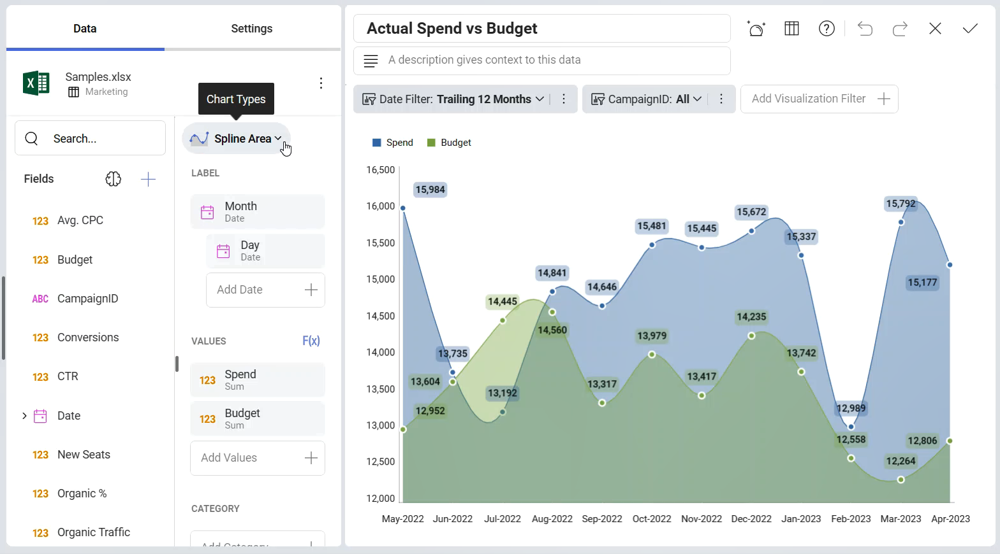
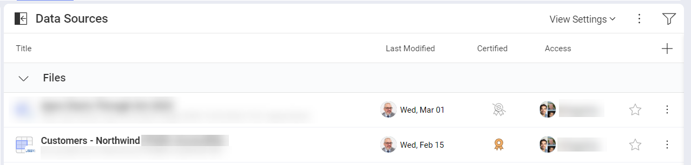
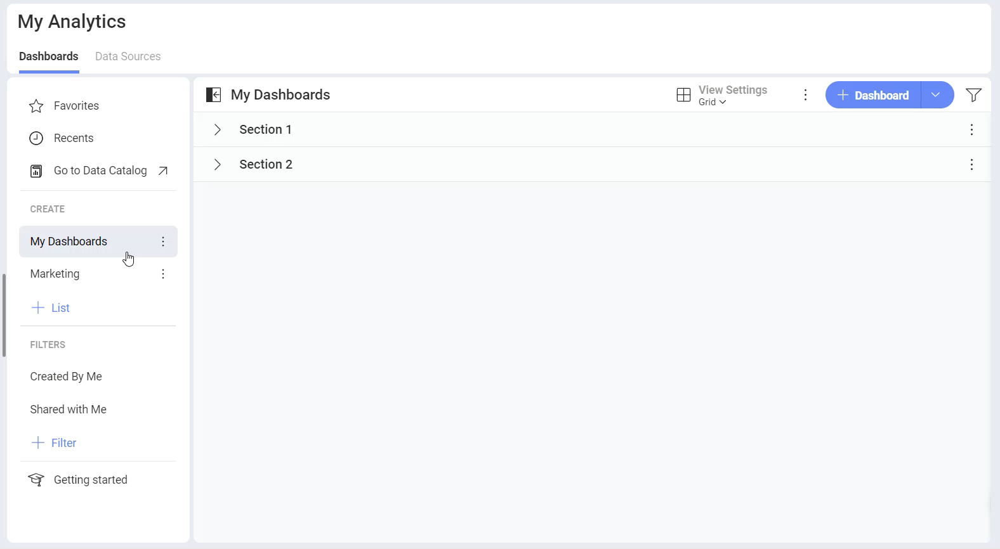
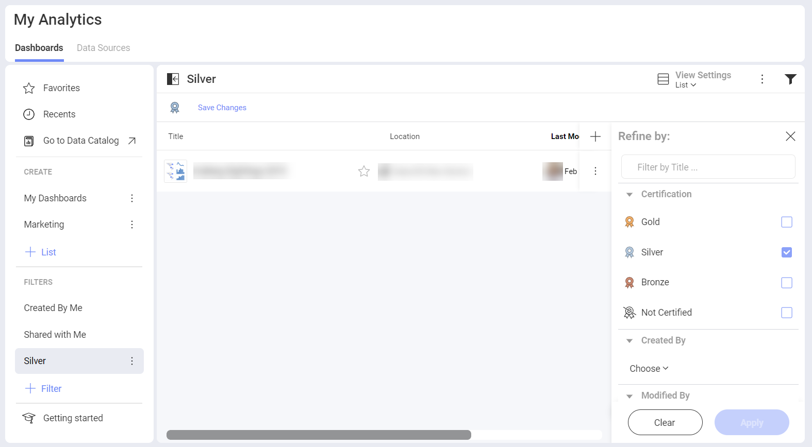

# 分析

With the *My Analytics* section of Slingshot, you can bring the power of BI (business intelligence) into your daily workflow while helping your team make faster data-driven decisions.

## [分析] の内容

データ主導の意思決定を行うために、Slingshot は次の機能を備えています:

- **ダッシュボード** – ダッシュボードを作成または共有して、チームがデータを活用し、生産性を向上できるようにします。Bring multiple data sources into one dashboard to ensure that you have all the information in one place.
- **Data Sources** - Connect directly to wherever your data comes from, including content managers, cloud services, CRMs, databases, spreadsheets, and more.
- **Data Catalog** - Find the most trustful information about your company in the list of data catalogs. The data is categorized and certified. 

>[!Note] Data Catalogs are available only to *[Enterprise](https://www.slingshotapp.io/en/help/docs/slingshot-enterprise-subscription)* users.

データ ソースは表示形式を構成し、表示形式はダッシュボードを構成します。In other words, your data comes from a data source, a visualization connects to that data source and displays the information. In order to increase productivity, dashboards include a collection of visualizations that have different pieces of related information.

## ダッシュボード

直感的なドラッグ＆ドロップ インターフェイスを備えた Slingshot は、数分でダッシュボードを簡単に作成できます。40 以上の異なる表示形式から選択して、データを提示し、ストーリーを最良の方法で伝えます。

### カスタマイズ

データの並べ替え、フィルター、集計も思い通りにできます! Each chart type provides you with different settings to design your visualizations the way you want them to appear.

[Read more about the different chart types here!](https://www.slingshotapp.io/en/help/docs/analytics/data-visualizations/overview)

### インタラクション

Once your dashboard is created, interact with your visualizations with the drill-up/down support. 

### Share

ダッシュボードを他の人と共有し、それらを介して共同作業します。 Different levels of permission types allow you to choose how to share the dashboards and what the access to them can be.

[Read more about dashboards here!](dashboards/overview)

## データ ソース

人気のあるデータ ソースへ、特別なサーバー設定なしで接続できます。 Get real-time insights by connecting directly to *SharePoint Online*, *Google Drive*, *OneDrive*, *Microsoft Analysis Services*, *Microsoft SQL Server*, *CRM*, and many more. 

[Click here for a full list of connectors!](datasources/overview)

### 接続

To connect right to your data source and build your visualizations, you can follow these steps:

1. Click/tap on the **+ Dashboard** or **Create Dashboard** (Getting started section) blue button.
2. 接続するデータ ソースを選択します。
3. 接続を構成します。これには、ファイルの場所 (スプレッドシートまたは JSON ファイル) の選択や、資格情報 (データ ストレージ、Web リソース、ソーシャル メディア コネクター、データベース) の入力が含まれる場合があります。

[Read more about data sources here!](datasources/overview)

## データ カタログ

Your organization’s data catalog makes it easier for users to quickly find the insights they are searching for. With this feature, *Enterprise* users can access an extensive catalog of dashboards and data sources. 

認証は、組織内で最も信頼できるデータを見つけるのに役立つため、データ カタログの重要な部分です。これは、どのダッシュボードまたはデータ ソースが信頼でき、検証済みの情報が含まれているかを知るための優れた方法です。ダッシュボードまたはデータ ソースが認証されると、その横に金、銀、または銅のバッジが表示されます。

[Read more about data catalog here!](../data-catalog.md)

## Lists

ダッシュボードとデータ ソースの複数のリストを管理できます。これらのリストは、これらのリソースを整理、管理、および共有するようにデザインされています。
[ダッシュボード] タブと [データ ソース] タブには、セクションごとに整理できるリストがあります。Sections are useful to add divisions and to better layout your content.

### 定義済みのリスト

By default, you start with the following lists - *My Dashboards* and *My Data Sources*, but you can create more lists and easily reorganize and move them just by dragging them. 

## Filters

Using filters allows you to view a set of dashboards or data sources that meet certain criteria. There are also filters out-of-the-box that you can save for future re-use.

### 定義済みのフィルター

Slingshot には、特定のダッシュボードまたはデータ ソースをすばやく見つけるのに非常に役立ついくつかの事前定義されたフィルターが含まれています。

編集または削除できないこれらの定義済みフィルターは次のとおりです:
- **作成済み** – Slingshot 内で自分が作成した各ダッシュボードまたはデータ ソース。

- **自分と共有済み** – 別の Slingshot ユーザーによって共有された各ダッシュボードまたはデータ ソース。

### フィルターの作成

To access the Filters editor, just click/tap the **+ Filter** icon in the *FILTERS* section.

To stop filtering dashboards or data sources, you can:

1. Click/tap on the filter icon to open the *Filters* dialog. 
2. Select the **Clear** button at the bottom to remove the current filters.
3. Click/tap on **Apply** to save your changes.

### フィルターの保存

Sometimes you might want to save a filter in order to use it again in the future. With Slingshot, you can save specific filters and later edit them, if needed. These filters can help keep at hand a list of dashboards or data sources that are relevant to you.