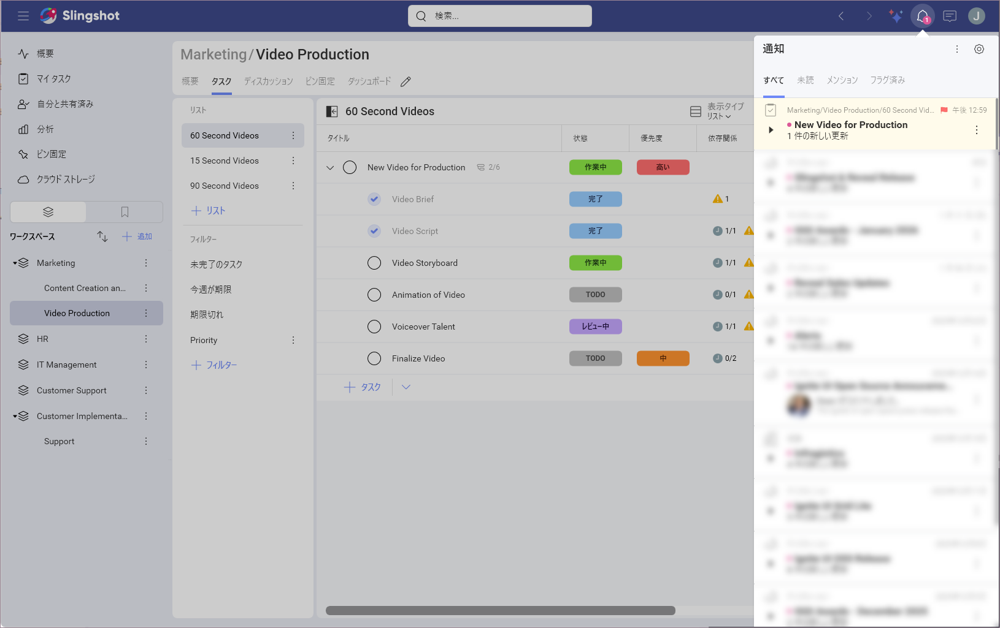
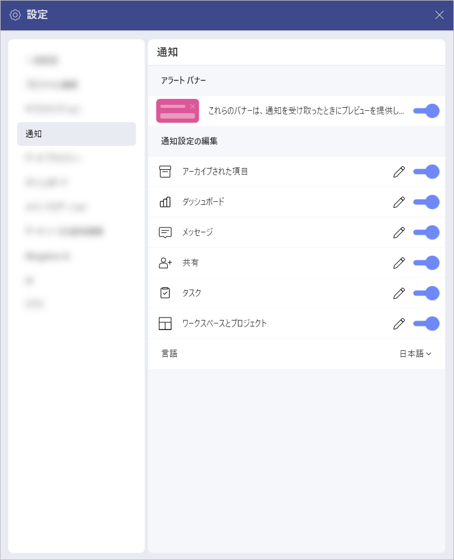
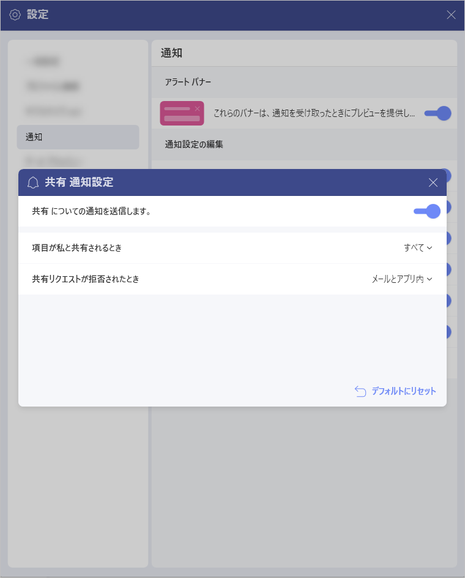
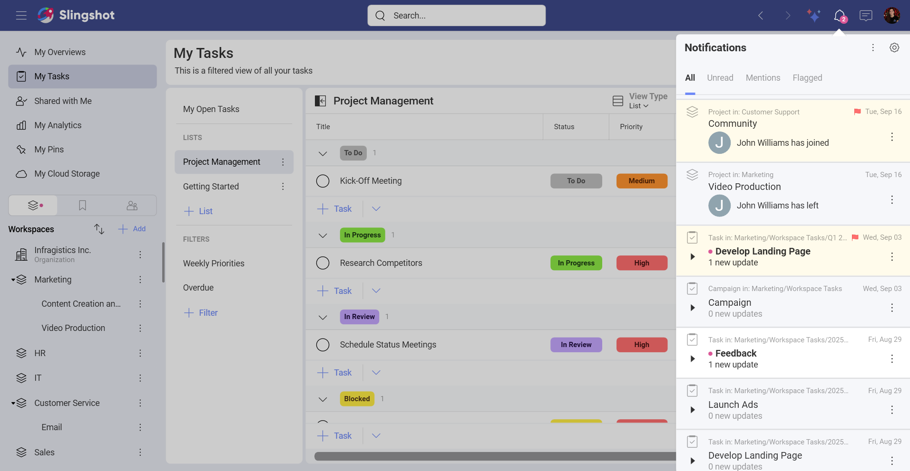

# 通知

通知により、Slingshot で見逃しを無くし、注意が必要なことを常に把握できます。

## 通知のタイプ

通知は次の 3 つの形式で提供されます:

- **アプリ内**: 右上にある [通知] パネル (ベルのアイコン) のアプリ内に表示される通知。

- **プッシュ**: これらの通知は、アプリを使用していないときに表示されるクリック可能なポップアップ メッセージです。「バナー」通知とも呼ばれ、モバイル デバイスまたはデスクトップ画面に表示されます。

- **メール**: アカウントに関連付けられたメール アドレスに配信される通知。

## 通知のカスタマイズ化

Slingshot で通知を受け取る対象を簡単に変更できるため、自分にとって最も重要なものについてのみアラートを受け取ることができます。設定に移動してから [通知] タブに移動すると、受信する通知を編集できます。または、**[通知]** パネルのオーバーフロー メニューを使用することもできます。

[通知] パネルで、鉛筆アイコンを選択して各カテゴリの詳細を表示するか、カテゴリ全体のオン / オフを切り替えます。

さらに、一番下にある [デフォルトにリセット] オプションを使用して、デフォルト設定を復元できます。

## [通知] パネルの使用

ここでは、ワークスペース、タスク、メッセージ、メンション、および分析ダッシュボードに関する最新情報を確認できます。これにより、ワークスペースから削除されたとき、フォローしているディスカッション スレッドで誰かがメッセージを送信したとき、自分に割り当てられたタスクがあるときなど、最新の状態に保つことができます。

>[!Note] タスクに割り当てられているユーザー、タスクでメンションされているユーザー、またはタスクにコメントしたユーザーのみが、そのタスクのチャット アクティビティの更新を受け取ります。ユーザーがタスクを作成したが、上記のいずれかの方法でタスクに参加していない場合、通知は受け取りません。

右上隅のベル アイコンをクリックすると、[通知] パネルにアクセスできます。

通知パネルでは、すべての通知、**未読**の通知のみ、@メンション、または**フラグ付き**の通知を表示することを選択できます。

<!--  -->

>[!Note] 通知にはフラグを設定し、未読としてマークすることの両方が可能です。その場合、通知は**未読**通知および**フラグ付き**通知の両方に表示されます。