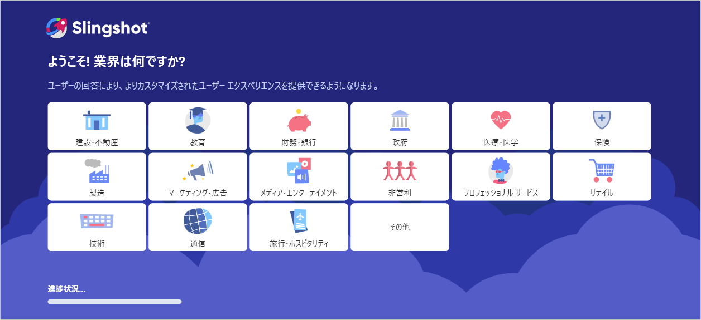
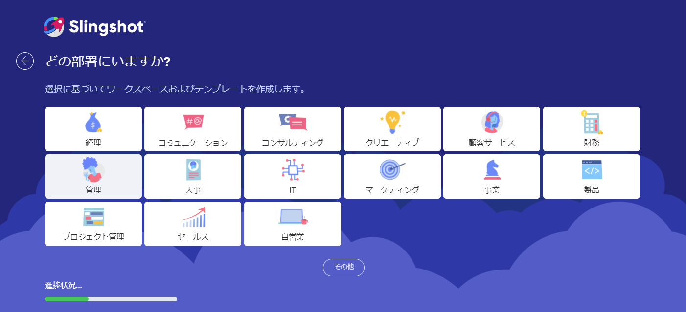

# オンボーディング

新しいアプリを初めて使用するときは、慣れるまでに時間がかかります。これを回避するために、Slingshot に新しいオンボーディング プロセスを実装しました。

## オンボーディング プロセスの構成 

オンボーディング プロセス中に、Slingshot で設定するために業界、部門、テンプレートを選択できます。

アカウントに初めてログインすると、以下のダイアログが表示されます。

1. 業界を選択できるダイアログ。オプションに表示されない場合は、**[その他]** を選択して手動で追加できます。

 

2. 次のダイアログで部署を選択できます。リストにない場合は、**[その他]** を選択して手動で追加できます。

 

3. 部門を指定すると、すぐに使えるテンプレートのリストが表示されます。作業スペースの設定に役立つテンプレートを選択できます。 

 

 >[!NOTE] たとえばチャット経由で Slingshot に招待された場合は、自分の業界と部門のみを選択できます。

4. オンボーディング プロセスが完了すると、ワークスペース内のプロジェクトに移動して、より迅速に開始できるようになります。

 

Slingshot が提供するすべての機能の詳細については、[こちら](https://www.slingshotapp.io/ja/learning-center)を参照してください。