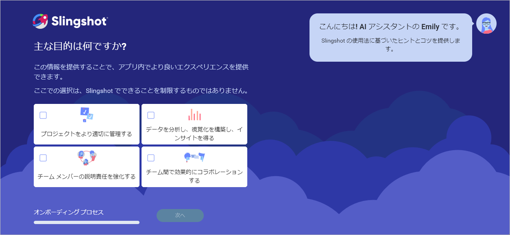
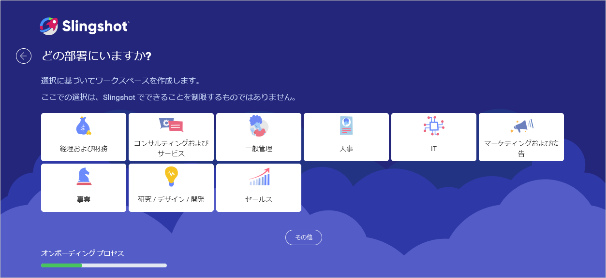
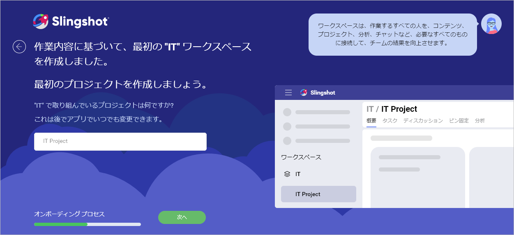
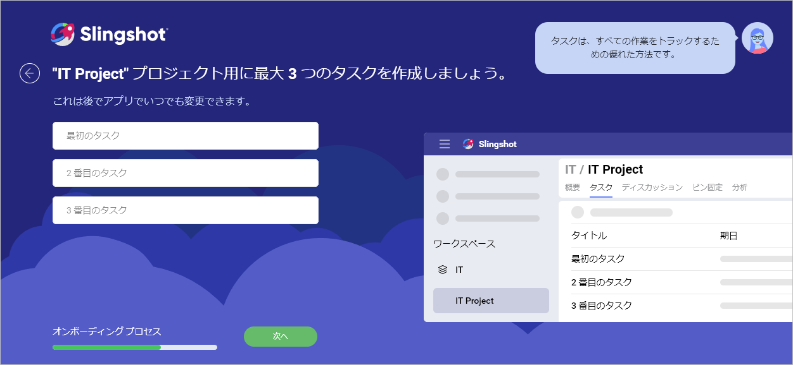
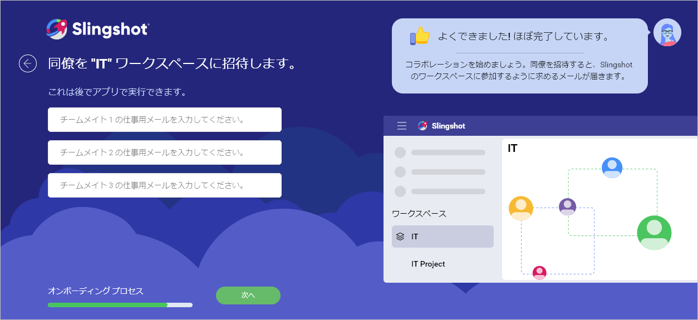
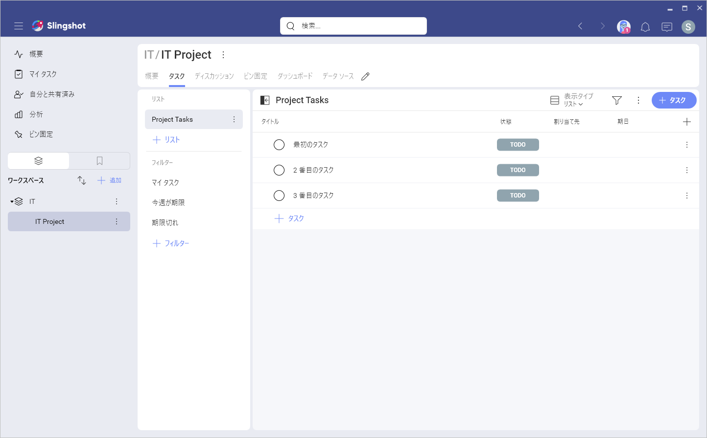

# オンボーディング

新しいアプリを初めて使用するときは、慣れるまでに時間がかかります。これを回避するために、Slingshot に新しいオンボーディング プロセスを実装しました。

## オンボーディング プロセスの構成 

オンボーディング プロセスでは、最初のワークスペース、プロジェクト、タスクなどを設定し、さらにチーム メンバーを Slingshot に招待することもできます。

アカウントに初めてログインすると、以下のダイアログが表示されます。

1. 主な目的を選択できるダイアログ。必要な数だけ選択できます。

 

2. 設定が完了したら、業種を選択できます。オプションにない場合は、**[その他]** をクリックして手動で追加します。

 

3. 次のダイアログで部署を選択できます。リストにない場合は、**[その他]** をクリックして手動で追加できます。

 

4. 部署を選択したら、最初のプロジェクトを作成できます。

 

5.	以前の選択によっては、プロジェクトにタスクを追加できるダイアログが表示される場合があります。後でいつでも変更できます。  

 

 >[!NOTE]「**データを分析し**、**視覚化を構築し**、**インサイトを得る**」を目的として選択した場合、このダイアログは表示されません。

6.	チームのないワークスペースは実際的なワークスペースではないため、チーム メンバーを Slingshot に招待できます。後の段階で行う場合は、**[次へ]** をクリックします。

 

7. オンボーディング プロセスが完了したら、作成したプロジェクトの[ダッシュボード](https://www.slingshotapp.io/jp/help/docs/analytics/dashboards/overview) セクションまたは[タスク](https://www.slingshotapp.io/jp/help/docs/tasks)に進みます。

  

Slingshot が提供するすべての機能の詳細については、[こちら](https://www.slingshotapp.io/learning-center)を参照してください。