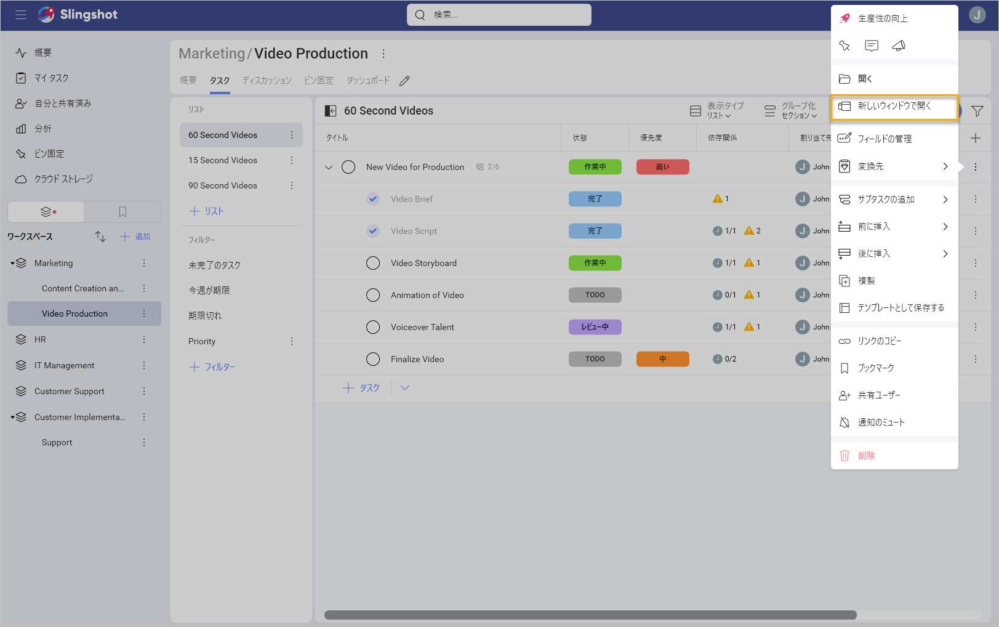
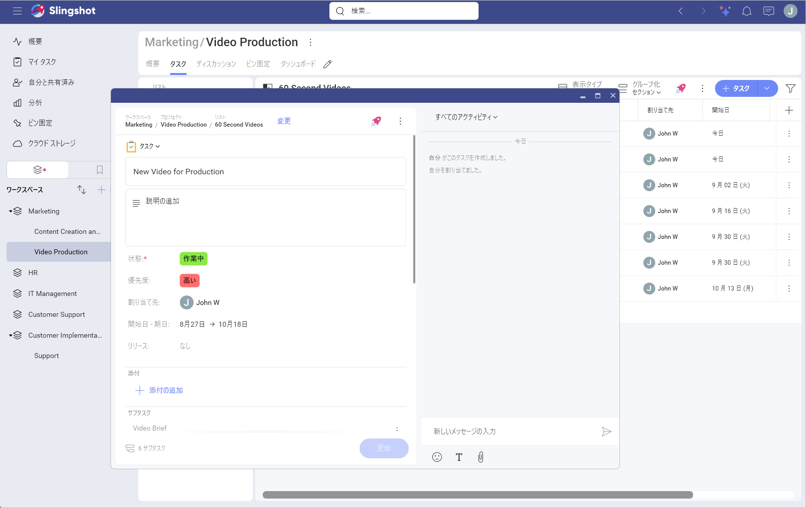

# 新しいウィンドウで開く

生産性を向上し時間を節約するために、ダッシュボード、ワークスペース、プロジェクトからタスク、ディスカッション、ブックマークなどのさまざまな項目を、新しいウィンドウ (同じモニターまたは別のウィンドウ) で開くことができます。 

項目を新しいウィンドウで開くには、その項目の隣のオーバーフロー メニューを開き、**[新しいウィンドウで開く]** を選択します。

>[!Note] 
>この機能は、デスクトップ、Mac、iPad、および iPhone でサポートされていることに注意してください。

以下の例では、ダッシュボード リストを新しいウィンドウで開き、ウィンドウのサイズを変更します。デジタル ワークスペースを整理するために、項目の新しいウィンドウのサイズをいつでも変更できます。

