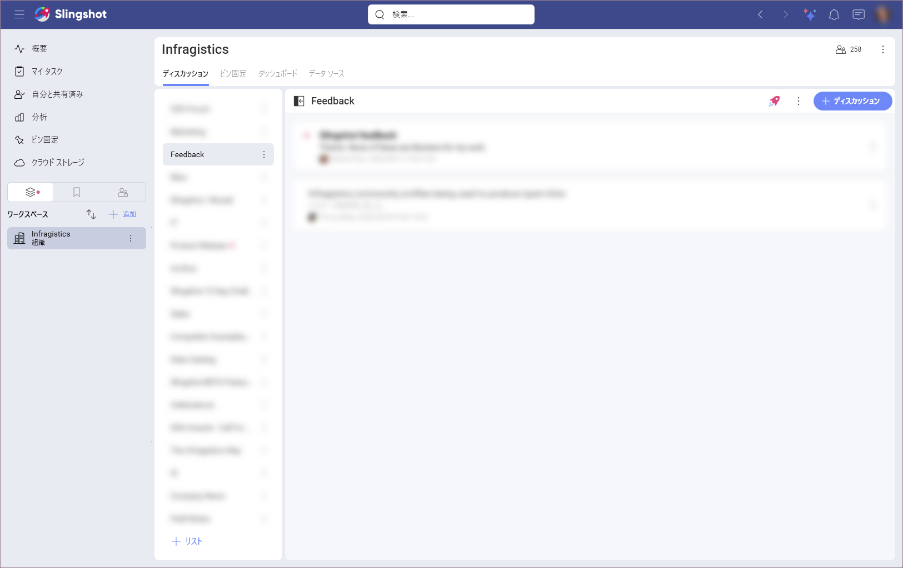
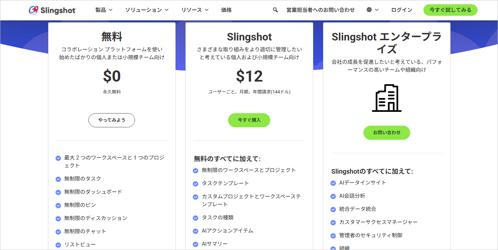
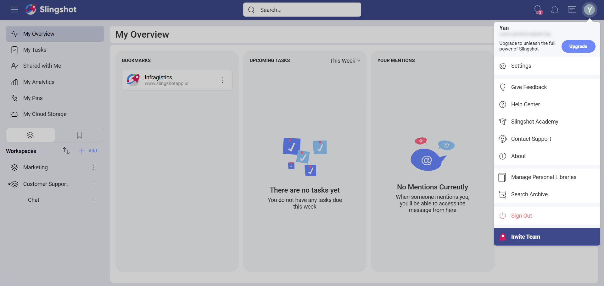
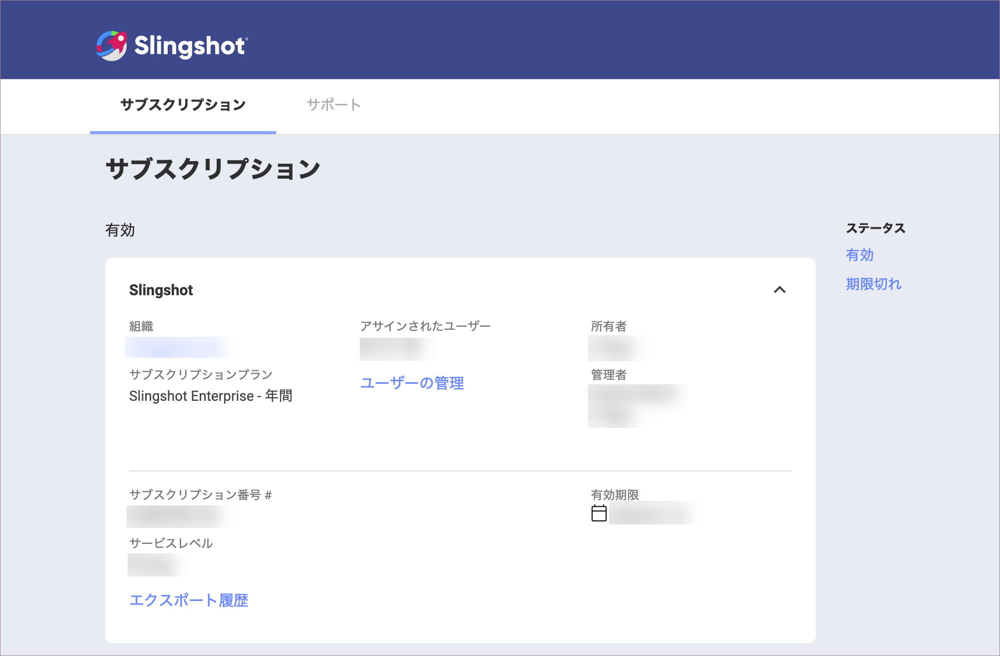
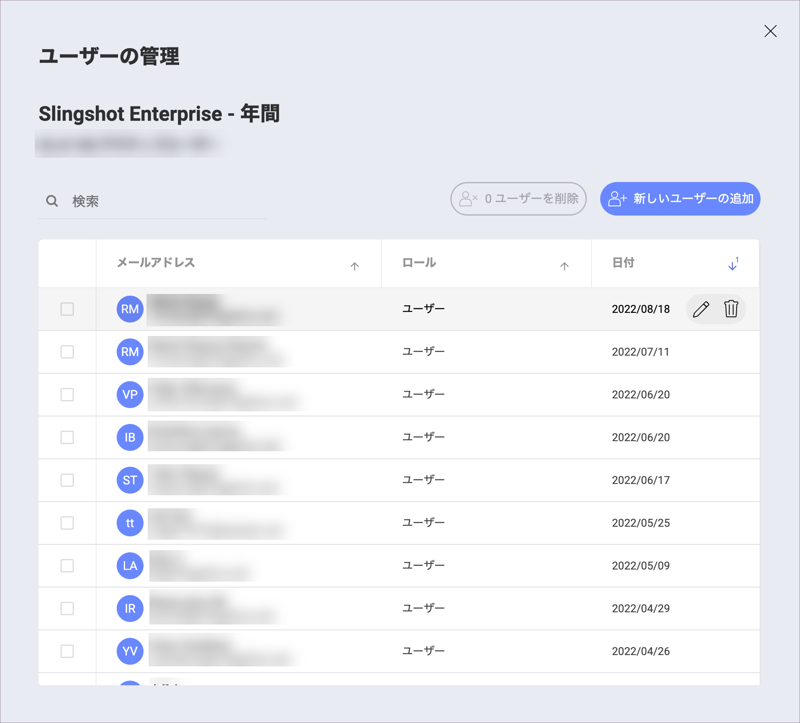
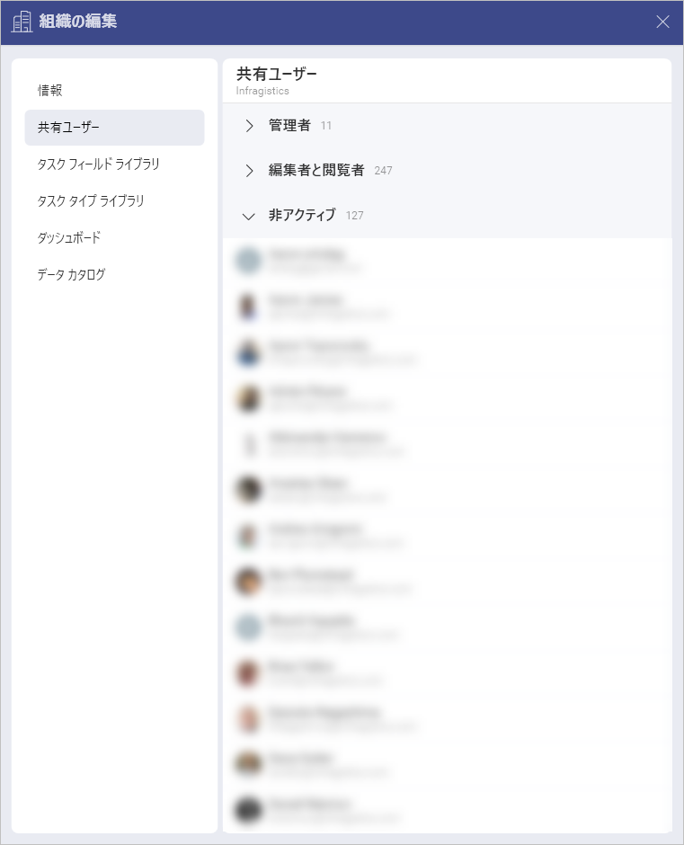
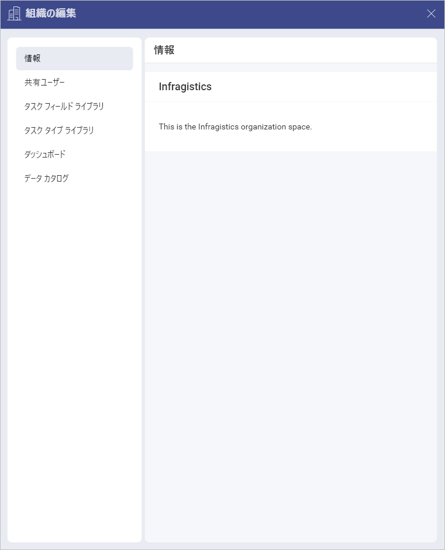

# 組織

Slingshot の組織は、あなたとあなたの同僚が会社によってアップロードされた情報を迅速かつ効率的に見つけることができるデジタル ワークスペースです。会社の全員と簡単に共同作業を行い、すべてを 1 か所にまとめることができます。

## 組織には何がありますか?

組織ワークスペース (左側のパネル) を開くと、次のタブが表示されます。

-	[ディスカッション](discussions-faq.md): ディスカッションを作成したり、既存のディスカッションに書き込んだりしながら、同僚と透明性の高い共同作業ができます。ディスカッションを使用すると、ヘルプを求めたり、お知らせを確認したり、最新の会社の変更について情報を得たりできます。

-	[ピン固定](pins.md): 重要な URL、ファイル、ダッシュボード、タスクなどをコンテンツ リストに添付して、会社の全員がすばやくアクセスできるようにすることができます。

-	[ダッシュボード](./analytics/dashboards/overview.md): ダッシュボードを作成して同僚と共有し、会社がデータに基づいた意思決定を行うために必要なすべての情報を確実に入手できるようにすることができます。

-	[データ ソース](./analytics/datasources/overview.md): さまざまなタイプのデータ ソースに接続して、美しく洞察に富んだダッシュボードを作成できます。

-	[データ カタログ](./data-catalog.md): データ カタログでデータを整理することで、チーム メンバーがデータにアクセスしやすくすることができます。ここでは、ダッシュボードとデータ ソースのリストを作成できます。

## Slingshot エンタープライズ サブスクリプションのアクティブ化

>[!Note] ユーザーは 1 つの Slingshot Enterprise サブスクリプションにのみ参加できます。

組織に属しておらず、組織を作成する場合は、まず [Slingshot エンタープライズ サブスクリプション](slingshot-enterprise-subscription.md)をアクティブ化する必要があります。

その場合は以下の手順を実行します:

1.	<a href="https://www.slingshotapp.io/ja/upgrade" target="blank" rel="noopener">こちら</a>の価格ページにアクセスします。

2.	Slingshot エンタープライズ サブスクリプションの下にある **[お問い合わせ]** をクリックまたはタップして、チームに連絡してください。チームがサブスクリプションのアクティブ化をサポートします。

すでに Slingshot アカウントにログインしている場合は、次のことができます:

1.	右上隅に移動して、プロフィール写真を選択します。

2.	**[アップグレード]** をクリックまたはタップします。

<!--  -->

3.	価格ページに移動します。**お問い合わせ**をクリックまたはタップして、チームに連絡できます。チームがサブスクリプションのアクティブ化をサポートします。

## Slingshot エンタープライズ サブスクリプションのロール

Slingshot エンタープライズ サブスクリプションには、**サブスクリプション管理者**、**組織管理者**、および**ユーザー**の 3 つのロールがあります。各ロールの詳細については、以下の表を参照してください。

| アクセス許可  | サブスクリプション管理者             | 組織管理者            | User             |
| ------------   | ---------------- | ------------------ | ------------------ |
| サブスクリプションの管理 (エンタープライズ サブスクリプションのアクティブ化および / またはキャンセル、組織へのユーザーの招待、組織からのユーザーの削除)| :white_check_mark: | :x:                | :x:                |
|アプリケーション内の機能を有効にする| :x: |    :white_check_mark: | :x: |
|Slingshot アプリを使用 (組織管理者は、アプリを使用するために新しいアカウントを作成する必要があります)。| :x: | :white_check_mark: | :white_check_mark: |

## 組織へのユーザーの追加

会社がすでに Slingshot エンタープライズ サブスクリプションを持っていて、組織に追加したい場合は、[サブスクリプション管理者](slingshot-enterprise-subscription.md#サブスクリプションを使用している間どのようなロールを担うことができますか)が招待する必要があります。これを行うには、次の手順を実行します。

1.	カスタマー ポータルに移動し、**[サブスクリプション]** をクリックまたはタップします。

2.	**[ユーザーの管理]** を選択します。

3.	**[ユーザーの追加]** ボタンをクリックしてユーザーを招待できるダイアログが表示されます。

4. Slingshot アプリを開いて招待を受け入れることができます。サインアウトして再度サインインするように求められます。再度サインインすると、組織のワークスペースが表示され、エンタープライズ サブスクリプション機能を使用できるようになります。

> [!Note]
> 組織メンバーには、設定メニューに**データ プライバシー** セクションがありません。これは、ユーザーが自分でアカウントを削除したり、データをエクスポートしたりできないことを意味します。

サブスクリプション管理者は、組織内のアカウントを管理する責任があります。サブスクリプション管理者は、あなたに代わってアカウントを削除したり、データをエクスポートしたりできます。

>[!Note] 非アクティブ化されたユーザーとは、サブスクリプションが割り当てられなくなったユーザーです。

組織メンバーは、次の手順で非アクティブ化されたユーザーのリストを表示できます。

1.	組織のオーバーフロー メニューから **[組織設定]** を開きます。

2.	**[共有ユーザー]** を選択します。

## 組織設定

組織設定にアクセスするには、次の手順を実行します。

1.	組織の横にあるオーバーフロー メニューを開きます。

2.	**[組織設定]** を選択します。

3.	ここでは、次のセクションがあります。

-	会社に関する情報

-	組織メンバーのリスト

-	[タスク フィールド ライブラリ](custom-fields.md#タスク-フィールド-ライブラリ)

-	[タスク タイプ ライブラリ](task-types.md#タスク-タイプ-ライブラリとは何ですか)

-	[ダッシュボード](./analytics/dashboards/overview.md)

-	[データ カタログ](data-catalog.md)

## 組織の権限

組織には 2 つのタイプの権限があります。

-	**管理者**: 組織アセット (ディスカッション、ピン固定、ダッシュボード、データ カタログ、データ ソース) の作成、編集、共有、削除。

-	**編集者**: 組織アセット (ディスカッション、ピン固定、ダッシュボード、データ カタログ、データ ソース) の作成、編集、共有。

## 追加情報

-	[Slingshot AI](slingshot-ai-overview.md) はデフォルトでオンになっていますが、組織に所属している場合は、組織の管理者が全体のために無効にしていることがあります。

-	[グループ](groups.md)を作成して、チーム メンバーと情報をすばやく共有できます。

