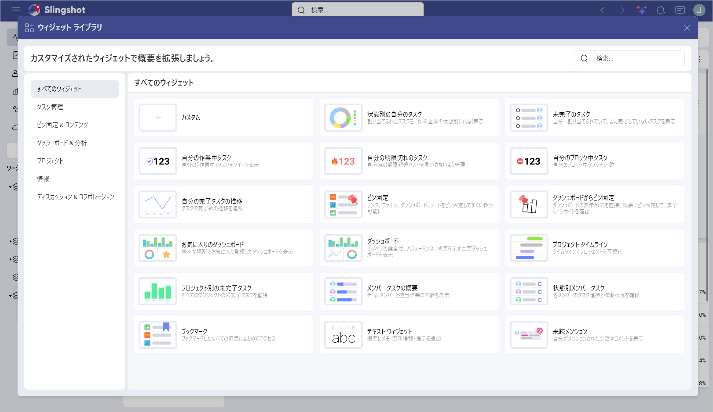

# 定義済みのウィジェット

定義済みの Slingshot ウィジェットは、内部フローや会社の目標に最適に合わせて概要をカスタマイズするのに役立ちます。

これらは 6 つのカテゴリに整理されています:

- **タスク管理**: 状態別のタスク、未完了のタスク、進行中タスク、期限切れのタスク、ブロック中タスク、完了タスクの推移

- **ピン固定 & コンテンツ**: ピン固定、ブックマーク

- **ダッシュボード & 分析**: ダッシュボードからピン固定、お気に入りのダッシュボード、ダッシュボード

- **プロジェクトとワークスペース**: プロジェクト タイムライン、プロジェクト別の未完了タスク

- **情報**: メンバー タスクの概要、状態別メンバー タスク、テキスト ウィジェット

- **ディスカッション & コラボレーション**: 未読メンション

**未読メンション**、**ブックマーク**、および**お気に入りのダッシュボード**ウィジェットは、**[概要]** にのみ使用できます。

**プロジェクト タイムライン**および**プロジェクト別の未完了タスク** ウィジェットは、**ワークスペース**の概要および **[概要]** セクションの概要にのみ使用できます。

ウィジェットを使用する場所に応じて、さまざまなカテゴリが表示されます。以下に、Slingshot で現在利用可能な定義済みのウィジェットすべてを示す表があります。

|         ウィジェット         |                                                                                                                      ユース ケース                                                                                                                      |
| ---------------------------- | ------------------------------------------------------------------------------------------------------------------------------------------------------------------------------------------------------------------------------------------------------- |
| 状態別のタスク               | チームのタスク分布を明確に把握したいとします。**状態別のタスク** ウィジェットを使用すると、バックログ タスクとチームの全体的な進捗状況を監視できます。                                                                                                  |
| 未完了のタスク               | プロジェクトの期限が迫っており、タスクに優先順位を付けたいとします。**未完了のタスク** ウィジェットを使用すると、整理された状態を維持し、目標を着実に達成できます。                                                                                     |
| 作業中タスク                 | チーム メンバー間で新しいタスクを均等に配分したいとします。**進行中**ウィジェットを使用すると、各人が取り組んでいるタスクの数を確認して、それに応じて新しいタスクを割り当てることができます。                                                           |
| 期限切れのタスク             | チームが新機能を開発しているとします。機能リリースの期限を逃さないようにするために、**期限切れのタスク** ウィジェットを使用してタスクに優先順位を付けることができます。                                                                                 |
| ブロック中タスク             | まざまなチームを管理していて、チームの 1 つがタスクを進められないことに気付いたとします。**ブロック中タスク**を確認してブロッカーを解決し、プロジェクトのフローを改善できます。                                                                         |
| 完了タスクの推移             | チームがプロジェクトを完了するのにかかる時間を追跡する必要があるとします。**完了タスクの推移**ウィジェットを使用すると、生産性の傾向を確認し、必要な対応を取ることができます。                                                                          |
| ピン固定                     | さまざまなワークスペースに保存されているいくつかのタイプのドキュメントがあるとします。**ピン固定**を使用すると、主要なリソース (画像、ファイル、URL、分析) をピン固定して、チームが重要な項目に簡単にアクセスできるようになります。                     |
| ダッシュボードからピン固定   | チームが Facebook 広告と YouTube 広告にどれだけ費やしたかの概要を確認したいとします。さまざまなダッシュボードから表示形式をピン固定して、コストを比較できます。                                                                                         |
| ダッシュボード               | チームに今月の売上レポートを作成して全体的な進捗状況を追跡してもらいたいとします。作業中の 「売上」 ダッシュボードをワークスペース概要にピン固定して、チームが簡単にアクセスできるようにすることができます。                                            |
| お気に入りのダッシュボード   | 最も重要なダッシュボードにすばやくアクセスしたいとします。お気に入りのダッシュボードを **[概要]** セクションの概要に追加して、迅速にデータ駆動型の意思決定を行うことができます。                                                                        |
| プロジェクト タイムライン    | 複数のワークスペースに参加しており、各プロジェクトの進捗状況を監視したいとします。**プロジェクト タイムライン** ウィジェットを使用して、タスクを計画し、ワークロードを配分できます。                                                                    |
| プロジェクト別の未完了タスク | ワークスペース内の各プロジェクトの進捗状況を確認したいとします。**プロジェクト別の未完了タスク** ウィジェットを使用すると、プロジェクトを管理し、期限に遅れないようにすることができます。                                                               |
| メンバー タスクの概要        | ワークスペース内の割り当てられたタスクのうち、期限が迫っているものを確認したいとします。**メンバー タスクの概要**ウィジェットを使用して、各タスクの期日をひと目で確認できます。                                                                         |
| 状態別メンバー タスク        | チームのパフォーマンスを評価したいとします。**状態別メンバー タスク** ウィジェットを使用して、各チーム メンバーの貢献度を分解できます。                                                                                                                 |
| ブックマーク                 | Slingshot で最も重要な項目をすぐに利用できるようにしたいとします。**ブックマーク** ウィジェットを使用して、情報をより簡単にナビゲートするためのショートカットを作成できます。                                                                           |
| テキスト                     | オンボーディング情報をチームと共有したいとします。**テキスト** ウィジェットを使用して、オンボーディング プロセスを詳細に説明できます。                                                                                                                  |
| 未読メンション               | さまざまなプロジェクトやワークスペースに参加しているため、メンションされたすべてのディスカッションやタスクを追跡する方法が必要であるとします。**未読メンション** ウィジェットを使用すると、メッセージが無限のスレッドで失われるのを防ぐことができます。 |

上記の各ウィジェットは、ビジネス目標に最適な方法で構成できます。さまざまな表示形式を使用してウィジェットを使用する方法の詳細については、[こちら](visualization-types.md)を参照してください。
