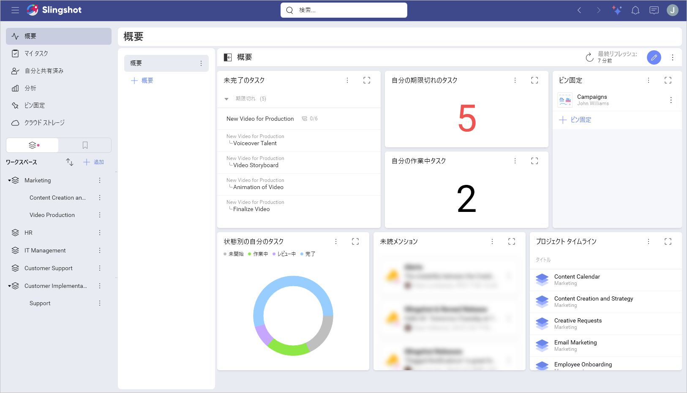
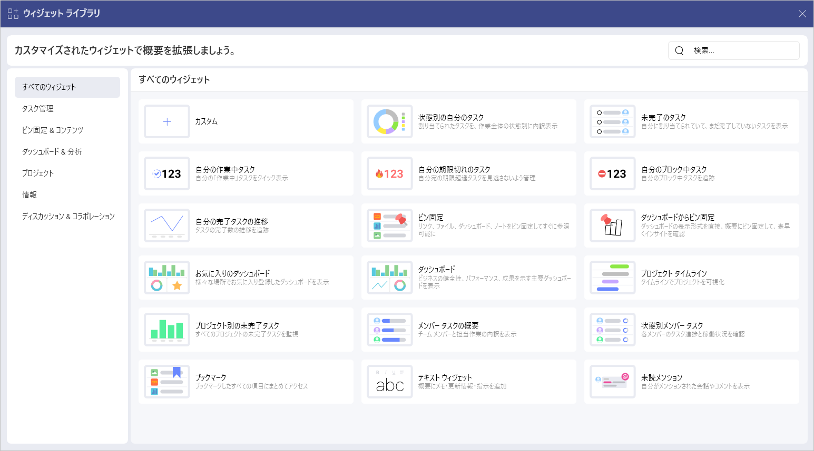

# 概要

複数のワークスペースやプロジェクトで作業していると、次のようなよくある質問が頻繁に発生します:

- 進捗は順調ですか? そうでない場合は、誰に何を確認するとよいですか?

- 問題にぶつかりましたか? もしそうなら、問題は何ですか?

- このプロジェクトに取り組んでいるのは誰ですか? タスクの消化具合はどうですか?

- ワークスペースに関するドキュメントやその他のリソースはどこで入手できますか?

- データ駆動型の意思決定を行うために統計を追跡するにはどうすればよいですか?

これらの質問はすべて、概要を使用して回答できます。

概要を使用すると、作業に関する最も重要な情報を一目で確認できます。これにより、情報に基づいた意思決定を行い、全体的な進捗状況を追跡し、ワークフローを合理化できます。

> [!Note]
> Slingshot の無料版を使用している場合、**[概要]**、ワークスペース、またはプロジェクトのすぐに使える概要のみを編集できますが、新しい概要を作成することはできません。[Slingshot](slingshot-subscription.md) または [Slingshot Enterprise](slingshot-enterprise-subscription.md) サブスクリプションを使用すると、複数の概要を作成して編集できます。

## 概要のタイプ

各ワークスペースとプロジェクトには概要を含めることができます。すべてのユーザーは、自分だけに表示される独自の概要を持つこともできます。

- **[概要]**: 自分の作業を視覚化し、自分自身を整理できます。

- **ワークスペースまたはプロジェクトの概要**: ワークスペースまたはプロジェクトのクイック スナップショットを作成し、自分とチームにとって最も重要な情報を強調表示できます。

## 概要

個人的な概要のリストは、画面の左上隅の **[概要]** にあります。ここでは、ユーザー自身が仕事を整理し、要約して仕事を視覚化することができます。目標に最適に合わせて概要をカスタマイズできます。

## ワークスペースとプロジェクトの概要

ワークスペースとプロジェクトは左側のパネルにあります。プロジェクトやチームを実行するときは、全体像を把握して、迅速かつ積極的に行動する必要があります。仕事に関する最も重要な情報を一目見れば、パフォーマンスの高いチームを目指して進むことができます。

概要では、プロジェクト マネージャーとリーダーの両方に、ワークスペースまたはプロジェクトの全体的な状態を示し、主要なコンテンツをメンバーに喚起することができます。

> [!Note]
> ワークスペースとプロジェクトの概要には、それぞれ変更可能なデフォルトの概要があります。**管理者**の権限を持つユーザーのみが概要を変更できます。

## ウィジェット ライブラリ

概要をカスタマイズするには、**[ウィジェット ライブラリ]** を使用できます。ここでは、個人の概要、ワークスペースの概要、またはプロジェクトの概要を形成するために使用できる、カスタマイズされたウィジェットを見つけることができます。ウィジェットは次のカテゴリに分類されています:

- **すべてのウィジェット**: ここでは、使用可能なすぐに使えるウィジェットすべてのリストと、カスタム ウィジェットを作成するオプションを見つけることができます。

- **タスク管理**: 状態別のタスク、未完了のタスク、進行中タスク、期限切れのタスク、ブロック中タスク、完了タスクの推移

- **ピン固定 & コンテンツ**: ピン固定、ブックマーク

- **ダッシュボード & 分析**: ダッシュボードからピン固定、お気に入りのダッシュボード、ダッシュボード

- **プロジェクトとワークスペース**: プロジェクト タイムライン、プロジェクト別の未完了タスク

- **情報**: メンバー タスクの概要、状態別メンバー タスク、テキスト ウィジェット

- **ディスカッション & コラボレーション**: 未読メンション

定義済みのウィジェットの詳細については、[こちら](out-of-the-box-widgets.md)を参照してください。

ウィジェット ライブラリを開くには、次の手順を実行します:

1. **[概要]** セクション、ワークスペース、またはプロジェクトの概要を開きます。

2. 右上隅にある鉛筆アイコンをクリックまたはタップします。

3. **[+ウィジェット]** をクリックまたはタップします。

4. 使用できるすべてのウィジェットのリストが表示されます。カテゴリ別に整理されたすべてのウィジェットを表示する場合は、**[ウィジェット ライブラリ]** をクリックまたはタップできます。

5. ウィジェット ライブラリが開いたら、カテゴリからウィジェットを選択するか、検索バーを使用して名前でウィジェットを検索できます。

