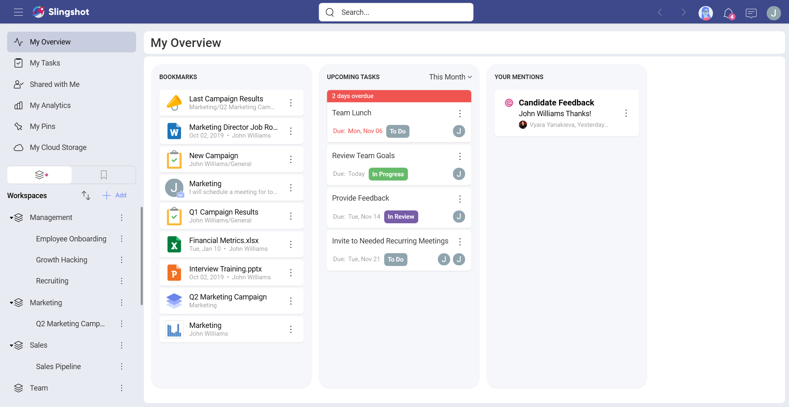
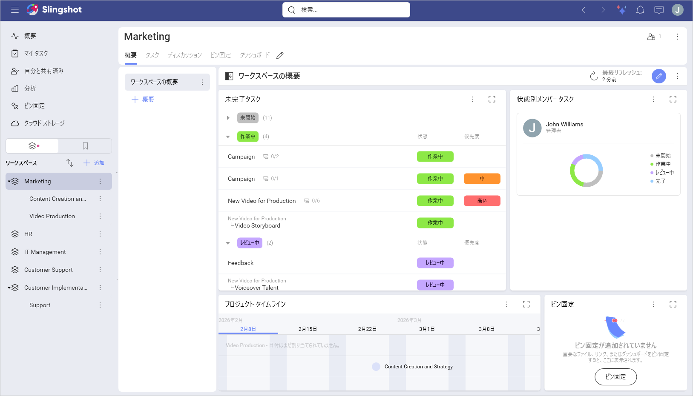

# 概要

複数のワークスペースやプロジェクトで作業していると、次のようなよくある質問が頻繁に発生します:

- 進捗は順調ですか? そうでない場合は、誰に何を確認するとよいですか?

- 問題にぶつかりましたか? もしそうなら、問題は何ですか?

- このプロジェクトに取り組んでいるのは誰ですか? タスクの消化具合はどうですか?

- ワークスペースに関するドキュメントやその他のリソースはどこで入手できますか?

これらの質問はすべて、ワークスペースとプロジェクトの概要を使用して回答できます。

## 概要のタイプ

概要を使用すると、作業に関する最も重要な情報を一目で確認できます。  概要には 2 つのタイプがあります:

- **[概要]** - 個人的な概要 (画面の左上) は、ユーザーが自身の仕事を視覚化し、整理することができる場所です。

- **ワークスペースまたはプロジェクトの [概要]** - ワークスペースまたはプロジェクトのクイッ クスナップショットを提供し、まとめた情報を表示することで、全員の作業の現在の状態を示します。

## 概要

個人の概要は画面の左上にあります。**[概要]** では、ユーザー自身が仕事を整理し、要約して仕事を視覚化することができます。ここに表示されるもの:

- **ブックマーク** – Slingshot の最も重要な項目をすぐに利用できます。ワークスペース、タスク、チャット、およびコンテンツにブックマークを追加できます。ブックマークされたリストを使用すると、ピン固定されているすべてのドキュメントと Web リンクにアクセスできます。

- **[今後のタスク]** – **[今日]**、**[明日]**、**[今週]**、**[今月]**、および **[期限切れ]** でフィルタリングできるタスクを使用して、1 日の優先順位を付けるのに役立ちます。

- **[メンション]** – Slingshot での @メンション。

## ワークスペースとプロジェクトの概要

プロジェクトやチームを実行するときは、全体像を把握して、迅速かつ積極的に行動する必要があります。仕事に関する最も重要な情報を一目見れば、パフォーマンスの高いチームを目指して進むことができます。

概要では、プロジェクト マネージャーとリーダーの両方に、全体的な状態 (**進行中**、**リスク**、**危険**、**完了**)、**開始**と**期日**を示し、主要なコンテンツをメンバーに喚起することができます。

### 詳細

画面の左側から、次のようなワークスペースまたはプロジェクトに関する一般的な詳細を確認できます:

- **プロジェクト / ワークスペースのメンバー** – ここでは、すべてのメンバーにすばやくアクセスして管理したり、プロジェクトまたはワークスペースへの保留中の招待を表示したりできます。
	- **状態** – ワークスペースの管理者は、いつでも全体的な状態を変更して、**[進行中]**、**[リスク]**、**[危険]**、および **[完了]** を切り替えることができます。

- **簡単な説明** – ワークスペースまたはプロジェクトに簡単な説明を付けて、新しく入ってきたチーム メンバーも前からいるチームメンバーも、その目的を理解できるようにします。

- **開始と期日** – ワークスペースがプロジェクトを中心に展開している場合、プロジェクトのすべての関係者にとって、日付の可視性は非常に重要です。

- **ピン固定** – 主要なリソース (画像、ファイル、URL、分析) をピン固定します。

### メンション

ここでは、ワークスペースまたはプロジェクトのタスクおよびディスカッション内のチームメートからユーザーに向けられた @メンションにアクセスできます。これは、メッセージがスレッド内で流れ去るのを防ぎながら、可視性を確保するための優れた方法です。

### タスクの状態

[タスク の状態] の下に、現在のプロジェクトまたはワークスペース内のすべてのメンバーのリストと、さまざまなタスクの進捗状況が表示されます。ワークスペースには、その特定のワークスペースのタスクと、そのプロジェクトのタスクが含まれることに注意してください。
