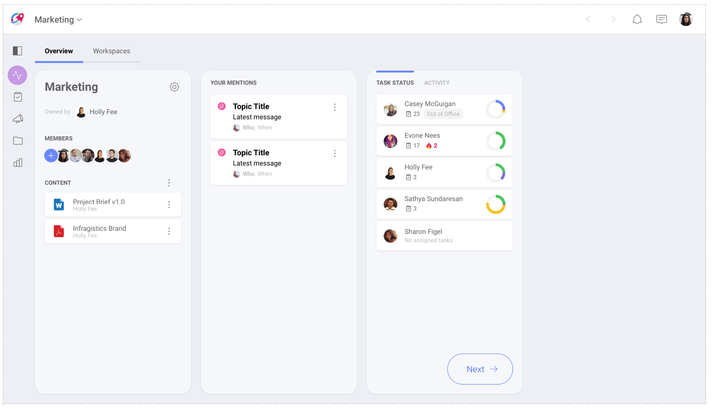

## Getting the Big Picture with Overviews

In short, an overview is a general review or summary about something, it helps you get the big picture, while leaving out details that are too specific.

Putting a little thought into to this, big picture thinking can be a big help for us to act proactively rather than reactively. A quick glance to the most important information around something can be a game changer. For example, taking advantage of a useful overview related to your team's work can push you towards high-performing teams ground.

### So, What's a Slingshot Overview?

It's a quick snapshot of a project, a team, or your personal work. Slingshot overviews present you with the current status of one of those three by including summarized information.

By looking at a **project overview** you can get a sense of the project progress at a glance. Within seconds you get an overall status (On Target, At Risk, Danger, Completed), the start and due dates, and issues raised by someone working on the project. That information alone might be enough for you, if not you can dig deeper by exploring specific tasks within the project or even mentions directed at you. Project content can be useful to add resources like links, documents, dashboards, etc.

From a **team overview** you can get a list of the team members and their tasks, all mentions directed at you, and links to relevant content for the team.

Your **personal overview** is that one place where you can visualize your work and organize yourself. All your tasks with dates can be found here and you can open them without navigating away. Bookmarks are very useful to keep at hand those links that are really relevant to you. You can add links to teams, projects, tasks, chats and also boards. As boards are just containers, bookmarking a board gets you access to all its pinned documents and web links.

### Why Visibility is so Important?
In an [agile world](https://agilemanifesto.org/), you can never go wrong by saying that trust and transparency are key elements for a team leader seeking effective collaboration. That being said, visibility is essential for allowing, if not actually creating trust and transparency within a team.  

Slingshot might be all about visibility yes, but overviews were specifically designed with visibility in mind. Besides helping build trust and transparency, overviews can help you turn challenges into opportunities. Using Slingshot overviews you are able to contrast and reframe current challenges while you adapt to a changing reality.   

When following a team or a team's project you will frequently find yourself with many questions, including:
- Are we on time? If not, who should I ask and what to ask about?
- Did we bump into an issue? If so, what's the issue?
- Who's working on this project? How are they doing with their tasks?
- Where can I get docs or other resources about the project or the team?

All those questions can be answered using overviews.
