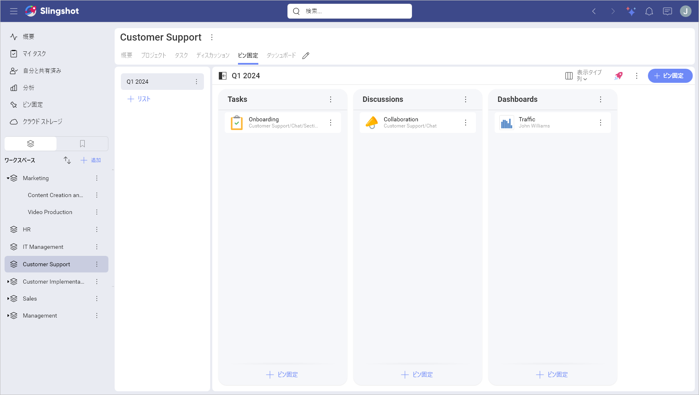
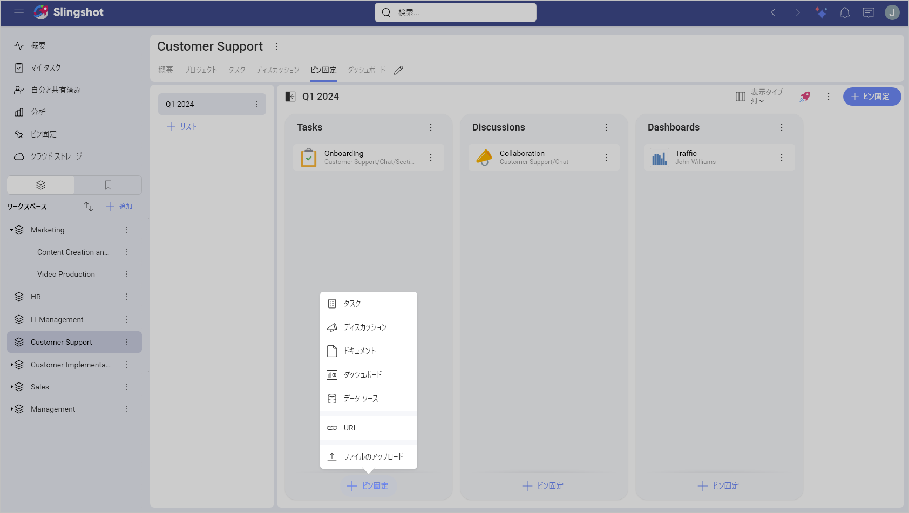
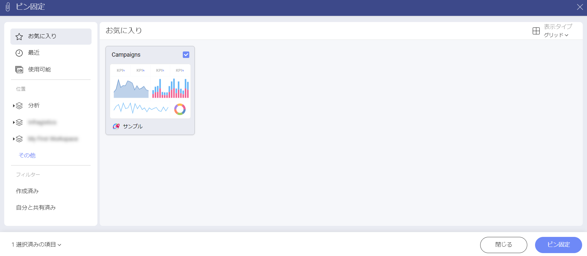
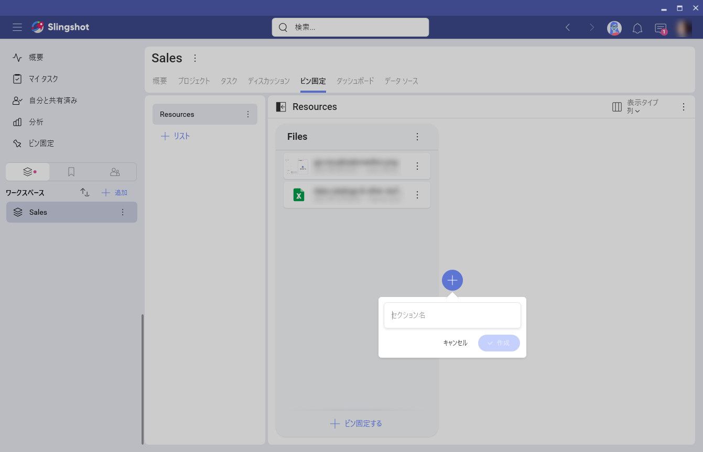
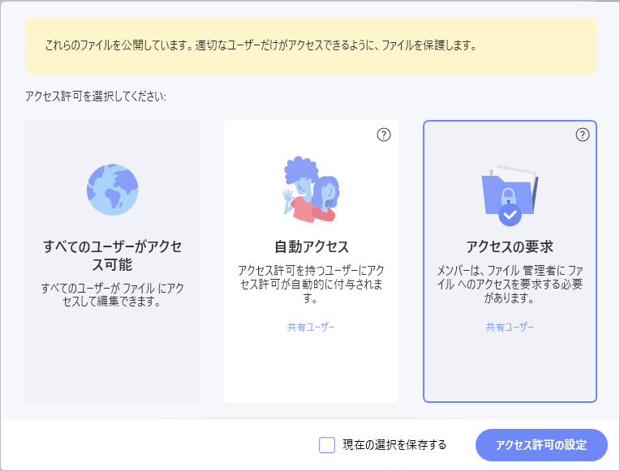
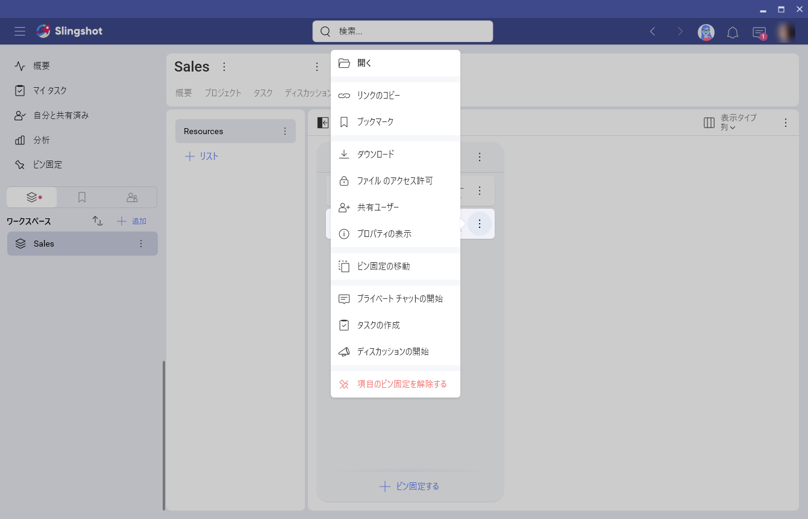

# ピン固定

ピン固定は Slingshot の重要な要素であり、ユーザー自身またはチームに関連するリソースにアクセスして共有することができます。さまざまなクラウド ストレージに保存されている、またはウェブに分散しているリソースは、すべて Slingshot リストに整理できます。

## ピン固定の概要

ピン固定は、クラウド ストレージ上のファイル、URL、分析ダッシュボードなど、さまざまな種類のリソースへの単純なリンクです。リソースを整理、管理、共有する目的で、ピン固定の複数のリストを管理できます。

## コンテンツをピン固定する方法

コンテンツのピン固定は、Slingshot 内でリソースを共有するための最も一般的な方法の 1 つです。ファイルまたは分析ダッシュボードは、クラウド ストレージや、既存のピン固定、共有されているコンテンツから選択するか、デバイスからアップロードすることでピン固定できます。URL をピン固定するには、URL とタイトルを追加するだけです。

>[!NOTE] ダッシュボードを別のワークスペースやプロジェクトにピン固定することもできます。

### Slingshot の任意の場所からピン固定

1. [+ ピン固定する] ボタンを使用して、[コンテンツ] または [分析] を選択します。

2. [クラウド ストレージ]、Slingshot 内の既存の [ピン固定]、[ダッシュボード]、または [自分と共有済み] にあるファイルに移動します。

3. ピン固定するファイルを選択します。

### デバイスからアップロードしてピン固定

1.	[+ ピン固定する] ボタンを使用して、[ファイルのアップロード] を選択します。

2.	ファイルを選択したら、アップロードするクラウド ストレージを選択します。

3.	最後に、ファイルを共有するための適切なアクセス許可を選択します。

### 既存のピンからのピン固定

1.	ピン固定のオーバーフローを開き、**[ピン固定の移動]** を選択します。

2.	新しいピンを追加する場所に移動します。

3.	リストとセクションを選択し、**[-> 移動]** をクリックします。

### URL をピン固定

1.	[+ ピン固定する] ボタンを使用して、[URL] を選択します。

2.	URL を入力または貼り付け、必要に応じてタイトルを追加 / 変更します。

### ダッシュボードをワークスペースまたはプロジェクトにピン固定する

1. ダッシュボードをピン固定するワークスペースまたはプロジェクトを開きます。

2. **[ダッシュボード]** を開き、**[+ ダッシュボード]** ボタンをクリックまたはタップします。

3. **[ダッシュボード]** などからダッシュボードをピン固定するか、ダッシュボードを作成するかの 2 つのオプションが表示されます。ダッシュボードをワークスペースまたはプロジェクトに移動するには、**[ピン固定]** をクリックまたはタップします。

   

4. [ピン固定] ダイアログが開きます。さまざまな*場所*、*フィルター*などからダッシュボードを選択できます。  

   

5. 準備ができたら、**[ピン固定]** をクリックまたはタップします。

## ピン固定を整理

ワークスペースとプロジェクトの [ピン固定] タブにはピン固定のリストがあり、セクションを使用してさらに整理できます。セクションを使用して、ピン固定のリストを分割し、ピン固定をより適切にレイアウトできます。

さらに、リスト、セクション、ピン固定をドラッグするだけで簡単に再編成および移動できます。

[概要] タブには、チームが最重要視するべき主要なリソースを保持するための、単一のピン固定のリストがあります。

## クラウド ストレージ

Slingshot では、以下のクラウド ストレージ プロバイダーへの新しい接続を追加できます。
- Google ドライブ

- OneDrive

- Dropbox

- Box

- SharePoint

個人使用または他のユーザーとコンテンツを共有するためにクラウド ストレージを構成できます。

### クラウド ストレージへの接続

[+ ピン固定する] ダイアログまたは [クラウドストレージ] タブを使用して、新しいクラウド ストレージを追加できます。

1. [+ 追加] ボタンを使用して、クラウド ストレージを選択します。

2. サインインして、インフラジスティックスへのアクセスを許可します。

>[!NOTE] [クラウド ストレージ] タブは、[設定] > [メイン ナビゲーション] で有効にできます。

### サポートされているファイル タイプ

Slingshot では、ファイル タイプは異なるアイコンを使用して表示されます。最も一般的なものは以下のとおりです。

|**アイコン**|**ファイル タイプ**|**アイコン**|**ファイル タイプ**|
|---|---|---|---|
|| Microsoft Word ファイル|| Google ドキュメント ファイル|
|| Microsoft Excel ファイル|| Google シート ファイル|
|| Microsoft PowerPoint ファイル||画像ファイル|
||Adobe PDF ファイル|| ビデオ ファイル|
|| Web リンク|| ZIP ファイル|

### ファイルのアクセス許可を設定する方法

ワークスペース内のファイルを共有すると、ワークスペース内のユーザーがこれらのファイルを使用できるようになります。
ファイルのアクセス許可は、ファイルの管理者がファイルにアクセスできるユーザーを制御します。ファイルを固定するたびに、Slingshot は設定する許可のタイプを尋ねます。以下のようなダイアログが表示されます。

こちらでは、以下の 3 つの許可タイプから選択できます。

 - **すべてのユーザーがアクセス可能** - すべての Slingshot ユーザーがファイルにアクセスできます。

 - **自動アクセス** - ワークスペースのすべてのユーザーがファイルにアクセスできます。

 - **アクセス権の要求** - ワークスペースのユーザーを含むすべてのユーザーが管理者にアクセス権を要求する必要があります。

> [!NOTE] Slingshot でファイルへのアクセスを許可すると、ファイルの表示および編集のアクセス許可が与えられます。

[このトピック](security.md)では、各ファイルのアクセス許可のタイプとメンバーのアクセスを管理する方法について説明します。

### ドラッグ アンド ドロップ
ドラッグ アンド ドロップを使用して、外部ソースから Slingshot のリストにファイルまたはリンクをすばやく追加できます。Slingshot に追加されたファイルは、設定したクラウド ストレージの中に「Slingshot のアップロード」という名前のフォルダーを作成してそこにアップロードされます。

初めてファイルをアップロードするときに、次回以降自動的に選択されるデフォルトのクラウド ストレージを選択します。必要に応じて、後で [一般設定] > [ドラッグ アンド ドロップ] の場所で変更できます。

## コンテンツの操作
任意のファイルをクリックまたはタップすると、開くことができます。MS Office ファイルは、オンラインで開くことも、デバイスのローカル アプリを使用して開くこともできます。

さらに、[一般設定] > [ファイルを開く] 設定を使用してデフォルトの方法を設定できます。

ファイルを頻繁に編集します。Slingshot はサードパーティのアプリケーションを呼び出して作業を行うため、プラットフォームに応じて、MS Word や Excel などのさまざまなアプリケーションを使用できます。