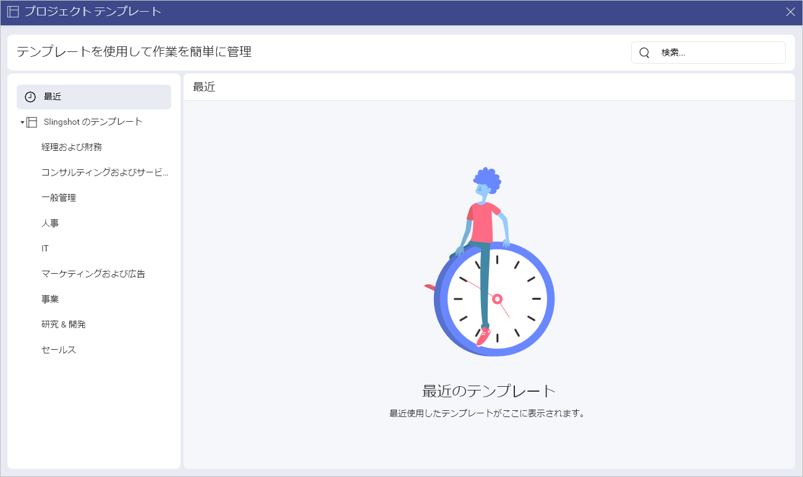

# プロジェクト テンプレート 

プロジェクト テンプレートを使用すると、チーム用のプロジェクトをすばやく作成できます。テンプレートは、必要なときにいつでも再利用できます。 

## さまざまなプロジェクト テンプレート リストにアクセスする方法

テンプレートにアクセスする方法:

1.	ワークスペース内のプロジェクトのリストを開きます。

2.	**[+プロジェクト]** ボタンをクリックまたはタップします。

3.	**[すべてのテンプレートを見る]** を選択します。

4.	次のダイアログが開きます:

左パネルでは、次のことができます:

- 最近使用したテンプレートを確認/使用します。

- Slingshot テンプレートからテンプレートを確認/使用します。

## プロジェクト テンプレートを使用する方法

Slingshot のテンプレートは、さまざまな業界/部署に基づいて編成されています。テンプレートを使用するには:

1.	左側のパネルでリストの 1 つを開きます。

2.	要件に最適なテンプレートをクリック/タップします。 

3.	プロジェクトの外観のプレビューが表示されます。この場合、**Project Management** テンプレートを選択します。

4.	こちらには、テンプレートの内容と作成者についての簡単な説明が表示されます。左矢印/右矢印を使用して、各コンポーネント (この場合は*タスク*と*ディスカッション*) のサムネイルを表示することもできます。これにより、プロジェクトがどのように見えるかについてより適切な概要が得られます。準備ができたら、**[テンプレートを使用]** をクリックまたはタップします。

5.	ダイアログが表示され、各テキスト ボックスをクリック/タップしてプロジェクトのタイトルを変更したり、説明を変更したりできます。プロジェクトを特定のワークスペースに保存し、ドロップダウン メニューからプロジェクトの開始日を設定することもできます。開始日はタスクの日付の構成にも使用されます。 

6.	準備ができたら、**[作成]** をクリックまたはタップします。

プロジェクトの作成方法と使用方法の詳細については、[こちら](./workspaces.md#workspace-hierarchy)をご覧ください。