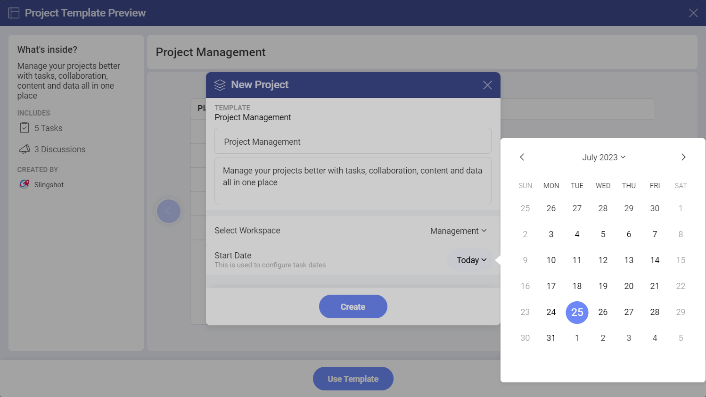
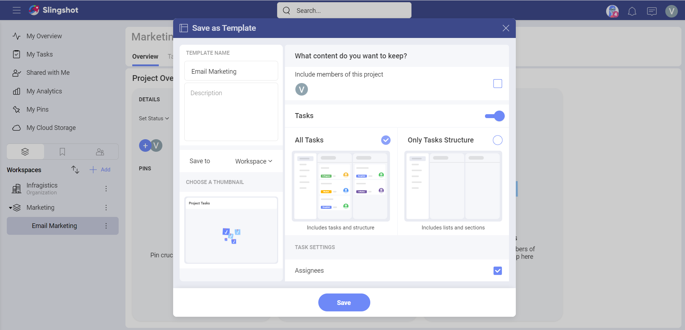

# プロジェクト テンプレート 

プロジェクト テンプレートを使用すると、チーム用のプロジェクトをすばやく作成できます。テンプレートは、必要なときにいつでも再利用できます。 

## さまざまなプロジェクト テンプレート リストにアクセスする方法

テンプレートにアクセスする方法:

1.	ワークスペース内のプロジェクトのリストを開きます。

2.	**[+ プロジェクト]** ボタンをクリックまたはタップします。

3.	**[すべてのテンプレートを見る]** を選択します。

4.	次のダイアログが開きます:

In the left panel, you can do the following:

- Check all of your templates.

- Check the templates that you have recently used.

- View all the featured templates.

- Use a template from the *Slingshot Templates*.

- Locate where you have stored your templates.

- Filter the templates by *Created by Me* or *Shared with Me*.

## How can I use an out-of-the-box Project Template?

Slingshot のテンプレートは、さまざまな業界/部署に基づいて編成されています。テンプレートを使用するには:

1.	左側のパネルでリストの 1 つを開きます。

2.	要件に最適なテンプレートをクリック/タップします。 

3.	プロジェクトの外観のプレビューが表示されます。この場合、**Project Management** テンプレートを選択します。

4.	こちらには、テンプレートの内容と作成者についての簡単な説明が表示されます。左矢印/右矢印を使用して、各コンポーネント (この場合は**タスク**と**ディスカッション**) のサムネイルを表示することもできます。これにより、プロジェクトがどのように見えるかについてより適切な概要が得られます。準備ができたら、**[テンプレートを使用]** をクリックまたはタップします。

5.	ダイアログが表示され、各テキスト ボックスをクリック/タップしてプロジェクトのタイトルを変更したり、説明を変更したりできます。プロジェクトを特定のワークスペースに保存し、ドロップダウン メニューからプロジェクトの開始日を設定することもできます。開始日はタスクの日付の構成にも使用されます。 

6.	準備ができたら、**[作成]** をクリックまたはタップします。

## How can I create a custom Project Template? 

To create a custom project template, you need to:

1.	Open the overflow menu of the project you want to use for the template.

2.	Click/tap on **Save as Template**. 

3. The following dialog will open up. Here you can choose what to keep from the project in order to use it for the template. You can also choose where to store the template from the drop-down menu in the left panel of the dialog. When you are ready, click /tap on **Save**.

4.	Once you have created the template, you can open your list of projects in a workspace and click/tap on **See all Templates**. 

You can find the template under **Locations** in one of the sections. In the example below, we saved the template with the title *Email Marketing* in the **Marketing** workspace.

Besides this, you can also open the overflow menu on the right side of the project template, that you have created, and take the following actions:

-	Open the template.

-	Copy the link to the template.

-	Add the template to *Bookmarks* or remove it from there.

-	Share the template.

-	Delete the template.

プロジェクトの作成方法と使用方法の詳細については、[こちら](./workspaces.md#workspace-hierarchy)をご覧ください。