# プロジェクト テンプレート 

プロジェクト テンプレートを使用すると、チーム用のプロジェクトをすばやく作成できます。テンプレートは、必要なときにいつでも再利用できます。 

## さまざまなプロジェクト テンプレート リストにアクセスする方法

テンプレートにアクセスする方法:

1. ワークスペース内のプロジェクトのリストを開きます。

2. **[+ プロジェクト]** ボタンをクリックまたはタップします。

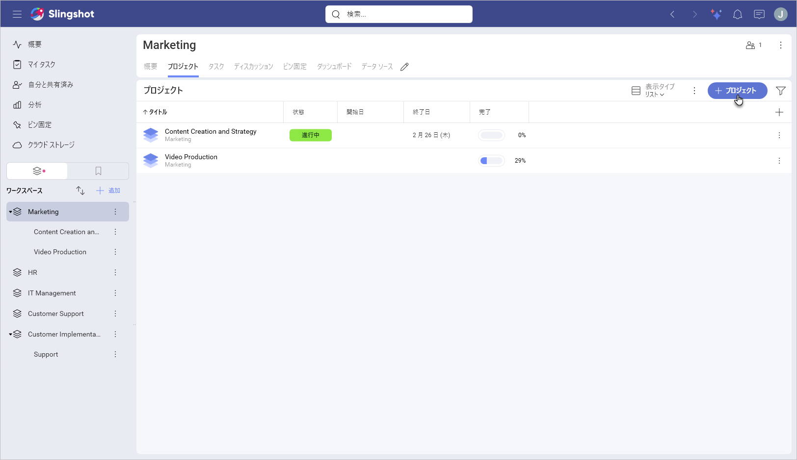

3. **[すべてのテンプレートを見る]** を選択します。

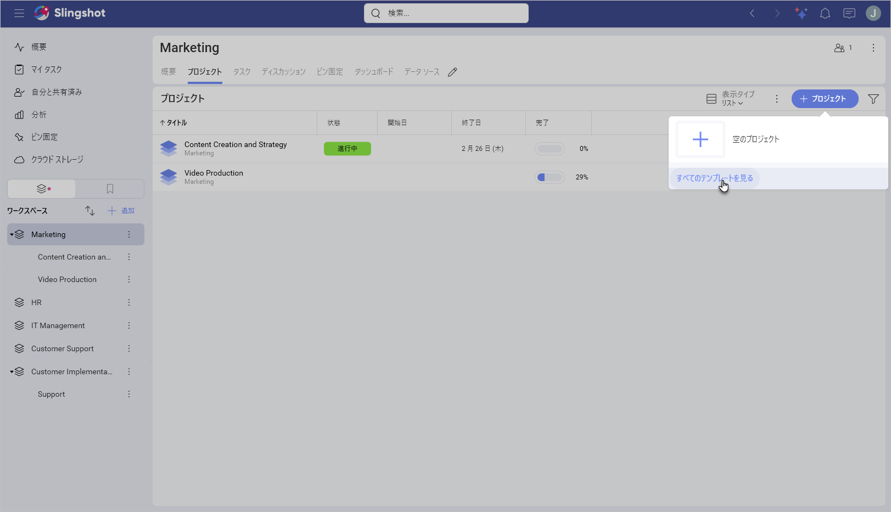

4. 次のダイアログが開きます:

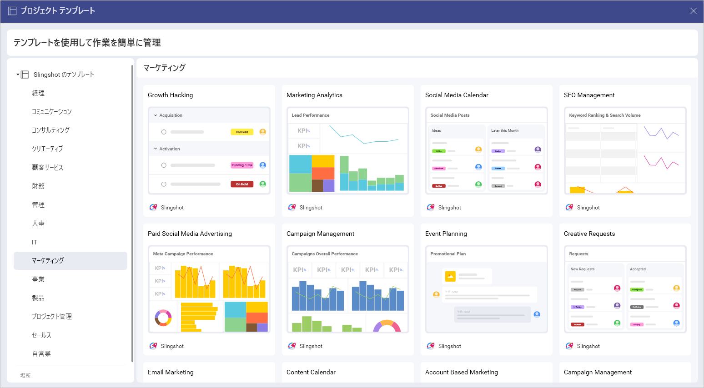

左側のパネルでは、次の操作を行うことができます:

- すべての注目のテンプレートを表示。

- **Slingshot のテンプレート**を使用。

- テンプレートを保存した場所を見つける。

別の方法としては以下の手順も利用できます:

1. ワークスペースのオーバーフロー メニューを開きます。

2. **[プロジェクトの追加]** をクリックまたは タップします。

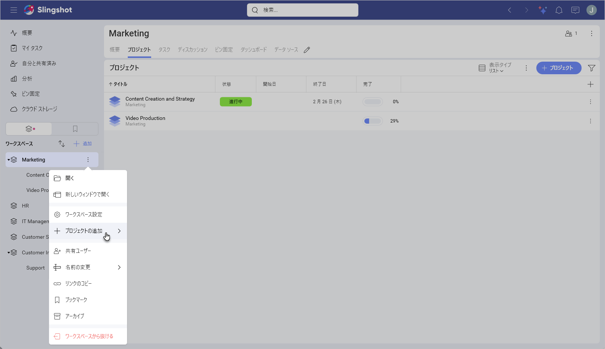

3. **[テンプレートから追加]** を選択します。

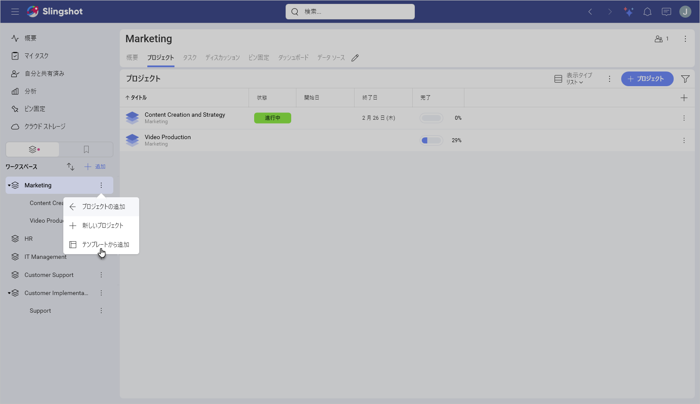

4. **プロジェクト テンプレート** ダイアログが表示され、上記の 3 つのカテゴリに分類されたすべてのテンプレートを確認できます: **[おすすめ]**、**[Slingshot テンプレート]**、および特定の**場所**に保存された**テンプレート**。

## すぐに使えるプロジェクト テンプレートを使用する方法

Slingshot のテンプレートは、さまざまな業界/部署に基づいて編成されています。テンプレートを使用するには:

1. 左側のパネルでリストの 1 つを開きます。

2. 要件に最適なテンプレートをクリックまたはタップします。 

3. プロジェクトの外観のプレビューが表示されます。この場合、**Project Management** テンプレートを選択します。こちらには、テンプレートの内容と作成者についての簡単な説明が表示されます。左矢印/右矢印を使用して、各コンポーネント (この場合は**タスク**と**ディスカッション**) のサムネイルを表示することもできます。これにより、プロジェクトがどのように見えるかについてより適切な概要が得られます。準備ができたら、**[テンプレートを使用]** をクリックまたはタップします。

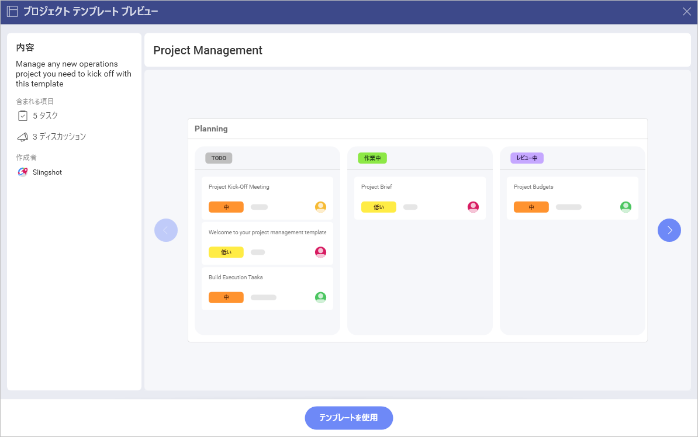

4. ダイアログが表示され、各テキスト ボックスをクリックまたはタップしてプロジェクトのタイトルを変更したり、説明を変更したりできます。ドロップダウン メニューからプロジェクトの開始日を設定することもできます。開始日はタスクの日付の構成にも使用されます。変更の準備ができたら、**[作成]** をクリックまたはタップします。

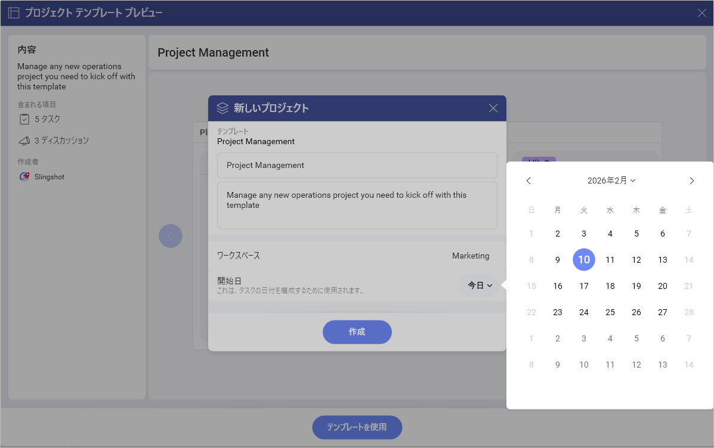

## カスタム プロジェクト テンプレートを作成する方法

>[!Note] カスタム プロジェクト テンプレートを作成するオプションは、Slingshot および Slingshot Enterprise ユーザーが利用できることに注意してください。

カスタム プロジェクト テンプレートを作成するには、次のことを行う必要があります:

1. テンプレートに使用するプロジェクトのオーバーフロー メニューを開きます。

2. **[テンプレートとして保存する]** をクリックまたはタップします。

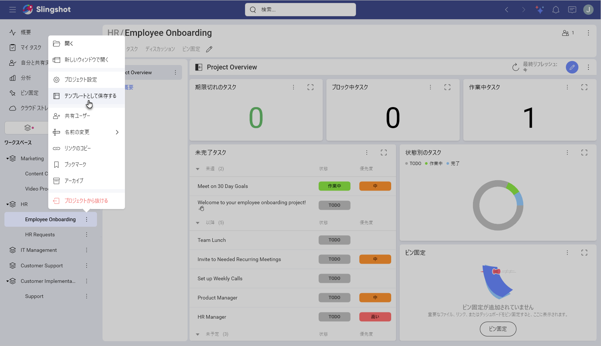

3. 次のダイアログが開きます。実行できること:

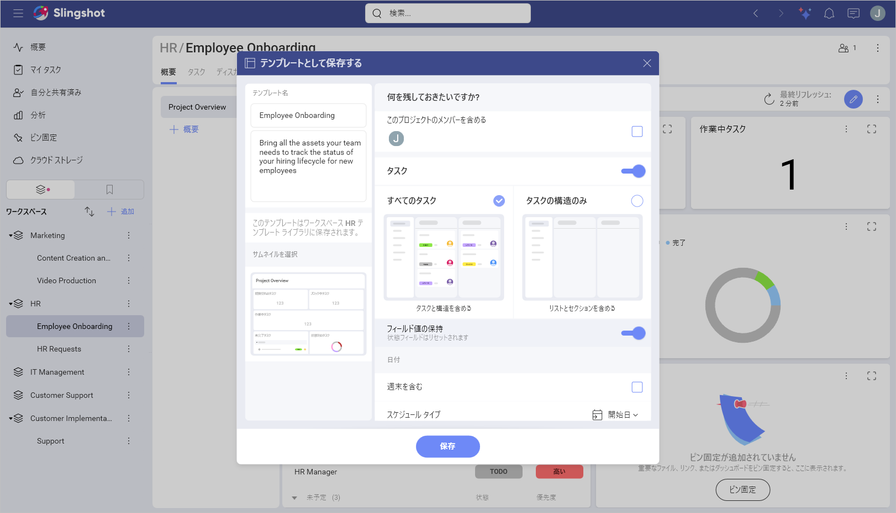

  - テンプレートのタイトルと説明を変更。
  
  - ワークスペースとそのプロジェクトのメンバーを保持。

  - サムネイルを選択。こうすることで、さまざまなテンプレートをすばやく参照し、特定のテンプレートに含まれる内容の概要を把握できます。

  - すべてのタスクを保持するか、タスク構造のみを保持できます。タスクの構造のみを保持することにした場合、タスクとそのフィールドは表示されなくなります。タスクを保持することにした場合は、次のことができます。

    - [フィールド](custom-fields.md)の値を保存。

    - 週末も含める。

    - スケジュール タイプを設定。

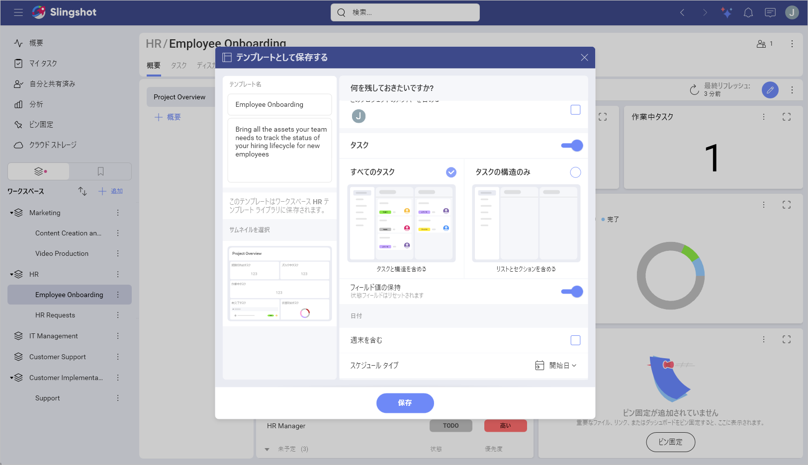

4. 下にスクロールすると、概要、ダッシュボード、ピン固定などの追加コンテンツから保持するものを選択することもできます。

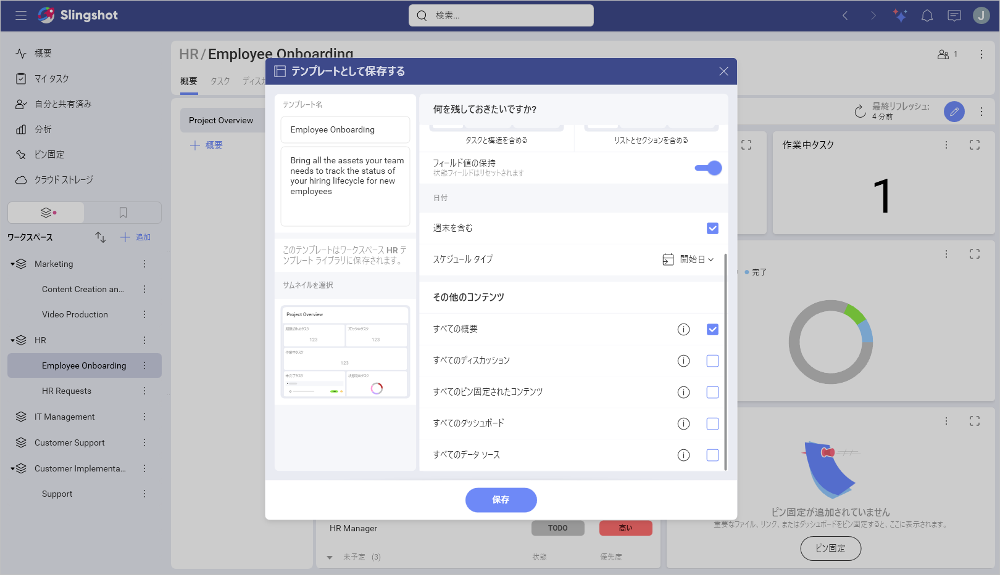

5. テンプレートに使用するためにプロジェクトから何を保持するかを選択できます。準備ができたら、**[保存]** をクリックまたはタップします。

テンプレートに使用するためにプロジェクトから何を保持するかを選択できます。準備ができたら、**[保存]** をクリックまたはタップします。

6. テンプレートを作成したら、ワークスペースでプロジェクトのリストを開き、**[すべてのテンプレートを見る]** をクリックまたはタップします。

7. テンプレートは、**[場所]** の下のワークスペースに保存されます。

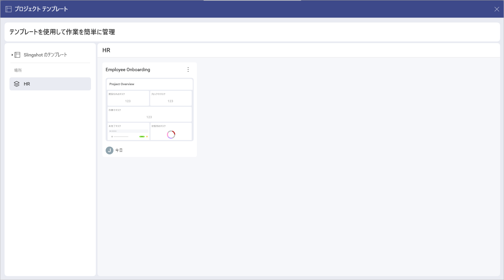

これに加えて、作成したプロジェクト テンプレートの右側にあるオーバーフロー メニューを開いて、次のアクションを実行することもできます:

- テンプレートを開く。

- テンプレートへのリンクをコピー。

- テンプレートを **[ブックマーク]** に追加するか、そこから削除。

- テンプレートを削除。

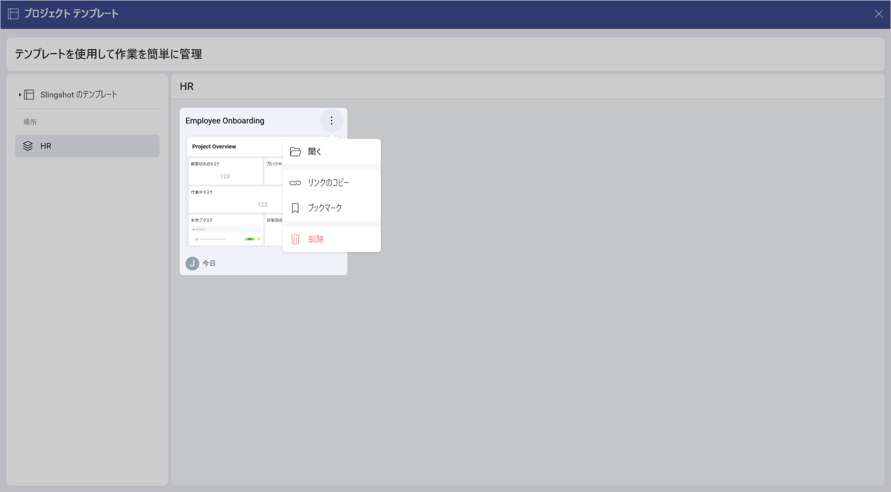

プロジェクトの作成方法と使用方法の詳細については、[こちら](./workspaces.md#プロジェクトの作成)をご覧ください。