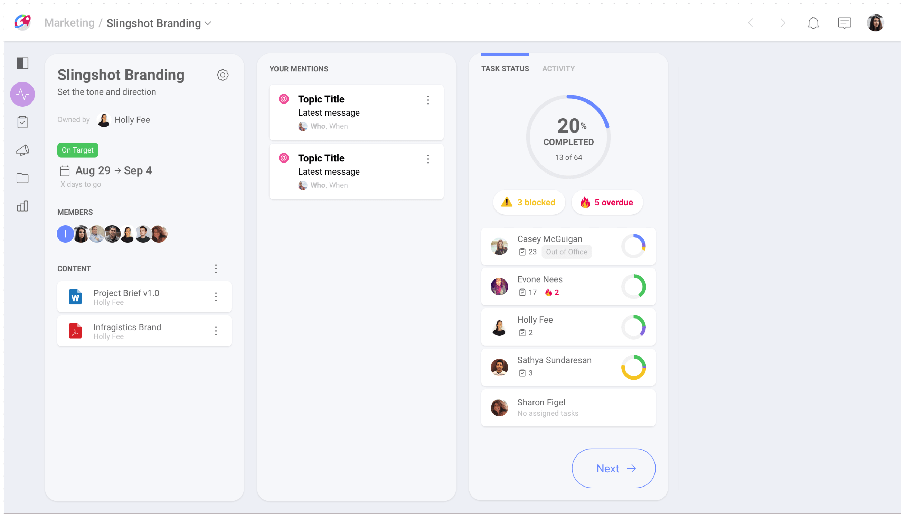
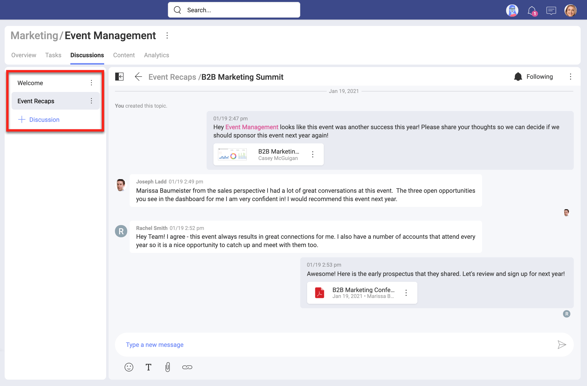
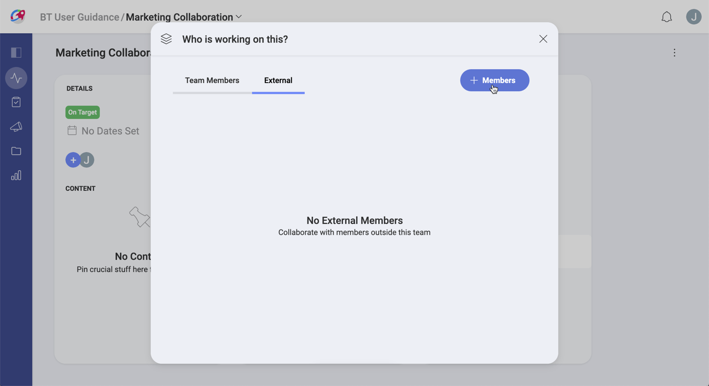

# Projects

In short, a project is a series of carefully planned individual or collaborative tasks that need to be completed within a time frame, in order to reach a specific outcome.

Projects are normally undertaken by people with expertise in many different areas, who might belong to different teams and, at the same time, receive project assignments to different projects. Sometimes even people from outside the organization might join a project. More than ever, project members greatly benefit from a strong leadership, clear communication and good visibility over the project and all its resources.  Slingshot's take on projects was designed with all this in mind...

## So, What's a Slingshot Project?

It's the virtual representation of a project, a series of tasks that need to be completed collaboratively by certain people over a period of time. But that's not quite all. Slingshot project management approach was designed to ship projects consistently and with the highest success rate. So, how can this happen?

- Projects **capture and make easily accessible all relevant information around a project**.
- Slingshot helps project members **identify when a project is not going well and needs attention**.

## Slingshot Empowers your Project and its Members

You can foster productive collaboration and best practices in your projects by empowering your project members. So, what do project members need? No surprises here, they need what a team needs with a few additions. Teams need solid leadership, good communication, and access to the right resources they need to do their job. Projects also incorporate new important needs like adding dates, as all projects have a beginning and an end. Also important is to keep everyone on the loop by providing a quick status of the project for everyone to see. And finally, there is the need to have a fixed place where any project member can bring to light specific issues to discuss.

Project overviews help you get a quick snapshot of a project, giving you a sense of the project progress at a glance.  Everyone can get an overall status (On Target, At Risk, Danger, Completed), the project's start and due dates, and issues raised by someone working on the project. The overview also includes all the tasks for the project, as well as all mentions directed at you. Finally, you have a place where you can add useful resources for the project like links, documents, dashboards, etc.

Using shared resources is required to collaborate, working towards a common objective. One of the best practices in Slingshot is to organize your content in Boards. Designed to manage your personal or team content, boards are just containers that point to cloud storages that hold your resources.

You can communicate live with all project members via Discussions or with any Slingshot user (or group of users) through the general chat.  Not limited to write, you can also attach files, use emojis, and react to messages.

As mentioned above, Projects are normally undertaken by people with expertise in many different areas, who might belong to different teams and, at the same time, receive project assignments to different projects.   
In Slingshot, every project is associated to a team. And you can assign one or more team members, plus any external people that might belong to other teams or even from outside of the organization.

## Want to Know More About Projects?

Continue [here](projects-starting.md)!
