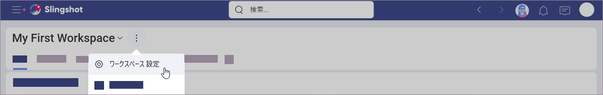

# ロールとアクセス許可の詳細

ようこそ! このトピックは Slingshot のロールとアクセス許可に関する詳細を説明します。

## Slingshot 内のロールとアクセス許可

コンピューター システムのアクセス制御の主な方法の 1 つは、ロールベース アクセス制御 (RBAC) として知られている方法です。基本的には、個人のロールに応じてシステムへのアクセスを制限することです。さまざまなグループごとに異なるアクセス レベルのニーズを満たすために、複数のロールが作成されます。ロールにはさまざまな権限があるため、ファイルの表示、作成、変更、共有などの特定のタスクを制限することができます。

Slingshot では、ユーザーは 1 つ以上のワークスペースに参加でき、組織の一部になることもできます。 
ロールは、ユーザーがワークスペースまたは組織で持つ一連の権限を表します。ユーザーがワークスペース / 組織に参加するときに、ユーザーにロールが割り当てられます。Slingshot には、管理者、編集者、閲覧者の 3 つの異なるロールがあります。

## 自分の役割を見つける方法

ワークスペースと組織のそれぞれで異なるロールを持つことができます。ロールは、ユーザーが招待されたその時点でワークスペースの作成者によってユーザーに与えられます。作成者は、ワークスペースの管理者でもあります。招待メールで、割り当てられたロールが通知されます。 

後でワークスペースまたは組織でのロールを確認する場合は、ワークスペース / 組織のオーバーフロー メニュー > *[共有ユーザー]* を選択できます。ワークスペース メンバーの管理の詳細については、[ワークスペースの詳細](workspaces-faq.html#ワークスペース-メンバーを管理する方法)トピックを参照してください。

## ワークスペースでさまざまなロールができること

次の表に、ワークスペース内の各ロールの権限を示します。

| アクセス許可                                                          | 管理者              | 編集者             | 閲覧者             |
| -------------------------------------------------------------------- | ------------------ | ------------------ | ------------------ |
| **ワークスペース**を作成および削除できます。                                | :white_check_mark: | :x:                | :x:                |
| ワークスペースの下に**サブワークスペース**を作成できます。                      | :white_check_mark: | :white_check_mark: | :x:                |
| **ワークスペース情報**を変更できます。                                 | :white_check_mark: | :x:                | :x:                |
| **ワークスペース**のメンバーを管理できます。                              | :white_check_mark: | :x:                | :x:                |
| **タスク**を作成、変更、削除できます。                                 | :white_check_mark: | :white_check_mark: | :x:                |
| **タスク フィルター**を作成、変更、削除できます。                          | :white_check_mark: | :white_check_mark: | :x:                |
| **ディスカッション**を作成、変更、削除できます。           | :white_check_mark: | :white_check_mark: | :x:                |
| **ディスカッション**でメッセージを送信できます。                                      | :white_check_mark: | :white_check_mark: | :x:                |
| **ボード**を作成、変更、削除できます。                                | :white_check_mark: | :white_check_mark: | :x:                |
| コンテンツを**ボード**にピン固定/ピン固定解除できます。                                  | :white_check_mark: | :white_check_mark: | :x:                |
| **分析ダッシュボード**を表示できます。                                    | :white_check_mark: | :white_check_mark: | :white_check_mark: |
| **分析ダッシュボード**を作成、変更、および共有できます。               | :white_check_mark: | :white_check_mark: | :x:                |
| **分析ダッシュボード**をエクスポートできます。                                  | :white_check_mark: | :white_check_mark: | :white_check_mark: |
| タスク、ディスカッション、コンテンツ、分析を**ブックマーク**できます。      | :white_check_mark: | :white_check_mark: | :white_check_mark: |
| タスク、ディスカッション、コンテンツ、分析への**リンクをコピー**できます。 | :white_check_mark: | :white_check_mark: | :white_check_mark: |

ワークスペースを作成する Slingshot ユーザーは、その**管理者**として自動的に割り当てられます。ワークスペースには複数の管理者を含めることができます。ただし、ユーザー自身がワークスペースの唯一の管理者である場合、別のメンバーを管理者として割り当てることなくワークスペースを抜けることはできません。 

**管理者**は、ワークスペースを管理するためのフル アクセス権を持っています。これには、主な**情報** (*名前*、*説明*、*プライバシー*、*状態*) の変更、さらには削除も含まれます。また、管理者にはワークスペースの**メンバーを管理する**権利があります。つまり、メンバーを招待、削除、およびメンバーのロールを変更できます。管理者はワークスペース内のすべてのコンテンツ (タスク、フィルター、ディスカッション、ボード、分析ダッシュボード) を作成、編集、および削除できます。

**編集者**は管理者よりも制限されていますが、ワークスペースの下にサブワークスペースを作成できます。また、タスク、フィルター、ディスカッション、ボード、および分析ダッシュボードを作成、編集、および削除することもできます。招待ではなく自分で公開なワークスペースに[参加する](workspaces-faq.html#h他のワークスペースを見つけて参加する方法)場合、デフォルトで編集者のロールが割り当てられます。

**閲覧者**は、コンテンツの表示、ブックマーク、共有に制限されています。ワークスペースの閲覧者になるには、閲覧者のロールで招待される必要があります。

>[!NOTE] サブワークスペースでの権限は、親ワークスペースでのロールの影響を受けません。つまり、親ワークスペースの管理者であっても、サブワークスペースでのロールを超える権限を持つことはできません。たとえば、親ワークスペースの管理者であり、サブワークスペースの閲覧者である場合、サブワークスペースで何かを作成または削除することはできません。

## 組織でのロール 

ユーザーのロールとその権限について学ぶ前に、Slingshot の組織について詳しく知りたいと思うかもしれません。 

手短に言えば、組織はワークスペースですが、Slingshot の他のワークスペースとは異なります。そこでは、実際の組織 (ビジネスまたは非営利) の他のメンバーと協力することができます。 

Slingshot の組織は、[ワークスペース] のすぐ下に表示されます (以下を参照)。組織に関連付けられているメール アドレスを使用して、Google または Microsoft でサインインする必要があります。

Slingshot 組織でのロールは、他のワークスペース (管理者、編集者、閲覧者) と同じです。組織でのこれらのロールの権限の詳細については、以下の表を参照してください。

| アクセス許可                                                            | 管理者              | メンバー             | 閲覧者             |
| ---------------------------------------------------------------------- | ------------------ | ------------------ | ------------------ |
| **組織情報**を編集できます。                                       | :white_check_mark: | :x:                | :x:                |
| 組織の**メンバーを管理**できます。                                      | :white_check_mark: | :x:                | :x:                |
| ディスカッション、コンテンツ、ボードを**作成**できます。                | :white_check_mark: | :white_check_mark: | :x:                |
| ディスカッション、コンテンツ、ボードを**変更**できます。                | :white_check_mark: | :white_check_mark: | :x:                |
| ダッシュボードを作成および変更できます。                                   | :white_check_mark: | :x:                | :x:                |
| ディスカッション、コンテンツ、ボード、ダッシュボードを**削除**できます。    | :white_check_mark: | :x:                | :x:                |
| ディスカッション、コンテンツ、ボード、ダッシュボードを**表示**できます。      | :white_check_mark: | :white_check_mark: | :white_check_mark: |
| ディスカッション、コンテンツ、ボード、分析を**ブックマーク**できます。       | :white_check_mark: | :white_check_mark: | :white_check_mark: |
| ディスカッション、コンテンツ、ボード、分析への**リンクをコピー**できます。 | :white_check_mark: | :white_check_mark: | :white_check_mark: |

[ワークスペース](workspaces-faq.html#組織とワークスペースとサブワークスペース)のトピックで組織の詳細をご覧ください。

## 組織に属さないユーザー

Slingshot に組織があると、組織アカウントを持つユーザーまたは**組織ユーザー**になります。個人のメール アドレスを使用して Slingshot にサインインする場合、**個人アカウントのユーザー**となります。個人アカウントのユーザーは組織を持っていません。ただし、実際には、組織の人々が外部の人々と協力する必要がある場合があります。Slingshot を使用すると、組織のユーザーと個人アカウントのユーザーの両方を混在させたワークスペースを作成できます。

>[!NOTE] 個人アカウントユーザーをワークスペースに招待するときは、Slingshot で使用するメール アドレスを入力する必要があることに注意してください。個人アカウントのユーザーはメール アドレスの招待状を受け取り、ワークスペースに参加するにはそれを受け入れる必要があります。

個人アカウントのユーザーには、ワークスペースでロール (管理者、編集者、閲覧者) を割り当てることができます。これらのロールには、組織ユーザーと個人アカウントユーザーの両方に対して同等の権限があります。
## クラウド ストレージに関する権限

ユーザー自身に関連のあるコンテンツは、さまざまなクラウド ストレージに保存されている可能性があります。Slingshot を使用すると、クラウド ストレージへの接続を作成して、そのコンテンツにアクセスし、共有し、ボードで整理することができます。これらの接続は非公開または共有にすることができ、さまざまなシナリオで使用することを目的としています。

*[クラウド ストレージ]* には、*非公開クラウド ストレージ*接続があります。ユーザー自身だけがこれらの非公開接続にアクセスでき、いつでも作成 / 削除できます。必要に応じて**非公開コンテンツを他の人と共有する**ことができます。

非公開クラウド ストレージからワークスペース ボードにコンテンツを固定すると、その特定のコンテンツがワークスペース全体で利用できるようになります。ただし、ワークスペース メンバーが残りの非公開クラウド ストレージ コンテンツにアクセスできるという意味ではありません。

ワークスペースのすべてのメンバーは、**ワークスペース クラウド ストレージ**接続にアクセスでき、いつでも接続を作成 / 削除できます。

> [!NOTE]
> **Microsoft** アカウントを使用して Slingshot にログインする場合は、**OneDrive** を構成した状態で開始します。同じことが、**Google** アカウントでのログと **Google ドライブ**での開始にも当てはまります。

## 公開ワークスペースと非公開ワークスペース

新しく作成されたワークスペースはデフォルトで公開されています。つまり、組織のすべてのメンバーがワークスペースを検索して参加できます。信頼と透明性は、効果的なコラボレーションの重要な要素であり、所有権と説明責任にも役立ちます。  
しかしながら、非公開ワークスペースが必要になる場合もあります。この場合、ユーザーはワークスペースの管理者から招待状を取得することによってのみワークスペースに参加できます。これは、機密情報を扱うワークスペースに役立ちます。そのような場合、組織はアクセスを制限したいと考えています。

ワークスペースのプライバシーを変更するには、ワークスペースの**オーバーフロー メニュー** > **[ワークスペース設定]** > **[情報]** > **[プライバシー ポリシー]** を選択します。

**[非公開]** に変更し、**[更新]** を選択します。

