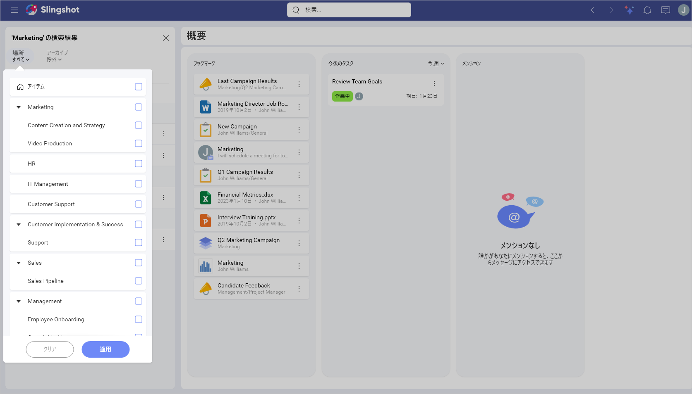

# 検索

さまざまなグループの人々と協力する、パフォーマンスの高いチームを運営するためには、適切な情報を見つけることが重要な機能です。Slingshot は、フォルダーを渡り歩いてコンテンツを探し回ったり、電子メールから必要なものを仕分けしたりする時間を節約します。Slingshot でも、必要なものをすばやく見つける方法が必要です。そこで検索が役立ちます。 

Slingshot の検索は、Slingshot 内のすべてからきちんと整理された結果を提供します。さまざまなフィルタリング オプションにより、優れた検索精度で、本当に必要なものをすばやく見つけることを確実にします。

## 検索方法

ワークスペース、タスク、概要など、どこからでもすばやく検索を開始できます。

1. 上部の検索ボックスに移動します。
 
2. コンテンツ/項目の名前を入力します。

3. 検索結果ペインが左側に開きます。

検索結果ペインには、Slingshot 内のあらゆる場所からの結果が表示されます。結果は、5 つのタブに個別に表示されます:

- **[ワークスペース](workspaces.md)** - すべてのワークスペースとプロジェクトの結果。

- **[タスク](tasks-faq.md)** - 割り当てられたタスクおよびすべてのワークスペースとプロジェクトのタスクの結果が表示されます。 

- **[メッセージ](communication.md)** - チャットおよびディスカッションのメッセージの結果を表示します。

- **[ピン固定](pins.md)** - 概要、ワークスペース、組織のすべてのリストの結果を表示します。

- **[分析](../docs/analytics/my-analytics.md)** - 概要、ワークスペース、組織のダッシュボードとダッシュボード フォルダーの結果を表示します。

>[!NOTE] 結果ウィンドウで、オーバーフロー メニューを開き、結果をブックマークに保存したり、他のユーザーと共有したりできます。

## 結果のフィルタリング

結果が多すぎて検索を絞り込む必要がある場合があります。これを支援するために、Slingshot には、上部に場所フィルターがあり、5 つのタブのそれぞれの下にフィルターの 2 番目の層があります。

アーカイブ フィルター ([Slingshot](slingshot-subscription.md) および [Slingshot Enterprise](slingshot-enterprise-subscription.md) の機能) を使用すると、アーカイブされた光もを参照することもできます。

### 場所でフィルタリング

[場所] フィルター (ページの上部) は、選択した結果タブに関係なく、すべての結果に適用されます。たとえば、異なるワークスペースにある 2 つのプロジェクトでブロックされたすべてのタスクを簡単に検索できます。これを行うには、場所のドロップダウンで 2 つのプロジェクトを選択し、[タスク] タブで [ブロック中] 状態でフィルターします。

### より多くのフィルターを使用する

これらのフィルターは、選択したタブと結果のタイプに固有です。たとえば、[タスク] タブを選択すると、[作成者]、[割当先]、[期日] などで結果をフィルタリングできます。

フィルターは検索結果を閉じたときにのみリセットされるため、必要に応じてフィルターを追加および削除して複数回検索できます。