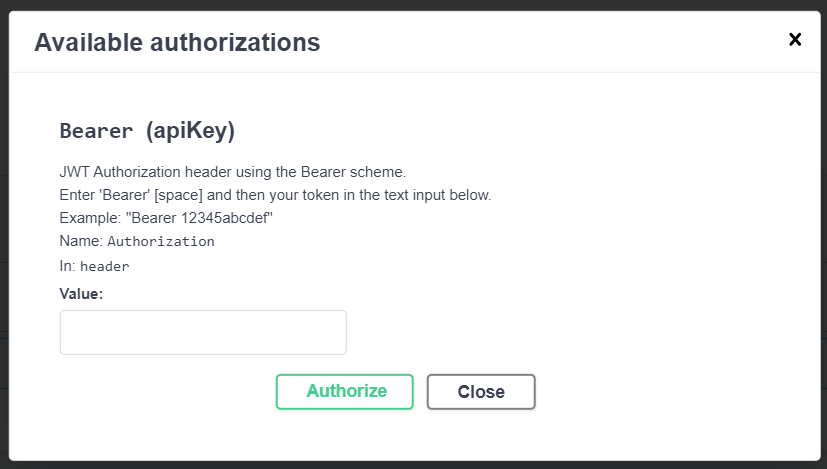

# API エクスプローラー

Slingshot の API のテストを支援するために、Web ブラウザーで使用できるテスト環境を作成しました。 
以下の手順で試すことができます:

1.	[ここ](https://my.slingshotapp.io/v1/api-browser/index.html)に進み、右隅にある **[Authorize]** (認証) ボタンをクリックします。

2.	値を入力する必要があるダイアログが開きます。値は **[Bearer](https://swagger.io/docs/specification/authentication/bearer-authentication/)** という単語と **Slingshot の API キー**を組み合わせたものです。API キーをお持ちでない場合は、[この記事](authentication.md)を参照して作成してください。

   

3.	準備ができたら、**[Authorize]** をクリックし、**[Close]** を選択して、ダイアログを閉じます。

4.	テストするリソースを開き、**[Try it out]** (試してみる) をクリックします。 

5.	リクエストによっては、パラメーターの追加が必要になる場合があります。そうしないと提出できません。準備ができたら、**[Execute]** (実行) をクリックします。

6.	カール、リクエスト URL、レスポンス ボディ、およびレスポンス ヘッダーが提供されます。可能な応答の例も見つけることができます。

7.	必要に応じて、カール テキストをクリップボードに**コピーできます**。応答本文をクリップボードに**コピーしたり**、ダウンロードしたりすることもできます。

