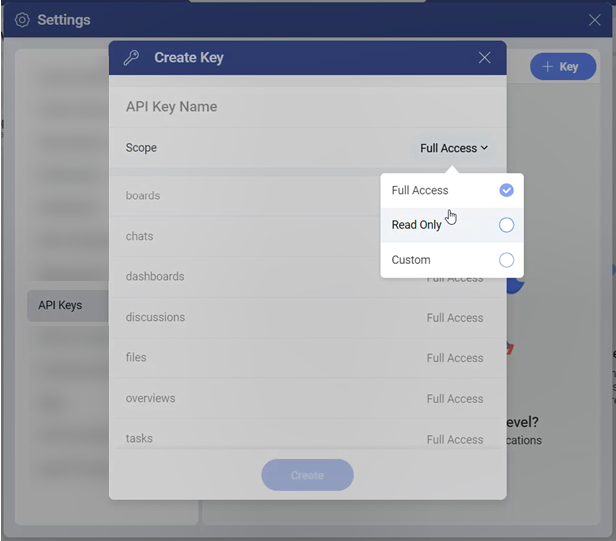
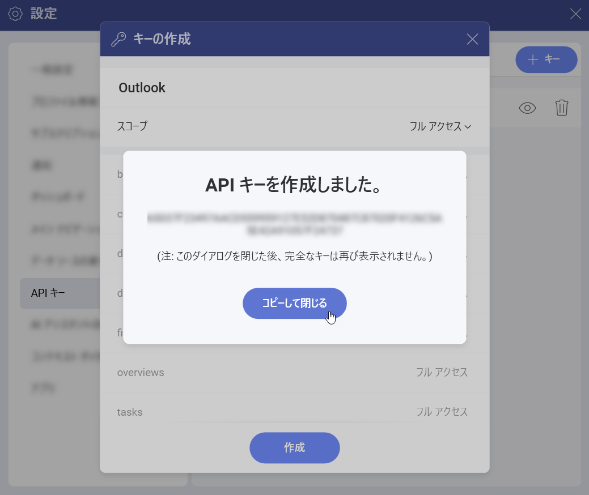
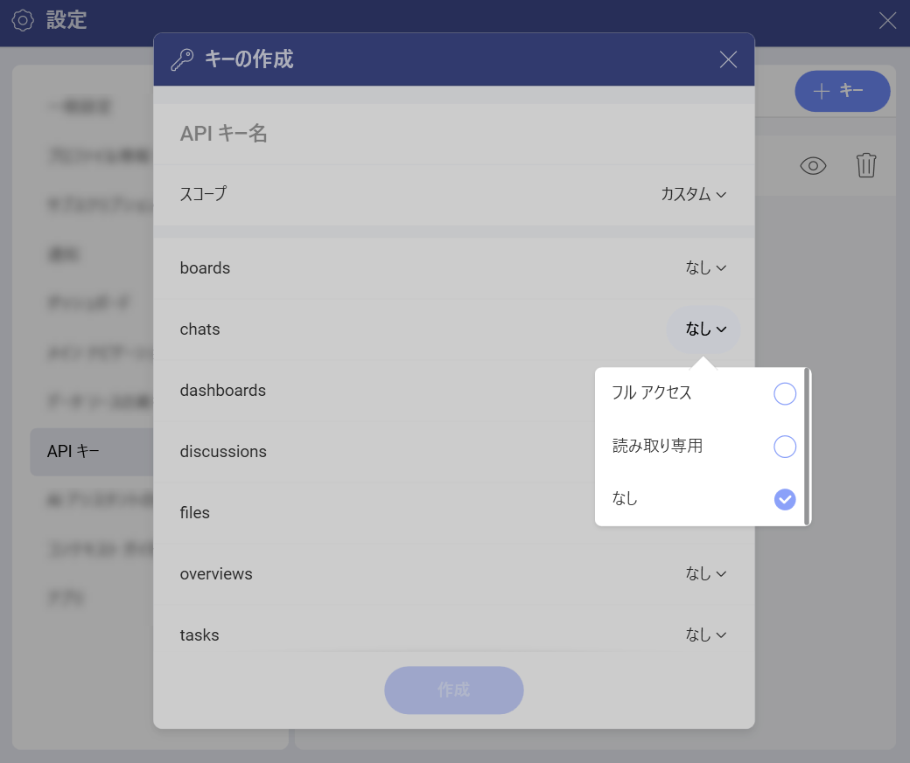

# 認証
 
API 経由で Slingshot のデータにアクセスするには、まず自分自身を認証する必要があります。そのために、Slingshot API キーを作成できます。これは Slingshot アプリで行うことができます。 

## Slingshot API キーの作成

Slingshot API キーを作成するには、次のことを行う必要があります:

1.	**Slingshot** アカウントにログインします。

2.	プロファイルの横にあるドロップダウン メニューから **[設定]** を開きます。

3.	**[API キー]** を開きます。ここに、作成したすべての API キーのリストが表示されます。

4.	**[+ キー]** ボタンをクリックまたはタップして、新しい API キーを作成します。

5.	**[キーの作成]** ダイアログが表示され、API キーの名前とスコープを設定できます。**[フル アクセス]**、**[読み取り専用]**、または **[カスタム]** から選択できます。 

    

6.	キーを作成したら、完全なキー コードをコピーしてのちに、ダイアログを閉じます。 

    >[!NOTE] 完全なキーは 1 回しか表示されないため、確実に保管してください。

    

    >[!NOTE] コンポーネントに **[カスタム]** を選択した場合は、**[フル アクセス]**、**[読み取り専用]**、または **[なし]** から選択できます。**[なし]** を選択すると、そのコンポーネントは表示されません。

    

